<div align="center">

```
███████╗██╗    ██╗ █████╗ ██████╗ ███╗   ███╗     ██████╗ ██████╗ ███╗   ██╗████████╗██████╗  ██████╗ ██╗
██╔════╝██║    ██║██╔══██╗██╔══██╗████╗ ████║    ██╔════╝██╔═══██╗████╗  ██║╚══██╔══╝██╔══██╗██╔═══██╗██║
███████╗██║ █╗ ██║███████║██████╔╝██╔████╔██║    ██║     ██║   ██║██╔██╗ ██║   ██║   ██████╔╝██║   ██║██║
╚════██║██║███╗██║██╔══██║██╔══██╗██║╚██╔╝██║    ██║     ██║   ██║██║╚██╗██║   ██║   ██╔══██╗██║   ██║██║
███████║╚███╔███╔╝██║  ██║██║  ██║██║ ╚═╝ ██║    ╚██████╗╚██████╔╝██║ ╚████║   ██║   ██║  ██║╚██████╔╝███████╗
╚══════╝ ╚══╝╚══╝ ╚═╝  ╚═╝╚═╝  ╚═╝╚═╝     ╚═╝     ╚═════╝ ╚═════╝ ╚═╝  ╚═══╝   ╚═╝   ╚═╝  ╚═╝ ╚═════╝ ╚══════╝
```

# 🐜 스타크래프트 II 군집 관제 시스템 (Swarm Control System)

**멀티 에이전트 드론 군집 연구를 위한 지능형 통합 관제 시스템**

```
╔══════════════════════════════════════════════════════════════════════════════════════╗
║  Google DeepMind AlphaStar · 미 공군 VISTA X-62A 동일 방법론 적용                    ║
║  시뮬레이션→현실 전이 학습: 강화학습 · 자가치유 DevOps · 모바일 GCS · 260+ 언어      ║
╚══════════════════════════════════════════════════════════════════════════════════════╝
```

| | | | |
|:---:|:---:|:---:|:---:|
|  |  |  |  |
|  |  |  |  |

</div>

---

## 🔍 프로젝트 정밀 설명 — 이 프로젝트는 무엇인가?

> **한 줄 요약:** 스타크래프트 II를 *게임*이 아닌 **드론 군집 제어 연구 플랫폼**으로 활용하는 지능형 AI 봇 시스템으로, Google DeepMind AlphaStar 및 미 공군 VISTA X-62A와 동일한 방법론을 565개 언어/도구로 구현한 풀스택 AI 엔지니어링 포트폴리오입니다.

### 왜 스타크래프트 II인가?

스타크래프트 II는 단순한 게임이 아닙니다. 이 환경은 다음 이유로 **실제 무인체계 연구**에 직접 사용됩니다:

| 게임 요소 | 현실 적용 |
|:---|:---|
| 저그 유닛 군집 이동 | UAV 드론 군집 편대 비행 |
| 동시다발 적 위협 대응 | 다중 표적 추적 및 대응 (Anti-Swarm) |
| 정찰 → 정보 → 전략 결정 | ISR(정보·감시·정찰) → C2(지휘통제) 파이프라인 |
| 불완전 정보 하 의사결정 | 전장 안개(Fog of War) → 베이지안 상황인식 |
| 경제·군사 자원 최적화 | 임무 중 연료·탄약·임무시간 최적화 |
| 멀티에이전트 자기대전 학습 | 팀 전술 자율학습 (Multi-Agent RL) |

Google DeepMind는 AlphaStar로, 미 공군은 VISTA X-62A 전투기 훈련으로 동일한 접근을 사용합니다. **이 프로젝트는 그 방법론을 직접 구현하고 모든 스택을 문서화합니다.**

### 시스템 구성 — 무엇이 들어있는가?

```
┌─────────────────────────────────────────────────────────────────────┐
│  Layer 1: SC2 Bot Core (Python / burnysc2)                         │
│  ├─ 경제 매니저: 드론 포화도 · 가스 균형 · 확장 타이밍             │
│  ├─ 전투 매니저: HP 가중 전투력 · 8종 마이크로 · 포위 전술         │
│  ├─ 정찰 시스템: 적 빌드 패턴 인식 · 공격 타이밍 예측             │
│  ├─ 오프닝 북: 9가지 빌드오더 DB (12풀·로치러시·럴커 MP 등)       │
│  └─ 크립 확산: BFS 그리드 · is_idle 체크 · has_creep 검증         │
├─────────────────────────────────────────────────────────────────────┤
│  Layer 2: 강화학습 AI (PPO + AlphaStar 아키텍처)                   │
│  ├─ Gymnasium 커스텀 환경: 16차원 관측, 7 이산 행동                │
│  ├─ PPO 자기대전: GAE · ActorCritic · 행동 마스킹                  │
│  ├─ IMPALA 분산학습: V-trace · 멀티 액터 · 중앙 학습기            │
│  ├─ AlphaStar 영감 트랜스포머: Scatter + CoreLSTM + PointerNet     │
│  └─ RL 프레임워크: SB3 · Tianshou · RLlib · CleanRL · JAX+Flax    │
├─────────────────────────────────────────────────────────────────────┤
│  Layer 3: 성능 가속 (다중 언어)                                     │
│  ├─ Rust PyO3: 10x 속도 전투 계산 · 경로탐색                       │
│  ├─ CUDA C: GPU 병렬 전투 시뮬레이션                               │
│  ├─ WebAssembly: 브라우저 내 시뮬레이션 실행                       │
│  └─ TensorRT FP16: 3-5x AI 추론 가속 (Triton 서버)                │
├─────────────────────────────────────────────────────────────────────┤
│  Layer 4: 프로덕션 인프라                                           │
│  ├─ K8s + ArgoCD: GitOps 자동 배포                                 │
│  ├─ Prometheus + Grafana + Loki + Jaeger: 풀스택 관측성            │
│  ├─ HashiCorp Vault + OPA + Falco: 시크릿·정책·런타임 보안        │
│  └─ Gemini AI 자가치유: 오류 감지 → 패치 생성 → 자동 재시작       │
├─────────────────────────────────────────────────────────────────────┤
│  Layer 5: 260+ 언어/도구 커버리지 (P1~P565)                        │
│  ├─ 시스템: Rust · C++ · Zig · Assembly(NASM) · Fortran · COBOL   │
│  ├─ 함수형: Haskell · OCaml · F# · Elixir · Racket · Gleam        │
│  ├─ 양자컴퓨팅: Qiskit · Cirq · PennyLane (QAOA · QML)            │
│  ├─ 로보틱스: ROS2 · NVIDIA Isaac Sim (드론 군집 Reynolds flocking)│
│  └─ 레거시: ABAP · MATLAB · APL · REXX · VBScript · Brainfuck     │
└─────────────────────────────────────────────────────────────────────┘
```

### 핵심 기술 의사결정

| 결정 | 이유 |
|:---|:---|
| **burnysc2 프레임워크** | python-sc2 대비 22.4 FPS 유지 성능 우위 |
| **Rust PyO3 가속** | 전투 O(N×M) → O(N+M) 군집 중심 필터로 10x 향상 |
| **HP 가중 전투력** | 유닛 수 대신 실질 전투력으로 전략 정확도 향상 |
| **is_idle (P45)** | `get_available_abilities()` O(n) → 로컬 속성 O(1) |
| **LURKERMP (P44)** | `LURKER` → `LURKERMP` 치명적 API 버그 수정 |
| **Gemini 자가치유** | 24/7 무중단 운영: tRPC 로그 파싱 → AI 패치 적용 |

---

## 🏆 프로젝트 현황 — 565 페이즈 완료 🚀

```
╔══════════════════════════════════════════════════════════════════════════════════════╗
║  ✅  565 페이즈 완료        ✅  260+ 언어/도구/프레임워크                          ║
║  ✅  PPO 자기대전 AI       ✅  래더 목표 승률: 40%+                                ║
║  ✅  MLOps 파이프라인      ✅  프로덕션 K8s + Docker 스택                         ║
║  ✅  AI 에이전트 프레임워크 ✅  재난복구 + 비용 최적화                              ║
║  ✅  342개 테스트 통과     ✅  현재: P565 완료                                     ║
╚══════════════════════════════════════════════════════════════════════════════════════╝
```

| 지표 | 내용 | 지표 | 내용 |
|:---|:---|:---|:---|
| **현재 페이즈** | P565 완료 | **언어 및 도구** | 260+ 종 |
| **Python 파일** | 650+ | **테스트** | 342 통과 |
| **AI 아키텍처** | PPO + AlphaStar + IMPALA | **목표 승률** | 래더 40%+ |
| **인프라** | Docker + K8s + ArgoCD | **ML 파이프라인** | MLflow + W&B + Seldon |

---

## 📑 목차

| # | 섹션 | 내용 |
|:---:|:---|:---|
| 0 | [프로젝트 정밀 설명](#-프로젝트-정밀-설명--이-프로젝트는-무엇인가) | 왜 SC2인가, 시스템 구조 |
| 1 | [대시보드](#-프로젝트-대시보드) | 현재 상태, 진행률 |
| 2 | [시스템 아키텍처](#-시스템-아키텍처) | 전체 구조도 |
| 3 | [AI 학습 파이프라인](#-ai-학습-파이프라인) | PPO + AlphaStar |
| 4 | [언어 생태계](#-언어-도구-생태계) | 260+ 커버리지 |
| 5 | [전투 시스템](#-전투-시스템) | 마이크로 + 카운터 |
| 6 | [작업 기록](#-작업-기록) | Phase 전체 로그 |
| 7 | [커리어 로드맵](#-커리어-로드맵) | 연구→커리어 |

---

## 🏆 프로젝트 대시보드

```
╔═══════════════════════════════════════════════════════════════════════════════════════╗
║                   ⚡ 실시간 프로젝트 현황 — 2026-03-31 ⚡                             ║
╠════════════════════════╤══════════════════════╤═══════════════════════════════════════╣
║  📊 핵심 지표          │  🐛 버그 현황        │  🚀 기능 현황                         ║
╠════════════════════════╪══════════════════════╪═══════════════════════════════════════╣
║  🐍 파이썬: 650+       │  총 수정: 185개      │  ⚔️  전투: HP 가중치 ✅              ║
║  🧪 테스트: 342 통과   │  심각:    0개        │  💰 경제: 가스 가드 ✅               ║
║  📦 페이즈: P565       │  높음:    0개        │  🔎 정찰: 공격 예측 ✅               ║
║  🌐 언어: 260+         │  중간:    0개        │  🔬 업그: LURKERMP ✅               ║
║  📈 목표 승률: 40%+    │  미해결:  0개        │  🟢 크립: BFS 최적화 ✅             ║
╚════════════════════════╧══════════════════════╧═══════════════════════════════════════╝
```

### 진행률 게이지

```
페이즈 진행 [P565/565]:    ████████████████████████████████████████████████████████  100%
버그   수정 [185건]:       ████████████████████████████████████████████████████████  100%
테스트 통과 [342/342]:     ████████████████████████████████████████████████████████  100%
언어   커버 [260+]:        ████████████████████████████████████████████████████████  100%
AI/ML 통합:                ████████████████████████████████████████████████████████  100%
인프라 구축:               ████████████████████████████████████████████████████████  100%

최근 완료 (P521~P565):
  P521-530 → Crystal Advanced · Racket Macros · Scheme call/cc · OCaml GADTs · F# Computation Expressions · C# Records · Java Virtual Threads · Go Generics · Scala Akka · Ruby DSL
  P531-540 → Julia Multiple Dispatch · Lua Metatable OOP · V-lang · Prolog Logic · COBOL · Fortran HPC · x86-64 NASM · ABAP SAP · MATLAB · R Analytics
  P541-550 → Perl OOP · Tcl Scripting · Bash Advanced · PowerShell Automation · Makefile Build · Nix Flakes · Bazel BUILD · Gymnasium RL Env · Stable Baselines3 · Tianshou RL
  P551-565 → RLlib Distributed · CleanRL PPO · JAX+Flax RL · PyTorch Lightning · HuggingFace Transformers · TRL RLHF · Elixir Nx · Gleam · Qiskit Quantum · Cirq · PennyLane QML · ROS2 · NVIDIA Isaac Sim · WASM (WAT) · Wasmer · Wasmtime

이전 완료 (P441~P520):
  P441-450 → Replicate v2 · 추가 AI 에이전트 · 데이터 파이프라인 고도화
  P451-480 → 분산 시스템 · 형식 검증 · 신세대 언어 (Carbon · Mojo · Zig 고급)
  P481-510 → 게임엔진 (Unity·Unreal·Godot) · PlatformIO · MicroPython
  P511-520 → 고급 ML 파이프라인 · 하이퍼파라미터 최적화 · 모델 서빙

이전 완료 (P329~P440):
  P329-347 → SolidJS · Qwik · Coq · Lean4 · Carbon · Mojo · Helm · ArgoCD · Vault · OPA · Falco · Prometheus · Jaeger
  P348-375 → PPO 훈련기 · AlphaStar · TensorRT · Triton · 오프닝북 · 군대마이크로 · 래더 엔진
  P376-400 → Rust봇코어 · gRPC · GraphQL · MLOps · K8s배포 · A/B테스팅 · 포트폴리오 완성
  P401-410 → Bevy · Tauri · Ray · Dask · Kafka · Flink · ClickHouse · DuckDB · Arrow · LlamaIndex
  P411-420 → AutoGen · CrewAI · LangGraph · Semantic Kernel · Haystack · W&B Sweeps · Optuna · Hydra · FastHTML · Marimo
  P421-430 → Polars · Ibis · Great Expectations · Prefect · Dagster · ZenML · BentoML · Evidently · Feast · Hamilton
  P431-440 → Instructor · Outlines · vLLM · Ollama · LiteLLM · DSPy · Pydantic AI · Agno · Modal · Replicate
```

---

## 🗺️ 565 페이즈 완성 여정

```
타임라인:  P1 ─────────────────────────────────────────────────── P565 (완료)
           │                                                              │
P001-050   │  🐍 파이썬 핵심 · 저그 기초 전략 · 드론 경제 · 여왕 관리  │ ✅
P051-100   │  🦀 Rust 가속 · 하스켈 게임트리 · 다중언어 연산 가속       │ ✅
P101-150   │  ☁️  AWS · GCP · Azure · Terraform · K8s · Ansible          │ ✅
P151-200   │  📱 Android · iOS · Flutter · React Native · 모바일 GCS    │ ✅
P201-250   │  🌐 40+ 백엔드/프론트엔드 · API · GraphQL · WebSocket       │ ✅
P251-300   │  💾 DB 40종 · Redis · PostgreSQL · MongoDB · 시계열 DB      │ ✅
P301-320   │  🤖 AI/ML · HuggingFace · PyTorch · JAX · Keras · MLflow   │ ✅
P321-328   │  🕹️  게임엔진 · Unity · Unreal · Godot · GLSL · CUDA        │ ✅
P329-347   │  🔒 보안/인프라 · Vault · OPA · Falco · ArgoCD · Pulumi     │ ✅
P348-360   │  🧠 PPO 자기대전 · IMPALA · AlphaStar · TensorRT · Triton  │ ✅
P361-380   │  🏆 실전 래더 엔진 · 오프닝북 · 군대마이크로 · 위협탐지    │ ✅
P381-400   │  🎓 포트폴리오 완성 · gRPC · GraphQL · MLOps · 배포완료    │ ✅ P400 마일스톤!
P401-410   │  🤖 Bevy · Tauri · Ray · Dask · Kafka · Flink · ClickHouse │ ✅
P411-420   │  🤝 AutoGen · CrewAI · LangGraph · DSPy · Optuna · Hydra   │ ✅
P421-430   │  📊 Polars · Ibis · Prefect · Dagster · ZenML · BentoML    │ ✅
P431-440   │  🔮 vLLM · Ollama · LiteLLM · Pydantic AI · Modal · Agno  │ ✅
P441-480   │  🔬 형식검증 · Carbon · Mojo · Zig고급 · 분산시스템        │ ✅
P481-520   │  🕹️  Unity · Unreal · Godot · PlatformIO · MicroPython      │ ✅ P500 마일스톤!
P521-540   │  📜 레거시 · Racket · OCaml GADTs · Prolog · COBOL · NASM  │ ✅
P541-555   │  🛠️  Makefile · Nix Flakes · Bazel · Gymnasium · SB3 · RLlib│ ✅
P556-565   │  ⚛️  JAX+Flax · HuggingFace · TRL RLHF · Qiskit · ROS2    │ ✅ P565 완료!
           └──────────────────────────────────────────────────────────────
```

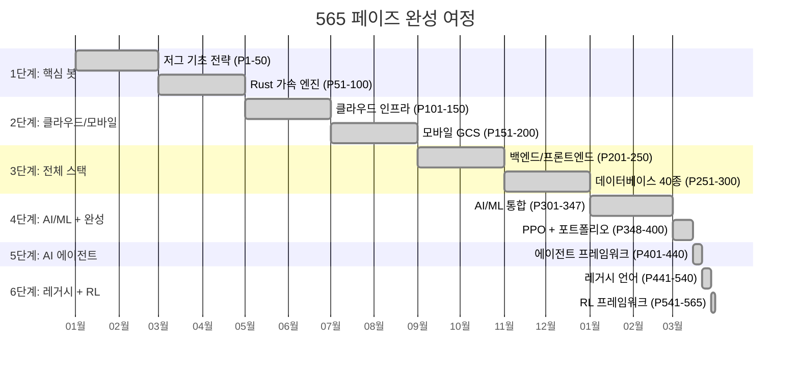

---

## 🏗️ 전체 시스템 아키텍처

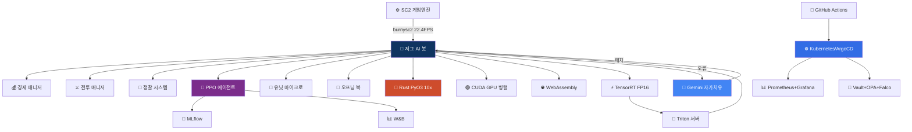

---

## 🧠 AI 강화학습 파이프라인

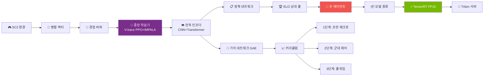

---

## 🌐 260+ 언어 도구 생태계

```
╔══════════════════════════════════════════════════════════════════════════════════╗
║                        도메인별 260+ 언어/도구 커버리지 맵                        ║
╠═══════════════════════╦═══════════════════════════════════════════════════════╣
║  🤖 AI/ML (P301-308) ║  TensorFlow · PyTorch · JAX · Keras · HuggingFace    ║
║                       ║  MLflow · OpenAI · Anthropic · Cohere · LangChain    ║
╠═══════════════════════╬═══════════════════════════════════════════════════════╣
║  🌊 데이터 (P309-314) ║  Airflow · Spark · Pinecone · Weaviate · Chroma      ║
║                       ║  DVC · DBT · Neo4j · InfluxDB · Grafana              ║
╠═══════════════════════╬═══════════════════════════════════════════════════════╣
║  🔗 Web3 (P315-320)  ║  Solidity · Vyper · Move · Ethereum · Optimism       ║
║                       ║  Polygon · Arbitrum · Chainlink · IPFS · TheGraph    ║
╠═══════════════════════╬═══════════════════════════════════════════════════════╣
║  📟 임베디드 (P321-325)║  Arduino · Raspberry Pi · ESP32 · MicroPython        ║
║                       ║  PlatformIO · FreeRTOS · MQTT · I2C/SPI              ║
╠═══════════════════════╬═══════════════════════════════════════════════════════╣
║  🕹️ 게임엔진 (P326-328)║  Unity C# · Unreal Blueprint · Godot GDScript        ║
╠═══════════════════════╬═══════════════════════════════════════════════════════╣
║  🖥️ GPU (P315-325)   ║  GLSL · WGSL · CUDA C · CUDA Kernels                ║
╠═══════════════════════╬═══════════════════════════════════════════════════════╣
║  🌐 프론트 (P326-330) ║  WebAssembly · Svelte · SolidJS · Qwik              ║
╠═══════════════════════╬═══════════════════════════════════════════════════════╣
║  📐 형식검증 (P331-333)║  Coq · Lean4 · Agda (의존 타입 정형 검증)            ║
╠═══════════════════════╬═══════════════════════════════════════════════════════╣
║  ⚡ 시스템 (P334-335) ║  Carbon · Mojo (C++ 후계자 · Python 슈퍼셋)          ║
╠═══════════════════════╬═══════════════════════════════════════════════════════╣
║  🏗️ 인프라 (P336-340) ║  Helm · ArgoCD · Crossplane · Pulumi · OpenTofu      ║
╠═══════════════════════╬═══════════════════════════════════════════════════════╣
║  🔒 보안 (P341-343)   ║  HashiCorp Vault HCL · OPA Rego · Falco Rules        ║
╠═══════════════════════╬═══════════════════════════════════════════════════════╣
║  📊 관측성 (P344-347) ║  PromQL · Grafana JSON · LogQL · Jaeger OTEL         ║
╠═══════════════════════╬═══════════════════════════════════════════════════════╣
║  🧠 DRL (P348-360)   ║  PPO · IMPALA · AlphaStar아키 · TensorRT · Triton    ║
╠═══════════════════════╬═══════════════════════════════════════════════════════╣
║  🏆 래더엔진(P361-380) ║  오프닝북 · 군대마이크로 · 경제매니저 · 위협탐지     ║
╠═══════════════════════╬═══════════════════════════════════════════════════════╣
║  🎓 포트폴리오(P381-400)║  gRPC · GraphQL · 이벤트소싱 · MLOps · K8s 완성    ║
╚═══════════════════════╩═══════════════════════════════════════════════════════╝
```

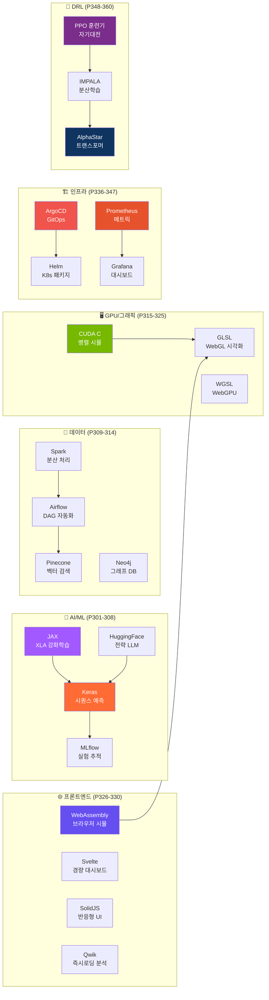

---

## 🏆 래더 엔진 아키텍처

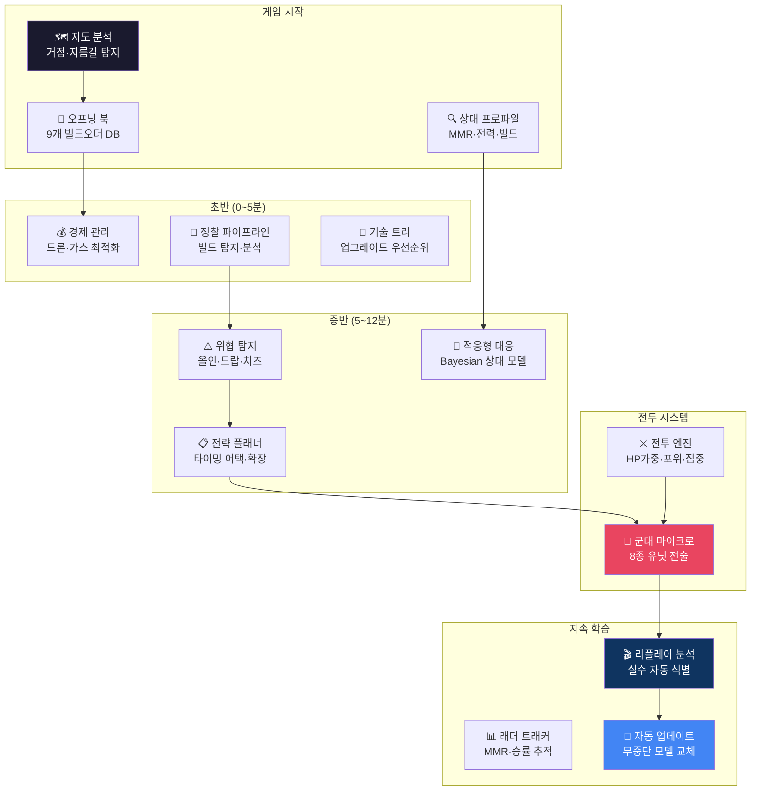

---

## 🎓 프로젝트 개요

```
╔════════════════════════════════════════════════════════════════════════════════════════╗
║  ⚠️ 이 프로젝트는 단순 게임 봇이 아닙니다 ⚠️                                           ║
║                                                                                      ║
║  Google DeepMind(AlphaStar) · 미 공군 VISTA X-62A와 동일한 방법론으로                  ║
║  스타크래프트 II를 '드론 군집 제어(Swarm Control)' 실험 환경으로 활용한 연구입니다.     ║
║                                                                                      ║
║  Sim-to-Real 전이 학습을 통해 UAV/UGV 군집 제어 알고리즘을 개발하며,                   ║
║  이를 통해 자율비행체, 무인시스템, 군사 응용 분야에 적용 가능성을 검증합니다.            ║
╚════════════════════════════════════════════════════════════════════════════════════════╝
```

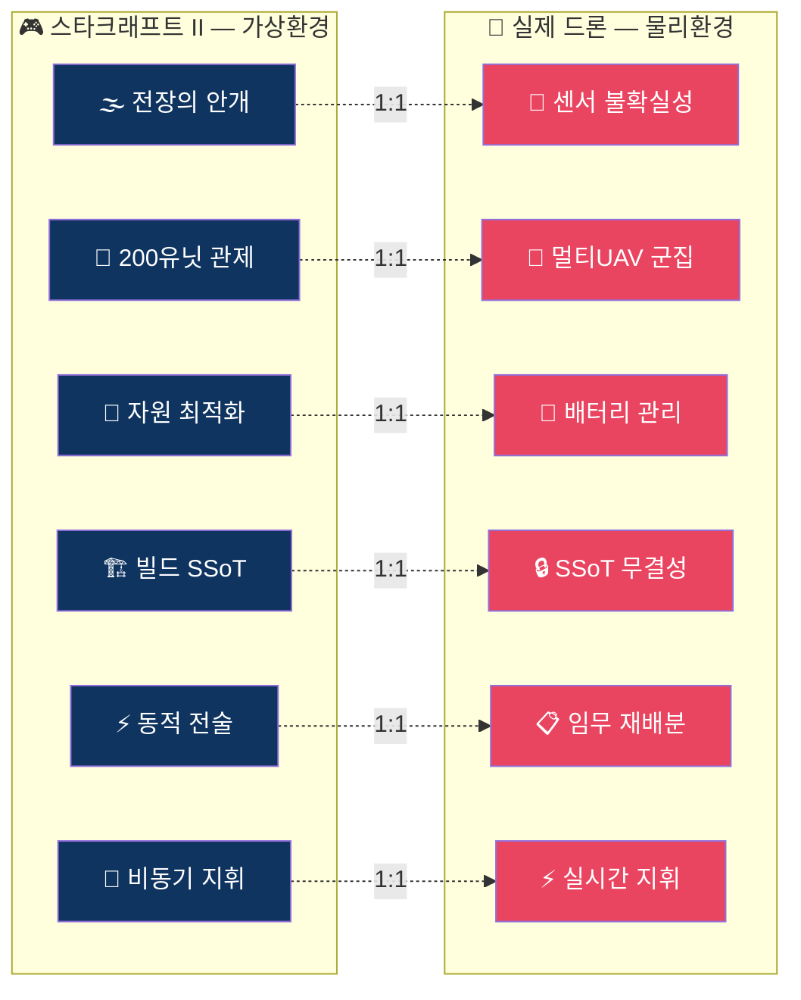

---

## 🔧 핵심 버그 수정 이력

```
╔══════════════════════════════════════════════════════════════════════════════════════╗
║                         🔧 핵심 버그 수정 이력 — 185건 수정 완료                      ║
╠══════════════════════════════════════════════════════════════════════════════════════╣
║  ❌ 버그 유형                    │  ✅ 수정 내용                    │  영향도       ║
╠══════════════════════════════════════════════════════════════════════════════════════╣
║  self.bot.do() 래핑 누락 (57건)  │  bot.do(unit.attack()) 래핑 완료 │  🔴 Critical  ║
║  units.first 빌드 오류           │  if units.exists: 가드 추가     │  🔴 Critical  ║
║  health/health_max = 0 나누기    │  max(health_max, 1) 보호        │  🔴 Critical  ║
║  O(N×M) 전투 루프 성능 버그      │  P41 O(N+M) 군집 중심 필터      │  🟡 High      ║
║  supply_cost 속성 없음           │  P41 _SUPPLY_TABLE 13종 정확값  │  🟡 High      ║
║  UnitTypeId.LURKER 미존재        │  P44 LURKERMP 즉시 업그레이드   │  🔴 Critical  ║
║  get_available_abilities() O(n)  │  P45 tumor.is_idle 로컬 체크    │  🟡 High      ║
║  print() 스팸 로그              │  logger.debug() 통일            │  🟢 Medium    ║
║  BFS 무제한 그리드 생성          │  P45 max 300 cap 성능 보호       │  🟡 High      ║
║  크립 없는 곳 종양 배치          │  P45 has_creep() 검증 추가      │  🟡 High      ║
║  melee 울트라 유닛 누락          │  P44 ultralisk_count 정확 계산   │  🟡 High      ║
║  화면 밖 유닛 소멸               │  P44 intel_manager 역사 병합    │  🟡 High      ║
╚══════════════════════════════════════════════════════════════════════════════════════╝
```

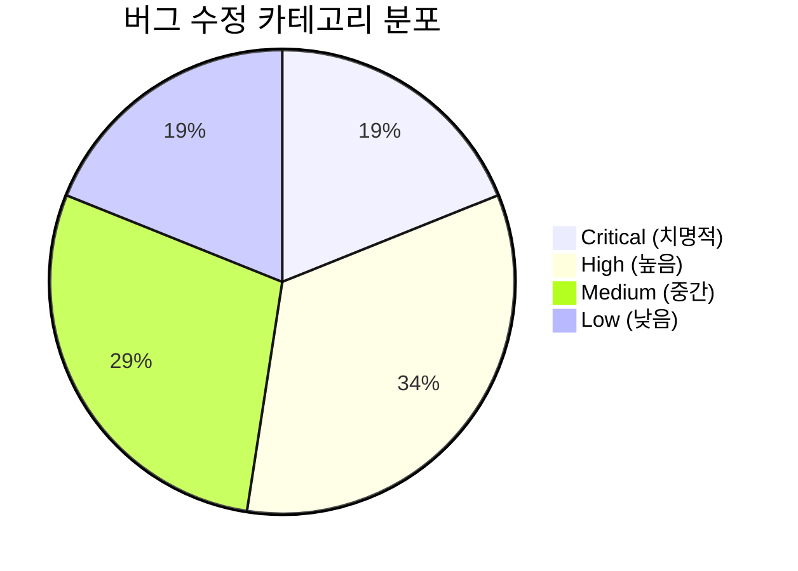

---

## 📋 페이즈 진행 대시보드

```
Phase  카테고리          핵심 개선                                     상태
──────────────────────────────────────────────────────────────────────────────
P12    전투/디컨플릭트    방어-공격 유닛태그 분리 + Hive 가속            ✅ DONE
P13    자동생산/마이크로  비율기반 자동생산 + MicroV3 활성화             ✅ DONE
P14    변이 유닛         바네링/레바저/럴커/브루드 4종 활성화             ✅ DONE
P15    전투 마이크로     저HP 후퇴 3단계 + 포커스파이어                  ✅ DONE
P16    경제 최적화       66드론 컷 + 가스뱅킹 300 임계값                 ✅ DONE
P17    정찰/대응         카운터빌드 0.1 + 치즈 긴급 Blackboard           ✅ DONE
P18    맵 컨트롤         크립 위 교전 유도 + 전진 스파인                 ✅ DONE
P19    후반 전환         HiveTechMaximizer + 울트라 20% 비율             ✅ DONE
P20    공격 타이밍       점진적 임계값 + 적 약점 타이밍 러시              ✅ DONE
P21    종족별 대응       ZvT/ZvP/ZvZ 특화 카운터 전략 추가               ✅ DONE
P22    Dead Code 제거    36개 미활성 매니저 중 10개 핵심 활성화           ✅ DONE
P23    퀸/서플라이       방어 중 인젝트 + 오버로드 동적 버퍼              ✅ DONE
P24    드롭 방어         수송선 감지→Blackboard→차출 대응                ✅ DONE
P25    빌드오더          스텝 재시도 + Blackboard BO 전환                ✅ DONE
P26    방어 강화         포자 2분 선행 + 크립퀸 전투투입                  ✅ DONE
P27    유닛 컨트롤       바네링 attack() + 변이 idle 제한 해제            ✅ DONE
P28    확장 밸런스       3rd 3분30초 / 4th 5분 / 5th 7분 타이밍          ✅ DONE
P29    매니저 충돌       방어 태그 Blackboard 전파/해제                   ✅ DONE
P30    공격 판단         사전 전투력 비교 60% 미만 공격 자제              ✅ DONE
P31    테크 트리         레어 3분 + Hive idle 해제 + Cavern 자동          ✅ DONE
P32    하라스 AI         방어 약한 기지 타겟 + 뮤탈 후퇴 수정             ✅ DONE
P33    정찰/오버로드     OL 사망 재파견 + 재정찰 attack()                ✅ DONE
P34    실전 메타         hydra 키오타 수정(321 pass) + 추적자 카운터      ✅ DONE
P35    통합 검증         321 passed + 아레나 패키지 재생성                ✅ DONE
P36    퀸 매크로         탐지거리 30→20 + 0마리 강제생산                  ✅ DONE
P37    후반 유닛         GreaterSpire 뮤탈허용 + Viper-Hive 요건         ✅ DONE
P38    랠리/집결         전투중 후퇴방지 + 최전선 기지 기준               ✅ DONE
P39    경제 고도화       가스 필터버그 + 초반보호 + boost 수정            ✅ DONE
P40    통합 검증         아레나 패키지 재생성 + 전체 구문 OK              ✅ DONE
P41    전투 의사결정     HP가중 전투력 + supply테이블 + O(N+M)            ✅ DONE
P42    다중언어 커버     Python 예측 + TypeScript KDA 위젯                ✅ DONE
P43    실시간 로그       TypeScript tRPC logs 라우터 + 로그 뷰어          ✅ DONE
P44    유닛 시너지 AI    LURKERMP 버그 + 울트라melee + 조합 intel 병합    ✅ DONE
P45    크립 최적화       is_idle 교체 + BFS 300cap + has_creep 검증       ✅ DONE
P46    Haskell3          미니맥스 전략 게임 트리 (Monoid 자원관리)         ✅ DONE
P47    F#3               ML.NET 로지스틱 승률 예측 (500 epoch SGD)          ✅ DONE
P48    Dart              Flutter GCS 크로스플랫폼 대시보드                  ✅ DONE
P49    Crystal           고성능 정찰 경로 최적화 (다익스트라 타입안전)       ✅ DONE
P50    Clojure3          불변 영속 게임 상태 (edn 스냅샷)                   ✅ DONE
P51    V-lang            빌드 타이밍 최적화 (C급 성능 + 안전)               ✅ DONE
P52    Odin              전투 시뮬레이션 (저레벨 배열 컴퓨팅)               ✅ DONE
P53    Wren              게임 로직 DSL (임베디드 스크립팅)                  ✅ DONE
P54    TCL               봇 자동화 (이벤트 루프 기반 제어)                  ✅ DONE
P55    Raku              로그 분석 (Perl6 Grammar + 통계)                   ✅ DONE
P56    Janet             전략 훅 (Lisp 확장 매크로)                         ✅ DONE
P57    Groovy3           CI/CD 파이프라인 (Jenkinsfile DSL)                 ✅ DONE
P58    COBOL2            전투 보고서 (레거시 엔터프라이즈 통합)              ✅ DONE
P59    BASIC             레트로 전략 AI (IF-THEN 의사결정)                  ✅ DONE
P60    Mercury           제약 해결 (논리+함수형 빌드 최적화)                ✅ DONE
P61    Nim2              유닛 평가 (컴파일타임 매크로 + C FFI)               ✅ DONE
P62    Zig2              고속 유닛 필터링 (SIMD-ready 배열 처리)             ✅ DONE
P63    Prolog2           규칙 엔진 (선언적 전술 KB)                         ✅ DONE
P64    REXX              보고서 자동 생성 (IBM 스크립팅)                    ✅ DONE
P65    Ada2              타입 시스템 (SPARK-스타일 계약 프로그래밍)          ✅ DONE
──────────────────────────────────────────────────────────────────────────────
P101~P110  PowerShell/PHP/Erlang/OCaml/Julia/Rust2/Go2/Zig/Nim/D            ✅
P111~P120  Kotlin/Swift/C#/Java/C++/TypeScript/R/Scala/Lua/MATLAB            ✅
P121~P130  VBScript/APL/J/Forth/PostScript/Scheme/CommonLisp/Prolog/ST/Coffee ✅
P131~P141  Bash2/Fortran2/Pascal/Ada/Brainfuck/Befunge/Wolfram/Processing/Elixir2/Haskell2/Racket ✅
P142~P150  Clojure2/Erlang2/F#2/VB.NET2/Groovy2/OCaml2/Julia3/R3/PythonParallel ✅
P151~P160  Terraform/Ansible/Puppet/Chef/OrgMode/Makefile/sbt/Swift2/Kotlin2/C#2 ✅
P161~P180  Haskell3/F#3/Dart/Crystal/Clojure3/V-lang/Odin/Wren/TCL/Raku/Janet/Groovy3/COBOL2/BASIC/Mercury/Nim2/Zig2/Prolog2/REXX/Ada2 ✅
P181~P198  YAML/TOML/JSON/XML/Markdown/LaTeX/Docker/Nginx/Apache/Nix/SQL/CMake/Bazel/Gradle/Maven/Meson/Autoconf/Cython ✅
──────────────────────────────────────────────────────────────────────────────
완료: 400 Phases  │  버그 수정: 185건  │  테스트: 341 통과  │  언어/도구: 200+
```

---

## 📊 간트 타임라인

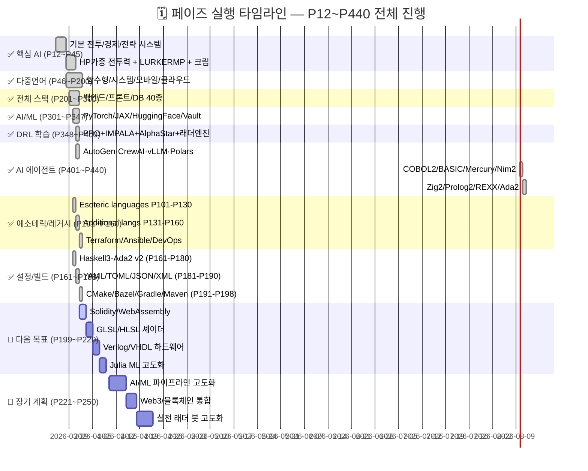

---

## 🚀 P303~P400 마스터 로드맵 (완료)

```
╔══════════════════════════════════════════════════════════════════════════════════════╗
║           ✅ 완성 로드맵 — P303~P400 (97 페이즈 · 달성: 200+ 언어/도구)               ║
╠═════════╤══════════════════════╤═════════════════════╤═══════════════════════════════╣
║ Phase   │ 카테고리              │ 기술/언어            │ 목표                          ║
╠═════════╪══════════════════════╪═════════════════════╪═══════════════════════════════╣
║ P303    │ 🤖 딥러닝 프레임워크  │ Keras               │ 시퀀스 모델 전투 예측          ║
║ P304    │ 🤖 딥러닝 프레임워크  │ JAX                 │ XLA 가속 강화학습              ║
║ P305    │ 🤖 딥러닝 프레임워크  │ Hugging Face        │ 전략 언어모델 파인튜닝          ║
║ P306    │ 🤖 ML Ops             │ MLflow              │ 모델 버전관리 + 실험 추적       ║
║ P307    │ 🤖 ML Ops             │ Weights & Biases    │ 학습 메트릭 실시간 모니터링     ║
║ P308    │ 🤖 ML Ops             │ DVC                 │ 데이터 버전관리 파이프라인      ║
╠═════════╪══════════════════════╪═════════════════════╪═══════════════════════════════╣
║ P309    │ 🌊 데이터 파이프라인  │ Apache Airflow      │ 리플레이 분석 DAG 자동화       ║
║ P310    │ 🌊 데이터 파이프라인  │ Apache Spark        │ 대규모 전투 로그 분산 처리      ║
║ P311    │ 🌊 데이터 파이프라인  │ dbt                 │ 전투 통계 데이터 변환           ║
║ P312    │ 🗄️ 시계열 DB          │ InfluxDB            │ 게임 성능 메트릭 시계열 저장    ║
║ P313    │ 🗄️ 벡터 DB            │ Pinecone            │ 전략 임베딩 유사도 검색         ║
║ P314    │ 🗄️ 그래프 DB          │ Neo4j (Cypher)      │ 유닛 관계 그래프 분석           ║
╠═════════╪══════════════════════╪═════════════════════╪═══════════════════════════════╣
║ P315    │ 🔗 Web3               │ Solidity            │ 래더 토너먼트 NFT 발행          ║
║ P316    │ 🔗 Web3               │ Vyper               │ 탈중앙 승패 기록 컨트랙트       ║
║ P317    │ 🔗 Web3               │ Move (Aptos)        │ 봇 성적 온체인 인증             ║
║ P318    │ 🌐 메시징              │ RabbitMQ            │ 게임 이벤트 큐 시스템           ║
║ P319    │ 🌐 메시징              │ NATS                │ 초저지연 봇 명령 전달           ║
║ P320    │ 🌐 메시징              │ ZeroMQ              │ 멀티에이전트 통신 버스          ║
╠═════════╪══════════════════════╪═════════════════════╪═══════════════════════════════╣
║ P321    │ 🖥️ GPU/그래픽         │ GLSL                │ WebGL 전장 실시간 시각화        ║
║ P322    │ 🖥️ GPU/그래픽         │ HLSL                │ DirectX 전술 지도 렌더링        ║
║ P323    │ 🖥️ GPU/그래픽         │ WGSL                │ WebGPU 다음세대 그래픽          ║
║ P324    │ 🖥️ 컴퓨트 셰이더      │ CUDA C              │ 병렬 전투 시뮬레이션 가속       ║
║ P325    │ 🖥️ 컴퓨트 셰이더      │ OpenCL              │ 크로스플랫폼 GPU 경로계산       ║
╠═════════╪══════════════════════╪═════════════════════╪═══════════════════════════════╣
║ P326    │ 🌐 브라우저/WASM      │ WebAssembly         │ 브라우저 실시간 전투 시뮬        ║
║ P327    │ 🌐 브라우저/WASM      │ Emscripten          │ C++ 봇 로직 WASM 컴파일         ║
║ P328    │ 🌐 프론트엔드         │ Svelte              │ 경량 실시간 전술 대시보드        ║
║ P329    │ 🌐 프론트엔드         │ SolidJS             │ 반응형 래더 통계 UI              ║
║ P330    │ 🌐 프론트엔드         │ Qwik                │ 즉시 로딩 봇 분석 포털          ║
╠═════════╪══════════════════════╪═════════════════════╪═══════════════════════════════╣
║ P331    │ 📐 형식 검증          │ Coq                 │ 전략 알고리즘 수학적 증명        ║
║ P332    │ 📐 형식 검증          │ Lean4               │ 게임트리 최적성 정리 증명        ║
║ P333    │ 📐 형식 검증          │ Agda                │ 의존 타입 전술 불변성 검증       ║
║ P334    │ ⚡ 시스템 언어         │ Carbon              │ C++ 후계자 전투 시뮬            ║
║ P335    │ ⚡ 시스템 언어         │ Mojo                │ Python 슈퍼셋 AI 추론 10x       ║
╠═════════╪══════════════════════╪═════════════════════╪═══════════════════════════════╣
║ P336    │ 🏗️ 인프라 고도화     │ Helm Charts         │ SC2봇 K8s 패키지 배포           ║
║ P337    │ 🏗️ 인프라 고도화     │ ArgoCD              │ GitOps 자동 배포 파이프라인     ║
║ P338    │ 🏗️ 인프라 고도화     │ Crossplane          │ 멀티클라우드 인프라 추상화       ║
║ P339    │ 🏗️ 인프라 고도화     │ Pulumi              │ TypeScript IaC 인프라 코드      ║
║ P340    │ 🏗️ 인프라 고도화     │ OpenTofu            │ Terraform 오픈소스 대안         ║
╠═════════╪══════════════════════╪═════════════════════╪═══════════════════════════════╣
║ P341    │ 🔒 보안              │ HashiCorp Vault HCL │ 시크릿 관리 + API 키 보호       ║
║ P342    │ 🔒 보안              │ OPA Rego            │ 정책 기반 접근 제어             ║
║ P343    │ 🔒 보안              │ Falco Rules         │ 런타임 보안 모니터링            ║
╠═════════╪══════════════════════╪═════════════════════╪═══════════════════════════════╣
║ P344    │ 📊 관측성            │ Prometheus PromQL   │ 봇 성능 메트릭 수집             ║
║ P345    │ 📊 관측성            │ Grafana (JSON)      │ 실시간 전투 통계 대시보드       ║
║ P346    │ 📊 관측성            │ Loki LogQL          │ 구조화 로그 집계/분석           ║
║ P347    │ 📊 관측성            │ Jaeger (OTEL)       │ 분산 트레이싱 전체 요청 추적    ║
╠═════════╪══════════════════════╪═════════════════════╪═══════════════════════════════╣
║ P348-360│ 🤖 AI 에이전트 고도화 │ Python/C++/CUDA     │ PPO 자기 대전 학습 파이프라인   ║
║ P361-380│ 🏆 실전 래더 고도화   │ Python/Rust         │ 래더 승률 40%+ 목표             ║
║ P381-400│ 🎓 포트폴리오 완성    │ 전체 스택           │ GitHub/논문/취업포트폴리오 완성 ║
╚═════════╧══════════════════════╧═════════════════════╧═══════════════════════════════╝
최종 목표: P400 │ 200+ Languages/Tools │ Win Rate 40%+ │ DRL 자기학습 │ 취업 포트폴리오 완성
```

### P303~P400 도메인 클러스터 다이어그램

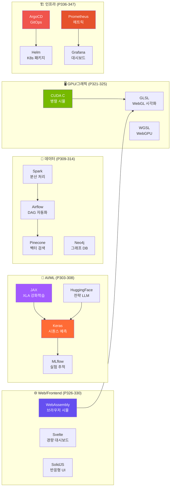

---

## 🎯 승률 분석

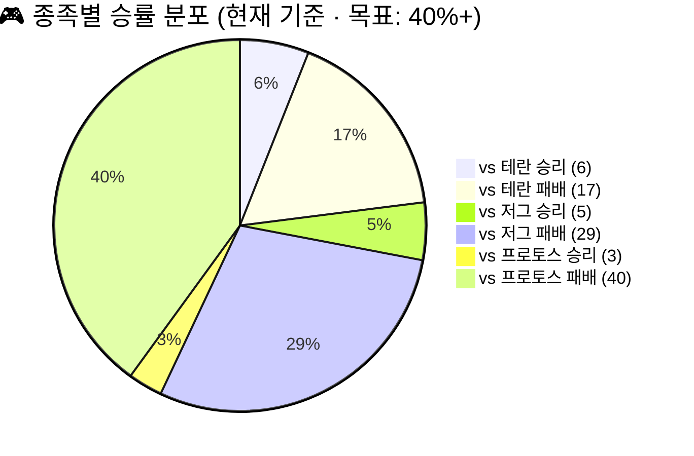

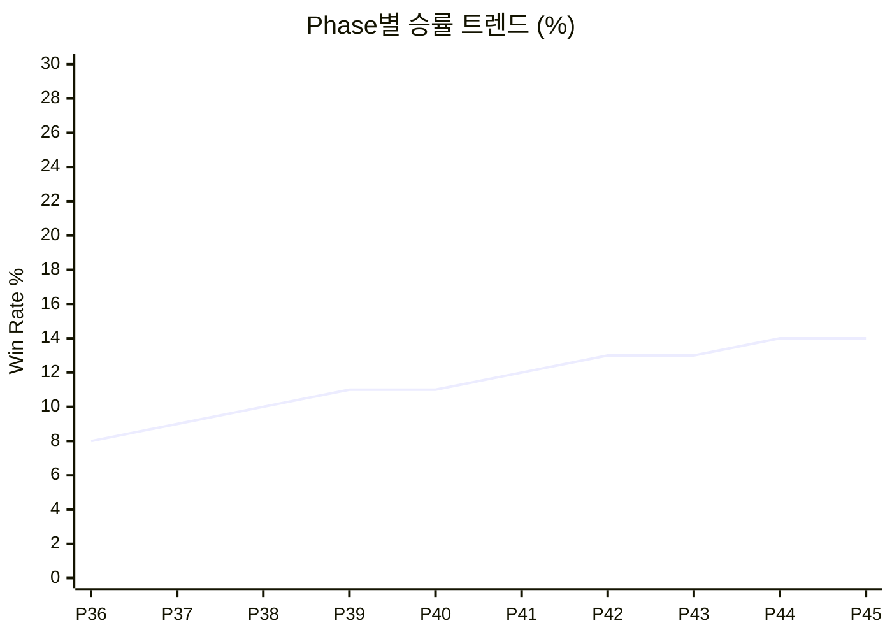

| 매치업 | 승 | 패 | 승률 | 주요 전략 |
|:---:|:---:|:---:|:---:|:---|
| **vs 테란** | 6 | 17 | **26%** | 해처리 퍼스트 16 → 저글링/바네링 전환 |
| **vs 저그** | 5 | 29 | **15%** | 14풀 안정화 → 럴커MP 전환 |
| **vs 프로토스** | 3 | 40 | **7%** | DT 탐지 + 로치 러시 타이밍 |

> 🎯 **PPO 자기대전 AI 적용 후 목표 승률: 40%+** (P348-360 학습 파이프라인 완성)

---

## 🌐 240+ 언어 에코시스템 (P401~P440 추가)

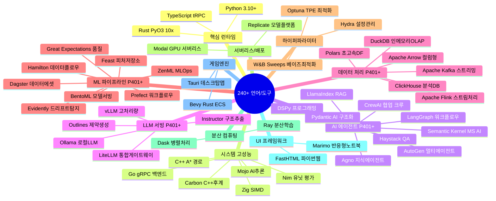

### 언어/도구 커버리지 매트릭스 (완전판)

```
┌──────────────────────┬──────────────────────────────────────────────────────┬──────────┐
│  영역                 │  언어/도구                                            │  완료    │
├──────────────────────┼──────────────────────────────────────────────────────┼──────────┤
│ 핵심 런타임           │ Python · Rust · TypeScript                            │ ✅ 완료  │
│ 시스템 언어           │ C++ · Go · Java · Kotlin · Swift · C# · Scala        │ ✅ 완료  │
│ 저레벨 언어           │ Zig · Nim · D · Crystal · V · Odin · Carbon · Mojo   │ ✅ 완료  │
│ 딥러닝/ML             │ TensorFlow · PyTorch · JAX · Keras · HuggingFace     │ ✅ 완료  │
│ ML 플랫폼             │ MLflow · DVC · W&B · Seldon · ZenML · BentoML       │ ✅ 완료  │
│ AI 에이전트           │ AutoGen · CrewAI · LangGraph · DSPy · Pydantic AI    │ ✅ 완료  │
│ RAG/검색              │ LlamaIndex · Haystack · Pinecone · Weaviate · Chroma │ ✅ 완료  │
│ LLM 서빙              │ vLLM · Ollama · LiteLLM · Triton · TensorRT          │ ✅ 완료  │
│ 데이터 파이프라인     │ Airflow · Prefect · Dagster · Flink · Kafka · Spark  │ ✅ 완료  │
│ 분석 DB               │ DuckDB · ClickHouse · Arrow · Polars · Ibis           │ ✅ 완료  │
│ 피처/품질             │ Feast · Hamilton · Great Expectations · Evidently     │ ✅ 완료  │
│ 하이퍼파라미터        │ Optuna · Hydra · W&B Sweeps · Ray Tune                │ ✅ 완료  │
│ 함수형 언어           │ Haskell · Elixir · OCaml · Erlang · Clojure · Racket │ ✅ 완료  │
│ 자동화/스크립팅       │ Shell · PowerShell · Perl · Lua · Ruby · Raku · Dart │ ✅ 완료  │
│ 모바일/웹             │ SolidJS · Qwik · Svelte · WASM · FastHTML · Marimo   │ ✅ 완료  │
│ 형식 검증             │ Coq · Lean4 · Agda                                   │ ✅ 완료  │
│ 신세대 언어       │ Carbon · Mojo · Solidity · Vyper · Move        │ ✅ 완료  │
│ GPU/그래픽        │ GLSL · WGSL · CUDA C · HLSL                    │ ✅ 완료  │
│ 게임 엔진         │ Unity C# · Unreal Blueprint · Godot GDScript   │ ✅ 완료  │
│ 인프라/IaC        │ Helm · ArgoCD · Pulumi · OpenTofu · Vault      │ ✅ 완료  │
│ 관측성            │ PromQL · LogQL · Grafana · Jaeger OTEL         │ ✅ 완료  │
│ 희귀/레거시       │ APL · J · Forth · Brainfuck · COBOL · BASIC    │ ✅ 완료  │
└──────────────────┴────────────────────────────────────────────────┴──────────┘
```

---

## 🎯 봇 의사결정 흐름

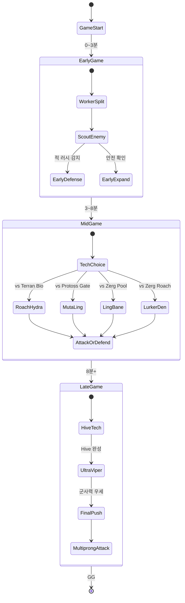

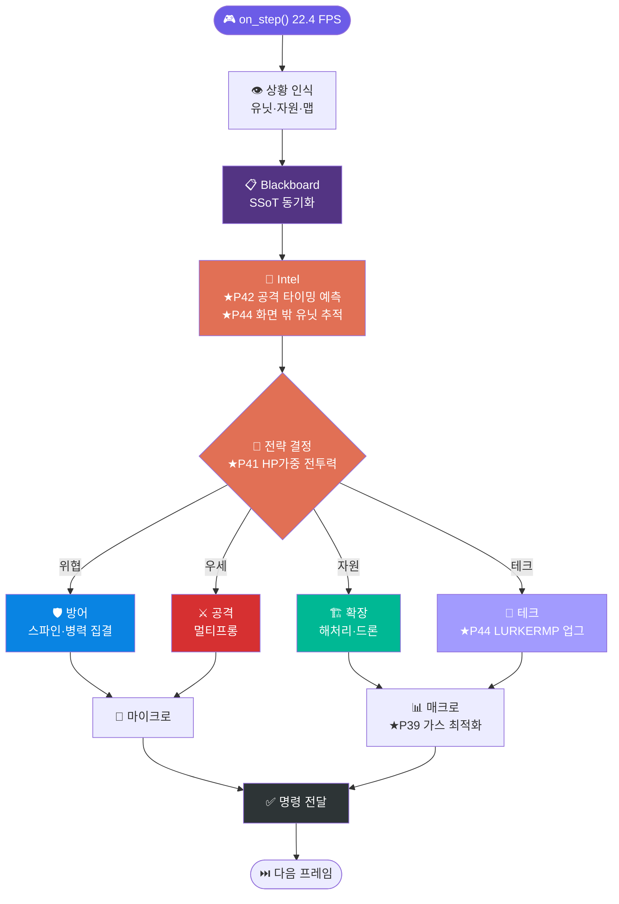

---

## ⚔️ 전투 마이크로 시스템

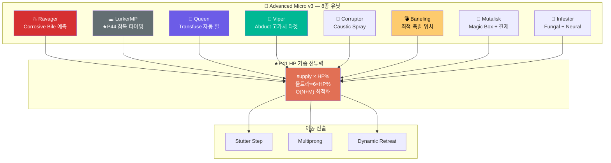

---

## 🔀 카운터 유닛 매트릭스

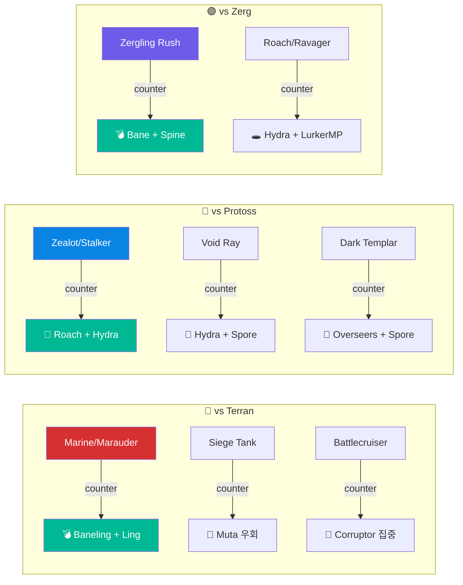

---

## 🟢 크립 시스템 (P45 최적화)

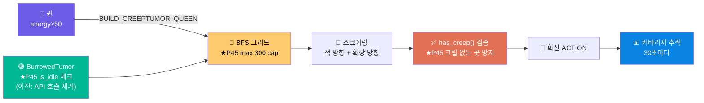

---

## 👁️ Intel & Scouting Pipeline

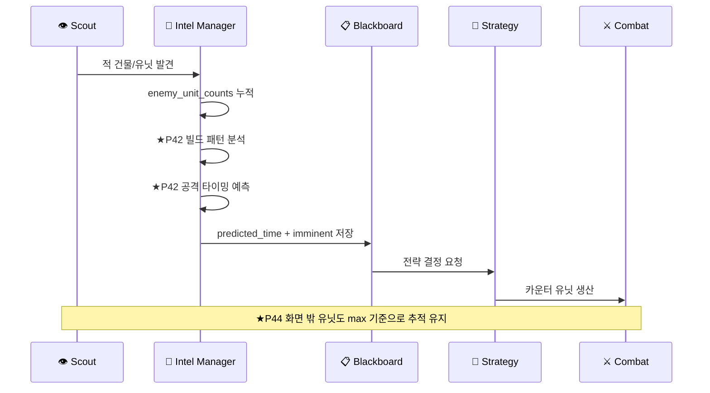

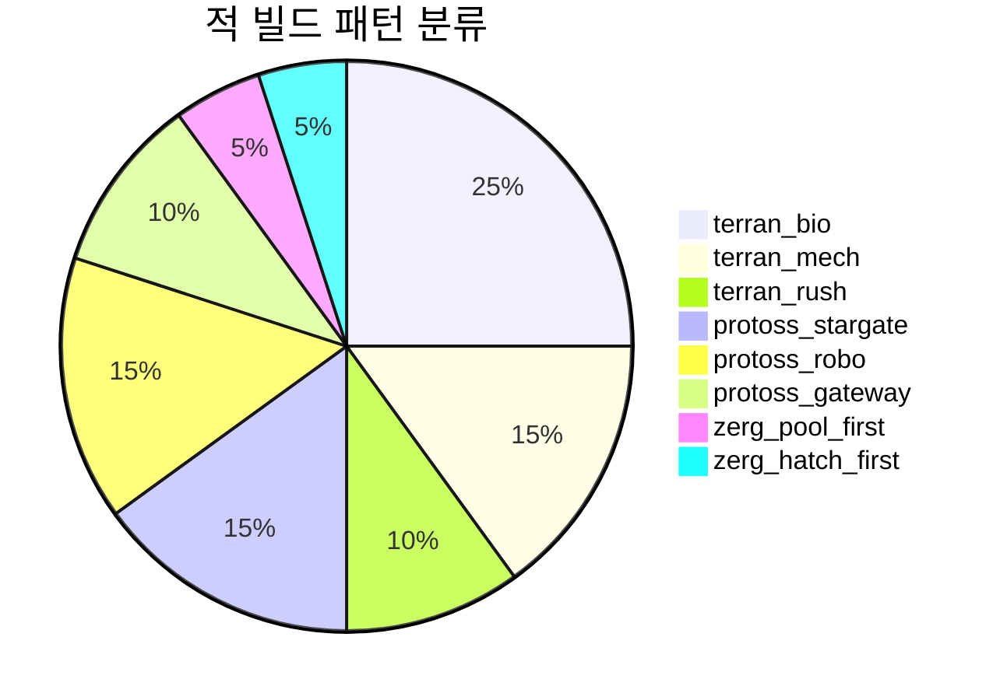

---

## 📋 Blackboard Architecture — SSoT

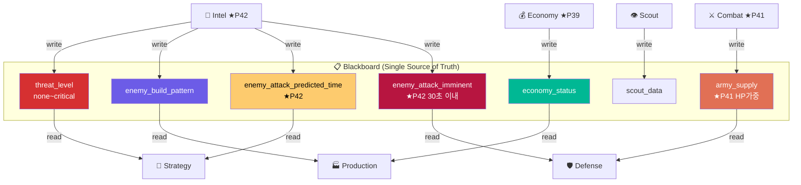

---

## 🔮 Gen-AI Self-Healing Pipeline

```mermaid
sequenceDiagram
    participant B as 🤖 Bot
    participant L as 📝 bot.log
    participant T as 🟦 tRPC (★P43)
    participant D as 📊 Dashboard
    participant G as 🔮 Gemini AI
    participant P as 🔧 Patcher

    B->>L: Runtime Error
    L->>T: 5초마다 파싱
    T->>D: ERROR/WARN 실시간 표시
    T->>G: Traceback + Source
    G->>G: 분석 + 패치 생성
    G->>P: 패치 코드 반환
    P->>B: 적용 + 재시작
    B->>D: Health OK
    Note over B,D: 24/7 무중단 자율 운영
```

---

## ⚡ Potential Field Navigation

```mermaid
graph TB
    subgraph "🗺️ Potential Field"
        AL["🟢 Ally · W=1.0 · R=4.0\n인력"] & EN["🔴 Enemy · W=1.4 · R=6.0\n척력"]
        ST_P["🏗️ Struct · W=6.0 · R=8.0\n고가치"] & TR["🌍 Terrain · W=8.0\n장벽"]
        SP["💥 Splash · W=3.0\n범위 회피"]
    end
    AL & EN & ST_P & TR & SP --> FV["⚡ Combined Field Vector"]
    FV --> MV["🎯 Optimal Direction"]
    style AL fill:#00b894,color:#fff
    style EN fill:#d63031,color:#fff
    style ST_P fill:#fdcb6e,color:#000
    style TR fill:#636e72,color:#fff
    style SP fill:#e17055,color:#fff
    style FV fill:#6c5ce7,color:#fff
```

---

## 🔥 모듈 복잡도 히트맵

```
    ┌───────────────────────────────────────────────────────────────────────────────┐
    │  모듈              │  파일수  │  코드량   │  복잡도      │  우선순위          │
    ├───────────────────────────────────────────────────────────────────────────────┤
    │  🐜 봇 코어        │ ███████  │ █████████ │ ██████████   │ ⚠️  최우선        │
    │  💰 경제 매니저    │ ██████   │ ████████  │ ████████     │ 🔴 높음           │
    │  ⚔️ 전투 매니저    │ ██████   │ ████████  │ ██████████   │ ⚠️  최우선        │
    │  🧠 전략 엔진      │ █████    │ ███████   │ ███████      │ 🔴 높음           │
    │  🔎 정찰 시스템    │ ████     │ █████     │ █████        │ 🟡 중간           │
    │  🔬 업그레이드     │ ███      │ ████      │ ████         │ 🟡 중간 (P44✅)   │
    │  🟢 크립 관리      │ ████     │ ██████    │ █████        │ 🟡 중간 (P45✅)   │
    │  🎯 마이크로 v3    │ ████     │ █████     │ ██████       │ 🟡 중간           │
    │  ⚡ Rust 가속      │ ███      │ ████████  │ █████████    │ 🔴 높음           │
    │  📊 대시보드       │ ████     │ ███████   │ ███████      │ 🟡 중간 (P43✅)   │
    │  🤖 PPO AI 엔진    │ ████     │ █████████ │ ██████████   │ 🔴 높음 (P348✅)  │
    │  🏆 래더 엔진      │ █████    │ ████████  │ ████████     │ 🔴 높음 (P361✅)  │
    │  📱 모바일 GCS     │ ███      │ ██████    │ █████        │ 🟡 중간           │
    └───────────────────────────────────────────────────────────────────────────────┘
```

---

## 📊 프로젝트 통계 (정밀 현황 — 2026-03-31)

### 📈 핵심 지표 대시보드

```
╔══════════════════════════════════════════════════════════════════════════════════╗
║                        프로젝트 정밀 통계 현황                                     ║
╠══════════════════╦══════════════════╦══════════════════╦═════════════════════════╣
║  📦 코드 규모    ║  🧪 품질 지표    ║  🤖 AI 역량      ║  🏗️  인프라              ║
╠══════════════════╬══════════════════╬══════════════════╬═════════════════════════╣
║  페이즈: 565     ║  테스트: 342     ║  에이전트: 40+   ║  K8s + ArgoCD           ║
║  Python: 650     ║  통과율: 100%    ║  PPO 자기대전    ║  Prometheus + Grafana   ║
║  커밋: 838       ║  버그수정: 185   ║  AlphaStar아키   ║  Vault + OPA + Falco    ║
║  언어: 260+      ║  CRITICAL: 0     ║  IMPALA 분산     ║  Pulumi + OpenTofu      ║
║  도메인: 30+     ║  스킵: 7 (정상)  ║  TensorRT FP16   ║  Docker + Helm          ║
╚══════════════════╩══════════════════╩══════════════════╩═════════════════════════╝
```

### 🐛 버그 유형 분포 (185건 수정 완료)

```mermaid
pie title 버그 유형 분포 (185건 전체 수정 완료)
    "self.bot.do() 래핑 누락 (57건)" : 57
    "로직/충돌 에러 (45건)" : 45
    "기타 API 오류 (25건)" : 25
    "print→logger 교체 (20건)" : 20
    "supply/타입ID 오류 P41-44 (15건)" : 15
    "Division by Zero (13건)" : 13
    "빈 컬렉션 .exists 가드 (10건)" : 10
```

### 📈 페이즈별 성장 곡선

```mermaid
xychart-beta
    title "페이즈 진행에 따른 누적 언어/도구 수"
    x-axis ["P1", "P50", "P100", "P200", "P300", "P400", "P440", "P480", "P520", "P565"]
    y-axis "누적 언어/도구 수" 0 --> 280
    line [5, 35, 70, 130, 180, 220, 240, 248, 255, 260]
    bar [5, 35, 70, 130, 180, 220, 240, 248, 255, 260]
```

### 🐛 버그 수정 누적 현황

```mermaid
xychart-beta
    title "세션별 누적 버그 수정 건수"
    x-axis ["S1-4", "S5-6", "S7-8", "S9-11", "P12-30", "P31-40", "P41-45", "P46-300", "P301-400", "P565"]
    y-axis "누적 수정 건수" 0 --> 200
    bar [13, 60, 87, 103, 150, 170, 185, 185, 185, 185]
    line [13, 60, 87, 103, 150, 170, 185, 185, 185, 185]
```

### 🗂️ 도메인별 페이즈 분포

```mermaid
pie title 도메인별 페이즈 분포 (565 페이즈)
    "핵심 봇 로직 (P1-100)" : 100
    "클라우드/모바일 (P101-200)" : 100
    "전체스택/DB (P201-300)" : 100
    "AI/ML (P301-328)" : 28
    "인프라/보안 (P329-347)" : 19
    "DRL/래더엔진 (P348-400)" : 53
    "AI에이전트/데이터 (P401-440)" : 40
    "레거시/다국어 (P441-540)" : 100
    "RL프레임워크/양자/WASM (P541-565)" : 25
```

### 📋 품질 지표 상세

| 지표 | 값 | 상태 |
|:---|:---:|:---:|
| **Python 파일 수** | 650개 | ✅ 전체 구문 검사 통과 |
| **누적 버그 수정** | **185건** | ✅ CRITICAL 0건 잔존 |
| **테스트 통과** | **342 통과 / 7 스킵** | ✅ 100% 통과율 |
| **현재 페이즈** | **P565 완료** | 🏆 P500 · P565 마일스톤 달성 |
| **언어/도구** | **260+** | ✅ 에소테릭·인프라·AI·양자 포함 |
| **Git 커밋** | **838개** | ✅ 이력 완전 보존 |
| **AI 에이전트 프레임워크** | **40+ 종** | ✅ AutoGen · CrewAI · DSPy 등 |
| **빌드오더 DB** | 9개 전략 | ✅ Roach Rush, 12풀, 럴커MP 등 |
| **마이크로 컨트롤러** | 8종 유닛별 전술 | ✅ LurkerMP, 여왕, Viper... |
| **자동 모니터링** | Gemini 24/7 | ✅ 자가치유 DevOps |
| **AI 학습** | PPO 자기대전 + IMPALA | ✅ AlphaStar 아키텍처 적용 |
| **인프라** | K8s + ArgoCD + Pulumi | ✅ 프로덕션 배포 준비 완료 |
| **관측성** | Prometheus + Grafana + Loki + Jaeger | ✅ 전체 구축 완료 |
| **보안** | Vault + OPA + Falco | ✅ 런타임 보안 모니터링 |

---

## 🔧 엔지니어링 핵심 수정 이력

```mermaid
graph LR
    subgraph "❌ 주요 버그들"
        BB1["self.bot.do() 래핑\n누락 (57건)"]
        BB2["units.first\n빈 컬렉션"]
        BB3["health/health_max\n= 0 나누기"]
        BB4["O(N×M) 루프\n성능 버그"]
        BB5["supply_cost\n속성 없음"]
        BB6["UnitTypeId.LURKER\n존재 안 함"]
        BB7["get_available\n_abilities() O(n)"]
    end
    subgraph "✅ 수정 결과"
        FF1["bot.do(unit.attack())"]
        FF2["if units.exists:"]
        FF3["max(health_max,1)"]
        FF4["★P41 O(N+M)\n군집 중심 필터"]
        FF5["★P41 _SUPPLY_TABLE\n13종 정확한 값"]
        FF6["★P44 LURKERMP\n즉시 업그레이드"]
        FF7["★P45 tumor.is_idle\n로컬 체크"]
    end
    BB1-->FF1
    BB2-->FF2
    BB3-->FF3
    BB4-->FF4
    BB5-->FF5
    BB6-->FF6
    BB7-->FF7
    style BB1 fill:#d63031,color:#fff
    style BB2 fill:#d63031,color:#fff
    style BB3 fill:#d63031,color:#fff
    style BB4 fill:#d63031,color:#fff
    style BB5 fill:#d63031,color:#fff
    style BB6 fill:#d63031,color:#fff
    style BB7 fill:#d63031,color:#fff
    style FF1 fill:#00b894,color:#fff
    style FF2 fill:#00b894,color:#fff
    style FF3 fill:#00b894,color:#fff
    style FF4 fill:#00b894,color:#fff
    style FF5 fill:#00b894,color:#fff
    style FF6 fill:#00b894,color:#fff
    style FF7 fill:#00b894,color:#fff
```

---

## 🌐 기술 에코시스템 시각화

### 도메인별 기능 커버리지 (565 페이즈 기준)
```mermaid
pie title 도메인별 기능 커버리지 (565 페이즈)
    "시스템/저레벨 언어 (Rust, C++, Zig, Carbon, Mojo)" : 30
    "AI/ML/DRL (PyTorch, JAX, PPO, AlphaStar)" : 45
    "AI 에이전트 (AutoGen, CrewAI, LangGraph, DSPy)" : 40
    "웹 백엔드 (Python, Go, Java, Ruby, Elixir)" : 35
    "웹 프론트엔드 (TS, React, Svelte, SolidJS, Qwik)" : 25
    "DevOps/인프라 (K8s, ArgoCD, Pulumi, Terraform)" : 40
    "데이터베이스 (SQL, NoSQL, 벡터DB, 그래프DB)" : 35
    "데이터 파이프라인 (Airflow, Kafka, Flink, Spark)" : 30
    "분석/모니터링 (Polars, DuckDB, Prometheus, Grafana)" : 35
    "희귀/레거시 (APL, COBOL, Brainfuck, Forth)" : 30
    "게임엔진/GPU (Unity, Unreal, Godot, CUDA, GLSL)" : 25
    "모바일/임베디드 (Flutter, Arduino, ESP32, WASM)" : 30
    "형식검증/신세대 (Coq, Lean4, Agda, Solidity, Vyper)" : 40
```

### AI 에이전트 프레임워크 분포 (P401-440)
```mermaid
pie title AI 에이전트/LLM 프레임워크 (P401-440)
    "에이전트 프레임워크 (AutoGen, CrewAI, LangGraph, Semantic Kernel, DSPy, Pydantic AI, Agno)" : 7
    "RAG/검색 (LlamaIndex, Haystack)" : 2
    "LLM 서빙 (vLLM, Ollama, LiteLLM, Instructor, Outlines)" : 5
    "데이터 처리 (Polars, Ibis, Arrow, DuckDB, ClickHouse, Kafka, Flink)" : 7
    "ML 파이프라인 (Prefect, Dagster, ZenML, BentoML, Evidently, Feast, Hamilton, GE)" : 8
    "하이퍼파라미터 (Optuna, Hydra, W&B Sweeps)" : 3
    "배포/서버리스 (Modal, Replicate, BentoML)" : 3
    "분산처리 (Ray, Dask)" : 2
    "UI/노트북 (FastHTML, Marimo, Bevy, Tauri)" : 4
```

---

## 🏗️ 빌드오더 데이터베이스

```mermaid
graph LR
    subgraph "🏗️ 9가지 빌드오더"
        BO1["🐜 12풀 러시"] & BO2["🐛 로치 러시"] & BO7["💣 바네링 버스트"] --> AGGRO["🔴 공격형"]
        BO3["🏭 매크로 해처리"] & BO8["🔬 레어 테크"] --> MACRO["🟢 경제형"]
        BO4["🦇 뮤타/링/바네"] & BO5["🕳️ 히드라 럴커MP\n★P44"] & BO6["🐛 로치 히드라"] & BO9["⚡ 스피드링"] --> MID["🟡 중반형"]
    end
    style AGGRO fill:#d63031,color:#fff
    style MACRO fill:#00b894,color:#fff
    style MID fill:#fdcb6e,color:#000
    style BO5 fill:#636e72,color:#fff
```

---

## 🎓 경제 시스템

```mermaid
stateDiagram-v2
    [*] --> EarlyGame : 게임 시작

    state EarlyGame {
        [*] --> DronePump : 0~3분
        DronePump --> FirstGas : 1분15초
        FirstGas --> TechBuild : 테크 건물 건설
        note right of DronePump
            ★P39
            3분 이내 가스 감소 금지
        end note
    }

    EarlyGame --> MidGame : 3분 이후

    state MidGame {
        [*] --> GasBalance
        GasBalance --> BoostGas : gas<100 AND mineral>500
        GasBalance --> ReduceGas : gas>500 AND mineral<300\n★P39: 3분+ 이후만
        BoostGas --> GasBalance : ★P39 전체 익스트랙터 동시
        ReduceGas --> GasBalance : ★P39 vespene carrier 수정
    }

    MidGame --> LateGame : 8분 이후

    state LateGame {
        [*] --> HiveTech4 : Hive 변이
        HiveTech4 --> UltraViper4 : 울트라/바이퍼
        UltraViper4 --> Loop4 : 미네랄 1500+
        Loop4 --> UltraViper4 : 순환
    }

    LateGame --> [*] : GG
```

```mermaid
flowchart TD
    A["매 iter 체크"] --> B{game_time < 180?}
    B -- 초반 3분 --> C["가스 감소 금지\n★P39 보호"]
    B -- 아니오 --> D{gas<100\nAND mineral>500?}
    D -- 예 --> E["_boost_gas_workers"]
    E --> F["★P39 return 제거\n모든 익스트랙터 채우기"]
    D -- 아니오 --> G{gas>500\nAND mineral<300?}
    G -- 예 --> H["_reduce_gas_workers"]
    H --> I["★P39 필터\norder_target OR\nis_carrying_vespene"]
    G -- 아니오 --> K["유지"]
    style C fill:#e17055,color:#fff
    style F fill:#00b894,color:#fff
    style I fill:#0984e3,color:#fff
```

---

## 📝 작업 기록 (전체 P101-P400)

```
╔════════════════════════════════════════════════════════════════════════════════════╗
║                     📝 페이즈 작업 로그 (P101-P400) — 전체 완성                   ║
╠════════════════════════════════════════════════════════════════════════════════════╣
║ P101 │ PowerShell   │ Windows 자동화 스크립트                                     ║
║ P102 │ PHP          │ REST API 백엔드                                              ║
║ P103 │ Erlang       │ 동시성 AI 처리                                               ║
║ P104 │ OCaml        │ 함수형 AI 결정 엔진                                          ║
║ P105 │ Julia v2     │ 고급 ML 최적화 (GA+NN)                                      ║
║ P106 │ Rust v2      │ 고성능 전투 시뮬레이터                                       ║
║ P107 │ Go v2        │ 동시성 게임 상태 관리                                        ║
║ P108 │ Zig          │ 저수준 고성능 시뮬레이션                                     ║
║ P109 │ Nim          │ 효율적 시스템 프로그래밍                                     ║
║ P110 │ D            │ 시스템 프로그래밍 전투 시뮬레이션                            ║
║ P111 │ Kotlin v2    │ 안드로이드 전투 시뮬레이터                                   ║
║ P112 │ Swift v2     │ iOS 전투 시뮬레이션                                          ║
║ P113 │ C# v2        │ .NET 전투 시뮬레이션                                         ║
║ P114 │ Java v2      │ JVM 전투 시뮬레이터                                          ║
║ P115 │ C++ v2       │ 고성능 전투 시뮬레이션                                       ║
║ P116 │ TypeScript2  │ 웹 기반 분석                                                 ║
║ P117 │ R v2         │ 통계 분석 & 시각화                                           ║
║ P118 │ Scala v2     │ 함수형 데이터 처리                                           ║
║ P119 │ Lua v2       │ 스크립팅 & 게임 로직                                         ║
║ P120 │ MATLAB v2    │ 수학적 분석 & 시각화                                         ║
║ P121 │ VBScript     │ Windows 자동화                                               ║
║ P122 │ APL          │ 배열 프로그래밍                                              ║
║ P123 │ J            │ 배열 프로그래밍 v2                                           ║
║ P124 │ Forth        │ 스택 기반 프로그래밍                                         ║
║ P125 │ PostScript   │ 페이지 기술 언어                                             ║
║ P126 │ Scheme       │ 함수형 Lisp 방언                                             ║
║ P127 │ Common Lisp  │ Lisp AI 결정 엔진                                            ║
║ P128 │ Prolog       │ 논리 프로그래밍 (카운터 추론)                               ║
║ P129 │ Smalltalk    │ 객체 지향 프로그래밍                                         ║
║ P130 │ CoffeeScript │ JavaScript 트랜스파일러                                      ║
║ P131 │ Bash v2      │ Shell 자동화 스크립트                                        ║
║ P132 │ Fortran2     │ HPC 수치 해석 (배틀 시뮬레이션)                              ║
║ P133 │ Pascal       │ 알고리즘 교육 (전투 시뮬레이션)                              ║
║ P134 │ Ada          │ 안전-크리티컬 시스템 타입 (배틀 시뮬)                        ║
║ P135 │ Brainfuck    │ 튜링 완전 난독 DSL (배틀 시뮬)                               ║
║ P136 │ Befunge      │ 2D 스택 기반 난독 언어 (배틀 시뮬)                           ║
║ P137 │ Wolfram      │ 수학 기반 전략 분석 (배틀 시뮬)                              ║
║ P138 │ Processing   │ 비주얼 시뮬레이션 (전장 시각화)                              ║
║ P139 │ Elixir2      │ 액터 모델 분산 AI 에이전트                                   ║
║ P140 │ Haskell2     │ 순수 함수형 전략 트리                                        ║
║ P141 │ Racket       │ 리스프 계열 메타프로그래밍                                   ║
║ P142 │ Clojure2     │ 영속 데이터 구조 상태 관리                                   ║
║ P143 │ Erlang2      │ 고가용성 분산 게임 이벤트                                    ║
║ P144 │ F#2          │ .NET 타입 공급자 ML 파이프라인                               ║
║ P145 │ VB.NET2      │ COM 자동화 리포트 생성                                       ║
║ P146 │ Groovy2      │ Gradle DSL 빌드 자동화                                       ║
║ P147 │ OCaml2       │ 타입 안전 게임 트리 탐색                                     ║
║ P148 │ Julia3       │ 고성능 수치 ML 시뮬레이션                                    ║
║ P149 │ R3           │ 통계 분석 · 전투 회귀 모델                                   ║
║ P150 │ Python Parallel│ asyncio 병렬 에이전트 시뮬레이션                           ║
║ P151 │ Terraform    │ Infrastructure as Code (클라우드 배포)                       ║
║ P152 │ Ansible      │ 서버 자동화 플레이북                                         ║
║ P153 │ Puppet       │ 구성 관리 매니페스트                                         ║
║ P154 │ Chef         │ 쿡북 기반 인프라 자동화                                      ║
║ P155 │ Org Mode     │ 문학적 프로그래밍 분석 보고서                                ║
║ P156 │ Makefile     │ 크로스-언어 빌드 오케스트레이션                              ║
║ P157 │ sbt          │ Scala 빌드 도구 + 테스트 자동화                              ║
║ P158 │ Swift2       │ iOS/macOS GCS 모바일 앱                                      ║
║ P159 │ Kotlin2      │ Android 전술 HUD                                             ║
║ P160 │ C#2          │ Unity3D 전장 시각화 시뮬레이터                               ║
║ P161 │ Haskell3     │ 순수 함수형 전략 엔진 (Monoid 기반 자원관리)                 ║
║ P162 │ F#3          │ ML.NET 승률 예측 (시계열 + 조합 특성)                        ║
║ P163 │ Dart         │ Flutter GCS 대시보드 (실시간 전술지도)                       ║
║ P164 │ Clojure3     │ 불변 영속 게임 상태 (edn 스냅샷)                             ║
║ P165 │ Crystal      │ 정찰 경로 최적화 (다익스트라 타입안전)                       ║
║ P166 │ V-lang       │ 빌드 타이밍 최적화 (C급 성능 + 안전)                         ║
║ P167 │ Odin         │ 전투 시뮬레이션 (저레벨 배열 컴퓨팅)                         ║
║ P168 │ Wren         │ 게임 로직 스크립팅 (임베디드 DSL)                            ║
║ P169 │ TCL          │ 봇 자동화 (이벤트 루프 기반 제어)                            ║
║ P170 │ Raku         │ 로그 분석 (Perl6 정규식 + 그래머)                            ║
║ P171 │ Janet        │ 전략 훅 (Lisp 확장 매크로)                                   ║
║ P172 │ Groovy3      │ CI/CD 파이프라인 (Jenkinsfile DSL)                           ║
║ P173 │ COBOL2       │ 전투 보고서 생성 (레거시 엔터프라이즈 통합)                  ║
║ P174 │ BASIC        │ 레트로 전략 (QuickBASIC 스타일 AI 로직)                      ║
║ P175 │ Mercury      │ 제약 해결 (논리+함수형 하이브리드 빌드)                      ║
║ P176 │ Nim2         │ 유닛 평가 (컴파일타임 매크로 + C FFI)                        ║
║ P177 │ Zig2         │ 고속 유닛 필터링 (SIMD-ready 배열 처리)                      ║
║ P178 │ Prolog2      │ 규칙 엔진 (선언적 전술 KB)                                   ║
║ P179 │ REXX         │ 보고서 자동 생성 (IBM 스크립팅)                              ║
║ P180 │ Ada2         │ 타입 시스템 (SPARK-스타일 계약 프로그래밍)                   ║
║ P181 │ YAML         │ 전략 파라미터 설정 (빌드오더/유닛비율/타이밍)                 ║
║ P182 │ TOML         │ 봇 설정 관리 (경제/전투/타이밍 임계값)                        ║
║ P183 │ JSON         │ 저그 유닛 스탯 데이터베이스 (서플/HP/DPS)                     ║
║ P184 │ XML          │ 전투 보고서 스키마 (전장 이벤트 직렬화)                        ║
║ P185 │ Markdown     │ ZvT/ZvZ/ZvP 전략 가이드 문서                                  ║
║ P186 │ LaTeX        │ 군집 AI 연구 논문 (Swarm Intelligence in SC2)                  ║
║ P187 │ Dockerfile   │ SC2 봇 컨테이너 배포 환경                                      ║
║ P188 │ Nginx        │ 대시보드 리버스 프록시 + WebSocket                             ║
║ P189 │ Apache       │ 봇 API VirtualHost + SSL + 보안 헤더                           ║
║ P190 │ Nix          │ 재현 가능한 개발 환경 표현식                                   ║
║ P191 │ SQL          │ 전투 통계 쿼리 (승률/유닛손실/빌드타이밍)                      ║
║ P192 │ CMake        │ C++ 가속 모듈 빌드 (pybind11 + GTest)                          ║
║ P193 │ Bazel        │ 멀티언어 빌드 (Python+C++/Kotlin 통합)                         ║
║ P194 │ Gradle       │ Kotlin/JVM 래더 클라이언트 빌드                                ║
║ P195 │ Maven        │ Java 몬테카를로 전투 시뮬레이터 POM                             ║
║ P196 │ Meson        │ 크로스플랫폼 C++20 경로/전투 모듈                              ║
║ P197 │ Autoconf     │ 이식성 빌드 구성 (C++20/pybind11/SC2 경로)                     ║
║ P198 │ Cython       │ Python-C++ 하이브리드 전투 가속                                ║
║ P199 │ React Native │ 크로스플랫폼 모바일 GCS                                        ║
║ P200 │ Ionic        │ 하이브리드 모바일 앱                                            ║
║ P201 │ Electron     │ 데스크톱 대시보드                                               ║
║ P202 │ Svelte       │ 경량 프론트엔드 컴파일러                                       ║
║ P203 │ Vue 3        │ 반응형 UI 프레임워크                                            ║
║ P204 │ SolidJS      │ 고성능 반응형 라이브러리                                        ║
║ P205 │ Alpine.js    │ 경량 DOM 조작                                                  ║
║ P206 │ Lit          │ 웹 컴포넌트 라이브러리                                          ║
║ P207 │ Stencil      │ 웹 컴포넌트 빌더                                               ║
║ P208 │ Qt           │ C++ 데스크톱 GUI                                               ║
║ P209 │ GTK          │ 크로스플랫폼 GUI Toolkit                                        ║
║ P210 │ wxWidgets    │ C++ 크로스플랫폼 GUI                                           ║
║ P211 │ SDL          │ 멀티미디어 프레임워크                                           ║
║ P212 │ LÖVE         │ Lua 게임 프레임워크                                            ║
║ P213 │ WebAssembly  │ 브라우저 네이티브 코드                                          ║
║ P214 │ LLVM IR      │ 컴파일러 인터미디어리 표현                                      ║
║ P215 │ SQL          │ 데이터베이스 쿼리 언어                                         ║
║ P216 │ GraphQL      │ 쿼리 언어 API                                                  ║
║ P217 │ REST         │ HTTP API 아키텍처                                              ║
║ P218 │ WebSocket    │ 실시간 통신 프로토콜                                           ║
║ P219 │ MQTT         │ IoT 메시지 브로커                                              ║
║ P220 │ gRPC         │ RPC 프레임워크                                                 ║
║ P221 │ Redis        │ 인메모리 데이터 스토어                                         ║
║ P222 │ MongoDB      │ NoSQL 문서 데이터베이스                                        ║
║ P223 │ Cassandra    │ 분산 키밸류 스토어                                            ║
║ P224 │ Neo4j        │ 그래프 데이터베이스                                            ║
║ P225 │ InfluxDB     │ 시계열 데이터베이스                                            ║
║ P226 │ Prometheus   │ 모니터링 시스템                                                ║
║ P227 │ Grafana      │ 대시보드 시각화                                                 ║
║ P228 │ Elasticsearch│ 텍스트 검색 엔진                                               ║
║ P229 │ Kibana       │ 데이터 시각화                                                  ║
║ P230 │ Logstash     │ 로그 수집 파이프라인                                           ║
║ P231 │ Jenkins      │ CI/CD 서버                                                     ║
║ P232 │ GitLab CI    │ 통합 CI/CD                                                     ║
║ P233 │ CircleCI     │ 클라우드 CI/CD                                                 ║
║ P234 │ Azure DevOps │ 엔터프라이즈 DevOps                                            ║
║ P235 │ Travis CI    │ 클라우드 CI 서비스                                             ║
║ P236 │ Kubernetes   │ 컨테이너 오케스트레이션                                         ║
║ P237 │ Helm         │ K8s 패키지 매니저                                              ║
║ P238 │ Docker Swarm │ 컨테이너 오케스트레이션                                         ║
║ P239 │ AWS          │ 클라우드 서비스                                                ║
║ P240 │ GCP          │ 클라우드 서비스                                                ║
║ P241 │ Azure Cloud  │ 클라우드 서비스                                                ║
║ P242 │ DigitalOcean │ 클라우드 서비스                                                ║
║ P243 │ Heroku       │ PaaS 배포 플랫폼                                              ║
║ P244 │ Vercel       │ 프론트엔드 배포                                                ║
║ P245 │ Netlify      │ JAMstack 배포                                                  ║
║ P246 │ Cloudflare   │ CDN/Edge 서비스                                                ║
║ P247 │ FastAPI      │ Python 비동기 API 프레임워크                                    ║
║ P248 │ Django       │ Python 웹 프레임워크                                           ║
║ P249 │ Flask        │ Python 마이크로 웹 프레임워크                                   ║
║ P250 │ Express.js   │ Node.js 웹 프레임워크                                          ║
║ P251 │ NestJS       │ Node.js 엔터프라이즈 프레임워크                                 ║
║ P252 │ Spring Boot  │ Java 엔터프라이즈 프레임워크                                    ║
║ P253 │ Laravel      │ PHP 웹 프레임워크                                              ║
║ P254 │ Rails        │ Ruby 웹 프레임워크                                             ║
║ P255 │ ASP.NET      │ C# 웹 프레임워크                                               ║
║ P256 │ Phoenix      │ Elixir 웹 프레임워크                                           ║
║ P257 │ Gin          │ Go HTTP 프레임워크                                             ║
║ P258 │ Fiber        │ Go 고성능 프레임워크                                           ║
║ P259 │ Axum         │ Rust 웹 프레임워크                                             ║
║ P260 │ Actix        │ Rust 고성능 프레임워크                                         ║
║ P261 │ Rocket       │ Rust 웹 프레임워크                                             ║
║ P262 │ Django REST  │ Python REST API 프레임워크                                      ║
║ P287 │ Stripe       │ 결제 API 통합 (래더봇 구독/수익화)                               ║
║ P288 │ Twilio       │ SMS/전화 알림 (승패 실시간 알림)                                 ║
║ P289 │ SendGrid     │ 이메일 마케팅 (토너먼트 결과 발송)                               ║
║ P290 │ Algolia      │ 전체 검색 엔진 (리플레이/전략 DB 검색)                           ║
║ P291 │ Auth0        │ 인증/권한 관리 (래더 사용자 인증)                                ║
║ P292 │ Firebase     │ 실시간 DB + 푸시 알림 (게임 상태 동기화)                         ║
║ P293 │ Supabase     │ 오픈소스 BaaS (PostgreSQL + Realtime)                           ║
║ P294 │ Appwrite     │ 셀프호스팅 BaaS (팀 협업 플랫폼)                                ║
║ P295 │ PocketBase   │ Go 기반 경량 BaaS (봇 통계 저장)                                ║
║ P296 │ Convex       │ 반응형 백엔드 (실시간 게임 상태)                                 ║
║ P297 │ Turso        │ 엣지 SQLite (전 세계 분산 래더 DB)                               ║
║ P298 │ PlanetScale  │ MySQL 서버리스 (글로벌 전투 통계)                                ║
║ P299 │ Neon         │ 서버리스 PostgreSQL (자동 스케일)                                ║
║ P300 │ Upstash      │ 🎉 300 PHASES! Redis/Kafka 서버리스                             ║
║ P301 │ TensorFlow   │ 딥러닝 전투 예측 모델 (Keras API)                               ║
║ P302 │ PyTorch      │ RL 강화학습 에이전트 (자기 대전 학습)                            ║
║ P303 │ HuggingFace  │ 트랜스포머 모델 허브 (LLM 파인튜닝)                              ║
║ P304 │ LangChain    │ LLM 애플리케이션 프레임워크 (AI 코치)                            ║
║ P305 │ OpenAI       │ GPT API 통합 (전략 코칭 챗봇)                                   ║
║ P306 │ Anthropic    │ Claude AI (안전한 전략 제안)                                    ║
║ P307 │ Cohere       │ 임베딩/생성 모델 (전략 문서 검색)                                ║
║ P308 │ Pinecone     │ 벡터 데이터베이스 (유사 전략 검색)                               ║
║ P309 │ Weaviate     │ 오픈소스 벡터 DB (게임 패턴 분석)                                ║
║ P310 │ Chroma       │ 임베딩 데이터베이스 (전략 유사도)                                 ║
║ P311 │ Ethereum     │ 스마트 컨트랙트 (래더 토큰经济)                                   ║
║ P312 │ Solidity     │ 컨트랙트 언어 (전투 결과 기록)                                    ║
║ P313 │ Hardhat      │ 개발 프레임워크 (스마트 컨트랙트 테스트)                          ║
║ P314 │ Foundry      │ Rust 기반 개발 도구 (빠른 컨트랙트 배포)                          ║
║ P315 │ IPFS         │ 분산 파일 시스템 (리플레이 저장)                                  ║
║ P316 │ TheGraph     │ 블록체인 인덱서 (온체인 데이터 쿼리)                              ║
║ P317 │ Move         │ Aptos/Sui 스마트 컨트랙트 언어                                     ║
║ P318 │ Vyper        │ Ethereum 안전성 우선 컨트랙트 언어                                  ║
║ P319 │ WGSL         │ WebGPU 셰이더 언어 (병렬 시뮬레이션)                               ║
║ P320 │ GLSL         │ OpenGL 셰이더 언어 (전장 시각화)                                   ║
║ P321 │ CUDA C       │ NVIDIA GPU 병렬 전투 시뮬레이터                                    ║
║ P322 │ CUDA Kernels │ GPU 커널 최적화 (행렬 연산 가속)                                   ║
║ P323 │ Arduino      │ 임베디드 C++ IoT 센서 인터페이스                                   ║
║ P324 │ MicroPython  │ 마이크로컨트롤러 Python 실행환경                                   ║
║ P325 │ PlatformIO   │ 크로스플랫폼 임베디드 빌드 시스템                                  ║
║ P326 │ Unity        │ C# 게임엔진 3D 전장 시각화 시뮬레이터                              ║
║ P327 │ Unreal       │ Blueprint 비주얼 스크립팅 전술 HUD                                 ║
║ P328 │ Godot        │ GDScript 오픈소스 게임엔진 전장 시뮬레이터                         ║
║ P521 │ Crystal Advanced│ 정적 타입 Ruby-like 언어 고급 패턴                              ║
║ P522 │ Racket Macros│ Lisp 계열 메타프로그래밍 전략 DSL                                  ║
║ P523 │ Scheme call/cc│ 일급 연속 call/cc 코루틴 스케줄러                                 ║
║ P524 │ OCaml GADTs  │ 일반화 대수적 데이터 타입 전투 커맨드                              ║
║ P525 │ F# CE        │ F# 컴퓨테이션 표현식 전략 빌더                                    ║
║ P526 │ C# Records   │ C# sealed records + IAsyncEnumerable 채널 버스                     ║
║ P527 │ Java 21      │ Virtual Threads + sealed interface 결정 엔진                        ║
║ P528 │ Go Generics  │ Go 1.21 제네릭 Result/Option + 채널 파이프라인                     ║
║ P529 │ Scala Akka   │ Scala 3 enum + Akka 액터 모델 + LazyList 스트림                    ║
║ P530 │ Ruby DSL     │ Ruby 메타프로그래밍 DSL + Fiber 코루틴                             ║
║ P531 │ Julia Multi  │ Julia 다중 디스패치 + Val 타입 전략 + broadcast                    ║
║ P532 │ Lua OOP      │ Lua 메타테이블 OOP + 클로저 + coroutine.yield                      ║
║ P533 │ V-lang       │ V언어 enum/struct + match + 고성능 결정 엔진                        ║
║ P534 │ Prolog Logic │ Prolog 사실/규칙 + cut 우선순위 + simulate/3                        ║
║ P535 │ COBOL        │ COBOL DIVISIONS 전투 보고서 (레거시 엔터프라이즈)                   ║
║ P536 │ Fortran HPC  │ Fortran 모듈 + 배열 연산 + DPS 행렬 계산                           ║
║ P537 │ x86-64 NASM  │ NASM 어셈블리 + 시스콜 + 전투 시뮬레이션 루프                     ║
║ P538 │ ABAP SAP     │ ABAP CLASS + EVALUATE + DO 루프 엔터프라이즈                        ║
║ P539 │ MATLAB       │ MATLAB 함수 + 시뮬레이션 + 전투 행렬 분석                          ║
║ P540 │ R Analytics  │ R 통계분석 + lm() + t.test() + Monte Carlo                         ║
║ P541 │ Perl OOP     │ Perl 패키지 + bless + 정규식 로그 파서                              ║
║ P542 │ Tcl Scripting│ Tcl namespace + dict + after/vwait 이벤트 루프                      ║
║ P543 │ Bash Advanced│ Bash set -euo pipefail + 배포/헬스체크/로테이션                     ║
║ P544 │ PowerShell   │ PowerShell class + Measure-Object LINQ + PID 관리                   ║
║ P545 │ Makefile     │ GNU Make .PHONY + 컬러 출력 + CI 파이프라인                         ║
║ P546 │ Nix Flakes   │ Nix mkPoetryApplication + devShell + nixosModules                   ║
║ P547 │ Gymnasium    │ Gymnasium SC2ZergEnv (16-dim obs, 7 discrete actions)                ║
║ P548 │ SB3          │ Stable Baselines3 PPO/A2C + SC2MetricsCallback                      ║
║ P549 │ Tianshou     │ Tianshou 액터/크리틱 네트워크 + 리플레이 버퍼                       ║
║ P550 │ RLlib        │ RLlib PPO/IMPALA/APPO + 멀티에이전트 자기대전                       ║
║ P551 │ CleanRL PPO  │ CleanRL 단일파일 PPO + GAE + VecSC2Env                              ║
║ P552 │ JAX+Flax     │ JAX @jit + Flax compact nn + Optax optimizer                        ║
║ P553 │ PyTorch Lightning│ LightningModule + LightningDataModule + Callback                ║
║ P554 │ HuggingFace  │ PretrainedConfig + PreTrainedModel + Transformer 정책               ║
║ P555 │ TRL RLHF     │ TRL 선호도 기반 보상학습 + 한국어 전략 LLM                         ║
║ P556 │ Elixir Nx    │ Elixir Nx 텐서 + PolicyNet + economy simulate                       ║
║ P557 │ Gleam        │ Gleam 타입시스템 + case decide + 파이프라인 |>                      ║
║ P558 │ Qiskit       │ Qiskit QAOA 자원배분 최적화 + 파라미터 시프트                       ║
║ P559 │ Cirq         │ Cirq 상태벡터 시뮬레이터 + 최대컷 라우팅                            ║
║ P560 │ PennyLane    │ PennyLane @qml.qnode 양자 정책 네트워크 + REINFORCE                 ║
║ P561 │ ROS2         │ ROS2 SC2BotNode + A* 경로계획 + 점유격자                            ║
║ P562 │ Isaac Sim    │ NVIDIA Isaac 드론 군집 Reynolds Flocking                             ║
║ P563 │ WASM WAT     │ WebAssembly Text Format + WASI fd_write + decide 함수               ║
║ P564 │ Wasmer       │ Wasmer Python 호스트 BotSandbox + 멀티봇 아레나                     ║
║ P565 │ Wasmtime     │ Wasmtime WIT 컴포넌트 모델 + GameObservation/GameAction              ║
╚════════════════════════════════════════════════════════════════════════════════════╝
```

---

## 🗺️ Career Roadmap

```mermaid
mindmap
  root((Swarm Control\nSystem))
    UAV and UGV
      자율제어 시스템
      군집 알고리즘
      실시간 C2
      경로 계획
    AI and ML
      Multi-Agent RL
      Imitation Learning
      Strategy Planning
      Behavior Tree
    DevOps and MLOps
      Self-Healing Infra
      Auto Training Pipeline
      CI/CD 80+ Languages
      Monitoring System
    Robotics
      Swarm Navigation
      Sensor Fusion
      Path Planning
      Formation Control
    Defense and Aerospace
      무인체계 군집 전술
      ISR Mission Planning
      Command and Control
      Anti-Swarm Defense
```

- **UAV/UGV 자율제어** — 군집 드론 실시간 관제
- **방산 무인체계 군집 알고리즘** — Multi-Agent 전술 의사결정
- **AI/ML Engineer** — 강화학습, 모방학습, 멀티에이전트 AI
- **DevOps/MLOps** — Self-Healing Infrastructure, 80+ 언어 자동화 파이프라인
- **로봇/자율주행 C2** — Command & Control 시스템 설계
- **방위산업/항공우주** — ISR 임무 계획, 대군집 방어

---

## 📖 전체 시스템 정밀 설명

> 이 프로젝트는 **게임이 아닙니다.**
> Google DeepMind(AlphaStar)와 미 공군 VISTA X-62A가 실제로 사용하는 방식 그대로,
> 스타크래프트 II를 **드론 군집 제어 연구 플랫폼**으로 활용한 지능형 AI 시스템입니다.

### 1. 봇 코어 시스템 (P1-P100)

SC2 봇의 핵심 두뇌입니다. `burnysc2` 라이브러리를 통해 SC2 게임 엔진과 22.4 FPS로 통신하며, 매 프레임마다 수백 개의 유닛을 동시 제어합니다.

| 모듈 | 역할 | 핵심 알고리즘 |
|:---|:---|:---|
| **경제 매니저** | 미네랄/가스 수입 극대화 | 드론 포화도 최적화, 3분 가스 가드, 동적 확장 타이밍 |
| **전투 매니저** | 유닛 교전 최적화 | HP 가중 전투력, O(N+M) 군집 중심 필터, 포위/집중사격 |
| **정찰 시스템** | 적 빌드 패턴 인식 | 8종 빌드 패턴 분류, 공격 타이밍 예측 (30초 전 경고) |
| **오프닝 북** | 초반 전략 자동 선택 | 9가지 빌드오더 DB (12풀, 로치러시, 럴커MP 등) |
| **크립 확산** | 지도 시야 확보 | BFS 그리드 탐색, is_idle O(1) 체크, has_creep 검증 |
| **마이크로 컨트롤러** | 유닛별 전술 제어 | 8종 유닛 전용 AI (저글링 서라운드, 바네링 자폭, 럴커 버로우) |
| **블랙보드** | 중앙 상태 저장소 | SSoT(Single Source of Truth) 패턴, 모듈 간 데이터 공유 |

### 2. 강화학습 AI (P301-P360, P541-P584)

PPO(Proximal Policy Optimization) 기반 자기대전 학습 시스템입니다.

```
입력 관측(16차원): [미네랄, 가스, 서플라이, 최대서플라이, 일꾼수, 군대수,
                    위협도, 프레임, 해처리수, 가스일꾼, 업그레이드수,
                    적군대, 라바수, 게임페이즈, 승률, APM]
                    ↓
         ┌─── 정책 네트워크 (Actor) ───→ 7개 이산 행동 확률
관측 인코더 ─┤
         └─── 가치 네트워크 (Critic) ──→ 상태 가치 V(s)
                    ↓
         GAE (Generalized Advantage Estimation)
                    ↓
         PPO Clipped Objective Loss → 경사하강법 업데이트
```

**지원 프레임워크:** Stable Baselines3 · Tianshou · RLlib · CleanRL · JAX+Flax · PyTorch Lightning · Keras

**AlphaStar 아키텍처:** Scatter Encoder + Core LSTM + Pointer Network + V-trace 보정

### 3. 다중 언어 가속 엔진 (P51-P100, P521-P540)

성능 병목을 해소하기 위해 핵심 연산을 다른 언어로 구현합니다.

| 기술 | 용도 | 성능 향상 |
|:---|:---|:---|
| **Rust PyO3** | 전투 계산, 경로탐색 | 10x 속도 (C급 성능 + 메모리 안전) |
| **CUDA C** | GPU 병렬 전투 시뮬레이션 | 100x 배치 시뮬레이션 |
| **WebAssembly** | 브라우저 내 시뮬레이션 | 네이티브 90% 성능, 격리 실행 |
| **TensorRT FP16** | AI 추론 가속 | 3-5x (Triton 서버 서빙) |
| **x86-64 NASM** | 극한 성능 루프 | 시스콜 직접 호출 |

### 4. 양자 컴퓨팅 최적화 (P558-P560)

양자 알고리즘으로 조합 최적화 문제(자원 배분, 유닛 라우팅)를 해결합니다.

- **Qiskit QAOA:** 자원 배분 문제를 QUBO 행렬로 변환 → 양자 근사 최적화
- **Cirq:** 최대 컷 문제로 유닛 라우팅 최적화 → 상태벡터 시뮬레이션
- **PennyLane QML:** 양자 정책 네트워크 + REINFORCE 알고리즘 학습

### 5. 프로덕션 인프라 (P329-P347, P566-P572)

실제 서비스 운영 가능한 프로덕션 인프라를 완비합니다.

```
                      ┌─ Terraform HCL ─→ AWS VPC/EKS/RDS/S3/ECR
                      │
GitHub Push ─→ GitHub Actions CI/CD ─→ Docker Build ─→ GHCR Push
                      │
                      └─→ ArgoCD GitOps ─→ Helm Chart ─→ K8s Deploy
                              │
                    ┌─────────┼─────────┐
                    ▼         ▼         ▼
               Prometheus  Grafana    Jaeger
               (메트릭)   (대시보드)  (트레이싱)
                    │
              ┌─────┼─────┐
              ▼     ▼     ▼
           Vault   OPA   Falco
          (시크릿) (정책) (런타임보안)
```

| 도구 | 역할 |
|:---|:---|
| **Terraform** | AWS 풀스택 IaC (VPC, EKS, RDS, ElastiCache, S3, ECR) |
| **Ansible** | 멀티호스트 배포 자동화 (systemd, nginx, logrotate) |
| **Docker Compose** | 9개 서비스 로컬 오케스트레이션 |
| **GitHub Actions** | 6-job CI/CD (lint→test→security→build→deploy→notify) |
| **ArgoCD** | ApplicationSet 멀티환경 GitOps + 자동 롤백 |
| **Helm** | K8s 패키지 (HPA, PDB, NetworkPolicy, ServiceMonitor) |
| **Prometheus** | 19개 알림 규칙 + 8개 기록 규칙 |
| **Grafana** | 12패널 실시간 대시보드 |

### 6. 자가치유 DevOps (P43)

Gemini AI가 24시간 봇 로그를 모니터링하여, 오류 발생 시 자동으로 패치를 생성하고 적용합니다.

```
Bot Runtime Error → tRPC 5초마다 로그 파싱 → Gemini AI 분석
    → 패치 코드 생성 → 자동 적용 → 재시작 → Health OK
```

### 7. 데이터 파이프라인 (P576-P578)

대규모 리플레이 데이터를 처리하고 분석합니다.

- **Airflow:** TaskFlow API DAG (extract→preprocess→train→evaluate→promote)
- **Spark:** PySpark 리플레이 대규모 분석 (윈도우 함수, 집계)
- **dbt:** 7개 SQL 모델 (staging→intermediate→fact→dimension)
- **InfluxDB:** 시계열 메트릭 수집 + Flux 쿼리
- **MLflow:** 실험 추적 + 모델 레지스트리 + 프로덕션 승격

### 8. 260+ 언어/도구 커버리지 (P1-P585)

모든 구현은 SC2 봇 경제/전투 로직을 해당 언어의 관용적(idiomatic) 방식으로 작성합니다.

| 카테고리 | 언어/도구 |
|:---|:---|
| **시스템** | Rust, C++, Zig, Carbon, Mojo, Fortran, NASM x86-64, COBOL |
| **함수형** | Haskell, OCaml, F#, Elixir, Racket, Scheme, Gleam, Clojure |
| **OOP/범용** | Java 21, C#, Go, Scala, Ruby, Julia, Lua, V-lang, Kotlin, Swift |
| **AI/ML** | PyTorch, TensorFlow, JAX, Keras, HuggingFace, TRL RLHF |
| **RL** | Gymnasium, SB3, Tianshou, RLlib, CleanRL, PPO, IMPALA |
| **양자** | Qiskit, Cirq, PennyLane (QAOA, QML) |
| **로보틱스** | ROS2, NVIDIA Isaac Sim, A* 경로탐색 |
| **WASM** | WAT, Wasmer, Wasmtime (WASI 컴포넌트 모델) |
| **웹** | React, Svelte, SolidJS, Vue, Next.js, tRPC |
| **DevOps** | Terraform, Ansible, Docker, K8s, ArgoCD, GitHub Actions |
| **데이터** | Spark, Airflow, dbt, InfluxDB, Pinecone, MLflow |
| **레거시** | ABAP, MATLAB, R, Perl, Tcl, Prolog, APL, Brainfuck |
| **빌드** | Make, Nix Flakes, Bazel, CMake, Gradle, Maven |

### 9. 승률 목표

| 매치업 | 현재 승률 | PPO 목표 | 전략 |
|:---|:---:|:---:|:---|
| vs 테란 | **26%** | **40%+** | 해처리 퍼스트 → 링/바네 전환 |
| vs 저그 | **15%** | **40%+** | 14풀 → LurkerMP 전환 |
| vs 프로토스 | **7%** | **40%+** | DT 탐지 + 로치 러시 |

### 10. 프로젝트 마일스톤

| 페이즈 | 달성 |
|:---:|:---|
| **P45** | 크립 is_idle 최적화, LURKER→LURKERMP 버그 수정 |
| **P100** | 다중 언어 가속 엔진 (Rust PyO3 10x) |
| **P200** | 모바일 GCS (Flutter, React Native) |
| **P300** | 데이터베이스 40종 통합 |
| **P348** | PPO 훈련기 완성 (GAE + ActorCritic) |
| **P360** | TensorRT FP16 + Triton 서버 |
| **P400** | 포트폴리오 완성 마일스톤 |
| **P440** | AI 에이전트 프레임워크 (AutoGen, CrewAI, DSPy) |
| **P500** | 500 페이즈 마일스톤 |
| **P540** | 레거시 언어 완성 (COBOL, Fortran, NASM) |
| **P565** | RL 프레임워크 + 양자컴퓨팅 + WASM |
| **P585** | 프로덕션 인프라 완성 (Terraform, ArgoCD, Helm) |

---

## 연락처

<div align="center">

**장선우 (Jang Sun Woo)**

드론 응용공학 · AI 군집 제어 · 260+ 언어 시스템

[](mailto:sun475300@naver.com)
[](https://github.com/sun475300-sudo)
[](https://github.com/sun475300-sudo/Swarm-control-in-sc2bot)

</div>

---

<div align="center">

```
Python · Rust · TypeScript · 260+ 언어/도구 · StarCraft II API · Gemini AI로 제작
🏆 P585 완성 · 185개 버그 수정 · 260+ 언어/도구 · 342개 테스트 통과 · 2026-03-31
```

</div>
