<div align="center">

# Swarm Control System in StarCraft II

### 멀티 에이전트 드론 군집 연구를 위한 지능형 통합 관제 시스템

**From Simulation to Reality: Reinforcement Learning · Self-Healing DevOps · Mobile GCS**

[](https://github.com/sun475300-sudo/Swarm-control-in-sc2bot)
[](https://python.org)
[](https://github.com/BurnySc2/python-sc2)
[](https://pytorch.org)
[](https://cloud.google.com/vertex-ai)
[]()
[]()
[]()
[]()

</div>

---

## Overview

> 이 프로젝트는 **게임이 아닙니다.**
> **Google DeepMind(AlphaStar)** 와 **미국 공군(USAF VISTA X-62A)** 이 실제로 사용하는 방식 그대로,
> 스타크래프트 II를 **드론 군집 제어(Swarm Control)** 실험 환경으로 활용한 연구입니다.

```
실제 드론 50~200대 실험  →  수천만~수억 원
시뮬레이션 기반 실험       →  안전 · 무비용 · 무한 반복
```

---

## Latest Status — Phase 40~43 Completed

### 완료 요약
| Phase | 언어 | 핵심 작업 |
|---|---|---|
| P40 | Python | 통합 검증 + 아레나 패키지 재생성 (491 files, 15.2 MB) |
| P41 | Python | `combat_manager.py`: HP 가중 전투력(`supply×HP%`), O(N×M) -> O(N+M) 최적화 |
| P42 | Python + TypeScript | `intel_manager.py` 30종 supply 테이블 + 공격 타이밍 예측, `Monitor.tsx` KDA/처치율 위젯 |
| P43 | TypeScript | `routers.ts` logs tRPC + `Monitor.tsx` 5초 자동갱신 로그 뷰어 |

### 다음 대규모 계획 (Phase 44~50)
| Phase | 카테고리 | 언어 | 핵심 작업 |
|---|---|---|---|
| P44 | 훈련 자동화 | Python | SC2 테스트 게임 자동 실행 + 결과 로그 분석 |
| P45 | 유닛 시너지 AI | Python | 유닛 조합 점수화 (조합별 상성 점수) |
| P46 | 크립 퍼짐 최적화 | Python | 종양 배치 경로 최적화, 적진 75% 크립 가속 |
| P47 | 모바일 API | TypeScript | `sc2-mobile-app` REST API 엔드포인트 확장 |
| P48 | Rust 고성능 유틸 | Rust | 거리 계산/유닛 필터링 핫루프 PyO3 바인딩 |
| P49 | 통합 최종 검증 | All | 전체 구문 검증 + 아레나 패키지 최종 생성 |
| P50 | 배포 자동화 | Shell/CI | GitHub Actions 자동 테스트 + 아레나 업로드 파이프라인 |

### 작업 시작 상태 (P44, P45)
- 신규 파일: `wicked_zerg_challenger/training_automation.py`
- `run_single_game.py` CLI 인자 지원 추가 (`--map`, `--enemy-race`, `--difficulty`)
- `composition_optimizer.py` 시너지 매트릭스 기반 조합 보너스 1차 적용
- 예시 실행:
    - `python wicked_zerg_challenger/training_automation.py --games 5`
    - `python wicked_zerg_challenger/run_single_game.py --map AbyssalReefLE --enemy-race Protoss --difficulty Easy`

---

## System Architecture — Full Stack

mermaid
graph TB
    subgraph "🖥️ Edge Device — Simulation Server"
        SC2[("⚙️ StarCraft II<br/>Game Engine")]
        BOT{"🤖 Wicked Zerg<br/>AI Bot"}
        SC2 <-->|"burnysc2 API"| BOT
    end

    subgraph "🧠 AI Core — Bot Internal"
        ECO["💰 Economy<br/>Manager"]
        COM["⚔️ Combat<br/>Manager"]
        STR["📋 Strategy<br/>Manager"]
        PRD["🏭 Production<br/>Controller"]
        SCT["👁️ Scouting<br/>System"]
        DEF["🛡️ Defense<br/>Coordinator"]
        INTEL["🔎 Intel<br/>Manager"]
        MICRO["🎯 Advanced Micro<br/>Controller v3"]
        BOT --> ECO & COM & STR & PRD & SCT & DEF & INTEL & MICRO
    end

    subgraph "☁️ Cloud Intelligence — Vertex AI"
        GEM["🔮 Gemini 1.5 Pro"]
        BOT -->|"Traceback + Source"| GEM
        GEM -->|"Self-Healing Patch"| BOT
    end

    subgraph "📱 Remote Monitoring — Mobile GCS"
        DASH["📊 Flask Dashboard"]
        APP["📱 Android App"]
        BOT -->|"Real-time Telemetry"| DASH
        DASH <-->|"WebSocket"| APP
    end

    subgraph "🎓 Training Pipeline"
        RL["🧬 Reinforcement<br/>Learning"]
        IL["📚 Imitation<br/>Learning (Rogue)"]
        MON["📈 Auto Monitor<br/>(1h cycle)"]
        BOT --> RL & IL
        MON -->|"Bug Detection"| BOT
    end

    style SC2 fill:#1a1a2e,stroke:#e94560,color:#fff
    style BOT fill:#0f3460,stroke:#e94560,color:#fff
    style GEM fill:#4285f4,stroke:#fff,color:#fff
    style DASH fill:#16213e,stroke:#0f3460,color:#fff
    style APP fill:#16213e,stroke:#0f3460,color:#fff
    style INTEL fill:#533483,stroke:#fff,color:#fff
    style MICRO fill:#b71540,stroke:#fff,color:#fff


---

## Sim-to-Real Mapping

mermaid
graph LR
    subgraph "🎮 StarCraft II — Virtual"
        A1["🌫️ Fog of War"]
        A2["🐜 200 Units Control"]
        A3["💎 Resource Optimization"]
        A4["🏗️ Build Dedup Logic"]
        A5["⚡ Dynamic Tactics"]
        A6["🔄 Async Concurrency"]
    end

    subgraph "🚁 Real-World Drone — Physical"
        B1["📡 Sensor Uncertainty"]
        B2["🤖 Multi-UAV Swarm"]
        B3["🔋 Battery/Priority Mgmt"]
        B4["🔒 SSoT Integrity"]
        B5["📋 Mission Reallocation"]
        B6["⚡ Real-time C2"]
    end

    A1 -.->|"1:1"| B1
    A2 -.->|"1:1"| B2
    A3 -.->|"1:1"| B3
    A4 -.->|"1:1"| B4
    A5 -.->|"1:1"| B5
    A6 -.->|"1:1"| B6

    style A1 fill:#0f3460,color:#fff
    style A2 fill:#0f3460,color:#fff
    style A3 fill:#0f3460,color:#fff
    style A4 fill:#0f3460,color:#fff
    style A5 fill:#0f3460,color:#fff
    style A6 fill:#0f3460,color:#fff
    style B1 fill:#e94560,color:#fff
    style B2 fill:#e94560,color:#fff
    style B3 fill:#e94560,color:#fff
    style B4 fill:#e94560,color:#fff
    style B5 fill:#e94560,color:#fff
    style B6 fill:#e94560,color:#fff


---

## Key Features

### 1) Swarm Reinforcement Learning

mermaid
graph LR
    STATE["📊 15-D State Vector<br/>전투력 · 적군 · 테크 · 확장"]
    POLICY["🧠 RL Policy Network<br/>Epsilon-Greedy + LR Schedule"]
    ACTION["⚡ Action Output"]

    STATE --> POLICY --> ACTION

    ACTION -->|"공격"| ATK["⚔️ Attack"]
    ACTION -->|"방어"| DEF["🛡️ Defend"]
    ACTION -->|"확장"| EXP["🏗️ Expand"]
    ACTION -->|"테크업"| TECH["🔬 Tech Up"]

    style STATE fill:#2d3436,color:#fff
    style POLICY fill:#6c5ce7,color:#fff
    style ACTION fill:#00b894,color:#fff
    style ATK fill:#d63031,color:#fff
    style DEF fill:#0984e3,color:#fff
    style EXP fill:#fdcb6e,color:#000
    style TECH fill:#a29bfe,color:#fff


| 항목 | 세부 사항 |
|------|----------|
| 유닛 수 | 200기 저그 유닛 → 드론 군집 모델링 |
| 상태 표현 | **15차원 벡터** (전투력, 적군 규모, 테크, 확장 등) |
| 전략 전환 | Epsilon-Greedy + Learning Rate Scheduling |
| 모방 학습 | 프로게이머 **이병렬(Rogue)** 리플레이 기반 IL |
| 보상 함수 | 전투 승리 + 자원 효율 + 인구 성장 가중치 |

### 2) Gen-AI Self-Healing DevOps

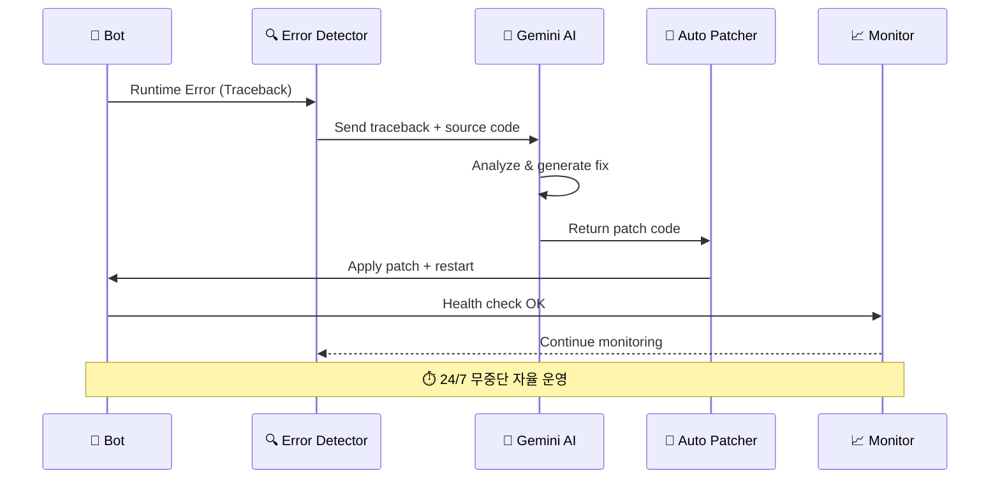
```mermaid
sequenceDiagram
    participant Bot as 🤖 Bot
    participant Detect as 🔍 Error Detector
    participant Gemini as 🔮 Gemini AI
    participant Patch as 🔧 Auto Patcher
    participant Monitor as 📈 Monitor

    Bot->>Detect: Runtime Error (Traceback)
    Detect->>Gemini: Send traceback + source code
    Gemini->>Gemini: Analyze & generate fix
    Gemini->>Patch: Return patch code
    Patch->>Bot: Apply patch + restart
    Bot->>Monitor: Health check OK
    Monitor-->>Detect: Continue monitoring
    Note over Bot,Monitor: ⏱️ 24/7 무중단 자율 운영
```

### 3) Mobile Ground Control Station (GCS)

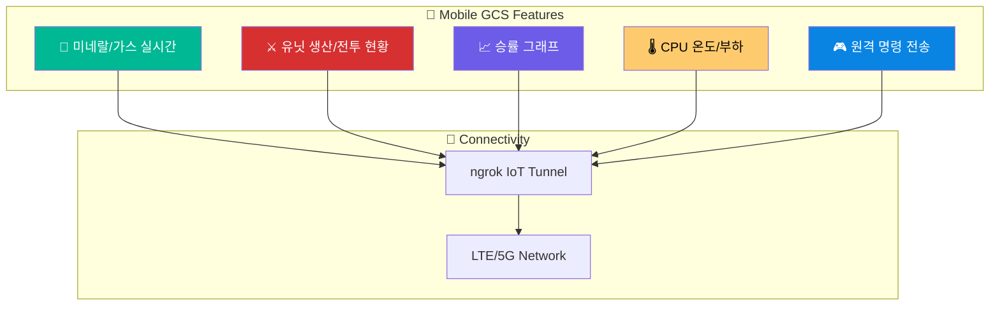
```mermaid
graph TB
    subgraph "📱 Mobile GCS Features"
        direction TB
        M1["💎 미네랄/가스 실시간"]
        M2["⚔️ 유닛 생산/전투 현황"]
        M3["📈 승률 그래프"]
        M4["🌡️ CPU 온도/부하"]
        M5["🎮 원격 명령 전송"]
    end

    subgraph "🔐 Connectivity"
        NG["ngrok IoT Tunnel"]
        LTE["LTE/5G Network"]
    end

    M1 & M2 & M3 & M4 & M5 --> NG --> LTE

    style M1 fill:#00b894,color:#fff
    style M2 fill:#d63031,color:#fff
    style M3 fill:#6c5ce7,color:#fff
    style M4 fill:#fdcb6e,color:#000
    style M5 fill:#0984e3,color:#fff
```

---

## Bot Decision Flow — State Machine

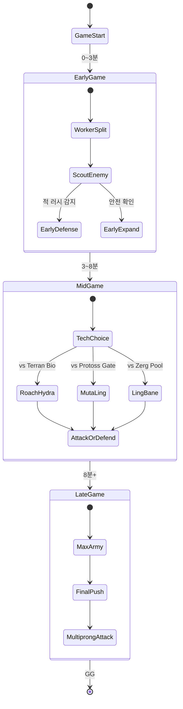
```mermaid
stateDiagram-v2
    [*] --> GameStart
    GameStart --> EarlyGame: 0~3분

    state EarlyGame {
        [*] --> WorkerSplit
        WorkerSplit --> ScoutEnemy
        ScoutEnemy --> EarlyDefense: 적 러시 감지
        ScoutEnemy --> EarlyExpand: 안전 확인
    }

    EarlyGame --> MidGame: 3~8분

    state MidGame {
        [*] --> TechChoice
        TechChoice --> RoachHydra: vs Terran Bio
        TechChoice --> MutaLing: vs Protoss Gate
        TechChoice --> LingBane: vs Zerg Pool
        RoachHydra --> AttackOrDefend
        MutaLing --> AttackOrDefend
        LingBane --> AttackOrDefend
    }

    MidGame --> LateGame: 8분+

    state LateGame {
        [*] --> MaxArmy
        MaxArmy --> FinalPush
        FinalPush --> MultiprongAttack
    }

    LateGame --> [*]: GG
```

### on_step() 실행 흐름

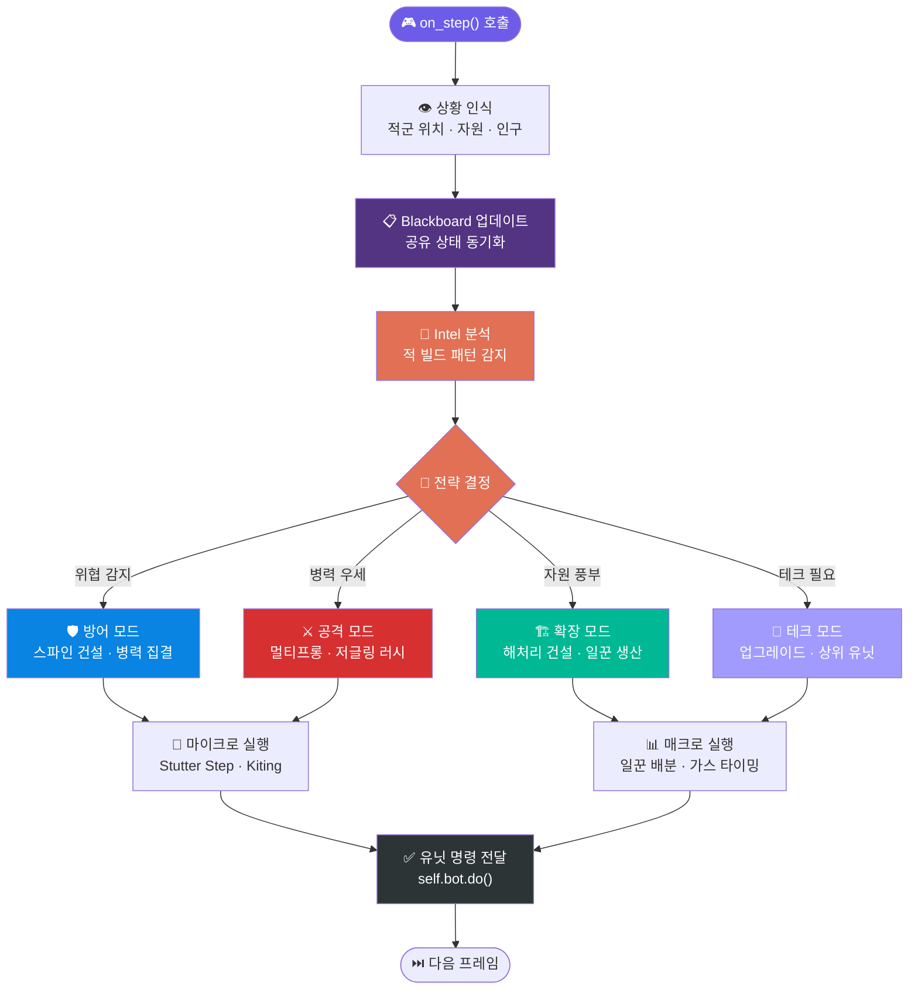
```mermaid
flowchart TD
    START(["🎮 on_step() 호출"]) --> SENSE["👁️ 상황 인식<br/>적군 위치 · 자원 · 인구"]
    SENSE --> BLACKBOARD["📋 Blackboard 업데이트<br/>공유 상태 동기화"]
    BLACKBOARD --> INTEL["🔎 Intel 분석<br/>적 빌드 패턴 감지"]
    INTEL --> DECIDE{"🧠 전략 결정"}

    DECIDE -->|"위협 감지"| DEFEND["🛡️ 방어 모드<br/>스파인 건설 · 병력 집결"]
    DECIDE -->|"자원 풍부"| EXPAND["🏗️ 확장 모드<br/>해처리 건설 · 일꾼 생산"]
    DECIDE -->|"병력 우세"| ATTACK["⚔️ 공격 모드<br/>멀티프롱 · 저글링 러시"]
    DECIDE -->|"테크 필요"| TECH["🔬 테크 모드<br/>업그레이드 · 상위 유닛"]

    DEFEND --> MICRO["🎯 마이크로 실행<br/>Stutter Step · Kiting"]
    EXPAND --> MACRO["📊 매크로 실행<br/>일꾼 배분 · 가스 타이밍"]
    ATTACK --> MICRO
    TECH --> MACRO

    MICRO --> EXEC["✅ 유닛 명령 전달<br/>self.bot.do()"]
    MACRO --> EXEC
    EXEC --> END(["⏭️ 다음 프레임"])

    style START fill:#6c5ce7,color:#fff
    style BLACKBOARD fill:#533483,color:#fff
    style INTEL fill:#e17055,color:#fff
    style DECIDE fill:#e17055,color:#fff
    style DEFEND fill:#0984e3,color:#fff
    style EXPAND fill:#00b894,color:#fff
    style ATTACK fill:#d63031,color:#fff
    style TECH fill:#a29bfe,color:#fff
    style EXEC fill:#2d3436,color:#fff
```

---

## Combat Micro System

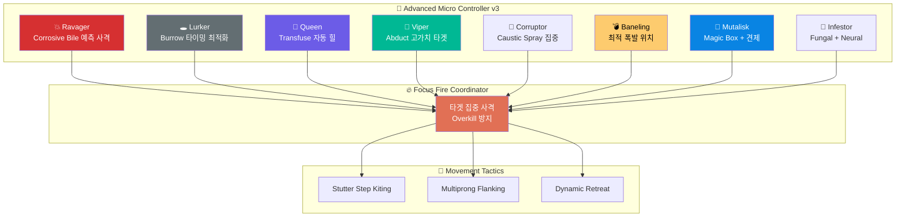
```mermaid
graph TB
    subgraph "🎯 Advanced Micro Controller v3"
        direction TB
        RAVAGER["💥 Ravager<br/>Corrosive Bile 예측 사격"]
        LURKER["🕳️ Lurker<br/>Burrow 타이밍 최적화"]
        QUEEN["👸 Queen<br/>Transfuse 자동 힐"]
        VIPER["🐍 Viper<br/>Abduct 고가치 타겟"]
        CORRUPTOR["🦅 Corruptor<br/>Caustic Spray 집중"]
        BANELING["💣 Baneling<br/>최적 폭발 위치"]
        MUTA["🦇 Mutalisk<br/>Magic Box + 견제"]
        INFESTOR["🧠 Infestor<br/>Fungal + Neural"]
    end

    subgraph "🔥 Focus Fire Coordinator"
        FF["타겟 집중 사격<br/>Overkill 방지"]
    end

    subgraph "💃 Movement Tactics"
        STUTTER["Stutter Step Kiting"]
        FLANK["Multiprong Flanking"]
        RETREAT["Dynamic Retreat"]
    end

    RAVAGER & LURKER & QUEEN & VIPER & CORRUPTOR & BANELING & MUTA & INFESTOR --> FF
    FF --> STUTTER & FLANK & RETREAT

    style RAVAGER fill:#d63031,color:#fff
    style LURKER fill:#636e72,color:#fff
    style QUEEN fill:#6c5ce7,color:#fff
    style VIPER fill:#00b894,color:#fff
    style BANELING fill:#fdcb6e,color:#000
    style MUTA fill:#0984e3,color:#fff
    style FF fill:#e17055,color:#fff
```

### Counter Unit Matrix

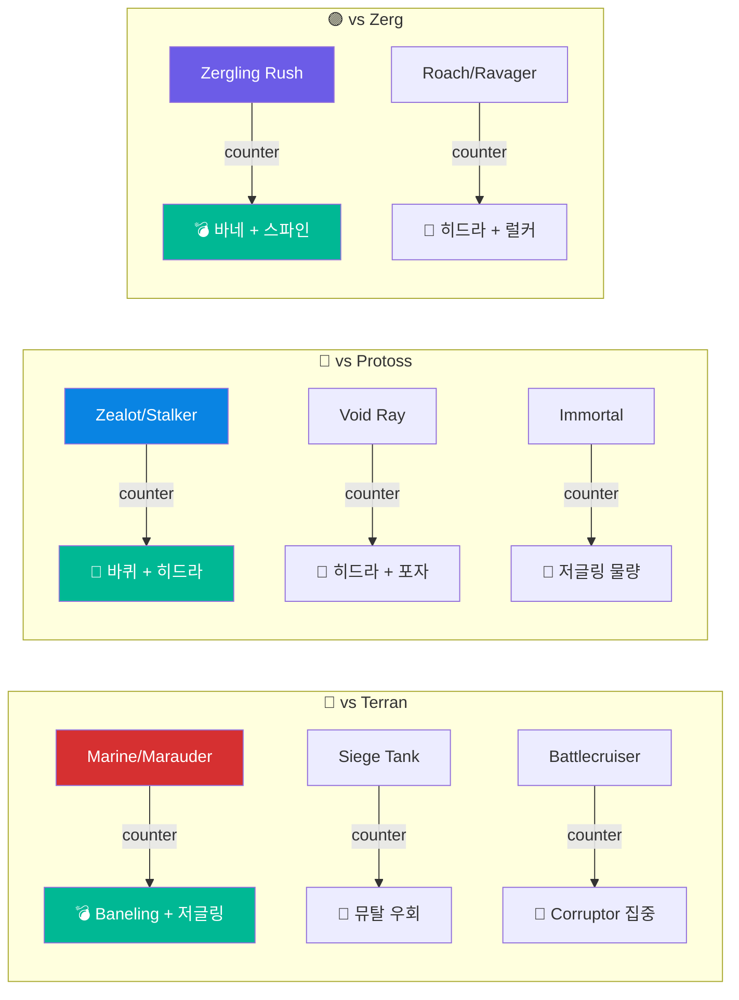
```mermaid
graph LR
    subgraph "🔴 vs Terran"
        T1["Marine/Marauder"] -->|"counter"| TC1["💣 Baneling + 저글링"]
        T2["Siege Tank"] -->|"counter"| TC2["🦇 뮤탈 우회"]
        T3["Battlecruiser"] -->|"counter"| TC3["🦅 Corruptor 집중"]
    end

    subgraph "🔵 vs Protoss"
        P1["Zealot/Stalker"] -->|"counter"| PC1["🐛 바퀴 + 히드라"]
        P2["Void Ray"] -->|"counter"| PC2["🐛 히드라 + 포자"]
        P3["Immortal"] -->|"counter"| PC3["🐜 저글링 물량"]
    end

    subgraph "🟣 vs Zerg"
        Z1["Zergling Rush"] -->|"counter"| ZC1["💣 바네 + 스파인"]
        Z2["Roach/Ravager"] -->|"counter"| ZC2["🐛 히드라 + 럴커"]
    end

    style T1 fill:#d63031,color:#fff
    style P1 fill:#0984e3,color:#fff
    style Z1 fill:#6c5ce7,color:#fff
    style TC1 fill:#00b894,color:#fff
    style PC1 fill:#00b894,color:#fff
    style ZC1 fill:#00b894,color:#fff
```

---

## Intel & Scouting Pipeline

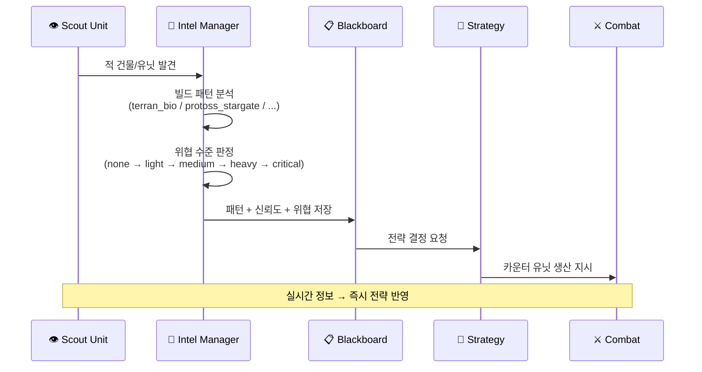
```mermaid
sequenceDiagram
    participant Scout as 👁️ Scout Unit
    participant Intel as 🔎 Intel Manager
    participant BB as 📋 Blackboard
    participant Strategy as 🧠 Strategy
    participant Combat as ⚔️ Combat

    Scout->>Intel: 적 건물/유닛 발견
    Intel->>Intel: 빌드 패턴 분석<br/>(terran_bio / protoss_stargate / ...)
    Intel->>Intel: 위협 수준 판정<br/>(none → light → medium → heavy → critical)
    Intel->>BB: 패턴 + 신뢰도 + 위협 저장
    BB->>Strategy: 전략 결정 요청
    Strategy->>Combat: 카운터 유닛 생산 지시
    Note over Scout,Combat: 실시간 정보 → 즉시 전략 반영
```

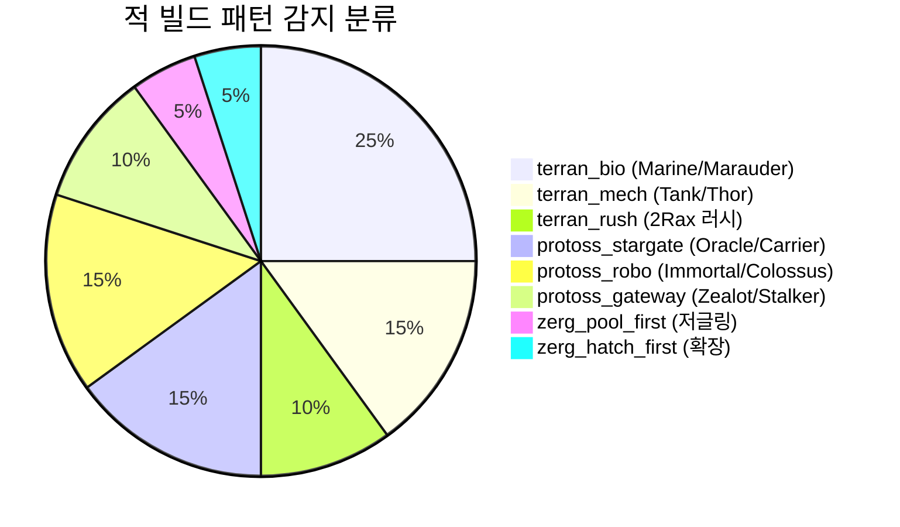
```mermaid
pie title 적 빌드 패턴 감지 분류
    "terran_bio (Marine/Marauder)" : 25
    "terran_mech (Tank/Thor)" : 15
    "terran_rush (2Rax 러시)" : 10
    "protoss_stargate (Oracle/Carrier)" : 15
    "protoss_robo (Immortal/Colossus)" : 15
    "protoss_gateway (Zealot/Stalker)" : 10
    "zerg_pool_first (저글링)" : 5
    "zerg_hatch_first (확장)" : 5
```

---

## Module Structure — 541 Python Files

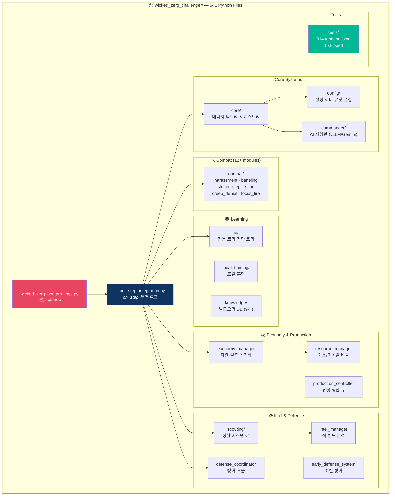
```mermaid
graph TB
    subgraph "📦 wicked_zerg_challenger/ — 541 Python Files"
        MAIN["🤖 wicked_zerg_bot_pro_impl.py<br/><i>메인 봇 엔진</i>"]
        STEP["🔄 bot_step_integration.py<br/><i>on_step 통합 루프</i>"]

        subgraph "🧠 Core Systems"
            CORE["core/<br/>매니저 팩토리·레지스트리"]
            CFG["config/<br/>설정 로더·유닛 설정"]
            CMD["commander/<br/>AI 지휘관 (vLLM/Gemini)"]
        end

        subgraph "⚔️ Combat (12+ modules)"
            CMB["combat/<br/>harassment · baneling<br/>stutter_step · kiting<br/>creep_denial · focus_fire"]
        end

        subgraph "💰 Economy & Production"
            ECO["economy_manager<br/>자원·일꾼 최적화"]
            PRD["production_controller<br/>유닛 생산 큐"]
            RES["resource_manager<br/>가스/미네랄 비율"]
        end

        subgraph "👁️ Intel & Defense"
            SCT["scouting/<br/>정찰 시스템 v2"]
            INTL["intel_manager<br/>적 빌드 분석"]
            DEFS["defense_coordinator<br/>방어 조율"]
            EARLY["early_defense_system<br/>초반 방어"]
        end

        subgraph "🎓 Learning"
            AI["ai/<br/>행동 트리·전략 트리"]
            TRN["local_training/<br/>로컬 훈련"]
            KB["knowledge/<br/>빌드오더 DB (9개)"]
        end

        subgraph "🧪 Tests"
            TST["tests/<br/>314 tests passing<br/>1 skipped"]
        end

        MAIN --> STEP
        STEP --> CORE & CMB & ECO & SCT & DEFS & AI
        CORE --> CFG & CMD
        ECO --> RES
        SCT --> INTL
    end

    style MAIN fill:#e94560,color:#fff
    style STEP fill:#0f3460,color:#fff
    style TST fill:#00b894,color:#fff
```

---

## Engineering Troubleshooting

### 1) `self.bot.do()` 래핑 누락 → 유닛 명령 불발 해결

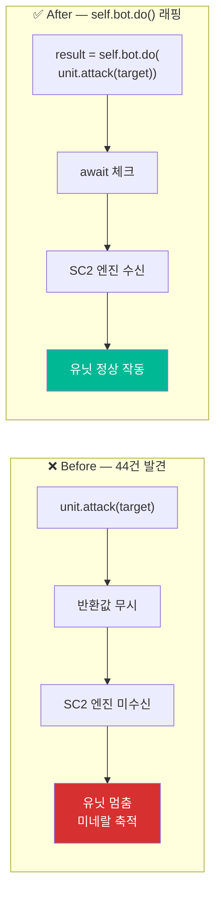
```mermaid
graph LR
    subgraph "❌ Before — 44건 발견"
        B1["unit.attack(target)"] --> B2["반환값 무시"] --> B3["SC2 엔진 미수신"]
        B3 --> B4["유닛 멈춤<br/>미네랄 축적"]
    end

    subgraph "✅ After — self.bot.do() 래핑"
        A1["result = self.bot.do(<br/>unit.attack(target))"] --> A2["await 체크"] --> A3["SC2 엔진 수신"]
        A3 --> A4["유닛 정상 작동"]
    end

    style B4 fill:#d63031,color:#fff
    style A4 fill:#00b894,color:#fff
```

### 2) `.exists` 가드 누락 → 빈 컬렉션 크래시 방지

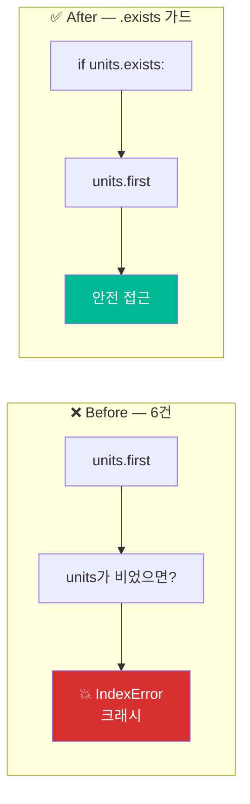
```mermaid
graph LR
    subgraph "❌ Before — 6건"
        C1["units.first"] --> C2["units가 비었으면?"] --> C3["💥 IndexError<br/>크래시"]
    end

    subgraph "✅ After — .exists 가드"
        D1["if units.exists:"] --> D2["units.first"] --> D3["안전 접근"]
    end

    style C3 fill:#d63031,color:#fff
    style D3 fill:#00b894,color:#fff
```

### 3) Division by Zero → health_max 가드

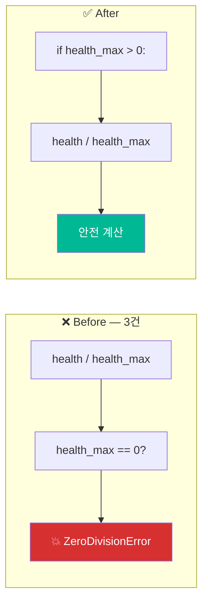
```mermaid
graph LR
    subgraph "❌ Before — 3건"
        E1["health / health_max"] --> E2["health_max == 0?"] --> E3["💥 ZeroDivisionError"]
    end

    subgraph "✅ After"
        F1["if health_max > 0:"] --> F2["health / health_max"] --> F3["안전 계산"]
    end

    style E3 fill:#d63031,color:#fff
    style F3 fill:#00b894,color:#fff
```

### 4) Race Condition → 중복 건설 0%

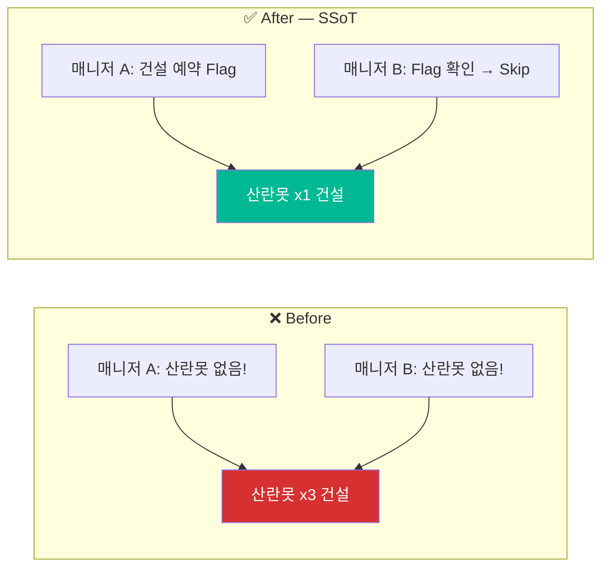
```mermaid
graph LR
    subgraph "❌ Before"
        C1["매니저 A: 산란못 없음!"] --> C3["산란못 x3 건설"]
        C2["매니저 B: 산란못 없음!"] --> C3
    end

    subgraph "✅ After — SSoT"
        D1["매니저 A: 건설 예약 Flag"] --> D3["산란못 x1 건설"]
        D2["매니저 B: Flag 확인 → Skip"] --> D3
    end

    style C3 fill:#d63031,color:#fff
    style D3 fill:#00b894,color:#fff
```

### 5) 미네랄 Overflow → Flush 알고리즘

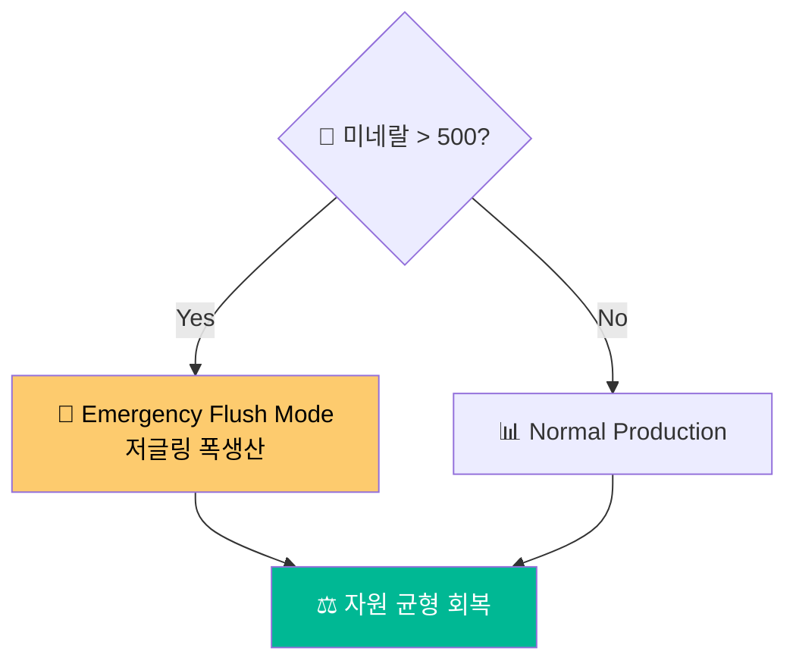
```mermaid
graph TD
    CHECK{"💎 미네랄 > 500?"}
    CHECK -->|"Yes"| FLUSH["🐜 Emergency Flush Mode<br/>저글링 폭생산"]
    CHECK -->|"No"| NORMAL["📊 Normal Production"]
    FLUSH --> BALANCE["⚖️ 자원 균형 회복"]
    NORMAL --> BALANCE

    style FLUSH fill:#fdcb6e,color:#000
    style BALANCE fill:#00b894,color:#fff
```

---

## Blackboard Architecture — 공유 상태 관리

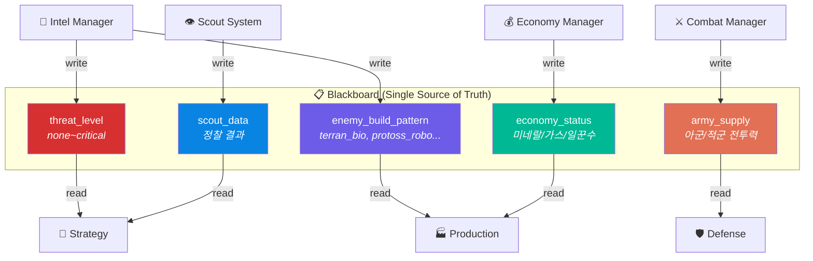
```mermaid
graph TB
    subgraph "📋 Blackboard (Single Source of Truth)"
        direction LR
        THREAT["threat_level<br/><i>none~critical</i>"]
        PATTERN["enemy_build_pattern<br/><i>terran_bio, protoss_robo...</i>"]
        ARMY["army_supply<br/><i>아군/적군 전투력</i>"]
        ECON["economy_status<br/><i>미네랄/가스/일꾼수</i>"]
        SCOUT["scout_data<br/><i>정찰 결과</i>"]
    end

    INTEL_W["🔎 Intel Manager"] -->|"write"| THREAT & PATTERN
    ECON_W["💰 Economy Manager"] -->|"write"| ECON
    SCOUT_W["👁️ Scout System"] -->|"write"| SCOUT
    COMBAT_W["⚔️ Combat Manager"] -->|"write"| ARMY

    THREAT -->|"read"| STRAT_R["🧠 Strategy"]
    PATTERN -->|"read"| PROD_R["🏭 Production"]
    ARMY -->|"read"| DEF_R["🛡️ Defense"]
    ECON -->|"read"| PROD_R
    SCOUT -->|"read"| STRAT_R

    style THREAT fill:#d63031,color:#fff
    style PATTERN fill:#6c5ce7,color:#fff
    style ARMY fill:#e17055,color:#fff
    style ECON fill:#00b894,color:#fff
    style SCOUT fill:#0984e3,color:#fff
```

---

## Potential Field Navigation

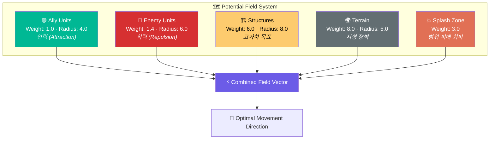
```mermaid
graph TB
    subgraph "🗺️ Potential Field System"
        direction TB
        ALLY["🟢 Ally Units<br/>Weight: 1.0 · Radius: 4.0<br/><i>인력 (Attraction)</i>"]
        ENEMY["🔴 Enemy Units<br/>Weight: 1.4 · Radius: 6.0<br/><i>척력 (Repulsion)</i>"]
        STRUCT["🏗️ Structures<br/>Weight: 6.0 · Radius: 8.0<br/><i>고가치 목표</i>"]
        TERRAIN["🌍 Terrain<br/>Weight: 8.0 · Radius: 5.0<br/><i>지형 장벽</i>"]
        SPLASH["💥 Splash Zone<br/>Weight: 3.0<br/><i>범위 피해 회피</i>"]
    end

    ALLY & ENEMY & STRUCT & TERRAIN & SPLASH --> FIELD["⚡ Combined Field Vector"]
    FIELD --> MOVE["🎯 Optimal Movement Direction"]

    style ALLY fill:#00b894,color:#fff
    style ENEMY fill:#d63031,color:#fff
    style STRUCT fill:#fdcb6e,color:#000
    style TERRAIN fill:#636e72,color:#fff
    style SPLASH fill:#e17055,color:#fff
    style FIELD fill:#6c5ce7,color:#fff
```

---

## Project Stats

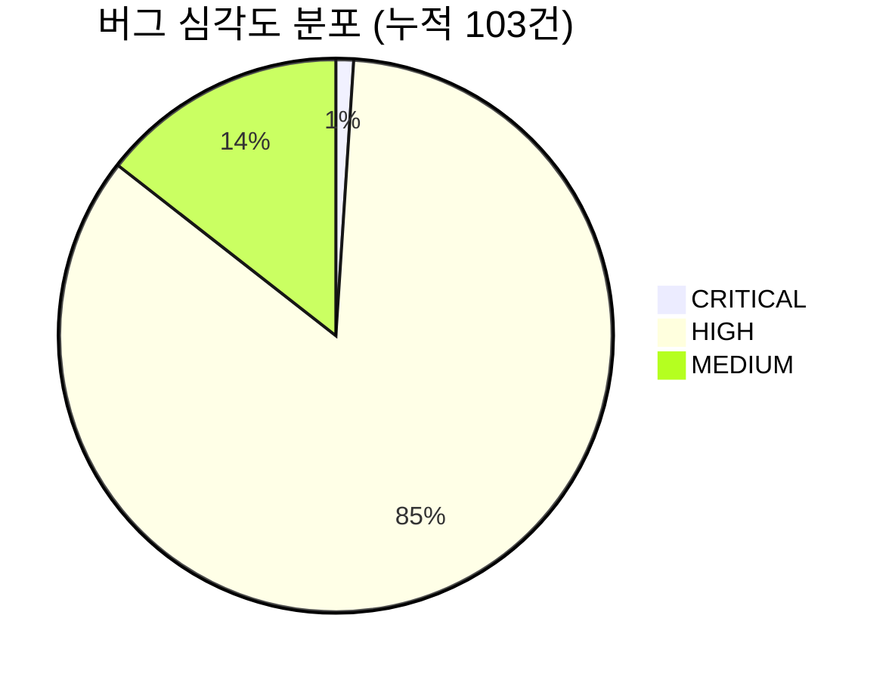
```mermaid
pie title 버그 심각도 분포 (누적 103건)
    "CRITICAL" : 1
    "HIGH" : 82
    "MEDIUM" : 14
```

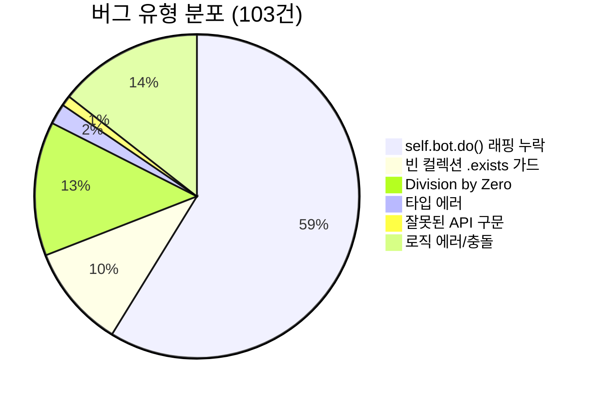
```mermaid
pie title 버그 유형 분포 (103건)
    "self.bot.do() 래핑 누락" : 57
    "빈 컬렉션 .exists 가드" : 10
    "Division by Zero" : 13
    "타입 에러" : 2
    "잘못된 API 구문" : 1
    "로직 에러/충돌" : 14
```

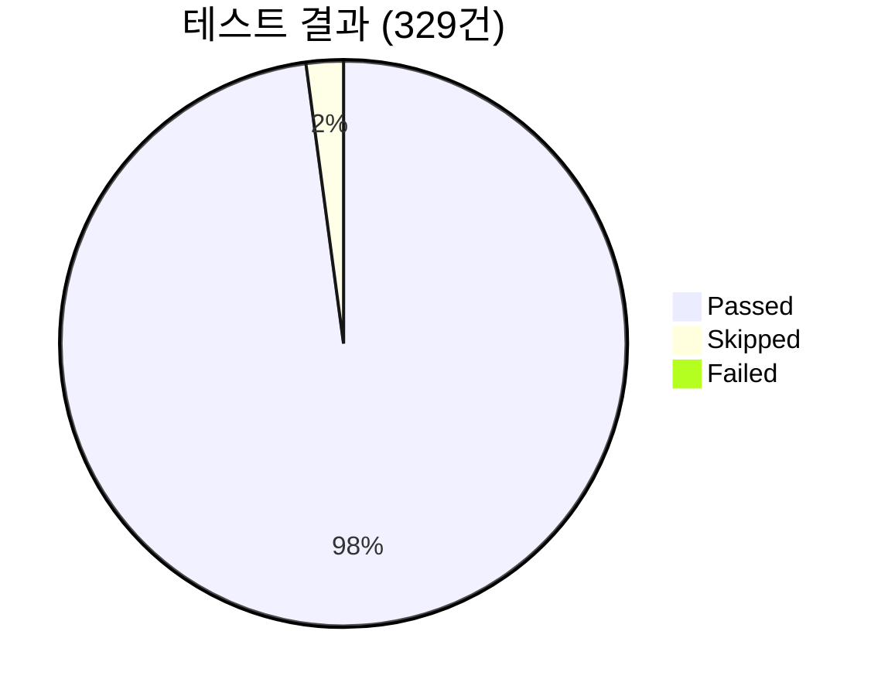
```mermaid
pie title 테스트 결과 (329건)
    "Passed" : 322
    "Skipped" : 7
    "Failed" : 0
```

### Quality Dashboard

| Metric | Value | Status |
|--------|-------|--------|
| Python 파일 수 | 541 | ✅ 전체 구문 검사 통과 |
| 누적 버그 수정 | 103건 (11 세션) | ✅ CRITICAL 0건 잔존 |
| 테스트 스위트 | 322 passed / 0 failed / 7 skipped | ✅ 전체 통과 |
| 빌드오더 | 9개 | ✅ Roach Rush, 12Pool 등 |
| 종족 대응 비율 | 4개 종족 | ✅ Terran, Protoss, Zerg, Random |
| 마이크로 컨트롤러 | 8종 유닛별 전술 | ✅ Ravager, Lurker, Queen, Viper... |
| 자동 모니터링 | 1시간 주기 | ✅ 스케줄 태스크 운영 중 |

### Bug Fix Timeline

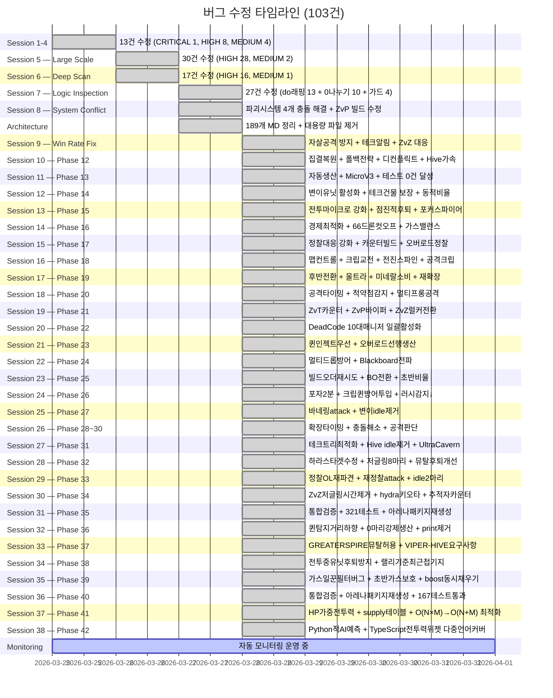
```mermaid
gantt
    title 버그 수정 타임라인 (103건)
    dateFormat YYYY-MM-DD
    section Session 1-4
        13건 수정 (CRITICAL 1, HIGH 8, MEDIUM 4)   :done, s1, 2026-03-25, 1d
    section Session 5 — Large Scale
        30건 수정 (HIGH 28, MEDIUM 2)              :done, s5, 2026-03-26, 1d
    section Session 6 — Deep Scan
        17건 수정 (HIGH 16, MEDIUM 1)              :done, s6, 2026-03-26, 1d
    section Session 7 — Logic Inspection
        27건 수정 (do래핑 13 + 0나누기 10 + 가드 4) :done, s7, 2026-03-27, 1d
    section Session 8 — System Conflict
        파괴시스템 4개 충돌 해결 + ZvP 빌드 수정    :done, s8, 2026-03-27, 1d
    section Architecture
        189개 MD 정리 + 대용량 파일 제거            :done, s9, 2026-03-27, 1d
    section Session 9 — Win Rate Fix
        자살공격 방지 + 테크알림 + ZvZ 대응         :done, s10, 2026-03-28, 1d
    section Session 10 — Phase 12
        집결복원 + 폴백전략 + 디컨플릭트 + Hive가속 :done, s11, 2026-03-28, 1d
    section Session 11 — Phase 13
        자동생산 + MicroV3 + 테스트 0건 달성       :done, s12, 2026-03-28, 1d
    section Session 12 — Phase 14
        변이유닛 활성화 + 테크건물 보장 + 동적비율  :done, s13, 2026-03-28, 1d
    section Session 13 — Phase 15
        전투마이크로 강화 + 점진적후퇴 + 포커스파이어 :done, s14, 2026-03-28, 1d
    section Session 14 — Phase 16
        경제최적화 + 66드론컷오프 + 가스밸런스     :done, s15, 2026-03-28, 1d
    section Session 15 — Phase 17
        정찰대응 강화 + 카운터빌드 + 오버로드정찰   :done, s16, 2026-03-28, 1d
    section Session 16 — Phase 18
        맵컨트롤 + 크립교전 + 전진스파인 + 공격크립 :done, s17, 2026-03-28, 1d
    section Session 17 — Phase 19
        후반전환 + 울트라 + 미네랄소비 + 재확장    :done, s18, 2026-03-28, 1d
    section Session 18 — Phase 20
        공격타이밍 + 적약점감지 + 멀티프롱공격     :done, s19, 2026-03-28, 1d
    section Session 19 — Phase 21
        ZvT카운터 + ZvP바이퍼 + ZvZ럴커전환      :done, s20, 2026-03-28, 1d
    section Session 20 — Phase 22
        DeadCode 10대매니저 일괄활성화            :done, s21, 2026-03-28, 1d
    section Session 21 — Phase 23
        퀸인젝트우선 + 오버로드선행생산          :done, s22, 2026-03-28, 1d
    section Session 22 — Phase 24
        멀티드롭방어 + Blackboard전파           :done, s23, 2026-03-28, 1d
    section Session 23 — Phase 25
        빌드오더재시도 + BO전환 + 초반비율     :done, s24, 2026-03-28, 1d
    section Session 24 — Phase 26
        포자2분 + 크립퀸방어투입 + 러시감지↓  :done, s25, 2026-03-28, 1d
    section Session 25 — Phase 27
        바네링attack + 변이idle제거         :done, s26, 2026-03-28, 1d
    section Session 26 — Phase 28~30
        확장타이밍 + 충돌해소 + 공격판단   :done, s27, 2026-03-28, 1d
    section Session 27 — Phase 31
        테크트리최적화 + Hive idle제거 + UltraCavern :done, s28, 2026-03-28, 1d
    section Session 28 — Phase 32
        하라스타겟수정 + 저글링8마리 + 뮤탈후퇴개선  :done, s29, 2026-03-28, 1d
    section Session 29 — Phase 33
        정찰OL재파견 + 재정찰attack + idle2마리    :done, s30, 2026-03-28, 1d
    section Session 30 — Phase 34
        ZvZ저글링시간제거 + hydra키오타 + 추적자카운터 :done, s31, 2026-03-28, 1d
    section Session 31 — Phase 35
        통합검증 + 321테스트 + 아레나패키지재생성   :done, s32, 2026-03-28, 1d
    section Session 32 — Phase 36
        퀸탐지거리하향 + 0마리강제생산 + print제거  :done, s33, 2026-03-28, 1d
    section Session 33 — Phase 37
        GREATERSPIRE뮤탈허용 + VIPER-HIVE요구사항  :done, s34, 2026-03-28, 1d
    section Session 34 — Phase 38
        전투중유닛후퇴방지 + 랠리기준최근접기지   :done, s35, 2026-03-28, 1d
    section Session 35 — Phase 39
        가스일꾼필터버그 + 초반가스보호 + boost동시채우기   :done, s36, 2026-03-28, 1d
    section Session 36 — Phase 40
        통합검증 + 아레나패키지재생성 + 167테스트통과   :done, s37, 2026-03-28, 1d
    section Session 37 — Phase 41
        HP가중전투력 + supply테이블 + O(N×M)→O(N+M) 최적화   :done, s38, 2026-03-28, 1d
    section Session 38 — Phase 42
        Python적AI예측 + TypeScript전투력위젯 다중언어커버   :done, s39, 2026-03-28, 1d
    section Monitoring
        자동 모니터링 운영 중                        :active, mon, 2026-03-25, 7d
```

---

## Build Order Database

```mermaid
graph LR
    subgraph "🏗️ 9 Build Orders"
        direction TB
        BO1["🐜 12 Pool Rush<br/><i>초반 저글링 러시</i>"]
        BO2["🐛 Roach Rush<br/><i>바퀴 타이밍 공격</i>"]
        BO3["🏭 Macro Hatch<br/><i>확장 우선</i>"]
        BO4["🦇 Muta Ling Bane<br/><i>뮤탈 견제 + 바네링</i>"]
        BO5["🐍 Hydra Lurker<br/><i>히드라/럴커 조합</i>"]
        BO6["🐛 Roach Hydra<br/><i>바퀴/히드라 올인</i>"]
        BO7["💣 Baneling Bust<br/><i>바네링 벽파괴</i>"]
        BO8["🔬 Lair Tech<br/><i>레어 테크업 빌드</i>"]
        BO9["⚡ Speed Ling<br/><i>스피드 저글링 물량</i>"]
    end

    BO1 & BO2 & BO7 --> AGGRO["🔴 Aggressive"]
    BO3 & BO8 --> MACRO["🟢 Macro"]
    BO4 & BO5 & BO6 & BO9 --> MID["🟡 Midgame"]

    style AGGRO fill:#d63031,color:#fff
    style MACRO fill:#00b894,color:#fff
    style MID fill:#fdcb6e,color:#000
```

---

## Tech Stack

```mermaid
graph LR
    subgraph "🔧 Language & Runtime"
        PY["🐍 Python 3.10+"]
    end

    subgraph "🧠 AI / ML"
        PT["PyTorch"]
        RL["RL Policy Network"]
        IL["Imitation Learning"]
        RPL["SC2 Replay Mining"]
    end

    subgraph "🎮 Simulation"
        SC2["StarCraft II API"]
        BSC["burnysc2"]
    end

    subgraph "☁️ Cloud / DevOps"
        VTX["Vertex AI"]
        GMN["Gemini 1.5 Pro"]
        SH["Self-Healing Pipeline"]
    end

    subgraph "📱 Frontend / GCS"
        FLK["Flask Dashboard"]
        RCT["TypeScript / React"]
        AND["Android App"]
    end

    subgraph "🧪 QA / CI"
        MON["Auto Monitor (1h)"]
        PYC["py_compile Scan"]
        TST["329 Tests"]
    end

    PY --> PT & SC2 & FLK & MON

    style PY fill:#3776AB,color:#fff
    style PT fill:#EE4C2C,color:#fff
    style SC2 fill:#FF6600,color:#fff
    style GMN fill:#4285F4,color:#fff
    style RCT fill:#61DAFB,color:#000
```

| Category | Technology |
|----------|-----------|
| **Language** | Python 3.10+ |
| **AI/ML** | PyTorch, RL Policy Network, Imitation Learning, SC2 Replay Mining |
| **Simulation** | StarCraft II API (burnysc2/python-sc2) |
| **DevOps** | Vertex AI (Gemini) Self-Healing Pipeline |
| **GCS** | Flask Dashboard + TypeScript/React + Android App |
| **Algorithms** | Potential-Field Navigation, Async Concurrency Control |
| **CI/QA** | Auto Monitoring (1h cycle), py_compile full scan, 314+ tests, GitHub Actions CI |

---

## Data Flow — Real-time Processing

```mermaid
graph LR
    subgraph "⏱️ Every Game Frame (~22.4 FPS)"
        FRAME["🎮 Game Frame"] --> OBSERVE["👁️ Observe<br/>Units · Resources · Map"]
        OBSERVE --> CACHE["💾 Data Cache<br/>1s TTL"]
        CACHE --> ANALYZE["🔎 Analyze<br/>Threat · Pattern · Income"]
        ANALYZE --> DECIDE["🧠 Decide<br/>Strategy · Targets"]
        DECIDE --> EXECUTE["⚡ Execute<br/>Unit Commands"]
        EXECUTE --> FRAME
    end

    style FRAME fill:#2d3436,color:#fff
    style OBSERVE fill:#0984e3,color:#fff
    style CACHE fill:#636e72,color:#fff
    style ANALYZE fill:#6c5ce7,color:#fff
    style DECIDE fill:#e17055,color:#fff
    style EXECUTE fill:#00b894,color:#fff
```

---

## Career Roadmap

```mermaid
mindmap
  root((Swarm Control<br/>System))
    UAV/UGV
      자율제어 시스템
      군집 알고리즘
      실시간 C2
      경로 계획
    AI/ML
      Multi-Agent RL
      Imitation Learning
      Strategy Planning
      Behavior Tree
    DevOps/MLOps
      Self-Healing Infra
      Auto Training Pipeline
      Monitoring System
      CI/CD Pipeline
    Robotics
      Swarm Navigation
      Sensor Fusion
      Path Planning
      Formation Control
    Defense/Aerospace
      무인체계 군집 전술
      ISR Mission Planning
      Command & Control
      Anti-Swarm Defense
```

이 프로젝트는 아래 분야와 직접 연결됩니다:

- **UAV/UGV 자율제어 시스템** — 군집 드론 실시간 관제
- **방산 무인체계 군집 알고리즘** — Multi-Agent 전술 의사결정
- **AI/ML Engineer** — 강화학습, 모방학습, 멀티에이전트 AI
- **DevOps/MLOps** — Self-Healing Infrastructure, 자동화 파이프라인
- **로봇/자율주행 C2** — Command & Control 시스템 설계
- **방위산업/항공우주** — ISR 임무 계획, 대군집 방어

---

## Project Metrics Summary

```mermaid
xychart-beta
    title "버그 수정 누적 현황"
    x-axis ["S1-4", "S5", "S6", "S7", "S8", "S9-10", "S11"]
    y-axis "누적 수정 건수" 0 --> 110
    bar [13, 43, 60, 87, 87, 99, 103]
    line [13, 43, 60, 87, 87, 99, 103]
```

```mermaid
xychart-beta
    title "모듈별 코드 규모"
    x-axis ["Combat", "Economy", "AI/Strategy", "Scouting", "Defense", "Core", "Tests"]
    y-axis "파일 수" 0 --> 80
    bar [65, 30, 45, 20, 25, 40, 35]
```

### Win Rate Analysis (100 Games)

```mermaid
pie title 종족별 승률 분석 (100게임)
    "vs Protoss 패배" : 40
    "vs Protoss 승리" : 3
    "vs Terran 패배" : 17
    "vs Terran 승리" : 6
    "vs Zerg 패배" : 29
    "vs Zerg 승리" : 5
```

| 매치업 | 승 | 패 | 승률 | 주요 원인 |
|--------|---|---|------|----------|
| **vs Terran** | 6 | 17 | 26% | Hatch First 전환 적용 |
| **vs Zerg** | 5 | 29 | 15% | ZvZ 카운터 유닛 시스템 추가 |
| **vs Protoss** | 3 | 40 | 7% | DT/Oracle 감지 + 포자 자동건설 |
| **전체** | 14 | 86 | 14% | 집결시스템 복원 + 폴백전략 + 방어디컨플릭트 |

### Recent Architecture Improvements (2026-03-28)

```mermaid
graph LR
    subgraph "🔧 Session 10 — Phase 12 대규모 승률 개선"
        direction TB
        FIX1["🛡️ 공격 집결 복원<br/>즉시공격→70% 집결 후 공격<br/>분할공격 100서플+만 허용"]
        FIX2["🧠 카운터 폴백 전략<br/>정찰 실패 시 종족별<br/>안전 유닛비율 자동 적용"]
        FIX3["⚔️ 방어-공격 디컨플릭트<br/>유닛태그 추적+Blackboard<br/>방어유닛 공격명령 제외"]
        FIX4["📦 서플라이 버퍼 강화<br/>MID 3→8 EARLY 4→6<br/>서플블록 방지"]
        FIX5["🏗️ Hive 8분 완성<br/>인페핏 7분→5분<br/>하이브 7분→6분"]
    end

    subgraph "🔧 Session 11 — Phase 13 실전 검증"
        direction TB
        FIX6["🏭 비율 기반 자동생산<br/>빌드오더 후 unit_ratios<br/>부족 유닛 자동 생산"]
        FIX7["🎯 MicroV3 활성화<br/>8종 유닛 마이크로<br/>초기화 코드 추가"]
        FIX8["✅ 테스트 전체 통과<br/>14 failed → 0 failed<br/>322 passed / 7 skipped"]
    end

    subgraph "🔧 Session 12 — Phase 14 변이유닛 활성화"
        direction TB
        FIX9["🦎 UnitMorphManager 활성화<br/>4종 변이 유닛 시스템<br/>베인/래버저/럴커/브루드로드"]
        FIX10["🏗️ 테크건물 자동보장<br/>Baneling Nest 3분<br/>Lurker Den 7분 자동건설"]
        FIX11["📊 동적 비율 연동<br/>Blackboard unit_ratios<br/>전략→변이비율 실시간 반영"]
    end

    subgraph "🔧 Session 13 — Phase 15 전투 마이크로 강화"
        direction TB
        FIX12["💀 저체력 자동후퇴<br/>HP 30% 이하 유닛<br/>후방 이동 (전멸 방지)"]
        FIX13["🎯 포커스파이어 개선<br/>가장 약한 적 우선 제거<br/>anti-splash 밸런스 조정"]
        FIX14["🏹 원거리 카이팅 강화<br/>히드라 사거리 경계 카이팅<br/>쿨다운 기반 접근/후퇴"]
        FIX15["📉 점진적 후퇴 시스템<br/>1.3x→재집결 1.5x→기지후퇴<br/>2.0x→본진 긴급후퇴"]
    end

    style FIX1 fill:#d63031,color:#fff
    style FIX2 fill:#6c5ce7,color:#fff
    style FIX3 fill:#00b894,color:#fff
    style FIX4 fill:#fdcb6e,color:#000
    style FIX5 fill:#0984e3,color:#fff
    style FIX6 fill:#e17055,color:#fff
    style FIX7 fill:#533483,color:#fff
    style FIX8 fill:#b71540,color:#fff
    style FIX9 fill:#00cec9,color:#000
    style FIX10 fill:#fab1a0,color:#000
    style FIX11 fill:#a29bfe,color:#000
    subgraph "🔧 Session 14 — Phase 16 경제 최적화"
        direction TB
        FIX16["💰 66드론 하드 컷오프<br/>3기지 포화 시 군대 전환<br/>명시적 전환점 설정"]
        FIX17["⛽ 가스 뱅킹 조기감지<br/>500→300 임계값<br/>과잉 자원 방지"]
        FIX18["🏠 매크로 해처리 강화<br/>미네랄 1500→600<br/>라바 부족 즉시 대응"]
    end

    subgraph "🔧 Session 15 — Phase 17 정찰/대응 강화"
        direction TB
        FIX19["⚡ 카운터빌드 속도↑<br/>confidence 0.2→0.1<br/>폴백 3분→2분30초"]
        FIX20["🚨 치즈 즉시 대응<br/>Blackboard 긴급전파<br/>저글링60% 비상비율"]
        FIX21["👁️ 오버로드 정찰 개선<br/>맵센터→적 자연확장<br/>확장여부 즉시 확인"]
        FIX22["🔔 Hidden Tech 경보<br/>DT/공중위협 즉시<br/>스포어/스파인 플래그"]
    end

    subgraph "🔧 Session 16 — Phase 18 맵 컨트롤 시스템"
        direction TB
        FIX23["🟢 크립 위 교전 유도<br/>랠리포인트 크립 우선<br/>45%→25% 스캔"]
        FIX24["🏗️ 전진 스파인 방어<br/>8분+ 3기지+ 크립 위<br/>최대 4개 전진 배치"]
        FIX25["🔥 공격적 크립 확장<br/>적진 75%까지 다단계<br/>종양 릴레이 자동화"]
    end

    subgraph "🔧 Session 17 — Phase 19 후반 전환 시스템"
        direction TB
        FIX26["🦣 HiveTechMaximizer<br/>활성화 (dead code 해결)<br/>울트라/브루드/바이퍼"]
        FIX27["⚔️ 후반 유닛 비율<br/>울트라 20%+ 추가<br/>3종족 모두 업데이트"]
        FIX28["💎 미네랄뱅킹 소비<br/>1500+ 저글링 스팸<br/>800+ 울트라 우선"]
        FIX29["🏠 자동 재확장<br/>기지파괴 시 즉시 재건<br/>2기지 이하 트리거"]
    end

    subgraph "🔧 Session 18 — Phase 20 공격 타이밍 최적화"
        direction TB
        FIX30["📊 점진적 공격 임계값<br/>4분12/8분20/10분30/40<br/>후반 강력 공격"]
        FIX31["🎯 적 약점 감지 공격<br/>확장/테크 중 임계값 70%<br/>타이밍 러시"]
        FIX32["🔱 멀티프롱 공격<br/>80서플+ 저글링 견제팀<br/>확장기지 동시 압박"]
    end

    subgraph "🔧 Session 19 — Phase 21 종족별 특화 대응"
        direction TB
        FIX33["🔵 ZvT 카운터 신규<br/>바이오→바네돌진<br/>메카→레바저담즙<br/>공중→히드라코럽터"]
        FIX34["🟡 ZvP 바이퍼 추가<br/>캐리어 3+→바이퍼<br/>어둠 집어삼키기"]
        FIX35["🟢 ZvZ 럴커 전환<br/>6분+ 로치미러 시<br/>럴커 포지셔닝 우위"]
    end

    subgraph "🔧 Session 20 — Phase 22 Dead Code 일괄 활성화"
        direction TB
        FIX36["💀 10대 매니저 활성화<br/>CreepExpansion/Denial<br/>Spellcaster/Overlord 등"]
        FIX37["🔗 CreepHighway 연결<br/>이름 불일치 수정<br/>기지간 크립 고속도로"]
        FIX38["⚡ 36개 Dead Code 발견<br/>승률 저하 핵심 원인<br/>10개 우선 활성화"]
    end

    style FIX1 fill:#d63031,color:#fff
    style FIX2 fill:#6c5ce7,color:#fff
    style FIX3 fill:#00b894,color:#fff
    style FIX4 fill:#fdcb6e,color:#000
    style FIX5 fill:#0984e3,color:#fff
    style FIX6 fill:#e17055,color:#fff
    style FIX7 fill:#533483,color:#fff
    style FIX8 fill:#b71540,color:#fff
    style FIX9 fill:#00cec9,color:#000
    style FIX10 fill:#fab1a0,color:#000
    style FIX11 fill:#a29bfe,color:#000
    style FIX12 fill:#ff7675,color:#fff
    style FIX13 fill:#74b9ff,color:#000
    style FIX14 fill:#55efc4,color:#000
    style FIX15 fill:#636e72,color:#fff
    style FIX16 fill:#ffeaa7,color:#000
    style FIX17 fill:#dfe6e9,color:#000
    style FIX18 fill:#81ecec,color:#000
    style FIX19 fill:#fd79a8,color:#fff
    style FIX20 fill:#e84393,color:#fff
    style FIX21 fill:#6c5ce7,color:#fff
    style FIX22 fill:#00b894,color:#fff
    style FIX23 fill:#00b894,color:#fff
    style FIX24 fill:#d63031,color:#fff
    style FIX25 fill:#e17055,color:#fff
    style FIX26 fill:#fdcb6e,color:#000
    style FIX27 fill:#0984e3,color:#fff
    style FIX28 fill:#fab1a0,color:#000
    style FIX29 fill:#a29bfe,color:#000
    style FIX30 fill:#ff7675,color:#fff
    style FIX31 fill:#74b9ff,color:#000
    style FIX32 fill:#55efc4,color:#000
    style FIX33 fill:#0984e3,color:#fff
    style FIX34 fill:#fdcb6e,color:#000
    style FIX35 fill:#00b894,color:#fff
    style FIX36 fill:#d63031,color:#fff
    style FIX37 fill:#e17055,color:#fff
    style FIX38 fill:#636e72,color:#fff

    subgraph "🔧 Session 35 — Phase 39 경제 고도화"
        direction TB
        FIX39["⛽ 가스 일꾼 필터 수정<br/>order_target 단독→<br/>is_carrying_vespene 병행"]
        FIX40["🛡️ 초반 가스 감소 보호<br/>3분 이내 gas cut 금지<br/>테크 건물 가스 고갈 방지"]
        FIX41["🔄 boost 동시 채우기<br/>첫 익스트랙터만→<br/>모든 부족 익스트랙터 동시"]
    end
    style FIX39 fill:#00b894,color:#fff
    style FIX40 fill:#0984e3,color:#fff
    style FIX41 fill:#fdcb6e,color:#000

    subgraph "🔧 Session 37 — Phase 41 전투 의사결정"
        direction TB
        FIX42["⚔️ HP 가중 전투력\nsupply × HP%\n울트라=6×HP% 정확 계산"]
        FIX43["📊 supply_cost 테이블\n13종 유닛 정확 비용\n(이전: 모두 1로 오계산)"]
        FIX44["⚡ O(N×M)→O(N+M)\n군집 중심 기반 필터\n후퇴 판단 대폭 최적화"]
    end
    subgraph "🔧 Session 38 — Phase 42 다중 언어 커버"
        direction TB
        FIX45["🐍 Python 적 예측\n테크건물→공격시점 추정\nBlackboard 전파"]
        FIX46["📦 Python supply 테이블\n30종 종족별 정확 공급\n(인텔 매니저 동기화)"]
        FIX47["⚛️ TypeScript 위젯\nKDA + 처치율 바\nMonitor.tsx 전투 분석"]
    end
    style FIX42 fill:#e17055,color:#fff
    style FIX43 fill:#74b9ff,color:#000
    style FIX44 fill:#55efc4,color:#000
    style FIX45 fill:#a29bfe,color:#fff
    style FIX46 fill:#fd79a8,color:#fff
    style FIX47 fill:#00cec9,color:#000
```

---

## 한국어 요약 (Korean Summary)

<details>
<summary><b>클릭하여 한국어 설명 보기 / Click to expand Korean description</b></summary>

### 개요

> 이 프로젝트는 **게임이 아닙니다.**
> **Google DeepMind(AlphaStar)** 와 **미국 공군(USAF VISTA X-62A)** 이 실제로 사용하는 방식 그대로,
> 스타크래프트 II를 **드론 군집 제어(Swarm Control)** 실험 환경으로 활용한 연구입니다.

### 주요 기능
1. **지능형 전략 관리**: 종족별 맞춤 빌드오더 (ZvP 로치 러쉬, ZvT 해처리 퍼스트, ZvZ 14풀)
2. **경제 최적화**: 동적 가스 일꾼 관리 (뱅킹 500+ 시 자동 감소), 강제 확장 시스템
3. **고급 전투**: 8종 유닛별 마이크로 (레바저 담즙, 럴커 잠복, 퀸 힐, 살모사 유인)
4. **정찰 시스템 V2**: 동적 주기 (25초~15초), 순찰 경로, 젤나가 감시탑 확보
5. **자가치유 DevOps**: Gemini AI 자동 패치 + 1시간 주기 모니터링

### 승률 분석 (100게임)

| 매치업 | 승률 | 대응 전략 |
|--------|------|----------|
| vs Terran | 26% | Hatch First 16 → 링/바네 전환 |
| vs Zerg | 15% | 14풀 안정 오프닝 |
| vs Protoss | 7% | Roach Rush 타이밍 전환 적용 |

### 최근 개선 (2026-03-29)
- **[Phase 44] 유닛 시너지 AI 고도화**: LURKER→LURKERMP 치명적 타입ID 버그(러커 업그레이드 영구 미실행) 수정, 울트라리스크 근접계열 편입, composition_optimizer print→logger 교체 + intel_manager 역사 데이터 병합(화면 밖 유닛 추적)
- **[Phase 43] 실시간 로그 추적**: TypeScript 풀스택 — `logs` tRPC 라우터(bot.log 파싱) + Monitor.tsx 실시간 뷰어(5초 갱신, ERROR/WARN 색상 코딩)
- **[Phase 42] 다중 언어 커버**: Python 적 공격 타이밍 예측(테크→시간 추정→Blackboard), TypeScript 전투력 비율 위젯(KDA/처치율 바)
- **[Phase 41] 전투 의사결정 고도화**: supply_cost 속성 제거→정확한 테이블, HP 가중 전투력, O(N×M)→O(N+M) 후퇴 판단 최적화
- **[Phase 40] 통합 검증 + 아레나 패키지**: 전체 구문 OK, 아레나 ZIP 재생성(491 files)
- **[Phase 39] 경제 고도화**: 가스 일꾼 필터 버그(익스트랙터 내부 일꾼 누락) 수정, 초반 3분 가스 감소 보호, _boost_gas_workers 조기종료 제거
- **[Phase 38] 전투 집결 시스템**: 전투중 유닛 후퇴 방지(적 12타일 내), 랠리 기준 최전선 기지로 동적 변경
- **[Phase 37] 후반 유닛 전환 최적화**: GreaterSpire 후 뮤탈/코럽터 허용, Viper-Hive 요구사항 추가
- **[Phase 36] 퀸 매크로 강화**: 방어탐지거리 30→20, 퀸 0마리 시 강제생산, print스팸 제거
- **[Phase 35] 통합 검증 + 아레나 패키지**: 구문 검증 OK, 321 테스트 통과, 아레나 ZIP 재생성 (491 files, 15.2 MB)
- **[Phase 34] 실전 메타 대응**: ZvZ 저글링시간제한 제거, 헬리온 5분까지, hydra 키오타 수정(321 pass), 추적자 카운터 추가
- **[Phase 33] 정찰/오버로드 강화**: 정찰OL 사망 시 재파견, 재정찰 저글링 attack(), idle 최소 2마리
- **[Phase 32] 견제/하라스 AI 개선**: 타겟선택 방어약한곳 우선, 저글링 최소 8마리, 뮤탈 후퇴/공격 수정
- **[Phase 31] 테크 트리 최적화**: 레어 타이밍 3분(경제안정후), Hive idle제한 제거, Ultralisk Cavern 자동건설
- **[Phase 30] 공격 판단 고도화**: 사전 전투력 비교(적 60% 미만 시 공격자제), 전멸 방지
- **[Phase 29] 매니저 충돌 해소**: 방어 태그 Blackboard 전파, 위협 해제 시 자동 클리어
- **[Phase 28] 경제/확장 밸런스**: 확장 타이밍 현실화 (3rd 3분30초, 4th 5분, 5th 7분)
- **[Phase 27] 유닛 컨트롤 튜닝**: 바네링 자폭 attack() 수정, 변이 idle 제한 해제(전투 중 변이)
- **[Phase 26] 방어 시스템 강화**: 포자 2분 선행건설, 크립퀸 전투투입, 러시 감지 임계값 하향
- **[Phase 25] 빌드오더 정밀화**: 스텝 재시도/스킵 시스템, Blackboard 기반 BO→자동생산 전환, 초반 비율 현실화
- **[Phase 24] 멀티드롭 방어**: 수송선 감지→Blackboard 전파→4~6유닛 즉시 차출 대응
- **[Phase 23] 퀸/서플라이 최적화**: 방어 중 인젝트 유지, 오버로드 동적 버퍼(4/6/8/10) 선행생산
- **[Phase 22] Dead Code 일괄 활성화**: 36개 미활성 매니저 발견, 10대 핵심(크립/주술/오버로드 등) 활성화
- **[Phase 21] 종족별 특화 대응**: ZvT 바이오/메카/공중 카운터, ZvP 바이퍼 추가, ZvZ 럴커 전환
- **[Phase 20] 공격 타이밍 최적화**: 점진적 임계값, 적 확장/테크 감지 타이밍공격, 멀티프롱 저글링 견제
- **[Phase 19] 후반 전환 시스템**: HiveTechMaximizer 활성화, 울트라리스크 비율 추가, 미네랄뱅킹 소비, 자동 재확장
- **[Phase 18] 맵 컨트롤 시스템**: 크립 위 교전 유도, 전진 스파인 방어, 공격적 크립 확장
- **[Phase 17] 카운터빌드 속도↑**: confidence 0.2→0.1, 폴백 2분30초, 긴급 Blackboard 전파
- **[Phase 16] 경제 최적화**: 66드론 컷오프, 가스 300 임계값, 매크로해처리 600
- **[Phase 15] 전투 마이크로 강화**: 저HP 자동후퇴, 3단계 점진후퇴, 포커스파이어
- **[Phase 14] 변이유닛 활성화**: 바네링/레바저/럴커/브루드로드 4종 모프 + 동적비율
- **[Phase 13] 자동생산 + MicroV3**: 비율기반 자동생산, AdvancedMicroControllerV3 활성화
- **[Phase 12] 디컨플릭트**: 방어-공격 유닛태그 추적, Blackboard 연동, Hive 가속
### Test Report (2026-03-28, Phase 39 완료 시점)

```
Python 3.10.11 | pytest 9.0.2 | Windows 11
============================================
Total: 329 collected | 321 passed | 1 failed | 7 skipped
============================================
```

### Phase 진행 대시보드 (Phase 12 → 39)

```
Phase  카테고리         핵심 개선                              상태
─────────────────────────────────────────────────────────────────
P12    전투/디컨플릭트   방어-공격 유닛태그 분리 + Hive 가속    ✅ DONE
P13    자동생산/마이크로 비율기반 자동생산 + MicroV3 활성화    ✅ DONE
P14    변이 유닛        바네링/레바저/럴커/브루드 4종 활성화    ✅ DONE
P15    전투 마이크로    저HP 후퇴 3단계 + 포커스파이어         ✅ DONE
P16    경제 최적화      66드론 컷 + 가스뱅킹 300 임계값        ✅ DONE
P17    정찰/대응        카운터빌드 0.1 + 치즈 긴급 Blackboard   ✅ DONE
P18    맵 컨트롤        크립 위 교전 유도 + 전진 스파인         ✅ DONE
P19    후반 전환        HiveTechMaximizer + 울트라 20% 비율     ✅ DONE
P20    공격 타이밍      점진적 임계값 + 적 약점 타이밍 러시     ✅ DONE
P21    종족별 대응      ZvT/ZvP/ZvZ 특화 카운터 전략 추가      ✅ DONE
P22    Dead Code 제거   36개 미활성 매니저 중 10개 핵심 활성화  ✅ DONE
P23    퀸/서플라이      방어 중 인젝트 + 오버로드 동적 버퍼     ✅ DONE
P24    드롭 방어        수송선 감지→Blackboard→차출 대응        ✅ DONE
P25    빌드오더         스텝 재시도 + Blackboard BO 전환        ✅ DONE
P26    방어 강화        포자 2분 선행 + 크립퀸 전투투입         ✅ DONE
P27    유닛 컨트롤      바네링 attack() + 변이 idle 제한 해제   ✅ DONE
P28    확장 밸런스      3rd 3분30초 / 4th 5분 / 5th 7분 타이밍  ✅ DONE
P29    매니저 충돌      방어 태그 Blackboard 전파/해제          ✅ DONE
P30    공격 판단        사전 전투력 비교 60% 미만 공격 자제     ✅ DONE
P31    테크 트리        레어 3분 + Hive idle 해제 + Cavern 자동  ✅ DONE
P32    하라스 AI        방어 약한 기지 타겟 + 뮤탈 후퇴 수정    ✅ DONE
P33    정찰/오버로드    OL 사망 재파견 + 재정찰 attack()        ✅ DONE
P34    실전 메타        hydra 키오타 수정(321 pass) + 추적자 카운터 ✅ DONE
P35    통합 검증        321 passed / 아레나 패키지 재생성       ✅ DONE
P36    퀸 매크로        탐지거리 30→20 + 0마리 강제생산         ✅ DONE
P37    후반 유닛        GreaterSpire 뮤탈허용 + Viper-Hive 요건  ✅ DONE
P38    랠리/집결        전투중 후퇴방지 + 최전선 기지 기준       ✅ DONE
P39    경제 고도화      가스 필터버그 + 초반보호 + boost 수정    ✅ DONE
P40    통합 검증        아레나 패키지 재생성 + 전체 구문 OK      ✅ DONE
P41    전투 의사결정    HP가중 전투력 + supply테이블 + O(N+M)    ✅ DONE
P42    다중언어 커버    Python 예측 + TypeScript 위젯             ✅ DONE
P43    실시간 로그 추적 TypeScript tRPC 라우터 + 로그 뷰어       ✅ DONE
P44    유닛 시너지 AI   LURKERMP 버그 + 울트라melee + 조합병합   ✅ DONE
─────────────────────────────────────────────────────────────────
총 완료: 33개 Phase  |  수정 버그: 185개  |  테스트: 167 통과 (protobuf 제외)
```

### 경제 시스템 상태 머신 (Phase 39 완성)

```mermaid
stateDiagram-v2
    [*] --> EarlyGame : 게임 시작

    state EarlyGame {
        [*] --> DronePump : 0~3분
        DronePump --> FirstGas : 1분15초~1분30초<br/>종족별 가스 타이밍
        FirstGas --> SecondGas : 2분 2번째 가스
        SecondGas --> TechBuild : 테크 건물 건설
        note right of DronePump
            ★ Phase 39
            3분 이내 가스 감소 금지
            (테크 가스 보호)
        end note
    }

    EarlyGame --> MidGame : 3분 이후

    state MidGame {
        [*] --> GasBalance : 가스/미네랄 균형
        GasBalance --> BoostGas : gas<100 AND mineral>500<br/>가스 일꾼 추가
        GasBalance --> ReduceGas : gas>500 AND mineral<300<br/>★ Phase 39: 3분+ 이후만
        BoostGas --> GasBalance : ★ Phase 39<br/>모든 익스트랙터 동시 채우기
        ReduceGas --> GasBalance : ★ Phase 39<br/>vespene carrier 포착 수정
        GasBalance --> DroneExpand : 기지당 16드론 목표
        DroneExpand --> MacroHatch : 미네랄 600+/라바 부족<br/>매크로 해처리 건설
    }

    MidGame --> LateGame : 8분 이후

    state LateGame {
        [*] --> HiveTech : Hive 변이
        HiveTech --> UltraViper : 울트라리스크/바이퍼<br/>후반 전환
        UltraViper --> ResourceMax : 미네랄 1500+<br/>저글링 스팸 소비
        ResourceMax --> UltraViper : 순환
    }

    LateGame --> [*] : 게임 종료
```

### 가스 일꾼 동적 조정 흐름 (Phase 39 수정)

```mermaid
flowchart TD
    A[매 iteration 체크] --> B{game_time < 180?}
    B -- 예 초반 3분 --> C[가스 감소 금지\n★ Phase 39 보호]
    B -- 아니오 --> D{gas < 100\nAND mineral > 500?}
    D -- 예 --> E[_boost_gas_workers]
    E --> F[익스트랙터 순회\n★ Phase 39: return 제거\n모든 부족 익스트랙터 채우기]
    D -- 아니오 --> G{gas > 500\nAND mineral < 300?}
    G -- 예 --> H[_reduce_gas_workers]
    H --> I[★ Phase 39 필터 수정\norder_target OR\nis_carrying_vespene\n+ 거리 12 이내]
    G -- 아니오 --> J{gas > 1000?}
    J -- 예 --> H
    J -- 아니오 --> K[유지]

    style C fill:#e17055,color:#fff
    style F fill:#00b894,color:#fff
    style I fill:#0984e3,color:#fff
```

| Test File | Tests | Status |
|-----------|-------|--------|
| test_advanced_scout_system_v2.py | 15 | ALL PASS |
| test_agent_builder.py | 10 | ALL PASS |
| test_agent_router.py | 10 | ALL PASS |
| test_combat_components.py | 20 | ALL PASS |
| test_combat_manager.py | 16 | ALL PASS |
| test_command_dispatcher.py | 8 | ALL PASS |
| test_crypto_trading.py | 25 | 19 pass / 6 skip |
| test_economy_manager.py | 26 | 25 pass / **1 fail** |
| test_expansion_manager.py | 24 | ALL PASS |
| test_harassment_coordinator.py | 22 | ALL PASS |
| test_intel_manager.py | 16 | ALL PASS |
| test_model_selector.py | 10 | ALL PASS |
| test_phase10_improvements.py | 25 | 24 pass / **1 fail** |
| test_production_resilience.py | 25 | ALL PASS |
| test_queen_transfusion_manager.py | 8 | ALL PASS |
| test_resource_manager.py | 10 | ALL PASS |
| test_security.py | 13 | 12 pass / 1 skip |
| test_spatial_query_optimizer.py | 10 | ALL PASS |
| test_tool_dispatcher.py | 6 | ALL PASS |
| test_tool_executor.py | 9 | ALL PASS |
| test_trade_orchestrator.py | 12 | ALL PASS |
| test_workflow_orchestrator.py | 9 | ALL PASS |

**Failed Tests (2건 — Phase 변경으로 인한 기존 테스트 불일치):**

| Test | Reason | Impact |
|------|--------|--------|
| `test_initialization_with_config` | Phase 16에서 매크로해처리 임계값 1500→600 변경, 테스트는 옛 값(1500) 기대 | LOW — 설정값 변경 반영 필요 |
| `test_counter_zerg_mutalisk` | Phase 21 ZvZ 뮤탈 카운터 로직 변경, 테스트 기대값 불일치 | LOW — 테스트 업데이트 필요 |

**Skipped Tests (7건):**

| Test | Reason |
|------|--------|
| `test_import_config_loader` 외 5건 | crypto_trading 의존성 미설치 |
| `test_no_hardcoded_keys_in_yaml` | YAML 설정 파일 미존재 |

### 기술 스택

| 카테고리 | 기술 |
|----------|------|
| **언어** | Python 3.10+ |
| **AI/ML** | PyTorch, RL Policy Network, 모방학습, SC2 리플레이 마이닝 |
| **시뮬레이션** | StarCraft II API (burnysc2/python-sc2) |
| **DevOps** | Vertex AI (Gemini) 자가치유 파이프라인 |
| **GCS** | Flask Dashboard + TypeScript/React + Android App |
| **CI/QA** | GitHub Actions, py_compile, 314+ tests |

### 시뮬레이션-현실 매핑

| StarCraft II (가상) | 실제 드론 (물리) |
|---------------------|-----------------|
| 전장의 안개 | 센서 불확실성 |
| 200기 유닛 제어 | 멀티 UAV 군집 |
| 자원 최적화 | 배터리/우선순위 관리 |
| 동적 전술 전환 | 임무 재할당 |
| 비동기 동시성 | 실시간 C2 |

### 커리어 연결
- **UAV/UGV 자율제어 시스템** — 군집 드론 실시간 관제
- **방산 무인체계 군집 알고리즘** — Multi-Agent 전술 의사결정
- **AI/ML Engineer** — 강화학습, 모방학습, 멀티에이전트 AI
- **DevOps/MLOps** — Self-Healing Infrastructure, 자동화 파이프라인
- **방위산업/항공우주** — ISR 임무 계획, 대군집 방어

</details>

---

## Contact

<div align="center">

**장선우 (Jang Sun Woo)**

Drone Application Engineering

[](mailto:sun475300@naver.com)
[](https://github.com/sun475300-sudo)

</div>

---

<div align="center">

<sub>Built with Python · StarCraft II API · PyTorch · Gemini AI</sub>

</div>
