<div align="center">

# Swarm Control System in StarCraft II

### 멀티 에이전트 드론 군집 연구를 위한 지능형 통합 관제 시스템

**From Simulation to Reality: Reinforcement Learning · Self-Healing DevOps · Mobile GCS**

[](https://github.com/sun475300-sudo/Swarm-control-in-sc2bot)
[](https://python.org)
[](https://github.com/BurnySc2/python-sc2)
[](https://pytorch.org)
[](https://cloud.google.com/vertex-ai)
[]()
[]()
[]()

</div>

---

## Overview

> 이 프로젝트는 **게임이 아닙니다.**
> **Google DeepMind(AlphaStar)** 와 **미국 공군(USAF VISTA X-62A)** 이 실제로 사용하는 방식 그대로,
> 스타크래프트 II를 **드론 군집 제어(Swarm Control)** 실험 환경으로 활용한 연구입니다.

```
실제 드론 50~200대 실험  →  수천만~수억 원
시뮬레이션 기반 실험       →  안전 · 무비용 · 무한 반복
```

---

## System Architecture

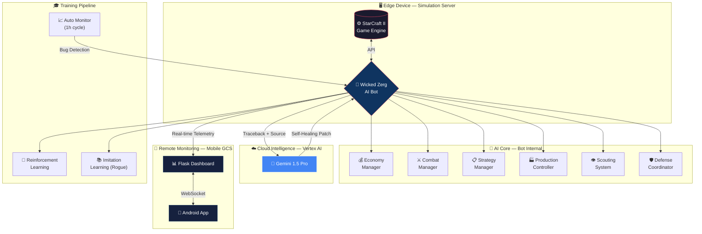

---

## Sim-to-Real Mapping

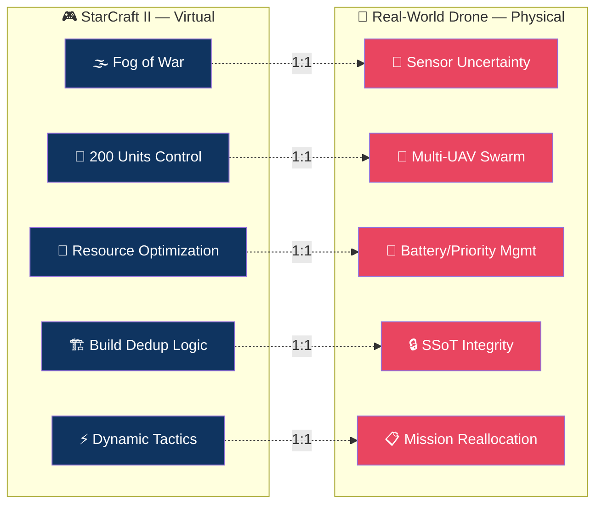

---

## Key Features

### 1) Swarm Reinforcement Learning

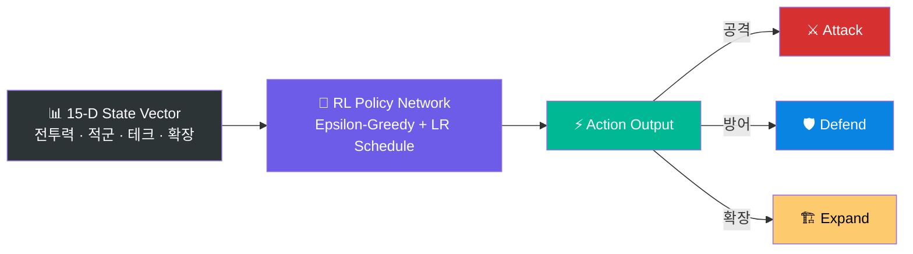

| 항목 | 세부 사항 |
|------|----------|
| 유닛 수 | 200기 저그 유닛 → 드론 군집 모델링 |
| 상태 표현 | **15차원 벡터** (전투력, 적군 규모, 테크, 확장 등) |
| 전략 전환 | Epsilon-Greedy + Learning Rate Scheduling |
| 모방 학습 | 프로게이머 **이병렬(Rogue)** 리플레이 기반 IL |

### 2) Gen-AI Self-Healing DevOps

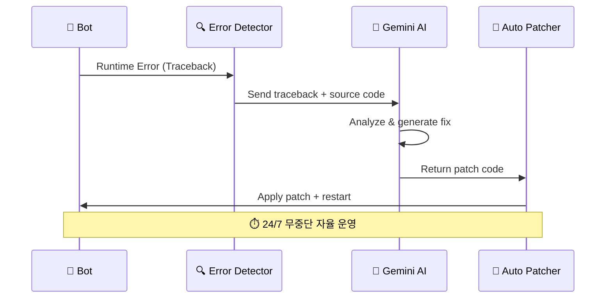

### 3) Mobile Ground Control Station (GCS)

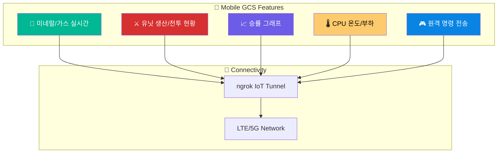

---

## Module Structure

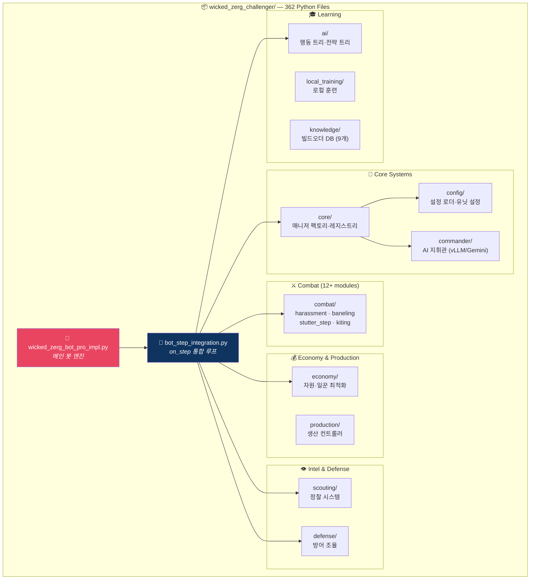

---

## Bot Decision Flow

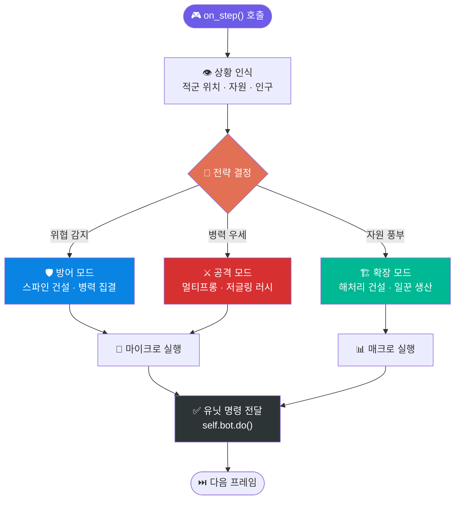

---

## Engineering Troubleshooting

### 1) `await` 누락 → 생산 마비 해결

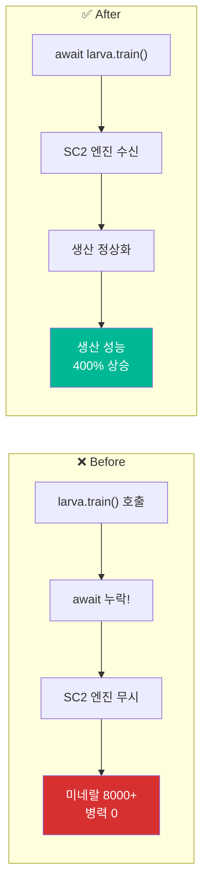

### 2) Race Condition → 중복 건설 0%

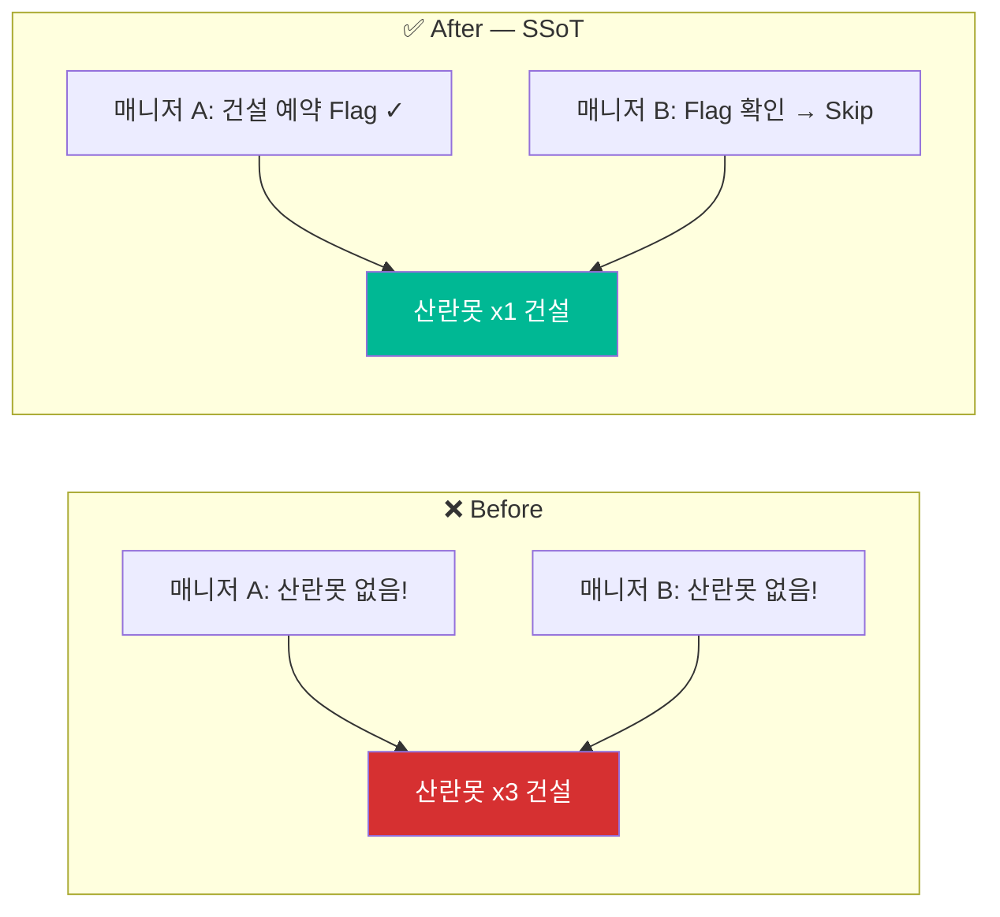

### 3) 미네랄 Overflow → Flush 알고리즘

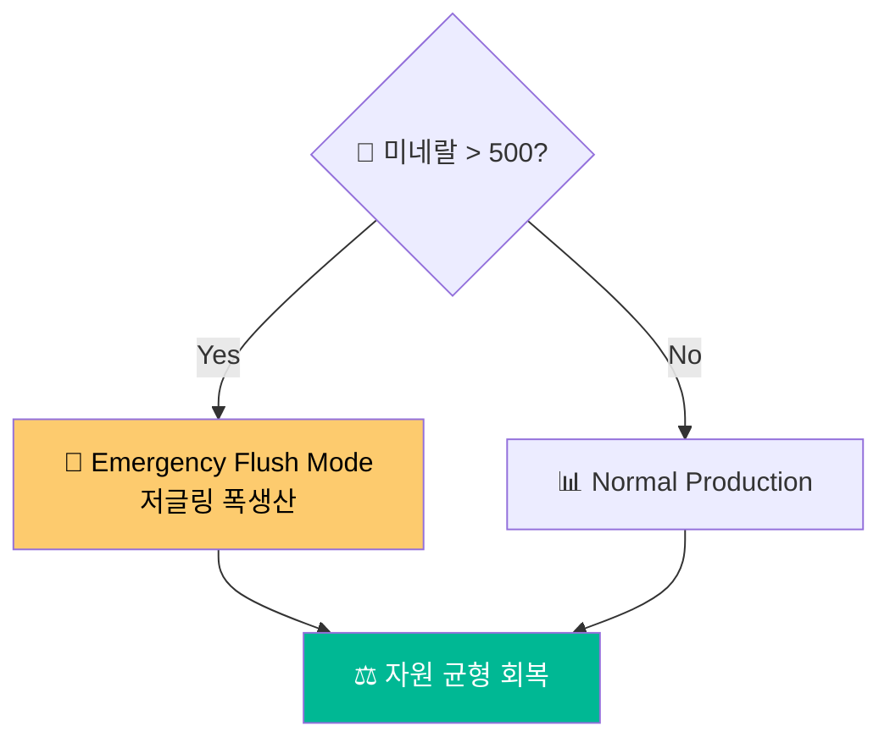

---

## Project Stats

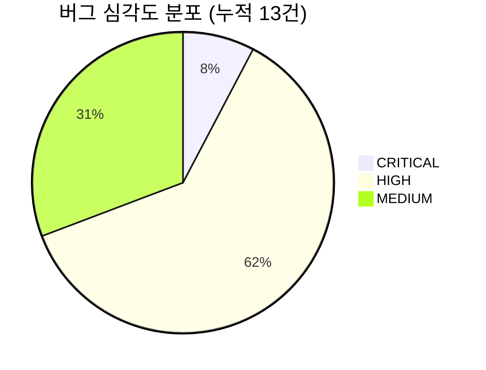

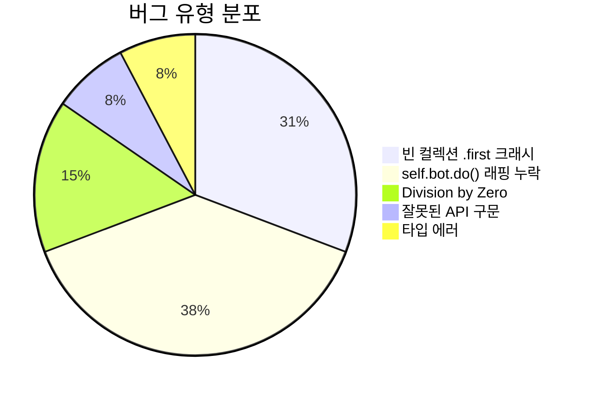

### Quality Dashboard

| Metric | Value | Status |
|--------|-------|--------|
| Python 파일 수 | 362 | ✅ 전체 구문 검사 통과 |
| 누적 버그 수정 | 13건 | ✅ CRITICAL 0건 잔존 |
| 테스트 스위트 | 3개 통과 | ✅ bot_init, strategy, knowledge |
| 빌드오더 | 9개 | ✅ Roach Rush, 12Pool 등 |
| 종족 대응 비율 | 4개 종족 | ✅ Terran, Protoss, Zerg, Random |
| 검증 완료 모듈 | 100% | ✅ core, combat, economy, scouting, defense 전체 |
| 자동 모니터링 | 1시간 주기 | ✅ 스케줄 태스크 운영 중 |

### Bug Fix Timeline

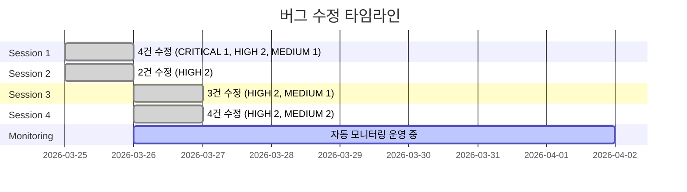

---

## Tech Stack

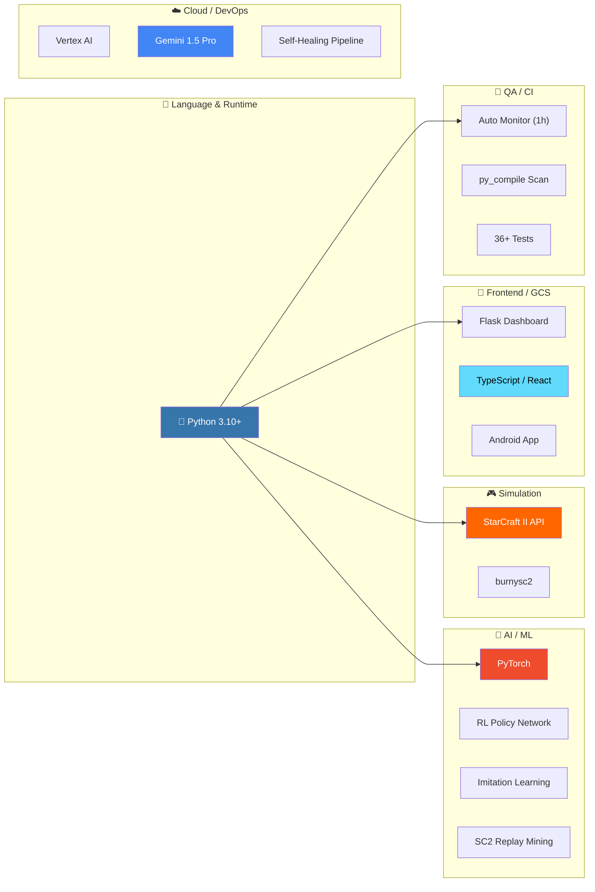

| Category | Technology |
|----------|-----------|
| **Language** | Python 3.10+ |
| **AI/ML** | PyTorch, RL Policy Network, Imitation Learning, SC2 Replay Mining |
| **Simulation** | StarCraft II API (burnysc2/python-sc2) |
| **DevOps** | Vertex AI (Gemini) Self-Healing Pipeline |
| **GCS** | Flask Dashboard + TypeScript/React + Android App |
| **Algorithms** | Potential-Field Navigation, Async Concurrency Control |
| **CI/QA** | Auto Monitoring (1h cycle), py_compile full scan, 36+ tests |

---

## Career Roadmap

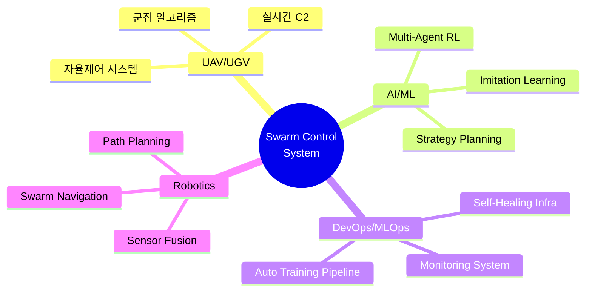

이 프로젝트는 아래 분야와 직접 연결됩니다:

- **UAV/UGV 자율제어 시스템** — 군집 드론 실시간 관제
- **방산 무인체계 군집 알고리즘** — Multi-Agent 전술 의사결정
- **AI/ML Engineer** — 강화학습, 모방학습, 멀티에이전트 AI
- **DevOps/MLOps** — Self-Healing Infrastructure, 자동화 파이프라인
- **로봇/자율주행 C2** — Command & Control 시스템 설계

---

## Contact

<div align="center">

**장선우 (Jang Sun Woo)**

Drone Application Engineering

[](mailto:sun475300@naver.com)
[](https://github.com/sun475300-sudo)

</div>

---

<div align="center">

<sub>Built with Python · StarCraft II API · PyTorch · Gemini AI</sub>

</div>
