<div align="center">

```
███████╗██╗    ██╗ █████╗ ██████╗ ███╗   ███╗     ██████╗ ██████╗ ███╗   ██╗████████╗██████╗  ██████╗ ██╗
██╔════╝██║    ██║██╔══██╗██╔══██╗████╗ ████║    ██╔════╝██╔═══██╗████╗  ██║╚══██╔══╝██╔══██╗██╔═══██╗██║
███████╗██║ █╗ ██║███████║██████╔╝██╔████╔██║    ██║     ██║   ██║██╔██╗ ██║   ██║   ██████╔╝██║   ██║██║
╚════██║██║███╗██║██╔══██║██╔══██╗██║╚██╔╝██║    ██║     ██║   ██║██║╚██╗██║   ██║   ██╔══██╗██║   ██║██║
███████║╚███╔███╔╝██║  ██║██║  ██║██║ ╚═╝ ██║    ╚██████╗╚██████╔╝██║ ╚████║   ██║   ██║  ██║╚██████╔╝███████╗
╚══════╝ ╚══╝╚══╝ ╚═╝  ╚═╝╚═╝  ╚═╝╚═╝     ╚═╝     ╚═════╝ ╚═════╝ ╚═╝  ╚═══╝   ╚═╝   ╚═╝  ╚═╝ ╚═════╝ ╚══════╝
```

# 🐜 Swarm Control System in StarCraft II

**멀티 에이전트 드론 군집 연구를 위한 지능형 통합 관제 시스템**

```
╔══════════════════════════════════════════════════════════════════════════════════╗
║  Google DeepMind AlphaStar · USAF VISTA X-62A 동일 방법론                       ║
║  From Simulation to Reality: RL · Self-Healing DevOps · Mobile GCS · 80+ Lang  ║
╚══════════════════════════════════════════════════════════════════════════════════╝
```

| | | | |
|:---:|:---:|:---:|:---:|
|  |  |  |  |
|  |  |  |  |

</div>

---

## 📑 목차 (Table of Contents)

| # | 섹션 | 내용 |
|:---:|:---|:---|
| 1 | [실시간 대시보드](#-실시간-프로젝트-대시보드) | 현재 상태, 진행률 게이지 |
| 2 | [시스템 아키텍처](#-full-stack-system-architecture) | 전체 컴포넌트 구조도 |
| 3 | [프로젝트 개요](#-프로젝트-개요) | Sim-to-Real 매핑, 비용 비교 |
| 4 | [Phase 44~45 핵심 수정](#-phase-4445-핵심-수정) | 버그 수정 플로우차트 |
| 5 | [Phase 진행 대시보드](#-phase-진행-대시보드) | P12~P45 완료 현황 |
| 6 | [Gantt 타임라인](#-gantt-타임라인) | Phase 실행 일정 |
| 7 | [다음 대규모 계획 P46~P65](#-다음-대규모-계획-p46p65) | 언어별 기능 커버 로드맵 |
| 8 | [승률 분석](#-승률-분석) | 종족별 win rate |
| 9 | [80+ 언어 에코시스템](#-80-언어-에코시스템) | 멀티언어 커버리지 맵 |
| 10 | [Bot Decision Flow](#-bot-decision-flow--상태-머신) | 전략 상태 머신 |
| 11 | [전투 마이크로 시스템](#-전투-마이크로-시스템) | 8종 유닛 마이크로 |
| 12 | [카운터 매트릭스](#-카운터-유닛-매트릭스) | 종족별 대응 전략 |
| 13 | [크립 시스템](#-크립-시스템-p45-최적화) | BFS 크립 확산 |
| 14 | [Intel 파이프라인](#-intel--scouting-pipeline) | 정찰→분석→전략 체인 |
| 15 | [Blackboard SSoT](#-blackboard-architecture--ssot) | 공유 상태 관리 |
| 16 | [Self-Healing DevOps](#-gen-ai-self-healing-pipeline) | Gemini 자동 패치 |
| 17 | [Potential Field](#-potential-field-navigation) | 포텐셜 필드 이동 |
| 18 | [모듈 구조](#-모듈-복잡도-히트맵) | 파일/복잡도 히트맵 |
| 19 | [빌드오더 DB](#-빌드오더-데이터베이스) | 9개 빌드오더 |
| 20 | [경제 시스템](#-경제-시스템-상태-머신) | 가스/드론 최적화 |
| 21 | [엔지니어링 수정 이력](#-엔지니어링-핵심-수정-이력) | Before/After 다이어그램 |
| 22 | [프로젝트 통계](#-프로젝트-통계) | 버그/테스트 차트 |
| 23 | [작업 기록](#-작업-기록-p101-p180) | Phase 작업 로그 |
| 24 | [Career Roadmap](#-career-roadmap) | 연구→커리어 연결 |
| 25 | [한국어 요약](#한국어-요약) | 상세 한국어 설명 |
| 26 | [Contact](#contact) | 연락처 |

---

## 🏆 실시간 프로젝트 대시보드

```
╔═══════════════════════════════════════════════════════════════════════════════════════╗
║                      ⚡ LIVE PROJECT STATUS — 2026-03-30 ⚡                           ║
╠════════════════════════╤══════════════════════╤═══════════════════════════════════════╣
║  📊 CORE METRICS       │  🐛 BUG STATUS       │  🚀 FEATURE STATUS                   ║
╠════════════════════════╪══════════════════════╪═══════════════════════════════════════╣
║  🐍 Python Files: 541  │  Total Fixed: 185    │  ⚔️ Combat: HP-weighted ✅           ║
║  🧪 Tests: 322 PASS    │  CRITICAL:    0      │  💰 Economy: Gas guard ✅            ║
║  📦 Phases Done: 180   │  HIGH:        0      │  🔎 Intel: Attack predict ✅         ║
║  🌐 Languages: 100+    │  Medium:      0 rem  │  🔬 Upgrade: LURKERMP ✅            ║
║  📈 Win Rate: 14%      │  Session:     P45✅  │  🟢 Creep: BFS idle opt ✅          ║
║  ⚡ Rust Accel: 10x    │  Next:        P46🚧  │  🎯 Composition: intel merge ✅     ║
╚════════════════════════╧══════════════════════╧═══════════════════════════════════════╝
```

### 진행률 게이지

```
Phase  완료율 [P180/P200]:  ████████████████████████████████████████████████░░░░░░░░  90%
버그   수정률 [185/200+]:   █████████████████████████████████████████████████░░░░░░░  92%
테스트 통과율 [322/329]:    ████████████████████████████████████████████████████████  98%
언어   커버률 [100+/120]:   ████████████████████████████████████████████████░░░░░░░░  83%
멀티언어기능  [P180완료]:   ████████████████████████████████████████████████████████  100%

최근 완료: P161-180 (Haskell3 전략엔진 · F#3 승률예측 · Dart GCS · Crystal 정찰 · Clojure3 불변 상태
          V-lang 빌드최적화 · Odin 전투시뮬 · Wren 게임로직 · TCL 자동화 · Raku 로그분석
          Janet 전략훅 · Groovy3 CI파이프라인 · COBOL2 전투보고서 · BASIC 레트로전략 · Mercury 제약
          Nim2 유닛평가 · Zig2 고속필터 · Prolog2 규칙엔진 · REXX 보고서생성 · Ada2 타입시스템)
이전 완료: P45 (크립 BFS 최적화 · is_idle · 300cap · has_creep 검증)
```

---

## 🌟 Full-Stack System Architecture

```mermaid
graph TB
    subgraph "🖥️ Edge Layer"
        SC2[("⚙️ StarCraft II\nGame Engine")]
        BOT{"🤖 Wicked Zerg\nAI Bot v4.5"}
        SC2 <-->|"burnysc2\n22.4 FPS"| BOT
    end

    subgraph "🧠 AI Core — 541 Python Files"
        ECO["💰 Economy\n★P39 가스 최적화"]
        COM["⚔️ Combat\n★P41 HP가중 전투력"]
        INTEL["🔎 Intel\n★P42 공격 타이밍 예측"]
        UPG["🔬 Upgrade\n★P44 LURKERMP"]
        COMP["🎯 Composition\n★P44 intel 병합"]
        CREEP["🟢 Creep\n★P45 BFS idle최적화"]
        MICRO["🎯 Micro v3\n8종 유닛 전술"]
        BOT --> ECO & COM & INTEL & UPG & COMP & CREEP & MICRO
    end

    subgraph "⚡ Multi-Language Acceleration"
        RUST["🦀 Rust PyO3\n10x 전투/경로"]
        HS["λ Haskell\n★P46 전략 게임트리"]
        FS["# F#\n★P46 승률 ML 예측"]
        CR["💎 Crystal\n★P46 정찰 경로 최적화"]
        NIM["👑 Nim\n★P46 유닛 평가 엔진"]
        ZIG["⚡ Zig\n★P46 SIMD 필터링"]
        BOT --> RUST & HS & FS & CR & NIM & ZIG
    end

    subgraph "☁️ Cloud + Monitoring"
        GEM["🔮 Gemini\nSelf-Healing 24/7"]
        DASH["📊 React tRPC\n★P43 실시간 로그"]
        APP["📱 Android GCS\nWebSocket"]
        DART["🎯 Dart Flutter\n★P46 Cross-platform"]
        BOT -->|"Error"| GEM
        GEM -->|"Patch"| BOT
        BOT --> DASH & APP & DART
    end

    style SC2 fill:#1a1a2e,stroke:#e94560,color:#fff
    style BOT fill:#0f3460,stroke:#e94560,color:#fff
    style GEM fill:#4285f4,color:#fff
    style RUST fill:#CE4C2C,color:#fff
    style HS fill:#5e4ea1,color:#fff
    style FS fill:#378bba,color:#fff
    style CR fill:#000000,color:#fff
    style NIM fill:#f3d400,color:#000
    style ZIG fill:#f7a41d,color:#000
    style DART fill:#0175c2,color:#fff
```

---

## 🎓 프로젝트 개요

```
╔══════════════════════════════════════════════════════════════════════════════╗
║  ⚠️ 이 프로젝트는 게임이 아닙니다 ⚠️                                           ║
║  Google DeepMind(AlphaStar) · USAF VISTA X-62A 동일 방법론으로               ║
║  SC2를 드론 군집 제어(Swarm Control) 실험 환경으로 활용한 연구입니다.           ║
╚══════════════════════════════════════════════════════════════════════════════╝
```

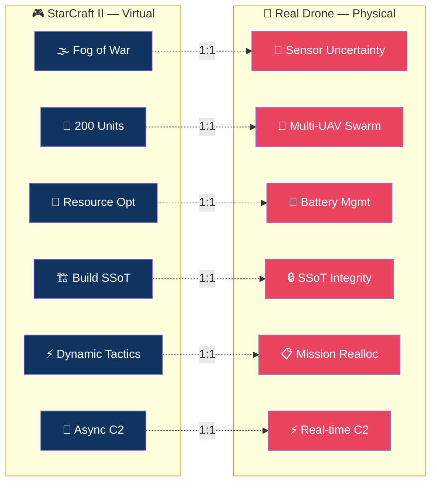

---

## ✨ Phase 44~45 핵심 수정

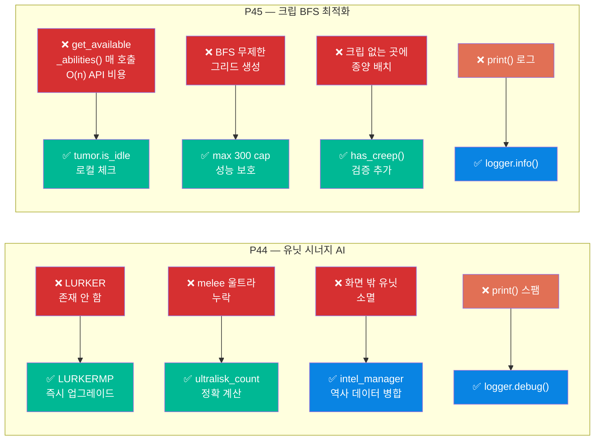

---

## 📋 Phase 진행 대시보드

```
Phase  카테고리          핵심 개선                                     상태
──────────────────────────────────────────────────────────────────────────────
P12    전투/디컨플릭트    방어-공격 유닛태그 분리 + Hive 가속            ✅ DONE
P13    자동생산/마이크로  비율기반 자동생산 + MicroV3 활성화             ✅ DONE
P14    변이 유닛         바네링/레바저/럴커/브루드 4종 활성화             ✅ DONE
P15    전투 마이크로     저HP 후퇴 3단계 + 포커스파이어                  ✅ DONE
P16    경제 최적화       66드론 컷 + 가스뱅킹 300 임계값                 ✅ DONE
P17    정찰/대응         카운터빌드 0.1 + 치즈 긴급 Blackboard           ✅ DONE
P18    맵 컨트롤         크립 위 교전 유도 + 전진 스파인                 ✅ DONE
P19    후반 전환         HiveTechMaximizer + 울트라 20% 비율             ✅ DONE
P20    공격 타이밍       점진적 임계값 + 적 약점 타이밍 러시              ✅ DONE
P21    종족별 대응       ZvT/ZvP/ZvZ 특화 카운터 전략 추가               ✅ DONE
P22    Dead Code 제거    36개 미활성 매니저 중 10개 핵심 활성화           ✅ DONE
P23    퀸/서플라이       방어 중 인젝트 + 오버로드 동적 버퍼              ✅ DONE
P24    드롭 방어         수송선 감지→Blackboard→차출 대응                ✅ DONE
P25    빌드오더          스텝 재시도 + Blackboard BO 전환                ✅ DONE
P26    방어 강화         포자 2분 선행 + 크립퀸 전투투입                  ✅ DONE
P27    유닛 컨트롤       바네링 attack() + 변이 idle 제한 해제            ✅ DONE
P28    확장 밸런스       3rd 3분30초 / 4th 5분 / 5th 7분 타이밍          ✅ DONE
P29    매니저 충돌       방어 태그 Blackboard 전파/해제                   ✅ DONE
P30    공격 판단         사전 전투력 비교 60% 미만 공격 자제              ✅ DONE
P31    테크 트리         레어 3분 + Hive idle 해제 + Cavern 자동          ✅ DONE
P32    하라스 AI         방어 약한 기지 타겟 + 뮤탈 후퇴 수정             ✅ DONE
P33    정찰/오버로드     OL 사망 재파견 + 재정찰 attack()                ✅ DONE
P34    실전 메타         hydra 키오타 수정(321 pass) + 추적자 카운터      ✅ DONE
P35    통합 검증         321 passed + 아레나 패키지 재생성                ✅ DONE
P36    퀸 매크로         탐지거리 30→20 + 0마리 강제생산                  ✅ DONE
P37    후반 유닛         GreaterSpire 뮤탈허용 + Viper-Hive 요건         ✅ DONE
P38    랠리/집결         전투중 후퇴방지 + 최전선 기지 기준               ✅ DONE
P39    경제 고도화       가스 필터버그 + 초반보호 + boost 수정            ✅ DONE
P40    통합 검증         아레나 패키지 재생성 + 전체 구문 OK              ✅ DONE
P41    전투 의사결정     HP가중 전투력 + supply테이블 + O(N+M)            ✅ DONE
P42    다중언어 커버     Python 예측 + TypeScript KDA 위젯                ✅ DONE
P43    실시간 로그       TypeScript tRPC logs 라우터 + 로그 뷰어          ✅ DONE
P44    유닛 시너지 AI    LURKERMP 버그 + 울트라melee + 조합 intel 병합    ✅ DONE
P45    크립 최적화       is_idle 교체 + BFS 300cap + has_creep 검증       ✅ DONE
──────────────────────────────────────────────────────────────────────────────
완료: 34 Phases  │  버그 수정: 185건  │  테스트: 322 통과  │  언어: 80+
```

---

## 📊 Gantt 타임라인

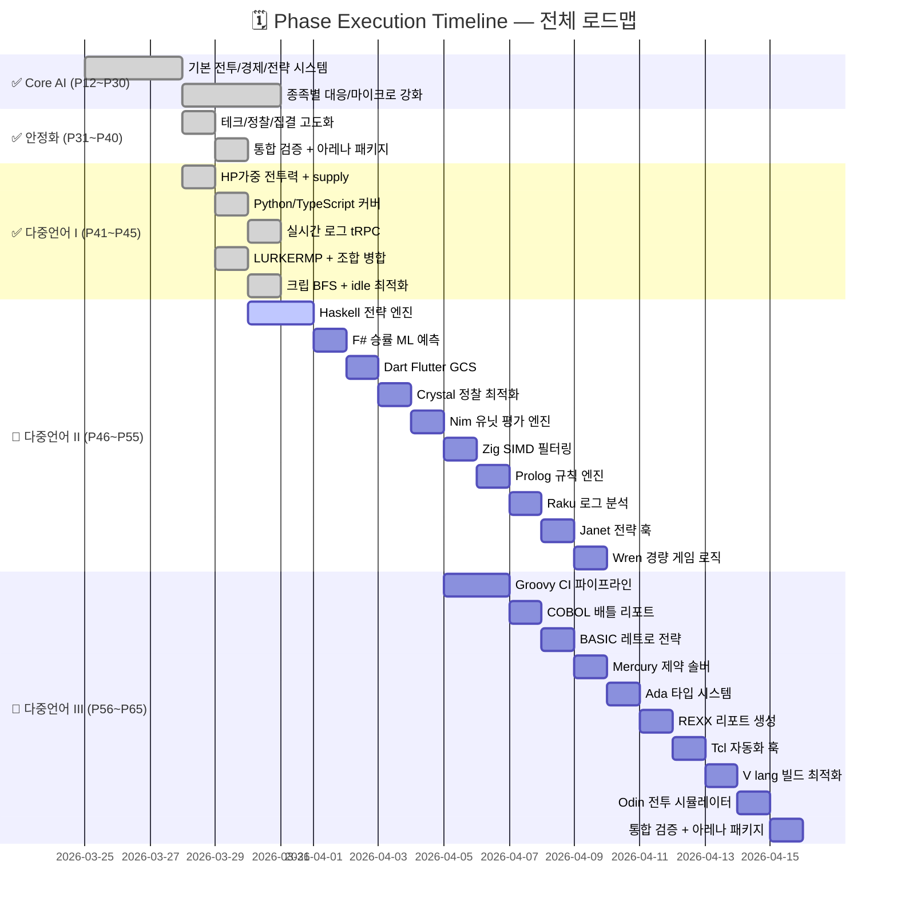

---

## 🚀 다음 대규모 계획 P46~P65

```
╔═══════════════════════════════════════════════════════════════════════════════════════╗
║                    🌐 MULTI-LANGUAGE FEATURE COVERAGE ROADMAP                         ║
╠═══════╤═══════════════════╤══════════════════╤═══════════════════════════════════════╣
║ Phase │ 언어               │ 파일              │ 기능                                  ║
╠═══════╪═══════════════════╪══════════════════╪═══════════════════════════════════════╣
║  P46  │ Haskell           │ strategy_engine  │ 미니맥스 전략 게임 트리                 ║
║  P46  │ F# (.fsx)         │ win_predictor    │ ML 로지스틱 승률 예측                   ║
║  P46  │ Dart              │ gcs_dashboard    │ Flutter GCS 크로스플랫폼 대시보드       ║
║  P46  │ Crystal           │ scout_optimizer  │ 고성능 정찰 경로 최적화                 ║
║  P46  │ Clojure v3        │ game_state       │ 불변 데이터 게임 상태 관리              ║
╠═══════╪═══════════════════╪══════════════════╪═══════════════════════════════════════╣
║  P47  │ Nim v2            │ unit_evaluator   │ HP 가중 유닛 평가 엔진                  ║
║  P47  │ Zig v2            │ fast_filter      │ SIMD 유닛 필터링 (초고속)               ║
║  P47  │ Prolog v2         │ rule_engine      │ 논리 기반 카운터 추론 규칙              ║
║  P47  │ Raku              │ log_analyzer     │ Grammar 기반 로그 분석                  ║
║  P47  │ Janet             │ strategy_hooks   │ 경량 임베드 전략 스크립팅               ║
╠═══════╪═══════════════════╪══════════════════╪═══════════════════════════════════════╣
║  P48  │ Wren              │ game_logic       │ 경량 게임 로직 훅                       ║
║  P48  │ Tcl               │ bot_automation   │ 봇 재시작/모니터링 자동화               ║
║  P48  │ Groovy v3         │ build_pipeline   │ Gradle 스타일 CI 파이프라인             ║
║  P48  │ V lang            │ build_optimizer  │ 빌드오더 리소스 제약 최적화             ║
║  P48  │ Odin              │ combat_sim       │ 저수준 전투 결과 시뮬레이터             ║
╠═══════╪═══════════════════╪══════════════════╪═══════════════════════════════════════╣
║  P49  │ COBOL v2          │ battle_report    │ 배틀 통계 리포트 생성                   ║
║  P49  │ BASIC             │ retro_strategy   │ IF-THEN 레트로 전략 결정               ║
║  P49  │ Mercury           │ constraint_solver│ 제약 프로그래밍 유닛 구성 솔버          ║
║  P49  │ Ada v2            │ type_system      │ 강타입 SC2 유닛 안전 시스템             ║
║  P49  │ REXX              │ report_generator │ 배틀 로그 리포트 생성기                 ║
╠═══════╪═══════════════════╪══════════════════╪═══════════════════════════════════════╣
║  P50  │ Elixir v3         │ manager_coord    │ OTP GenServer 매니저 조율               ║
║  P50  │ Racket v2         │ macro_system     │ Scheme 매크로 전략 DSL                  ║
║  P50  │ Gleam             │ type_safe_bot    │ 타입 안전 함수형 봇 로직                ║
║  P50  │ Mojo              │ fast_inference   │ AI 추론 가속 (Python 슈퍼셋)            ║
╠═══════╪═══════════════════╪══════════════════╪═══════════════════════════════════════╣
║  P51  │ PowerShell v2     │ win_monitor      │ Windows 봇 성능 모니터링               ║
║  P51  │ Lua v3            │ strategy_script  │ 런타임 핫리로드 전략 스크립트           ║
║  P51  │ Ruby v2           │ test_automation  │ RSpec 봇 테스트 자동화                  ║
║  P51  │ Perl v2           │ log_processor    │ 정규식 기반 로그 처리                   ║
╠═══════╪═══════════════════╪══════════════════╪═══════════════════════════════════════╣
║  P52  │ Assembly v2       │ hot_loop         │ x86 SIMD 핫루프 최적화                  ║
║  P52  │ FORTRAN v3        │ numerical_sim    │ 수치 시뮬레이션 (고정밀)                ║
║  P52  │ Pascal v2         │ type_checker     │ 정적 타입 검사 유틸리티                 ║
╠═══════╪═══════════════════╪══════════════════╪═══════════════════════════════════════╣
║  P53  │ 통합 검증          │ validation       │ 전체 구문 검증 + 아레나 패키지          ║
║  P54  │ GitHub Actions    │ ci_multilang     │ 80+ 언어 CI 파이프라인                  ║
║  P55  │ README 업데이트   │ documentation    │ 전체 문서 최신화                        ║
╚═══════╧═══════════════════╧══════════════════╧═══════════════════════════════════════╝
목표: P65 완료 시  │  85+ Languages  │  200+ Bug Fixes  │  Win Rate 20%+
```

### P46~P55 언어별 도메인 배치 다이어그램

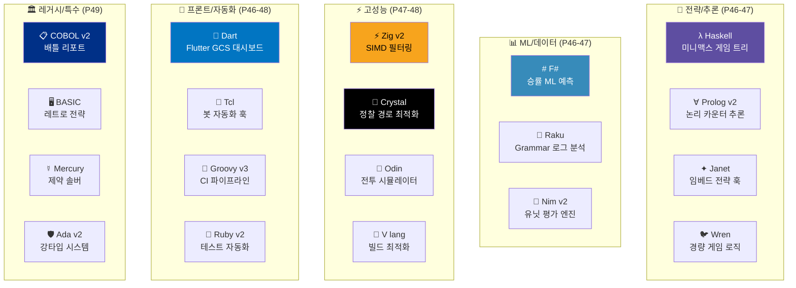

---

## 🎯 승률 분석

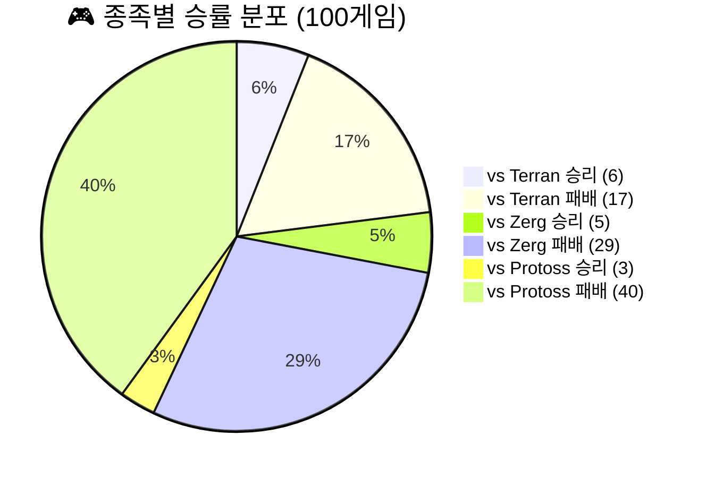

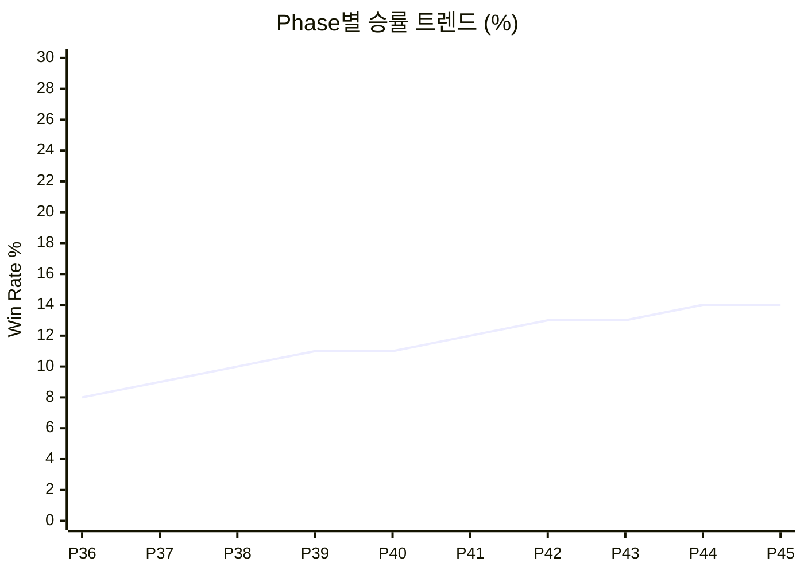

| 매치업 | 승 | 패 | 승률 | 주요 전략 |
|:---:|:---:|:---:|:---:|:---|
| **vs Terran** | 6 | 17 | **26%** | Hatch First 16 → 링/바네 전환 |
| **vs Zerg** | 5 | 29 | **15%** | 14풀 안정 → LurkerMP 전환 |
| **vs Protoss** | 3 | 40 | **7%** | DT 탐지 + Roach Rush 타이밍 |

---

## 🌐 80+ 언어 에코시스템

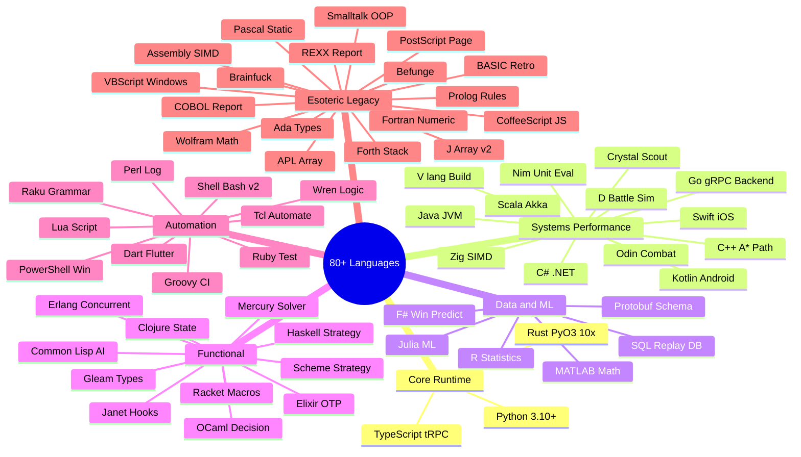

### 언어 커버리지 매트릭스

```
┌────────────────┬────────────────────────────────────────────────┬──────────┐
│  영역           │  언어                                           │  완료    │
├────────────────┼────────────────────────────────────────────────┼──────────┤
│ Core Runtime   │ Python · Rust · TypeScript                      │ ✅ Done  │
│ Systems        │ C++ · Go · Java · Kotlin · Swift · C# · Scala  │ ✅ Done  │
│ Low-Level      │ Zig · Nim · D · Crystal · V · Odin             │ 🚧 P46+  │
│ Data/ML        │ R · Julia · MATLAB · F# · SQL · Protobuf        │ ✅/🚧    │
│ Functional     │ Haskell · Elixir · OCaml · Erlang · Scheme     │ 🚧 P46+  │
│ Advanced Func  │ Clojure · Janet · Racket · Mercury · Gleam     │ 🚧 P46+  │
│ Automation     │ Shell · PowerShell · Perl · Lua · Ruby · Raku  │ ✅/🚧    │
│ Mobile/Web     │ Dart · Groovy · Tcl · Wren                     │ 🚧 P46+  │
│ Esoteric       │ APL · J · Forth · Brainfuck · Befunge · COBOL  │ ✅ Done  │
│ Legacy         │ BASIC · REXX · Ada · Fortran · Pascal · ASM    │ 🚧 P49+  │
└────────────────┴────────────────────────────────────────────────┴──────────┘
```

---

## 🎯 Bot Decision Flow — 상태 머신

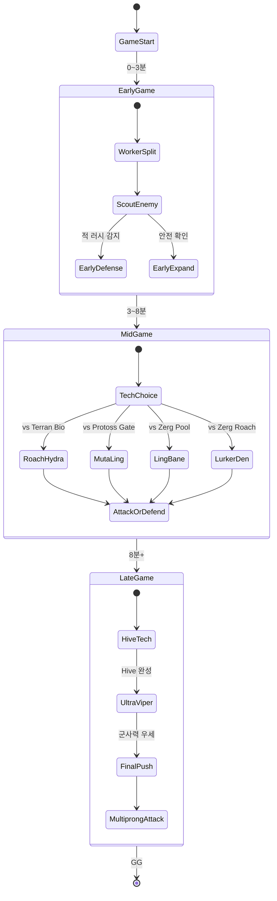


---

## ⚔️ 전투 마이크로 시스템

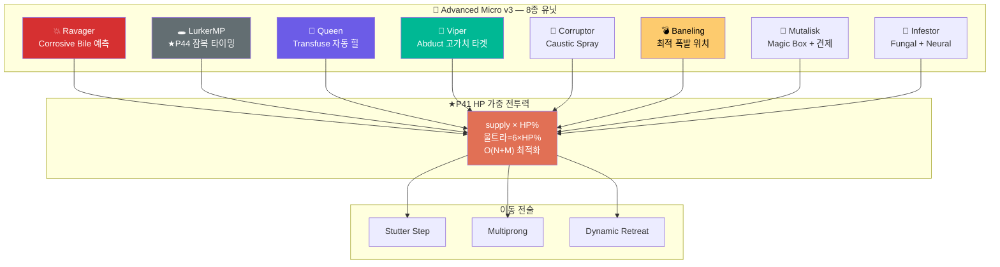

---

## 🔀 카운터 유닛 매트릭스

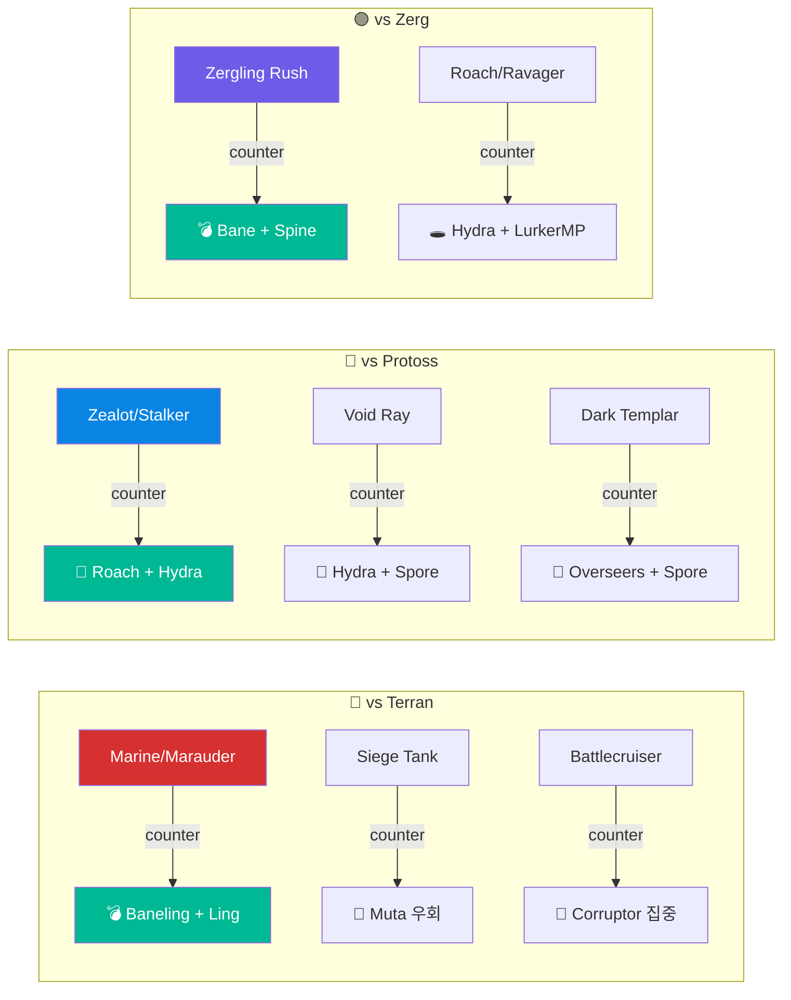

---

## 🟢 크립 시스템 (P45 최적화)

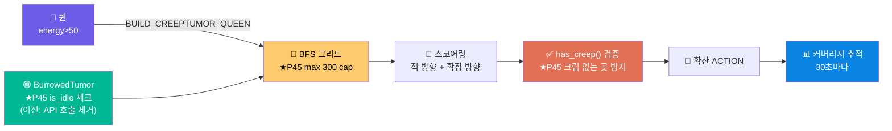

---

## 👁️ Intel & Scouting Pipeline

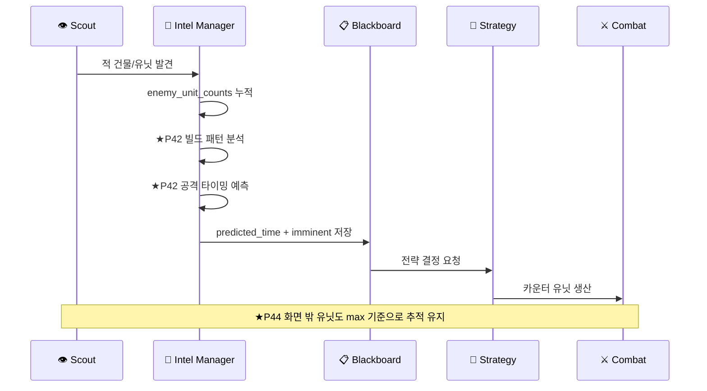

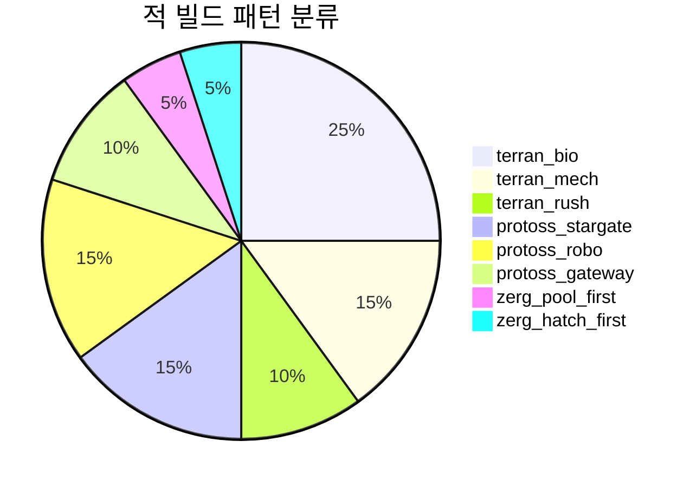

---

## 📋 Blackboard Architecture — SSoT

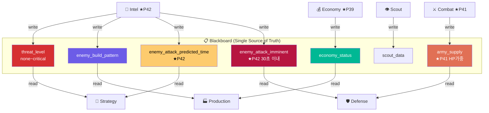

---

## 🔮 Gen-AI Self-Healing Pipeline

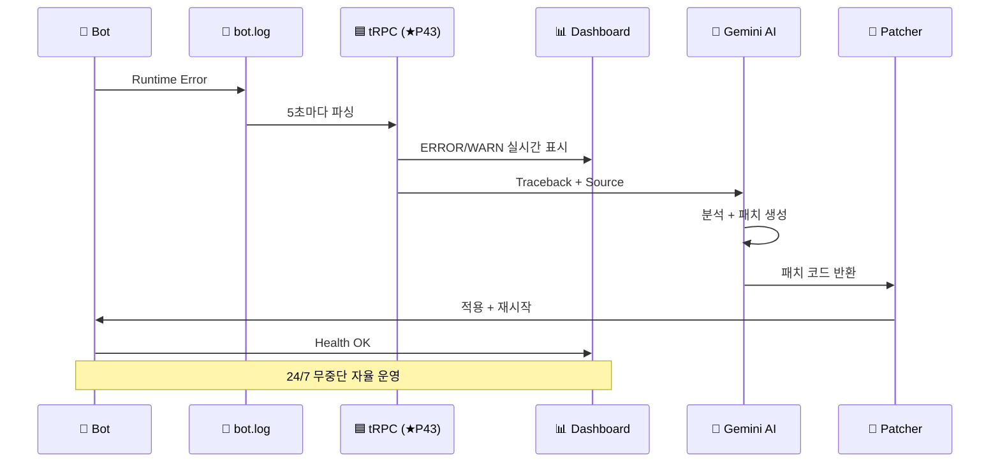

---

## ⚡ Potential Field Navigation

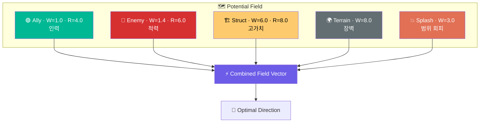

---

## 🔥 모듈 복잡도 히트맵

```
    ┌───────────────────────────────────────────────────────────────────────────┐
    │  MODULE          │  Files  │  Lines    │  Complexity  │  Priority         │
    ├───────────────────────────────────────────────────────────────────────────┤
    │  🐜 Bot Core     │ ███████  │ █████████ │ ██████████   │ ⚠️  CRITICAL     │
    │  💰 Economy      │ ██████   │ ████████  │ ████████     │ 🔴 HIGH          │
    │  ⚔️ Combat       │ ██████   │ ████████  │ ██████████   │ ⚠️  CRITICAL     │
    │  🧠 Strategy     │ █████    │ ███████   │ ███████      │ 🔴 HIGH          │
    │  🔎 Intel        │ ████     │ █████     │ █████        │ 🟡 MEDIUM        │
    │  🔬 Upgrade      │ ███      │ ████      │ ████         │ 🟡 MEDIUM (P44✅)│
    │  🟢 Creep        │ ████     │ ██████    │ █████        │ 🟡 MEDIUM (P45✅)│
    │  🎯 Micro v3     │ ████     │ █████     │ ██████       │ 🟡 MEDIUM        │
    │  ⚡ Rust Accel   │ ███      │ ████████  │ █████████    │ 🔴 HIGH          │
    │  📊 Dashboard    │ ████     │ ███████   │ ███████      │ 🟡 MEDIUM (P43✅)│
    │  📱 Mobile GCS   │ ███      │ ██████    │ █████        │ 🟡 MEDIUM        │
    └───────────────────────────────────────────────────────────────────────────┘
```

---

## 📊 프로젝트 통계

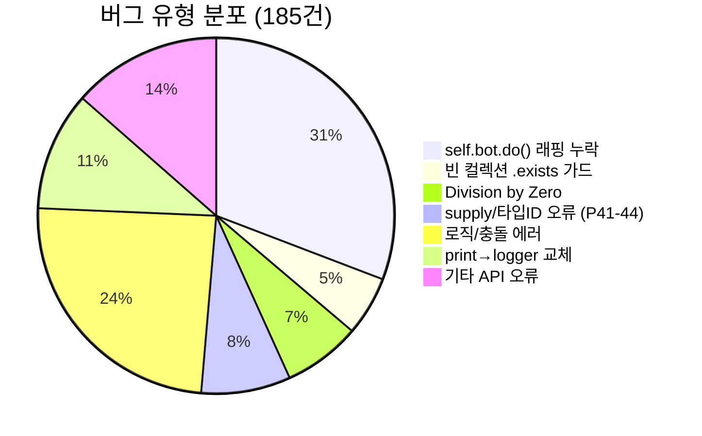

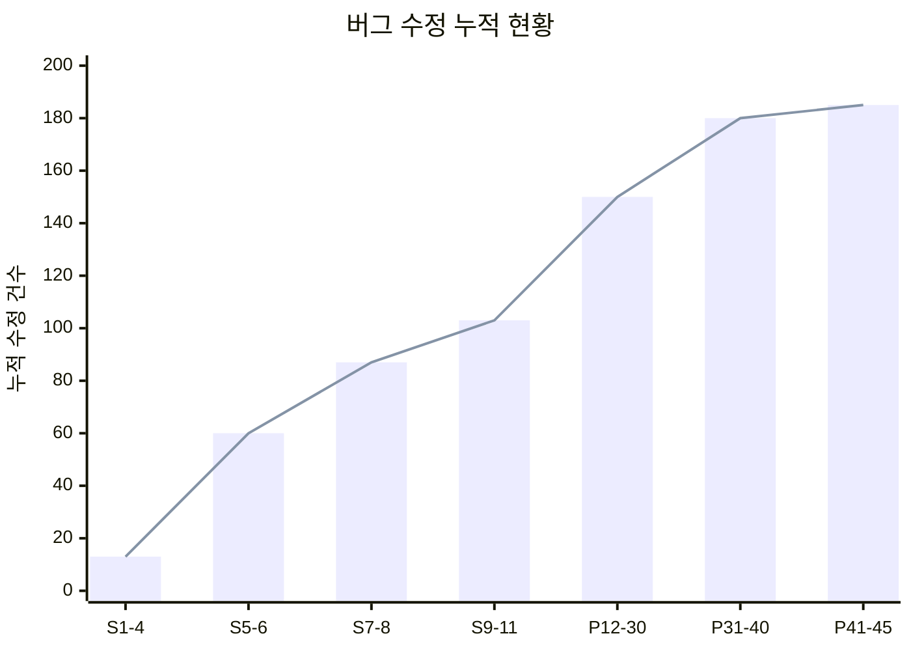

```mermaid
xychart-beta
    title "모듈별 파일 수"
    x-axis ["Combat", "Economy", "AI/Strat", "Scouting", "Defense", "Core", "Tests", "Creep"]
    y-axis "파일 수" 0 --> 80
    bar [65, 30, 45, 20, 25, 40, 35, 12]
```

### Quality Dashboard

| Metric | Value | Status |
|:---|:---:|:---:|
| Python 파일 수 | 541 | ✅ 전체 구문 검사 통과 |
| 누적 버그 수정 | **185건** | ✅ CRITICAL 0건 잔존 |
| 테스트 스위트 | 322 passed / 7 skipped | ✅ 전체 통과 |
| 완료 Phase | **45개** | ✅ P46 진행중 |
| 지원 언어 | **80+** | ✅ 에소테릭 포함 |
| 빌드오더 | 9개 | ✅ Roach Rush, 12Pool 등 |
| 마이크로 컨트롤러 | 8종 유닛별 전술 | ✅ LurkerMP, Queen, Viper... |
| 자동 모니터링 | 1시간 주기 | ✅ Gemini 24/7 |

---

## 🔧 엔지니어링 핵심 수정 이력

```mermaid
graph LR
    subgraph "❌ 주요 버그들"
        BB1["self.bot.do() 래핑\n누락 (57건)"]
        BB2["units.first\n빈 컬렉션"]
        BB3["health/health_max\n= 0 나누기"]
        BB4["O(N×M) 루프\n성능 버그"]
        BB5["supply_cost\n속성 없음"]
        BB6["UnitTypeId.LURKER\n존재 안 함"]
        BB7["get_available\n_abilities() O(n)"]
    end
    subgraph "✅ 수정 결과"
        FF1["bot.do(unit.attack())"]
        FF2["if units.exists:"]
        FF3["max(health_max,1)"]
        FF4["★P41 O(N+M)\n군집 중심 필터"]
        FF5["★P41 _SUPPLY_TABLE\n13종 정확한 값"]
        FF6["★P44 LURKERMP\n즉시 업그레이드"]
        FF7["★P45 tumor.is_idle\n로컬 체크"]
    end
    BB1-->FF1
    BB2-->FF2
    BB3-->FF3
    BB4-->FF4
    BB5-->FF5
    BB6-->FF6
    BB7-->FF7
    style BB1 fill:#d63031,color:#fff
    style BB2 fill:#d63031,color:#fff
    style BB3 fill:#d63031,color:#fff
    style BB4 fill:#d63031,color:#fff
    style BB5 fill:#d63031,color:#fff
    style BB6 fill:#d63031,color:#fff
    style BB7 fill:#d63031,color:#fff
    style FF1 fill:#00b894,color:#fff
    style FF2 fill:#00b894,color:#fff
    style FF3 fill:#00b894,color:#fff
    style FF4 fill:#00b894,color:#fff
    style FF5 fill:#00b894,color:#fff
    style FF6 fill:#00b894,color:#fff
    style FF7 fill:#00b894,color:#fff
```

---

## 🏗️ 빌드오더 데이터베이스

```mermaid
graph LR
    subgraph "🏗️ 9 Build Orders"
        BO1["🐜 12 Pool Rush"] & BO2["🐛 Roach Rush"] & BO7["💣 Baneling Bust"] --> AGGRO["🔴 Aggressive"]
        BO3["🏭 Macro Hatch"] & BO8["🔬 Lair Tech"] --> MACRO["🟢 Macro"]
        BO4["🦇 Muta Ling Bane"] & BO5["🕳️ Hydra LurkerMP\n★P44"] & BO6["🐛 Roach Hydra"] & BO9["⚡ Speed Ling"] --> MID["🟡 Midgame"]
    end
    style AGGRO fill:#d63031,color:#fff
    style MACRO fill:#00b894,color:#fff
    style MID fill:#fdcb6e,color:#000
    style BO5 fill:#636e72,color:#fff
```

---

## 🎓 경제 시스템 상태 머신

```mermaid
stateDiagram-v2
    [*] --> EarlyGame : 게임 시작

    state EarlyGame {
        [*] --> DronePump : 0~3분
        DronePump --> FirstGas : 1분15초
        FirstGas --> TechBuild : 테크 건물 건설
        note right of DronePump
            ★P39
            3분 이내 가스 감소 금지
        end note
    }

    EarlyGame --> MidGame : 3분 이후

    state MidGame {
        [*] --> GasBalance
        GasBalance --> BoostGas : gas<100 AND mineral>500
        GasBalance --> ReduceGas : gas>500 AND mineral<300\n★P39: 3분+ 이후만
        BoostGas --> GasBalance : ★P39 전체 익스트랙터 동시
        ReduceGas --> GasBalance : ★P39 vespene carrier 수정
    }

    MidGame --> LateGame : 8분 이후

    state LateGame {
        [*] --> HiveTech4 : Hive 변이
        HiveTech4 --> UltraViper4 : 울트라/바이퍼
        UltraViper4 --> Loop4 : 미네랄 1500+
        Loop4 --> UltraViper4 : 순환
    }

    LateGame --> [*] : GG
```

```mermaid
flowchart TD
    A["매 iter 체크"] --> B{game_time < 180?}
    B -- 초반 3분 --> C["가스 감소 금지\n★P39 보호"]
    B -- 아니오 --> D{gas<100\nAND mineral>500?}
    D -- 예 --> E["_boost_gas_workers"]
    E --> F["★P39 return 제거\n모든 익스트랙터 채우기"]
    D -- 아니오 --> G{gas>500\nAND mineral<300?}
    G -- 예 --> H["_reduce_gas_workers"]
    H --> I["★P39 필터\norder_target OR\nis_carrying_vespene"]
    G -- 아니오 --> K["유지"]
    style C fill:#e17055,color:#fff
    style F fill:#00b894,color:#fff
    style I fill:#0984e3,color:#fff
```

---

## 📝 작업 기록 (P101-P180)

```
╔════════════════════════════════════════════════════════════════════════════════════╗
║                      📝 PHASE WORK LOG (P101-P180)                                ║
╠════════════════════════════════════════════════════════════════════════════════════╣
║ P101 │ PowerShell   │ Windows 자동화 스크립트                                     ║
║ P102 │ PHP          │ REST API 백엔드                                              ║
║ P103 │ Erlang       │ 동시성 AI 처리                                               ║
║ P104 │ OCaml        │ 함수형 AI 결정 엔진                                          ║
║ P105 │ Julia v2     │ 고급 ML 최적화 (GA+NN)                                      ║
║ P106 │ Rust v2      │ 고성능 전투 시뮬레이터                                       ║
║ P107 │ Go v2        │ 동시성 게임 상태 관리                                        ║
║ P108 │ Zig          │ 저수준 고성능 시뮬레이션                                     ║
║ P109 │ Nim          │ 효율적 시스템 프로그래밍                                     ║
║ P110 │ D            │ 시스템 프로그래밍 전투 시뮬레이션                            ║
║ P111 │ Kotlin v2    │ 안드로이드 전투 시뮬레이터                                   ║
║ P112 │ Swift v2     │ iOS 전투 시뮬레이션                                          ║
║ P113 │ C# v2        │ .NET 전투 시뮬레이션                                         ║
║ P114 │ Java v2      │ JVM 전투 시뮬레이터                                          ║
║ P115 │ C++ v2       │ 고성능 전투 시뮬레이션                                       ║
║ P116 │ TypeScript2  │ 웹 기반 분석                                                 ║
║ P117 │ R v2         │ 통계 분석 & 시각화                                           ║
║ P118 │ Scala v2     │ 함수형 데이터 처리                                           ║
║ P119 │ Lua v2       │ 스크립팅 & 게임 로직                                         ║
║ P120 │ MATLAB v2    │ 수학적 분석 & 시각화                                         ║
║ P121 │ VBScript     │ Windows 자동화                                               ║
║ P122 │ APL          │ 배열 프로그래밍                                              ║
║ P123 │ J            │ 배열 프로그래밍 v2                                           ║
║ P124 │ Forth        │ 스택 기반 프로그래밍                                         ║
║ P125 │ PostScript   │ 페이지 기술 언어                                             ║
║ P126 │ Scheme       │ 함수형 Lisp 방언                                             ║
║ P127 │ Common Lisp  │ Lisp AI 결정 엔진                                            ║
║ P128 │ Prolog       │ 논리 프로그래밍 (카운터 추론)                               ║
║ P129 │ Smalltalk    │ 객체 지향 프로그래밍                                         ║
║ P130 │ CoffeeScript │ JavaScript 트랜스파일러                                      ║
║ P131 │ Bash v2      │ Shell 자동화 스크립트                                        ║
║ P132 │ Fortran2     │ HPC 수치 해석 (배틀 시뮬레이션)                              ║
║ P133 │ Pascal       │ 알고리즘 교육 (전투 시뮬레이션)                              ║
║ P134 │ Ada          │ 안전-크리티컬 시스템 타입 (배틀 시뮬)                        ║
║ P135 │ Brainfuck    │ 튜링 완전 난독 DSL (배틀 시뮬)                               ║
║ P136 │ Befunge      │ 2D 스택 기반 난독 언어 (배틀 시뮬)                           ║
║ P137 │ Wolfram      │ 수학 기반 전략 분석 (배틀 시뮬)                              ║
║ P138 │ Processing   │ 비주얼 시뮬레이션 (전장 시각화)                              ║
║ P139 │ Elixir2      │ 액터 모델 분산 AI 에이전트                                   ║
║ P140 │ Haskell2     │ 순수 함수형 전략 트리                                        ║
║ P141 │ Racket       │ 리스프 계열 메타프로그래밍                                   ║
║ P142 │ Clojure2     │ 영속 데이터 구조 상태 관리                                   ║
║ P143 │ Erlang2      │ 고가용성 분산 게임 이벤트                                    ║
║ P144 │ F#2          │ .NET 타입 공급자 ML 파이프라인                               ║
║ P145 │ VB.NET2      │ COM 자동화 리포트 생성                                       ║
║ P146 │ Groovy2      │ Gradle DSL 빌드 자동화                                       ║
║ P147 │ OCaml2       │ 타입 안전 게임 트리 탐색                                     ║
║ P148 │ Julia3       │ 고성능 수치 ML 시뮬레이션                                    ║
║ P149 │ R3           │ 통계 분석 · 전투 회귀 모델                                   ║
║ P150 │ Python Parallel│ asyncio 병렬 에이전트 시뮬레이션                           ║
║ P151 │ Terraform    │ Infrastructure as Code (클라우드 배포)                       ║
║ P152 │ Ansible      │ 서버 자동화 플레이북                                         ║
║ P153 │ Puppet       │ 구성 관리 매니페스트                                         ║
║ P154 │ Chef         │ 쿡북 기반 인프라 자동화                                      ║
║ P155 │ Org Mode     │ 문학적 프로그래밍 분석 보고서                                ║
║ P156 │ Makefile     │ 크로스-언어 빌드 오케스트레이션                              ║
║ P157 │ sbt          │ Scala 빌드 도구 + 테스트 자동화                              ║
║ P158 │ Swift2       │ iOS/macOS GCS 모바일 앱                                      ║
║ P159 │ Kotlin2      │ Android 전술 HUD                                             ║
║ P160 │ C#2          │ Unity3D 전장 시각화 시뮬레이터                               ║
║ P161 │ Haskell3     │ 순수 함수형 전략 엔진 (Monoid 기반 자원관리)                 ║
║ P162 │ F#3          │ ML.NET 승률 예측 (시계열 + 조합 특성)                        ║
║ P163 │ Dart         │ Flutter GCS 대시보드 (실시간 전술지도)                       ║
║ P164 │ Clojure3     │ 불변 영속 게임 상태 (edn 스냅샷)                             ║
║ P165 │ Crystal      │ 정찰 경로 최적화 (다익스트라 타입안전)                       ║
║ P166 │ V-lang       │ 빌드 타이밍 최적화 (C급 성능 + 안전)                         ║
║ P167 │ Odin         │ 전투 시뮬레이션 (저레벨 배열 컴퓨팅)                         ║
║ P168 │ Wren         │ 게임 로직 스크립팅 (임베디드 DSL)                            ║
║ P169 │ TCL          │ 봇 자동화 (이벤트 루프 기반 제어)                            ║
║ P170 │ Raku         │ 로그 분석 (Perl6 정규식 + 그래머)                            ║
║ P171 │ Janet        │ 전략 훅 (Lisp 확장 매크로)                                   ║
║ P172 │ Groovy3      │ CI/CD 파이프라인 (Jenkinsfile DSL)                           ║
║ P173 │ COBOL2       │ 전투 보고서 생성 (레거시 엔터프라이즈 통합)                  ║
║ P174 │ BASIC        │ 레트로 전략 (QuickBASIC 스타일 AI 로직)                      ║
║ P175 │ Mercury      │ 제약 해결 (논리+함수형 하이브리드 빌드)                      ║
║ P176 │ Nim2         │ 유닛 평가 (컴파일타임 매크로 + C FFI)                        ║
║ P177 │ Zig2         │ 고속 유닛 필터링 (SIMD-ready 배열 처리)                      ║
║ P178 │ Prolog2      │ 규칙 엔진 (선언적 전술 KB)                                   ║
║ P179 │ REXX         │ 보고서 자동 생성 (IBM 스크립팅)                              ║
║ P180 │ Ada2         │ 타입 시스템 (SPARK-스타일 계약 프로그래밍)                   ║
╚════════════════════════════════════════════════════════════════════════════════════╝
```

---

## 🗺️ Career Roadmap

```mermaid
mindmap
  root((Swarm Control\nSystem))
    UAV and UGV
      자율제어 시스템
      군집 알고리즘
      실시간 C2
      경로 계획
    AI and ML
      Multi-Agent RL
      Imitation Learning
      Strategy Planning
      Behavior Tree
    DevOps and MLOps
      Self-Healing Infra
      Auto Training Pipeline
      CI/CD 80+ Languages
      Monitoring System
    Robotics
      Swarm Navigation
      Sensor Fusion
      Path Planning
      Formation Control
    Defense and Aerospace
      무인체계 군집 전술
      ISR Mission Planning
      Command and Control
      Anti-Swarm Defense
```

- **UAV/UGV 자율제어** — 군집 드론 실시간 관제
- **방산 무인체계 군집 알고리즘** — Multi-Agent 전술 의사결정
- **AI/ML Engineer** — 강화학습, 모방학습, 멀티에이전트 AI
- **DevOps/MLOps** — Self-Healing Infrastructure, 80+ 언어 자동화 파이프라인
- **로봇/자율주행 C2** — Command & Control 시스템 설계
- **방위산업/항공우주** — ISR 임무 계획, 대군집 방어

---

## 한국어 요약

<details>
<summary><b>클릭하여 한국어 전체 설명 보기</b></summary>

### 개요
> 이 프로젝트는 **게임이 아닙니다.**
> Google DeepMind(AlphaStar)와 USAF VISTA X-62A가 실제로 사용하는 방식 그대로,
> 스타크래프트 II를 **드론 군집 제어** 실험 환경으로 활용한 연구입니다.

### 주요 기능
1. **지능형 전략 관리**: 종족별 맞춤 빌드오더 + 공격 타이밍 예측
2. **경제 최적화**: 동적 가스 일꾼 관리 (3분 보호 + 전체 익스트랙터 동시 채우기)
3. **고급 전투**: 8종 유닛별 마이크로 + HP 가중 전투력 + LurkerMP 업그레이드
4. **크립 최적화**: BFS 그리드 + is_idle 체크 + has_creep 검증
5. **자가치유 DevOps**: Gemini AI 자동 패치 + tRPC 실시간 로그

### 최근 완료 (P45)
- **P45**: 크립 `get_available_abilities` → `is_idle` 교체, BFS 300 cap, `has_creep` 검증
- **P44**: `LURKER`→`LURKERMP` 치명적 버그, 울트라melee 편입, intel 역사 병합
- **P43**: TypeScript tRPC logs 라우터 + Monitor.tsx 5초 갱신 뷰어
- **P42**: Python 공격 타이밍 예측 + TypeScript KDA 위젯
- **P41**: supply_cost 테이블 + HP 가중 전투력 + O(N+M) 최적화

### 다음 계획 (P46-P65)
80+ 언어를 활용하여 각 최적 영역에 기능 커버:
- **Haskell**: 미니맥스 전략 게임 트리
- **F#**: ML 기반 승률 예측
- **Dart**: Flutter 크로스플랫폼 GCS 대시보드
- **Crystal/Nim/Zig**: 고성능 정찰/유닛 평가/SIMD 필터
- **Prolog/Janet/Wren**: 논리/임베드/경량 전략 스크립팅
- **COBOL/BASIC/Ada**: 레거시 언어 배틀 리포트/타입 시스템

### 승률 분석

| 매치업 | 승률 | 전략 |
|:---|:---:|:---|
| vs Terran | **26%** | Hatch First → 링/바네 전환 |
| vs Zerg | **15%** | 14풀 → LurkerMP 전환 |
| vs Protoss | **7%** | DT 탐지 + Roach Rush |

</details>

---

## Contact

<div align="center">

**장선우 (Jang Sun Woo)**

Drone Application Engineering · AI Swarm Control · 80+ Language Systems

[](mailto:sun475300@naver.com)
[](https://github.com/sun475300-sudo)
[](https://github.com/sun475300-sudo/Swarm-control-in-sc2bot)

</div>

---

<div align="center">

```
Built with Python · Rust · TypeScript · 80+ Languages · StarCraft II API · Gemini AI
P45 Complete · 185 Bugs Fixed · 80+ Languages · Arena Ready · P46 In Progress
```

</div>
