<div align="center">

# Swarm Control System in StarCraft II

### 멀티 에이전트 드론 군집 연구를 위한 지능형 통합 관제 시스템

**From Simulation to Reality: Reinforcement Learning · Self-Healing DevOps · Mobile GCS**

[](https://github.com/sun475300-sudo/Swarm-control-in-sc2bot)
[](https://python.org)
[](https://github.com/BurnySc2/python-sc2)
[](https://pytorch.org)
[](https://cloud.google.com/vertex-ai)
[]()
[]()
[]()
[]()

</div>

---

## Overview

> 이 프로젝트는 **게임이 아닙니다.**
> **Google DeepMind(AlphaStar)** 와 **미국 공군(USAF VISTA X-62A)** 이 실제로 사용하는 방식 그대로,
> 스타크래프트 II를 **드론 군집 제어(Swarm Control)** 실험 환경으로 활용한 연구입니다.

```
실제 드론 50~200대 실험  →  수천만~수억 원
시뮬레이션 기반 실험       →  안전 · 무비용 · 무한 반복
```

---

## System Architecture — Full Stack

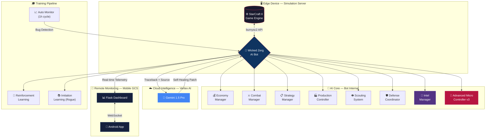

---

## Sim-to-Real Mapping

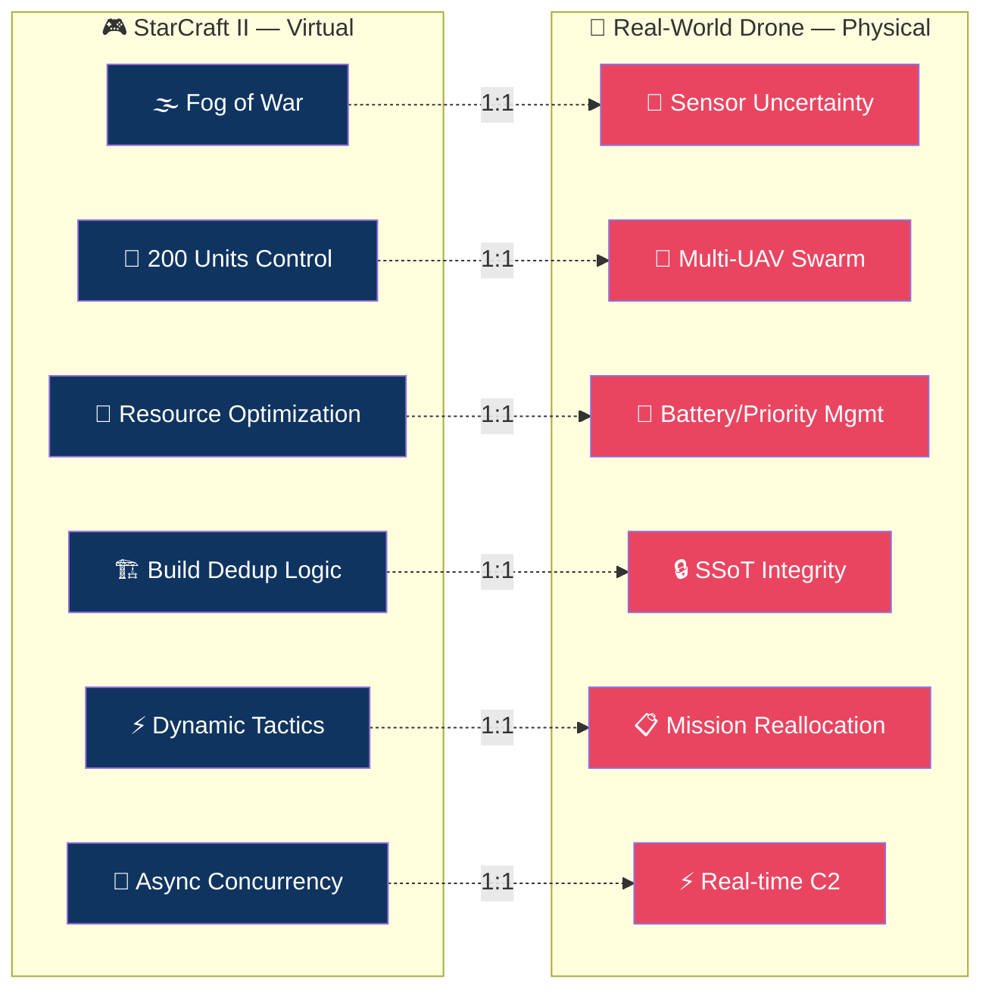

---

## Key Features

### 1) Swarm Reinforcement Learning

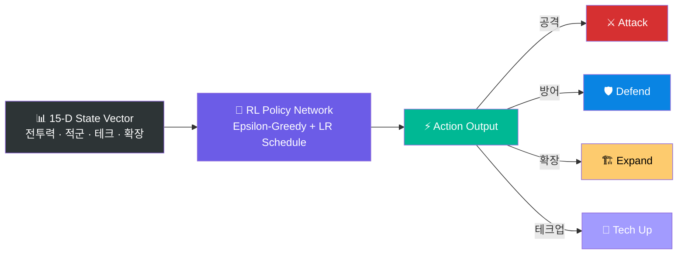

| 항목 | 세부 사항 |
|------|----------|
| 유닛 수 | 200기 저그 유닛 → 드론 군집 모델링 |
| 상태 표현 | **15차원 벡터** (전투력, 적군 규모, 테크, 확장 등) |
| 전략 전환 | Epsilon-Greedy + Learning Rate Scheduling |
| 모방 학습 | 프로게이머 **이병렬(Rogue)** 리플레이 기반 IL |
| 보상 함수 | 전투 승리 + 자원 효율 + 인구 성장 가중치 |

### 2) Gen-AI Self-Healing DevOps

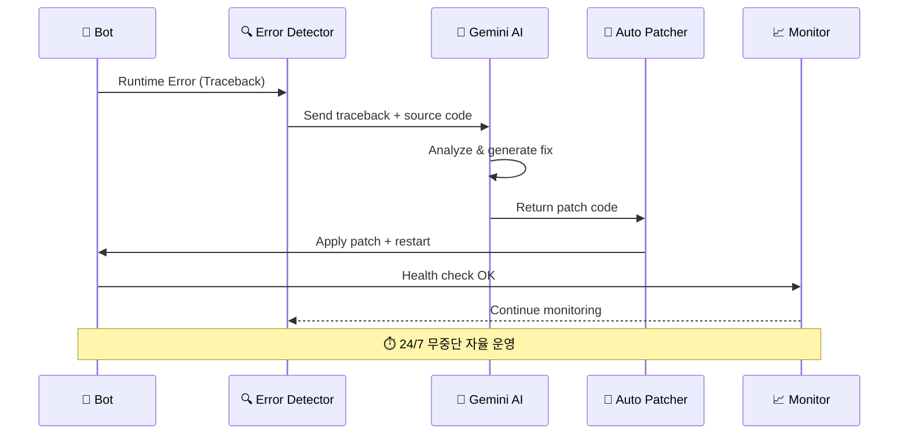

### 3) Mobile Ground Control Station (GCS)

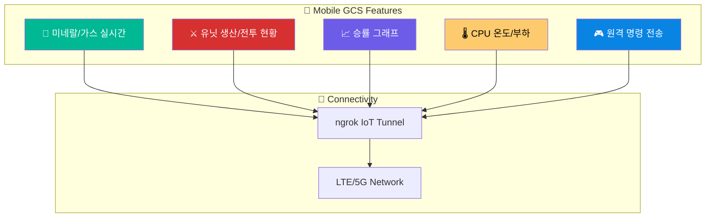

---

## Bot Decision Flow — State Machine

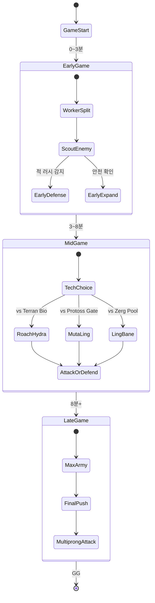

### on_step() 실행 흐름


---

## Combat Micro System

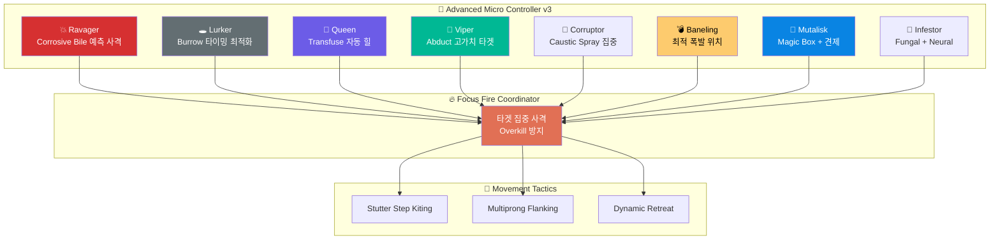

### Counter Unit Matrix

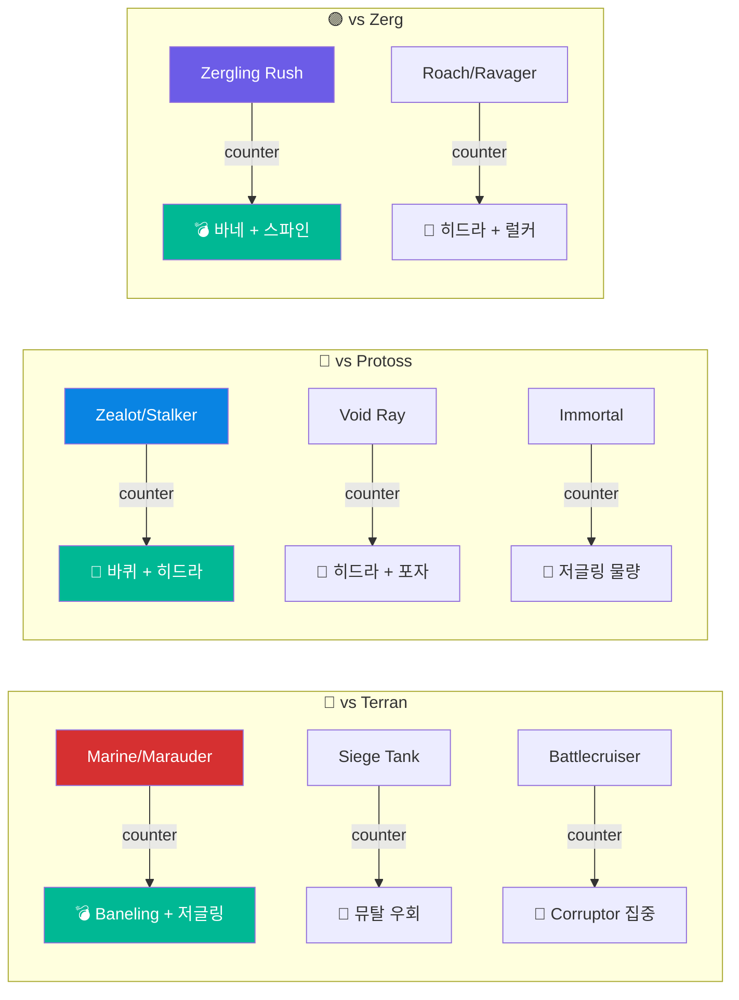

---

## Intel & Scouting Pipeline

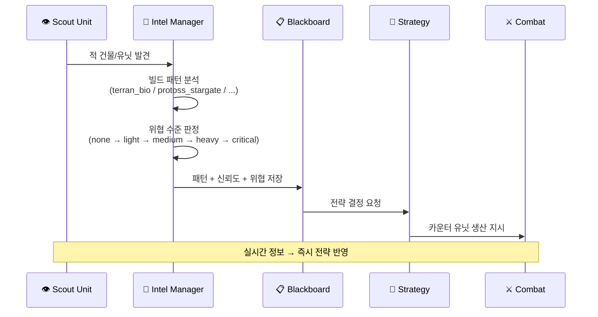

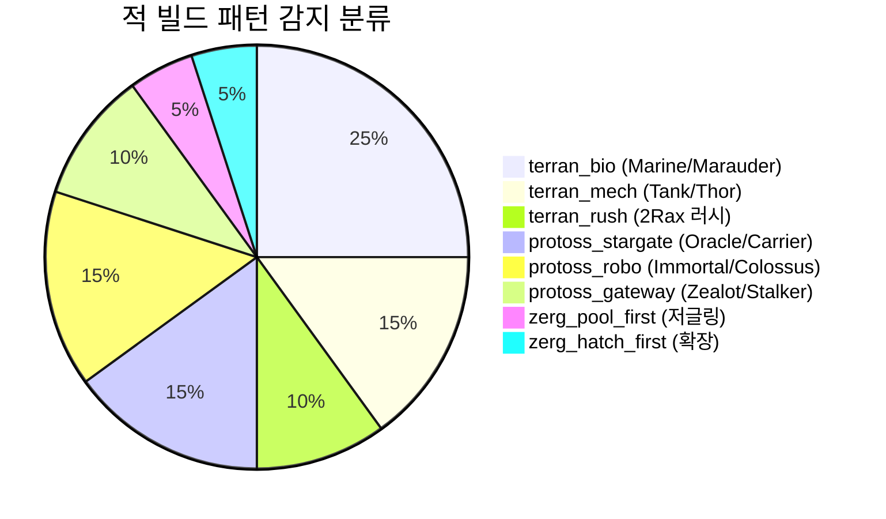

---

## Module Structure — 362 Python Files


---

## Engineering Troubleshooting

### 1) `self.bot.do()` 래핑 누락 → 유닛 명령 불발 해결

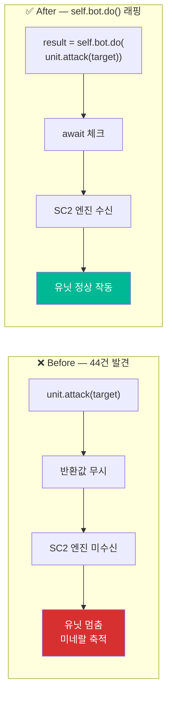

### 2) `.exists` 가드 누락 → 빈 컬렉션 크래시 방지

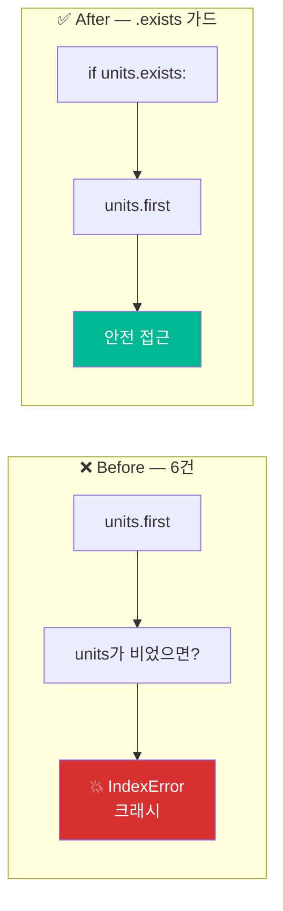

### 3) Division by Zero → health_max 가드

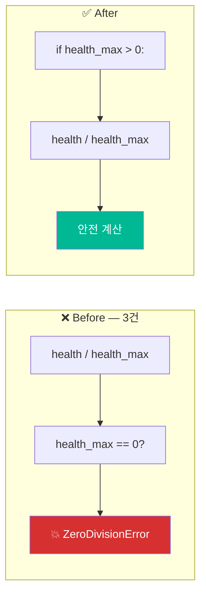

### 4) Race Condition → 중복 건설 0%

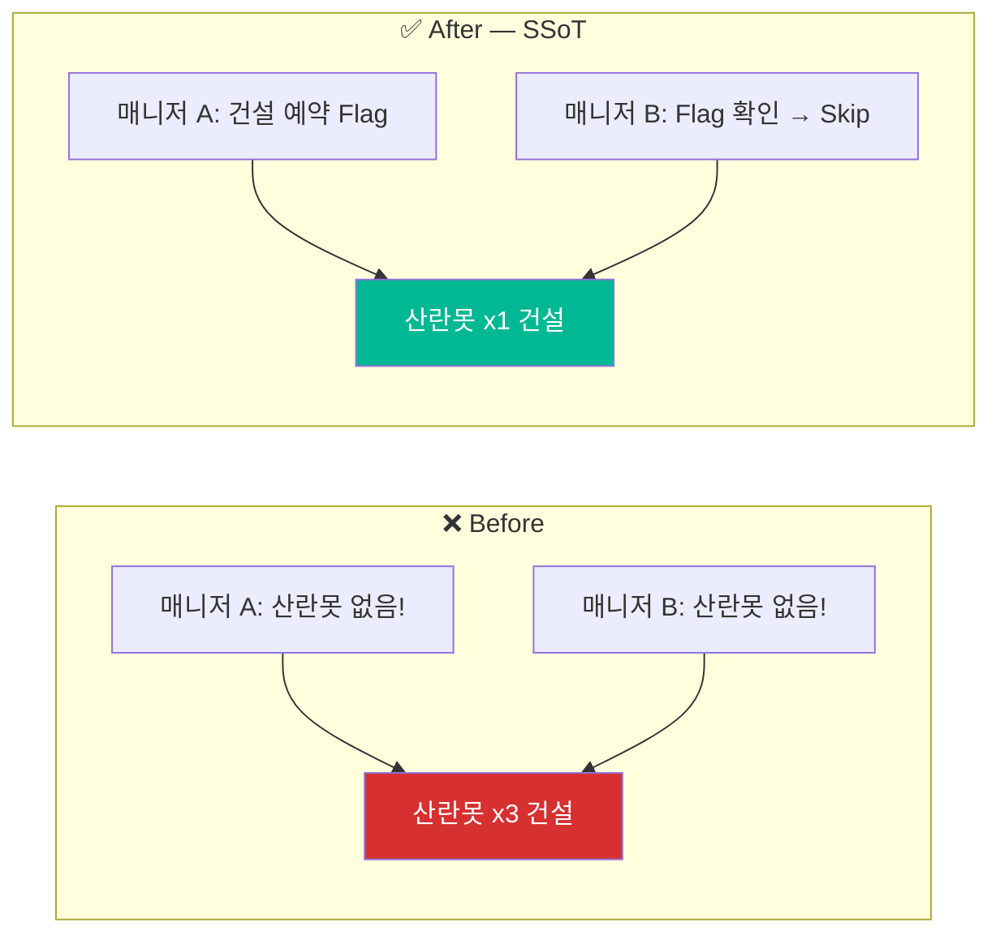

### 5) 미네랄 Overflow → Flush 알고리즘

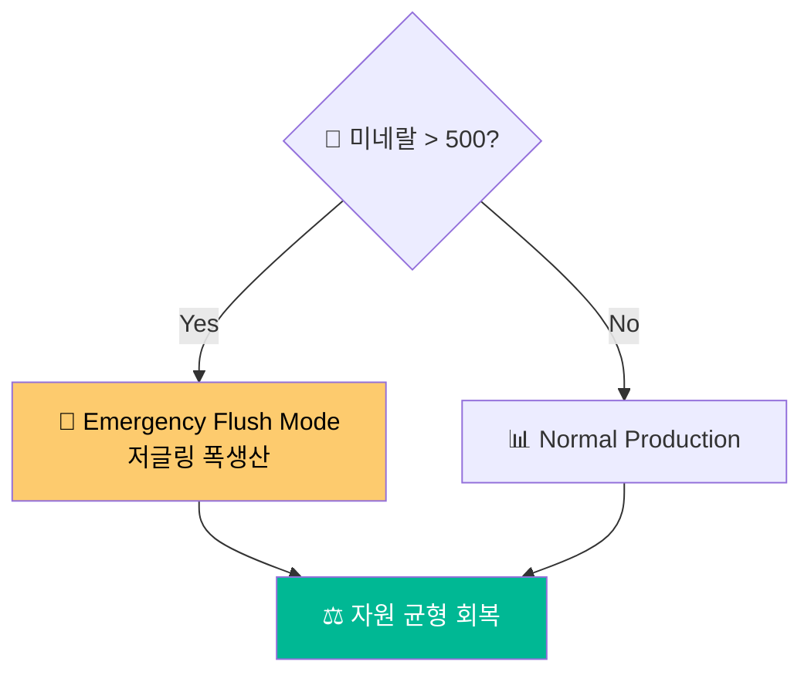

---

## Blackboard Architecture — 공유 상태 관리

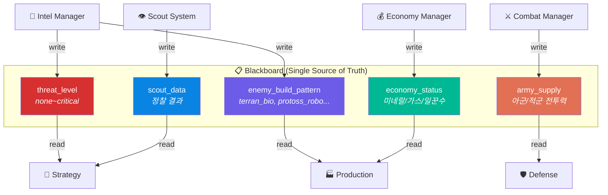

---

## Potential Field Navigation

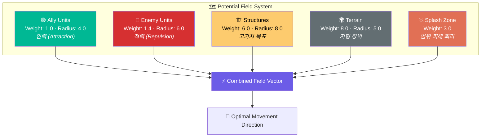

---

## Project Stats

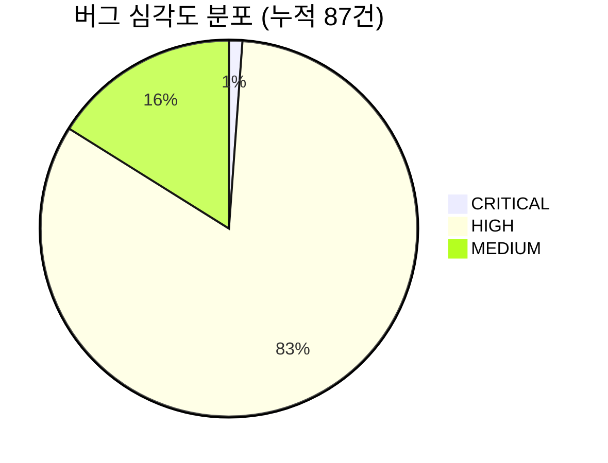

```mermaid
pie title 버그 유형 분포 (87건)
    "self.bot.do() 래핑 누락" : 57
    "빈 컬렉션 .exists 가드" : 10
    "Division by Zero" : 13
    "타입 에러" : 2
    "잘못된 API 구문" : 1
    "로직 에러/충돌" : 4
```

```mermaid
pie title 테스트 결과 (327건)
    "Passed" : 327
    "Skipped" : 0
    "Failed" : 0
```

### Quality Dashboard

| Metric | Value | Status |
|--------|-------|--------|
| Python 파일 수 | 362 | ✅ 전체 구문 검사 통과 |
| 누적 버그 수정 | 87건 (8 세션) | ✅ CRITICAL 0건 잔존 |
| 테스트 스위트 | 327 passed / 0 failed | ✅ 100% 통과 |
| 빌드오더 | 9개 | ✅ Roach Rush, 12Pool 등 |
| 종족 대응 비율 | 4개 종족 | ✅ Terran, Protoss, Zerg, Random |
| 마이크로 컨트롤러 | 8종 유닛별 전술 | ✅ Ravager, Lurker, Queen, Viper... |
| 자동 모니터링 | 1시간 주기 | ✅ 스케줄 태스크 운영 중 |

### Bug Fix Timeline

```mermaid
gantt
    title 버그 수정 타임라인 (60건)
    dateFormat YYYY-MM-DD
    section Session 1
        4건 수정 (CRITICAL 1, HIGH 2, MEDIUM 1)   :done, s1, 2026-03-25, 1d
    section Session 2
        2건 수정 (HIGH 2)                          :done, s2, 2026-03-25, 1d
    section Session 3
        3건 수정 (HIGH 2, MEDIUM 1)                :done, s3, 2026-03-25, 1d
    section Session 4
        4건 수정 (HIGH 2, MEDIUM 2)                :done, s4, 2026-03-25, 1d
    section Session 5 — Large Scale
        30건 수정 (HIGH 28, MEDIUM 2)              :done, s5, 2026-03-26, 1d
    section Session 6 — Deep Scan
        17건 수정 (HIGH 16, MEDIUM 1)              :done, s6, 2026-03-26, 1d
    section Test Fix
        9건 테스트 수정                             :done, s7, 2026-03-26, 1d
    section Monitoring
        자동 모니터링 운영 중                        :active, mon, 2026-03-26, 7d
```

---

## Build Order Database

```mermaid
graph LR
    subgraph "🏗️ 9 Build Orders"
        direction TB
        BO1["🐜 12 Pool Rush<br/><i>초반 저글링 러시</i>"]
        BO2["🐛 Roach Rush<br/><i>바퀴 타이밍 공격</i>"]
        BO3["🏭 Macro Hatch<br/><i>확장 우선</i>"]
        BO4["🦇 Muta Ling Bane<br/><i>뮤탈 견제 + 바네링</i>"]
        BO5["🐍 Hydra Lurker<br/><i>히드라/럴커 조합</i>"]
        BO6["🐛 Roach Hydra<br/><i>바퀴/히드라 올인</i>"]
        BO7["💣 Baneling Bust<br/><i>바네링 벽파괴</i>"]
        BO8["🔬 Lair Tech<br/><i>레어 테크업 빌드</i>"]
        BO9["⚡ Speed Ling<br/><i>스피드 저글링 물량</i>"]
    end

    BO1 & BO2 & BO7 --> AGGRO["🔴 Aggressive"]
    BO3 & BO8 --> MACRO["🟢 Macro"]
    BO4 & BO5 & BO6 & BO9 --> MID["🟡 Midgame"]

    style AGGRO fill:#d63031,color:#fff
    style MACRO fill:#00b894,color:#fff
    style MID fill:#fdcb6e,color:#000
```

---

## Tech Stack

```mermaid
graph LR
    subgraph "🔧 Language & Runtime"
        PY["🐍 Python 3.10+"]
    end

    subgraph "🧠 AI / ML"
        PT["PyTorch"]
        RL["RL Policy Network"]
        IL["Imitation Learning"]
        RPL["SC2 Replay Mining"]
    end

    subgraph "🎮 Simulation"
        SC2["StarCraft II API"]
        BSC["burnysc2"]
    end

    subgraph "☁️ Cloud / DevOps"
        VTX["Vertex AI"]
        GMN["Gemini 1.5 Pro"]
        SH["Self-Healing Pipeline"]
    end

    subgraph "📱 Frontend / GCS"
        FLK["Flask Dashboard"]
        RCT["TypeScript / React"]
        AND["Android App"]
    end

    subgraph "🧪 QA / CI"
        MON["Auto Monitor (1h)"]
        PYC["py_compile Scan"]
        TST["314+ Tests"]
    end

    PY --> PT & SC2 & FLK & MON

    style PY fill:#3776AB,color:#fff
    style PT fill:#EE4C2C,color:#fff
    style SC2 fill:#FF6600,color:#fff
    style GMN fill:#4285F4,color:#fff
    style RCT fill:#61DAFB,color:#000
```

| Category | Technology |
|----------|-----------|
| **Language** | Python 3.10+ |
| **AI/ML** | PyTorch, RL Policy Network, Imitation Learning, SC2 Replay Mining |
| **Simulation** | StarCraft II API (burnysc2/python-sc2) |
| **DevOps** | Vertex AI (Gemini) Self-Healing Pipeline |
| **GCS** | Flask Dashboard + TypeScript/React + Android App |
| **Algorithms** | Potential-Field Navigation, Async Concurrency Control |
| **CI/QA** | Auto Monitoring (1h cycle), py_compile full scan, 327+ tests, GitHub Actions CI |

---

## Data Flow — Real-time Processing

```mermaid
graph LR
    subgraph "⏱️ Every Game Frame (~22.4 FPS)"
        FRAME["🎮 Game Frame"] --> OBSERVE["👁️ Observe<br/>Units · Resources · Map"]
        OBSERVE --> CACHE["💾 Data Cache<br/>1s TTL"]
        CACHE --> ANALYZE["🔎 Analyze<br/>Threat · Pattern · Income"]
        ANALYZE --> DECIDE["🧠 Decide<br/>Strategy · Targets"]
        DECIDE --> EXECUTE["⚡ Execute<br/>Unit Commands"]
        EXECUTE --> FRAME
    end

    style FRAME fill:#2d3436,color:#fff
    style OBSERVE fill:#0984e3,color:#fff
    style CACHE fill:#636e72,color:#fff
    style ANALYZE fill:#6c5ce7,color:#fff
    style DECIDE fill:#e17055,color:#fff
    style EXECUTE fill:#00b894,color:#fff
```

---

## Career Roadmap

```mermaid
mindmap
  root((Swarm Control<br/>System))
    UAV/UGV
      자율제어 시스템
      군집 알고리즘
      실시간 C2
      경로 계획
    AI/ML
      Multi-Agent RL
      Imitation Learning
      Strategy Planning
      Behavior Tree
    DevOps/MLOps
      Self-Healing Infra
      Auto Training Pipeline
      Monitoring System
      CI/CD Pipeline
    Robotics
      Swarm Navigation
      Sensor Fusion
      Path Planning
      Formation Control
    Defense/Aerospace
      무인체계 군집 전술
      ISR Mission Planning
      Command & Control
      Anti-Swarm Defense
```

이 프로젝트는 아래 분야와 직접 연결됩니다:

- **UAV/UGV 자율제어 시스템** — 군집 드론 실시간 관제
- **방산 무인체계 군집 알고리즘** — Multi-Agent 전술 의사결정
- **AI/ML Engineer** — 강화학습, 모방학습, 멀티에이전트 AI
- **DevOps/MLOps** — Self-Healing Infrastructure, 자동화 파이프라인
- **로봇/자율주행 C2** — Command & Control 시스템 설계
- **방위산업/항공우주** — ISR 임무 계획, 대군집 방어

---

## Project Metrics Summary

```mermaid
xychart-beta
    title "버그 수정 누적 현황"
    x-axis ["S1", "S2", "S3", "S4", "S5", "S6", "Test"]
    y-axis "누적 수정 건수" 0 --> 70
    bar [4, 6, 9, 13, 43, 60, 69]
    line [4, 6, 9, 13, 43, 60, 69]
```

```mermaid
xychart-beta
    title "모듈별 코드 규모"
    x-axis ["Combat", "Economy", "AI/Strategy", "Scouting", "Defense", "Core", "Tests"]
    y-axis "파일 수" 0 --> 80
    bar [65, 30, 45, 20, 25, 40, 35]
```

---

## Contact

<div align="center">

**장선우 (Jang Sun Woo)**

Drone Application Engineering

[](mailto:sun475300@naver.com)
[](https://github.com/sun475300-sudo)

</div>

---

<div align="center">

<sub>Built with Python · StarCraft II API · PyTorch · Gemini AI</sub>

</div>
