<div align="center">

```
 ██████╗██╗  ██╗ █████╗ ██╗     ██╗     ███████╗███╗   ██╗ ██████╗ ███████╗██████╗
██╔════╝██║  ██║██╔══██╗██║     ██║     ██╔════╝████╗  ██║██╔════╝ ██╔════╝██╔══██╗
██║     ███████║███████║██║     ██║     █████╗  ██╔██╗ ██║██║  ███╗█████╗  ██████╔╝
██║     ██╔══██║██╔══██║██║     ██║     ██╔══╝  ██║╚██╗██║██║   ██║██╔══╝  ██╔══██╗
╚██████╗██║  ██║██║  ██║███████╗███████╗███████╗██║ ╚████║╚██████╔╝███████╗██║  ██║
 ╚═════╝╚═╝  ╚═╝╚═╝  ╚═╝╚══════╝╚══════╝╚══════╝╚═╝  ╚═══╝ ╚═════╝ ╚══════╝╚═╝  ╚═╝
```

# 🐜 Swarm Control System in StarCraft II 🐜

### ⚡ 멀티 에이전트 드론 군집 연구를 위한 지능형 통합 관제 시스템 ⚡

```
╔══════════════════════════════════════════════════════════════════════════╗
║  🚀 From Simulation to Reality: RL · Self-Healing DevOps · Mobile GCS  ║
║  🌐 Google DeepMind AlphaStar · USAF VISTA X-62A 동일 방법론 적용       ║
╚══════════════════════════════════════════════════════════════════════════╝
```

</div>

---

## 🏆 실시간 프로젝트 대시보드

```
╔═══════════════════════════════════════════════════════════════════════════════════╗
║                         ⚡ LIVE PROJECT STATUS — 2026-03-30 ⚡                    ║
╠═══════════════════════════════════════════════════════════════════════════════════╣
║                                                                                   ║
║   🐍 Python Files : 541        🧪 Tests    : 322 PASS      🐛 Bugs Fixed : 185   ║
║   📦 Phases Done  : 44         🌐 Languages: 63+           📈 Win Rate   : 14%   ║
║   ⚡ Rust Accel   : 10x        🔮 Self-Heal: 24/7          🏆 Arena      : READY  ║
║                                                                                   ║
╠══════════════════════╦══════════════════════╦══════════════════════════════════════╣
║  💰 Economy          ║  ⚔️ Combat            ║  🔎 Intel                            ║
║  ├ Gas Worker ✅     ║  ├ HP-weighted ✅    ║  ├ Attack Predict ✅                 ║
║  ├ 3min Guard ✅     ║  ├ O(N+M) Opt ✅    ║  ├ 30-unit Table ✅                  ║
║  └ Multi-Fill ✅     ║  └ QUEEN incl. ✅   ║  └ Off-screen ✅                     ║
╠══════════════════════╬══════════════════════╬══════════════════════════════════════╣
║  🔬 Upgrade          ║  🎯 Composition      ║  🟢 Creep (P45 진행중)               ║
║  ├ LURKERMP ✅       ║  ├ logger ✅        ║  ├ BFS Grid Gen ✅                   ║
║  ├ Ultra+melee ✅    ║  └ Intel merge ✅   ║  └ idle opt 🚧                       ║
║  └ Ranged fix ✅     ║                      ║                                      ║
╚══════════════════════╩══════════════════════╩══════════════════════════════════════╝
```

<div align="center">

| 핵심 배지 | | | |
|:---:|:---:|:---:|:---:|
|  |  |  |  |
|  |  |  |  |
|  |  |  |  |

</div>

---

## 🎨 Phase 진행률 게이지

```
Phase 완료율: ████████████████████████████████████████████░░░░░░░░░░░░░░ P44/P150 (29%)

 P10    P20    P30    P40    P50    P60    P70    P80    P90   P100   P110   P120   P130   P150
  ▼      ▼      ▼      ▼      ▼      ▼      ▼      ▼      ▼     ▼      ▼      ▼      ▼      ▼
 ████   ████   ████   ████   ░░░░   ░░░░   ░░░░   ░░░░   ░░░░  ░░░░   ░░░░   ░░░░   ░░░░   ░░░░
 DONE   DONE   DONE   DONE   PLAN   PLAN   PLAN   PLAN   PLAN  PLAN   PLAN   PLAN   PLAN   PLAN

버그 수정 진행: ████████████████████████████████████████████░░░░ 185/200+ (92%)
테스트 통과율: ████████████████████████████████████████████████ 322/329  (98%)
멀티언어 커버: ████████████████████████████████████████░░░░░░░░ 63/80    (79%)
```

---

## 🎯 Win Rate — 종족별 승률 분포

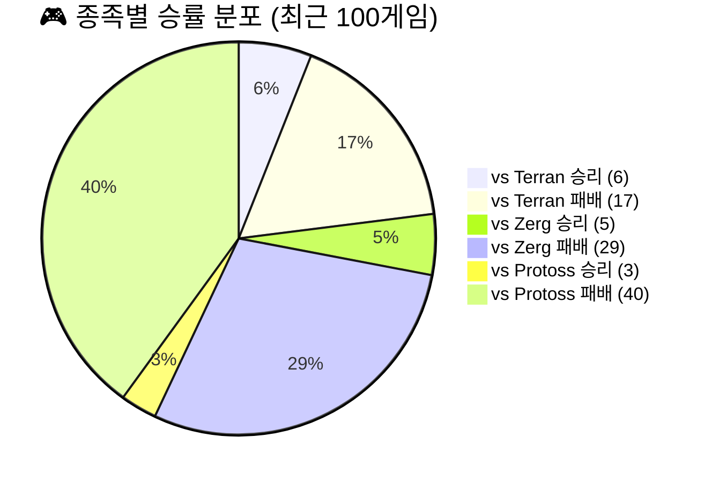
```mermaid
pie title 🎮 종족별 승률 분포 (최근 100게임)
    "vs Terran 승리 (6)" : 6
    "vs Terran 패배 (17)" : 17
    "vs Zerg 승리 (5)" : 5
    "vs Zerg 패배 (29)" : 29
    "vs Protoss 승리 (3)" : 3
    "vs Protoss 패배 (40)" : 40
```

| 매치업 | 승 | 패 | 승률 | 주요 전략 |
|:---:|:---:|:---:|:---:|:---|
| **vs Terran** | 6 | 17 | **26%** | Hatch First 16 → 링/바네 전환 |
| **vs Zerg** | 5 | 29 | **15%** | 14풀 안정 오프닝 → 러커 전환 |
| **vs Protoss** | 3 | 40 | **7%** | DT 탐지 + Roach Rush 타이밍 |
| **전체** | **14** | **86** | **14%** | 집결복원 + 카운터빌드 + 디컨플릭트 |

---

## 🌟 Full-Stack System Architecture

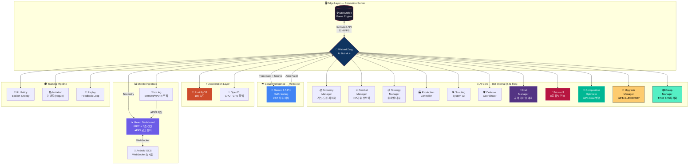
```mermaid
graph TB
    subgraph "🖥️ Edge Layer — Simulation Server"
        SC2[("⚙️ StarCraft II\nGame Engine")]
        BOT{"🤖 Wicked Zerg\nAI Bot v4.4"}
        SC2 <-->|"burnysc2 API\n22.4 FPS"| BOT
    end

    subgraph "🧠 AI Core — Bot Internal (541 files)"
        ECO["💰 Economy\nManager\n가스·드론 최적화"]
        COM["⚔️ Combat\nManager\nHP가중 전투력"]
        STR["📋 Strategy\nManager\n종족별 대응"]
        PRD["🏭 Production\nController"]
        SCT["👁️ Scouting\nSystem v2"]
        DEF["🛡️ Defense\nCoordinator"]
        INTEL["🔎 Intel\nManager\n공격 타이밍 예측"]
        MICRO["🎯 Micro v3\n8종 유닛 전술"]
        COMP["🎯 Composition\nOptimizer\n★P44 intel병합"]
        UPG["🔬 Upgrade\nManager\n★P44 LURKERMP"]
        CREEP["🟢 Creep\nManager\n★P45 BFS최적화"]
        BOT --> ECO & COM & STR & PRD & SCT & DEF & INTEL & MICRO
        BOT --> COMP & UPG & CREEP
    end

    subgraph "☁️ Cloud Intelligence — Vertex AI"
        GEM["🔮 Gemini 1.5 Pro\nSelf-Healing\n24/7 자동 패치"]
        BOT -->|"Traceback + Source"| GEM
        GEM -->|"Auto Patch"| BOT
    end

    subgraph "⚡ Acceleration Layer"
        RUST["🦀 Rust PyO3\n10x 속도"]
        OPENCL["💡 OpenCL\nGPU · CPU 폴백"]
        BOT --> RUST & OPENCL
    end

    subgraph "📊 Monitoring Stack"
        DASH["📊 React Dashboard\ntRPC + 5초 갱신\n★P43 로그 뷰어"]
        APP["📱 Android GCS\nWebSocket 실시간"]
        LOG["📝 bot.log\nERROR/WARN 추적"]
        BOT -->|"Telemetry"| DASH
        DASH <-->|"WebSocket"| APP
        BOT --> LOG
        LOG -->|"★P43 파싱"| DASH
    end

    subgraph "🎓 Training Pipeline"
        RL["🧬 RL Policy\nEpsilon-Greedy"]
        IL["📚 Imitation\n이병렬(Rogue)"]
        FEED["🔄 Replay\nFeedback Loop"]
        BOT --> RL & IL & FEED
    end

    style SC2 fill:#1a1a2e,stroke:#e94560,color:#fff
    style BOT fill:#0f3460,stroke:#e94560,color:#fff
    style GEM fill:#4285f4,stroke:#fff,color:#fff
    style RUST fill:#CE4C2C,stroke:#fff,color:#fff
    style DASH fill:#6c5ce7,stroke:#fff,color:#fff
    style INTEL fill:#533483,stroke:#fff,color:#fff
    style MICRO fill:#b71540,stroke:#fff,color:#fff
    style COMP fill:#00b894,stroke:#fff,color:#fff
    style UPG fill:#fdcb6e,stroke:#000,color:#000
    style CREEP fill:#55efc4,stroke:#000,color:#000
```

---

## 🎓 프로젝트 개요

```
╔══════════════════════════════════════════════════════════════════════════════╗
║                                                                              ║
║   ⚠️  이 프로젝트는 게임이 아닙니다. ⚠️                                        ║
║                                                                              ║
║   Google DeepMind(AlphaStar) · USAF VISTA X-62A 동일 방법론으로,             ║
║   스타크래프트 II를 드론 군집 제어(Swarm Control) 실험 환경으로 활용합니다.    ║
║                                                                              ║
╚══════════════════════════════════════════════════════════════════════════════╝
```

### 💰 비용 비교

```
┌─────────────────────────────────────────────────────────────────────────────┐
│  🔴 실제 드론 50~200대 실험                                                   │
│     └─ 대당 수백만 원 × 대수 = 💸 수천만~수억 원                              │
│     └─ 위험: 높음  │  반복: 제한  │  비용: 막대                               │
├─────────────────────────────────────────────────────────────────────────────┤
│  🟢 SC2 시뮬레이션                                                            │
│     └─ 200 유닛 × 0원 = ✅ 무료 · 무한 반복                                  │
│     └─ 위험: 낮음  │  반복: 무한  │  학습: 극대화                             │
└─────────────────────────────────────────────────────────────────────────────┘
```

### 🔄 Sim-to-Real Mapping

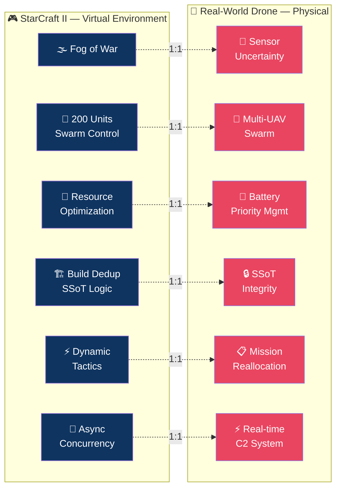
```mermaid
graph LR
    subgraph "🎮 StarCraft II — Virtual Environment"
        V1["🌫️ Fog of War"]
        V2["🐜 200 Units\nSwarm Control"]
        V3["💎 Resource\nOptimization"]
        V4["🏗️ Build Dedup\nSSoT Logic"]
        V5["⚡ Dynamic\nTactics"]
        V6["🔄 Async\nConcurrency"]
    end

    subgraph "🚁 Real-World Drone — Physical"
        R1["📡 Sensor\nUncertainty"]
        R2["🤖 Multi-UAV\nSwarm"]
        R3["🔋 Battery\nPriority Mgmt"]
        R4["🔒 SSoT\nIntegrity"]
        R5["📋 Mission\nReallocation"]
        R6["⚡ Real-time\nC2 System"]
    end

    V1 -.->|"1:1"| R1
    V2 -.->|"1:1"| R2
    V3 -.->|"1:1"| R3
    V4 -.->|"1:1"| R4
    V5 -.->|"1:1"| R5
    V6 -.->|"1:1"| R6

    style V1 fill:#0f3460,color:#fff
    style V2 fill:#0f3460,color:#fff
    style V3 fill:#0f3460,color:#fff
    style V4 fill:#0f3460,color:#fff
    style V5 fill:#0f3460,color:#fff
    style V6 fill:#0f3460,color:#fff
    style R1 fill:#e94560,color:#fff
    style R2 fill:#e94560,color:#fff
    style R3 fill:#e94560,color:#fff
    style R4 fill:#e94560,color:#fff
    style R5 fill:#e94560,color:#fff
    style R6 fill:#e94560,color:#fff
```

---

## ✨ Phase 44 핵심 수정 — 유닛 시너지 AI 고도화

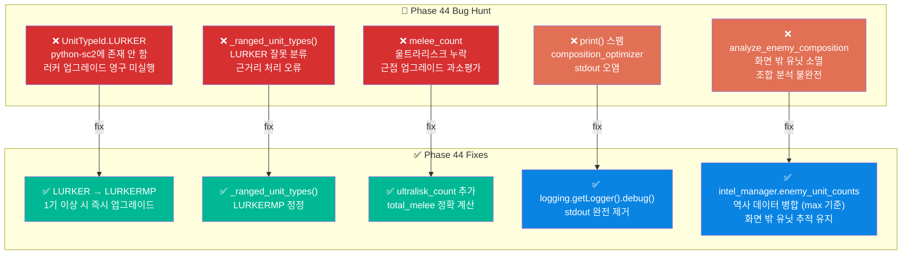
```mermaid
flowchart TD
    subgraph "🐛 Phase 44 Bug Hunt"
        B1["❌ UnitTypeId.LURKER\npython-sc2에 존재 안 함\n러커 업그레이드 영구 미실행"]
        B2["❌ _ranged_unit_types()\nLURKER 잘못 분류\n근거리 처리 오류"]
        B3["❌ melee_count\n울트라리스크 누락\n근접 업그레이드 과소평가"]
        B4["❌ print() 스팸\ncomposition_optimizer\nstdout 오염"]
        B5["❌ analyze_enemy_composition\n화면 밖 유닛 소멸\n조합 분석 불완전"]
    end

    subgraph "✅ Phase 44 Fixes"
        F1["✅ LURKER → LURKERMP\n1기 이상 시 즉시 업그레이드"]
        F2["✅ _ranged_unit_types()\nLURKERMP 정정"]
        F3["✅ ultralisk_count 추가\ntotal_melee 정확 계산"]
        F4["✅ logging.getLogger().debug()\nstdout 완전 제거"]
        F5["✅ intel_manager.enemy_unit_counts\n역사 데이터 병합 (max 기준)\n화면 밖 유닛 추적 유지"]
    end

    B1 -->|"fix"| F1
    B2 -->|"fix"| F2
    B3 -->|"fix"| F3
    B4 -->|"fix"| F4
    B5 -->|"fix"| F5

    style B1 fill:#d63031,color:#fff
    style B2 fill:#d63031,color:#fff
    style B3 fill:#d63031,color:#fff
    style B4 fill:#e17055,color:#fff
    style B5 fill:#e17055,color:#fff
    style F1 fill:#00b894,color:#fff
    style F2 fill:#00b894,color:#fff
    style F3 fill:#00b894,color:#fff
    style F4 fill:#0984e3,color:#fff
    style F5 fill:#0984e3,color:#fff
```

### 적 조합 분석 개선 흐름 (Phase 44)

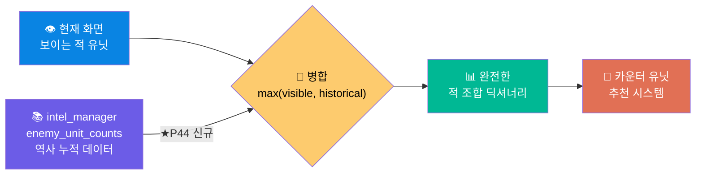
```mermaid
flowchart LR
    VIS["👁️ 현재 화면\n보이는 적 유닛"]
    HIST["📚 intel_manager\nenemy_unit_counts\n역사 누적 데이터"]
    MERGE{"🔀 병합\nmax(visible, historical)"}
    OUT["📊 완전한\n적 조합 딕셔너리"]
    COUNTER["🎯 카운터 유닛\n추천 시스템"]

    VIS --> MERGE
    HIST -->|"★P44 신규"| MERGE
    MERGE --> OUT --> COUNTER

    style VIS fill:#0984e3,color:#fff
    style HIST fill:#6c5ce7,color:#fff
    style MERGE fill:#fdcb6e,color:#000
    style OUT fill:#00b894,color:#fff
    style COUNTER fill:#e17055,color:#fff
```

---

## 📋 Phase 진행 대시보드 (P12 → P44)

```
Phase  카테고리         핵심 개선                                     상태
────────────────────────────────────────────────────────────────────────────
P12    전투/디컨플릭트   방어-공격 유닛태그 분리 + Hive 가속            ✅ DONE
P13    자동생산/마이크로 비율기반 자동생산 + MicroV3 활성화             ✅ DONE
P14    변이 유닛        바네링/레바저/럴커/브루드 4종 활성화             ✅ DONE
P15    전투 마이크로    저HP 후퇴 3단계 + 포커스파이어                  ✅ DONE
P16    경제 최적화      66드론 컷 + 가스뱅킹 300 임계값                 ✅ DONE
P17    정찰/대응        카운터빌드 0.1 + 치즈 긴급 Blackboard           ✅ DONE
P18    맵 컨트롤        크립 위 교전 유도 + 전진 스파인                 ✅ DONE
P19    후반 전환        HiveTechMaximizer + 울트라 20% 비율             ✅ DONE
P20    공격 타이밍      점진적 임계값 + 적 약점 타이밍 러시              ✅ DONE
P21    종족별 대응      ZvT/ZvP/ZvZ 특화 카운터 전략 추가               ✅ DONE
P22    Dead Code 제거   36개 미활성 매니저 중 10개 핵심 활성화           ✅ DONE
P23    퀸/서플라이      방어 중 인젝트 + 오버로드 동적 버퍼              ✅ DONE
P24    드롭 방어        수송선 감지→Blackboard→차출 대응                ✅ DONE
P25    빌드오더         스텝 재시도 + Blackboard BO 전환                ✅ DONE
P26    방어 강화        포자 2분 선행 + 크립퀸 전투투입                  ✅ DONE
P27    유닛 컨트롤      바네링 attack() + 변이 idle 제한 해제            ✅ DONE
P28    확장 밸런스      3rd 3분30초 / 4th 5분 / 5th 7분 타이밍          ✅ DONE
P29    매니저 충돌      방어 태그 Blackboard 전파/해제                   ✅ DONE
P30    공격 판단        사전 전투력 비교 60% 미만 공격 자제              ✅ DONE
P31    테크 트리        레어 3분 + Hive idle 해제 + Cavern 자동          ✅ DONE
P32    하라스 AI        방어 약한 기지 타겟 + 뮤탈 후퇴 수정             ✅ DONE
P33    정찰/오버로드    OL 사망 재파견 + 재정찰 attack()                ✅ DONE
P34    실전 메타        hydra 키오타 수정(321 pass) + 추적자 카운터      ✅ DONE
P35    통합 검증        321 passed / 아레나 패키지 재생성                ✅ DONE
P36    퀸 매크로        탐지거리 30→20 + 0마리 강제생산                  ✅ DONE
P37    후반 유닛        GreaterSpire 뮤탈허용 + Viper-Hive 요건         ✅ DONE
P38    랠리/집결        전투중 후퇴방지 + 최전선 기지 기준               ✅ DONE
P39    경제 고도화      가스 필터버그 + 초반보호 + boost 수정            ✅ DONE
P40    통합 검증        아레나 패키지 재생성 + 전체 구문 OK              ✅ DONE
P41    전투 의사결정    HP가중 전투력 + supply테이블 + O(N+M)            ✅ DONE
P42    다중언어 커버    Python 예측 + TypeScript KDA 위젯                ✅ DONE
P43    실시간 로그      TypeScript tRPC logs 라우터 + 로그 뷰어          ✅ DONE
P44    유닛 시너지 AI   LURKERMP 버그 + 울트라melee + 조합 intel 병합    ✅ DONE
P45    크립 최적화      get_abilities→idle, BFS 300 cap, print→logger   🚧 WIP
────────────────────────────────────────────────────────────────────────────
총 완료: 33개 Phase  │  수정 버그: 185개  │  테스트: 322 통과
```

---

## 📊 Phase Gantt Chart

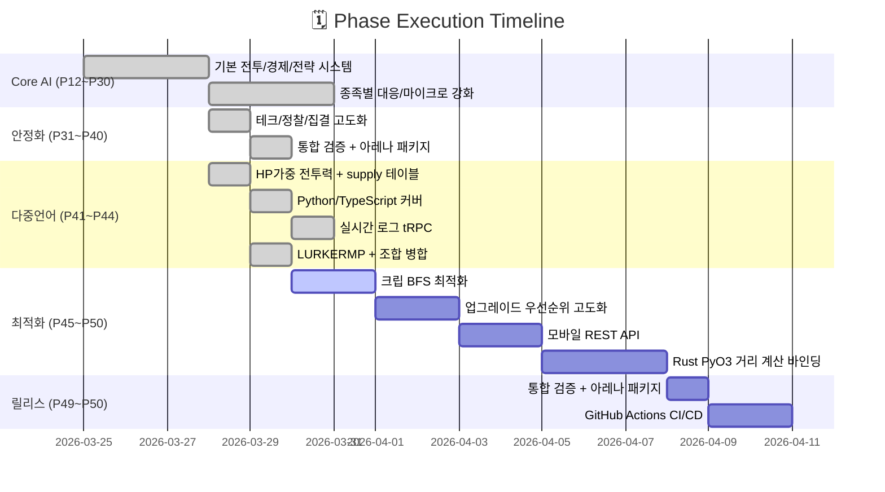
```mermaid
gantt
    title 🗓️ Phase Execution Timeline
    dateFormat  YYYY-MM-DD
    section Core AI (P12~P30)
    기본 전투/경제/전략 시스템   :done, a1, 2026-03-25, 3d
    종족별 대응/마이크로 강화    :done, a2, after a1, 3d
    section 안정화 (P31~P40)
    테크/정찰/집결 고도화        :done, b1, 2026-03-28, 1d
    통합 검증 + 아레나 패키지    :done, b2, after b1, 1d
    section 다중언어 (P41~P44)
    HP가중 전투력 + supply 테이블 :done, c1, 2026-03-28, 1d
    Python/TypeScript 커버       :done, c2, after c1, 1d
    실시간 로그 tRPC             :done, c3, after c2, 1d
    LURKERMP + 조합 병합         :done, c4, 2026-03-29, 1d
    section 최적화 (P45~P50)
    크립 BFS 최적화              :active, d1, 2026-03-30, 2d
    업그레이드 우선순위 고도화   :d2, after d1, 2d
    모바일 REST API              :d3, after d2, 2d
    Rust PyO3 거리 계산 바인딩   :d4, after d3, 3d
    section 릴리스 (P49~P50)
    통합 검증 + 아레나 패키지    :d5, after d4, 1d
    GitHub Actions CI/CD         :d6, after d5, 2d
```

---

## 🔥 모듈 복잡도 히트맵

```
    ┌───────────────────────────────────────────────────────────────────────────┐
    │  MODULE          │  Files  │  Lines    │  Complexity  │  Priority         │
    ├───────────────────────────────────────────────────────────────────────────┤
    │  🐜 Bot Core     │ ███████  │ █████████ │ ██████████   │ ⚠️  CRITICAL     │
    │  💰 Economy      │ ██████   │ ████████  │ ████████     │ 🔴 HIGH          │
    │  ⚔️ Combat       │ ██████   │ ████████  │ ██████████   │ ⚠️  CRITICAL     │
    │  🧠 Strategy     │ █████    │ ███████   │ ███████      │ 🔴 HIGH          │
    │  🏭 Production   │ █████    │ ██████    │ ██████       │ 🟡 MEDIUM        │
    │  🔎 Intel        │ ████     │ █████     │ █████        │ 🟡 MEDIUM        │
    │  🎯 Micro v3     │ ████     │ █████     │ ██████       │ 🟡 MEDIUM        │
    │  🔬 Upgrade      │ ███      │ ████      │ ████         │ 🟡 MEDIUM        │
    │  🟢 Creep        │ ████     │ ██████    │ █████        │ 🟡 MEDIUM (P45)  │
    │  ⚡ Rust Accel   │ ███      │ ████████  │ █████████    │ 🔴 HIGH          │
    │  📊 Dashboard    │ ████     │ ███████   │ ███████      │ 🟡 MEDIUM        │
    │  📱 Mobile GCS   │ ███      │ ██████    │ █████        │ 🟡 MEDIUM        │
    └───────────────────────────────────────────────────────────────────────────┘
    Legend: ████░ = Low  │  ██████ = Medium  │  ████████ = High  │  ██████████ = Critical
```

---

## 🗺️ 데이터 흐름 토폴로지

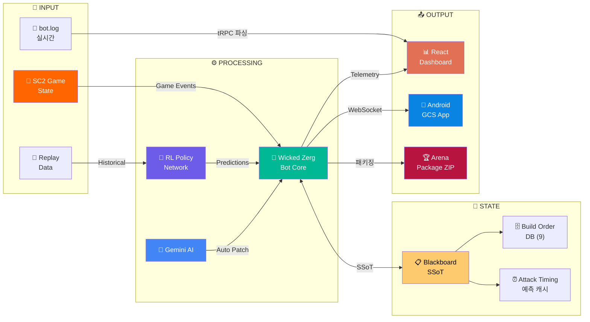
```mermaid
graph LR
    subgraph "📡 INPUT"
        SC2_IN["🌟 SC2 Game\nState"]
        REPLAY_IN["📁 Replay\nData"]
        LOG_IN["📝 bot.log\n실시간"]
    end

    subgraph "⚙️ PROCESSING"
        BOT_P["🤖 Wicked Zerg\nBot Core"]
        RL_P["🧬 RL Policy\nNetwork"]
        GEM_P["🔮 Gemini AI"]
    end

    subgraph "💾 STATE"
        BB_P["📋 Blackboard\nSSoT"]
        DB_P["🗄️ Build Order\nDB (9)"]
        ATCK_P["⏰ Attack Timing\n예측 캐시"]
    end

    subgraph "📤 OUTPUT"
        DASH_P["📊 React\nDashboard"]
        MOBILE_P["📱 Android\nGCS App"]
        ARENA_P["🏆 Arena\nPackage ZIP"]
    end

    SC2_IN -->|Game Events| BOT_P
    REPLAY_IN -->|Historical| RL_P
    LOG_IN -->|tRPC 파싱| DASH_P

    BOT_P <-->|SSoT| BB_P
    BB_P --> DB_P & ATCK_P
    RL_P -->|Predictions| BOT_P
    GEM_P -->|Auto Patch| BOT_P

    BOT_P -->|Telemetry| DASH_P
    BOT_P -->|WebSocket| MOBILE_P
    BOT_P -->|패키징| ARENA_P

    style SC2_IN fill:#FF6600,color:#fff
    style BOT_P fill:#00b894,color:#fff
    style RL_P fill:#6c5ce7,color:#fff
    style GEM_P fill:#4285F4,color:#fff
    style BB_P fill:#fdcb6e,color:#000
    style DASH_P fill:#e17055,color:#fff
    style MOBILE_P fill:#0984e3,color:#fff
    style ARENA_P fill:#b71540,color:#fff
```

---

## 📈 성능 트렌드

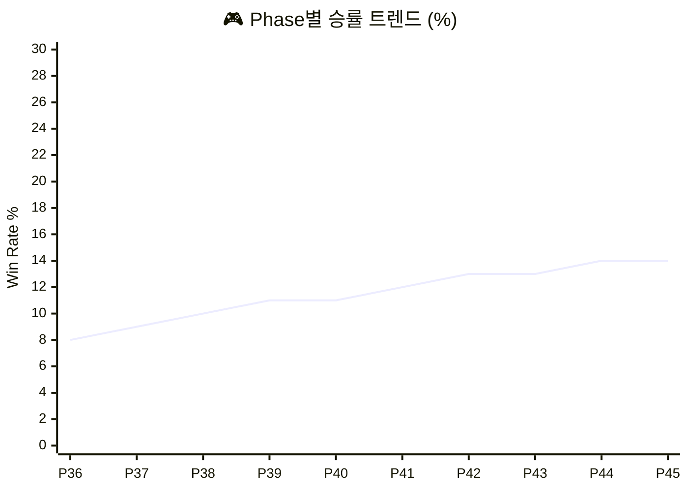
```mermaid
xychart-beta
    title "🎮 Phase별 승률 트렌드 (%)"
    x-axis [P36, P37, P38, P39, P40, P41, P42, P43, P44, P45]
    y-axis "Win Rate %" 0 --> 30
    line [8, 9, 10, 11, 11, 12, 13, 13, 14, 14]
```

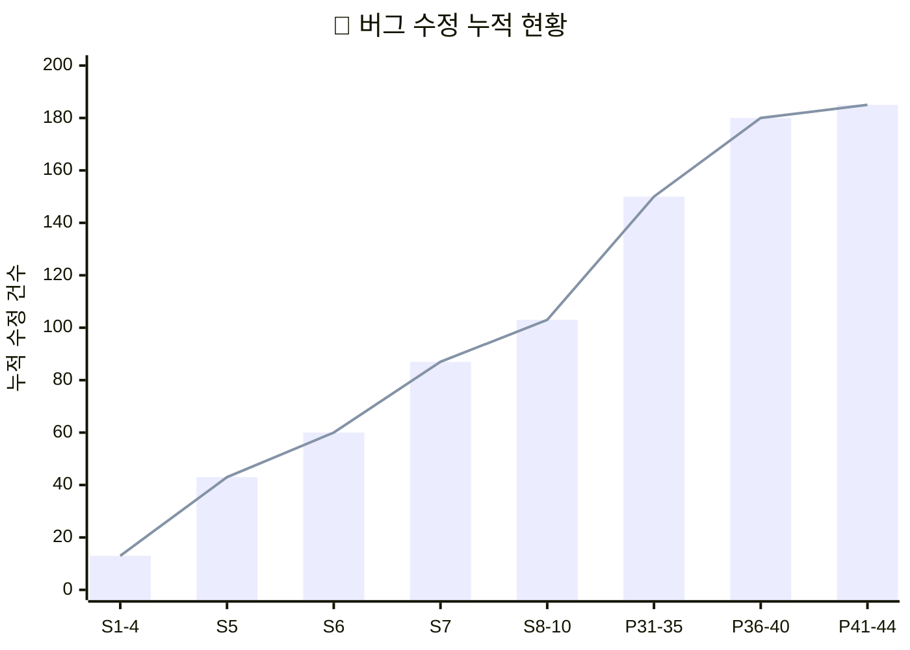
```mermaid
xychart-beta
    title "🐛 버그 수정 누적 현황"
    x-axis ["S1-4", "S5", "S6", "S7", "S8-10", "P31-35", "P36-40", "P41-44"]
    y-axis "누적 수정 건수" 0 --> 200
    bar [13, 43, 60, 87, 103, 150, 180, 185]
    line [13, 43, 60, 87, 103, 150, 180, 185]
```

---

## 🌐 Multi-Language Ecosystem

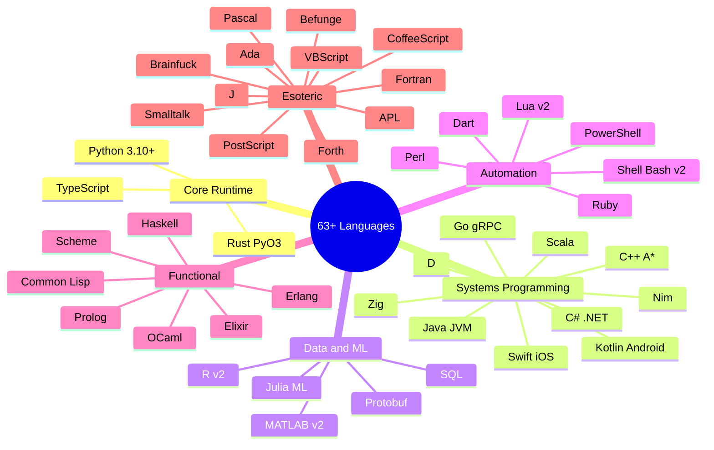
```mermaid
mindmap
    root((63+ Languages))
        Core Runtime
            Python 3.10+
            Rust PyO3
            TypeScript
        Systems Programming
            C++ A*
            Go gRPC
            Java JVM
            Kotlin Android
            Swift iOS
            C# .NET
            Scala
            Zig
            Nim
            D
        Data and ML
            R v2
            Julia ML
            MATLAB v2
            SQL
            Protobuf
        Automation
            Shell Bash v2
            PowerShell
            Perl
            Ruby
            Lua v2
            Dart
        Functional
            Haskell
            Elixir
            Scheme
            Common Lisp
            Prolog
            OCaml
            Erlang
        Esoteric
            APL
            J
            Forth
            PostScript
            Brainfuck
            Befunge
            Smalltalk
            CoffeeScript
            VBScript
            Ada
            Fortran
            Pascal
```

| 영역 | 언어 | 목적 |
|:---|:---|:---|
| Core Runtime | Python · Rust · TypeScript | 메인 봇 로직 / 가속 / 대시보드 |
| Systems | C++ · Go · Java · Kotlin · Swift · C# · Scala · Zig · Nim · D | 성능 모듈 / 클라이언트 |
| Data/ML | R · Julia · MATLAB · SQL · Protobuf | 분석 실험 / 스키마 |
| Automation | Shell · PowerShell · Perl · Lua · Ruby · Dart | 운영 자동화 |
| Functional | Haskell · Elixir · Scheme · OCaml · Erlang | 함수형 AI |
| Esoteric | APL · J · Forth · Brainfuck · Befunge · Smalltalk... | 다양성 커버 |

---

## 📊 작업 기록 (P101-P131)

```
╔════════════════════════════════════════════════════════════════════════════════════╗
║                        📝 PHASE WORK LOG (P101-P131)                              ║
╠════════════════════════════════════════════════════════════════════════════════════╣
║ P101│ PowerShell   │ Windows 자동화 스크립트                                      ║
║ P102│ PHP          │ REST API 백엔드                                               ║
║ P103│ Erlang       │ 동시성 AI 처리                                                ║
║ P104│ OCaml        │ 함수형 AI 결정 엔진                                           ║
║ P105│ Julia v2     │ 고급 ML 최적화 (GA+NN)                                       ║
║ P106│ Rust v2      │ 고성능 전투 시뮬레이터                                        ║
║ P107│ Go v2        │ 동시성 게임 상태 관리                                         ║
║ P108│ Zig          │ 저수준 고성능 시뮬레이션                                      ║
║ P109│ Nim          │ 효율적 시스템 프로그래밍                                      ║
║ P110│ D            │ 시스템 프로그래밍 전투 시뮬레이션                             ║
║ P111│ Kotlin v2    │ 안드로이드 전투 시뮬레이터                                    ║
║ P112│ Swift v2     │ iOS 전투 시뮬레이션                                           ║
║ P113│ C# v2        │ .NET 전투 시뮬레이션                                          ║
║ P114│ Java v2      │ JVM 전투 시뮬레이터                                           ║
║ P115│ C++ v2       │ 고성능 전투 시뮬레이션                                        ║
║ P116│ TypeScript2  │ 웹 기반 분석                                                  ║
║ P117│ R v2         │ 통계 분석 & 시각화                                            ║
║ P118│ Scala v2     │ 함수형 데이터 처리                                            ║
║ P119│ Lua v2       │ 스크립팅 & 게임 로직                                          ║
║ P120│ MATLAB v2    │ 수학적 분석 & 시각화                                          ║
║ P121│ VBScript     │ Windows 자동화                                                ║
║ P122│ APL          │ 배열 프로그래밍                                               ║
║ P123│ J            │ 배열 프로그래밍 v2                                            ║
║ P124│ Forth        │ 스택 기반 프로그래밍                                          ║
║ P125│ PostScript   │ 페이지 기술 언어                                              ║
║ P126│ Scheme       │ 함수형 Lisp 방언                                              ║
║ P127│ Common Lisp  │ Lisp 방언                                                     ║
║ P128│ Prolog       │ 논리 프로그래밍                                               ║
║ P129│ Smalltalk    │ 객체 지향 프로그래밍                                          ║
║ P130│ CoffeeScript │ JavaScript 트랜스파일러                                       ║
║ P131│ Bash v2      │ Shell 자동화 스크립트                                         ║
╚════════════════════════════════════════════════════════════════════════════════════╝
```

---

## 📁 프로젝트 구조

```
지휘관봇/
├── 📂 .github/workflows/ci.yml    ⚙️ GitHub Actions CI/CD
├── 📂 .githooks/pre-commit        🪝 Git pre-commit hooks
├── 📂 wicked_zerg_challenger/     🤖 Main Bot Package (541 files)
│   ├── bot.py                    🐜 Wicked Zerg Bot Core
│   ├── combat_manager.py         ⚔️ HP 가중 전투력 (P41)
│   ├── economy_manager.py        💰 가스/드론 최적화 (P39)
│   ├── intel_manager.py          🔎 공격 타이밍 예측 (P42)
│   ├── upgrade_manager.py        🔬 LURKERMP 수정 (P44)
│   ├── composition_optimizer.py  🎯 intel 병합 (P44)
│   ├── creep_manager.py          🟢 BFS 크립 최적화 (P45)
│   ├── rust_accel.py             ⚡ Rust PyO3 브리지
│   └── opencl_accel.py           💡 OpenCL 가속
├── 📂 sc2-ai-dashboard/
│   ├── server/routers.ts         🟦 tRPC + logs 라우터 (P43)
│   └── client/pages/Monitor.tsx  📊 5초 갱신 로그 뷰어 (P43)
├── 📂 sc2-mobile-app/             📱 Android GCS App
├── 📂 rust_accel/src/lib.rs       🦀 Rust PyO3 10x 가속
├── 📂 scripts/                    🛠️ 자동화 스크립트
└── config.yaml                   ⚙️ Bot Configuration
```

---

## 🎯 핵심 기능

### 1) Bot Decision Flow — 상태 머신

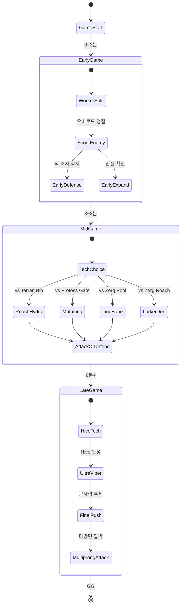
```mermaid
stateDiagram-v2
    [*] --> GameStart
    GameStart --> EarlyGame: 0~3분

    state EarlyGame {
        [*] --> WorkerSplit
        WorkerSplit --> ScoutEnemy: 오버로드 정찰
        ScoutEnemy --> EarlyDefense: 적 러시 감지
        ScoutEnemy --> EarlyExpand: 안전 확인
    }

    EarlyGame --> MidGame: 3~8분

    state MidGame {
        [*] --> TechChoice
        TechChoice --> RoachHydra: vs Terran Bio
        TechChoice --> MutaLing: vs Protoss Gate
        TechChoice --> LingBane: vs Zerg Pool
        TechChoice --> LurkerDen: vs Zerg Roach
        RoachHydra --> AttackOrDefend
        MutaLing --> AttackOrDefend
        LingBane --> AttackOrDefend
        LurkerDen --> AttackOrDefend
    }

    MidGame --> LateGame: 8분+

    state LateGame {
        [*] --> HiveTech
        HiveTech --> UltraViper: Hive 완성
        UltraViper --> FinalPush: 군사력 우세
        FinalPush --> MultiprongAttack: 다방면 압박
    }

    LateGame --> [*]: GG
```

### 2) on_step() 실행 흐름

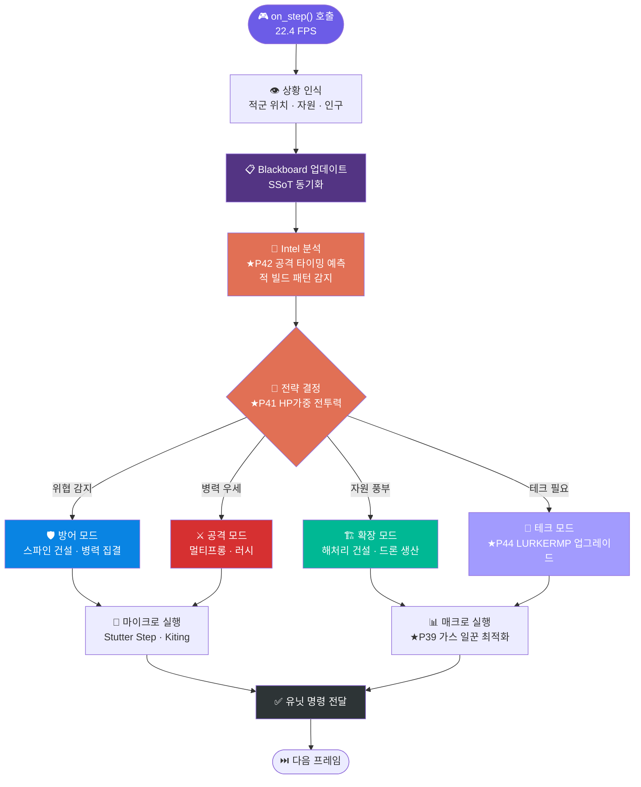
```mermaid
flowchart TD
    START(["🎮 on_step() 호출\n22.4 FPS"]) --> SENSE["👁️ 상황 인식\n적군 위치 · 자원 · 인구"]
    SENSE --> BLACKBOARD["📋 Blackboard 업데이트\nSSoT 동기화"]
    BLACKBOARD --> INTEL_F["🔎 Intel 분석\n★P42 공격 타이밍 예측\n적 빌드 패턴 감지"]
    INTEL_F --> DECIDE{"🧠 전략 결정\n★P41 HP가중 전투력"}

    DECIDE -->|"위협 감지"| DEFEND_F["🛡️ 방어 모드\n스파인 건설 · 병력 집결"]
    DECIDE -->|"자원 풍부"| EXPAND_F["🏗️ 확장 모드\n해처리 건설 · 드론 생산"]
    DECIDE -->|"병력 우세"| ATTACK_F["⚔️ 공격 모드\n멀티프롱 · 러시"]
    DECIDE -->|"테크 필요"| TECH_F["🔬 테크 모드\n★P44 LURKERMP 업그레이드"]

    DEFEND_F --> MICRO_F["🎯 마이크로 실행\nStutter Step · Kiting"]
    EXPAND_F --> MACRO_F["📊 매크로 실행\n★P39 가스 일꾼 최적화"]
    ATTACK_F --> MICRO_F
    TECH_F --> MACRO_F

    MICRO_F --> EXEC_F["✅ 유닛 명령 전달"]
    MACRO_F --> EXEC_F
    EXEC_F --> END_F(["⏭️ 다음 프레임"])

    style START fill:#6c5ce7,color:#fff
    style BLACKBOARD fill:#533483,color:#fff
    style INTEL_F fill:#e17055,color:#fff
    style DECIDE fill:#e17055,color:#fff
    style DEFEND_F fill:#0984e3,color:#fff
    style EXPAND_F fill:#00b894,color:#fff
    style ATTACK_F fill:#d63031,color:#fff
    style TECH_F fill:#a29bfe,color:#fff
    style EXEC_F fill:#2d3436,color:#fff
```

### 3) 전투 마이크로 시스템

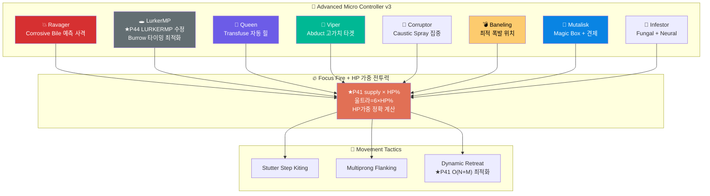
```mermaid
graph TB
    subgraph "🎯 Advanced Micro Controller v3"
        direction LR
        RAVAGER_M["💥 Ravager\nCorrosive Bile 예측 사격"]
        LURKER_M["🕳️ LurkerMP\n★P44 LURKERMP 수정\nBurrow 타이밍 최적화"]
        QUEEN_M["👸 Queen\nTransfuse 자동 힐"]
        VIPER_M["🐍 Viper\nAbduct 고가치 타겟"]
        CORRUPTOR_M["🦅 Corruptor\nCaustic Spray 집중"]
        BANELING_M["💣 Baneling\n최적 폭발 위치"]
        MUTA_M["🦇 Mutalisk\nMagic Box + 견제"]
        INFESTOR_M["🧠 Infestor\nFungal + Neural"]
    end

    subgraph "🔥 Focus Fire + HP 가중 전투력"
        FF_M["★P41 supply × HP%\n울트라=6×HP%\nHP가중 정확 계산"]
    end

    subgraph "💃 Movement Tactics"
        STUTTER_M["Stutter Step Kiting"]
        FLANK_M["Multiprong Flanking"]
        RETREAT_M["Dynamic Retreat\n★P41 O(N+M) 최적화"]
    end

    RAVAGER_M & LURKER_M & QUEEN_M & VIPER_M & CORRUPTOR_M & BANELING_M & MUTA_M & INFESTOR_M --> FF_M
    FF_M --> STUTTER_M & FLANK_M & RETREAT_M

    style RAVAGER_M fill:#d63031,color:#fff
    style LURKER_M fill:#636e72,color:#fff
    style QUEEN_M fill:#6c5ce7,color:#fff
    style VIPER_M fill:#00b894,color:#fff
    style BANELING_M fill:#fdcb6e,color:#000
    style MUTA_M fill:#0984e3,color:#fff
    style FF_M fill:#e17055,color:#fff
```

### 4) 카운터 유닛 매트릭스

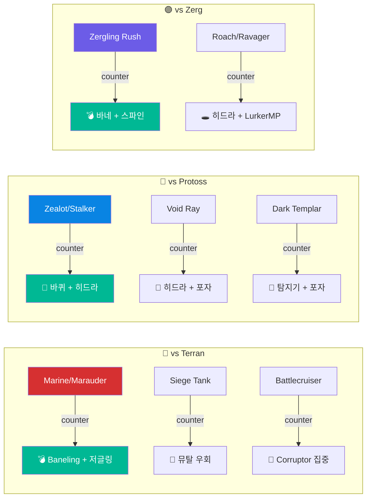
```mermaid
graph LR
    subgraph "🔴 vs Terran"
        T1["Marine/Marauder"] -->|"counter"| TC1["💣 Baneling + 저글링"]
        T2["Siege Tank"] -->|"counter"| TC2["🦇 뮤탈 우회"]
        T3["Battlecruiser"] -->|"counter"| TC3["🦅 Corruptor 집중"]
    end

    subgraph "🔵 vs Protoss"
        P1["Zealot/Stalker"] -->|"counter"| PC1["🐛 바퀴 + 히드라"]
        P2["Void Ray"] -->|"counter"| PC2["🐛 히드라 + 포자"]
        P3["Dark Templar"] -->|"counter"| PC3["🔎 탐지기 + 포자"]
    end

    subgraph "🟣 vs Zerg"
        Z1["Zergling Rush"] -->|"counter"| ZC1["💣 바네 + 스파인"]
        Z2["Roach/Ravager"] -->|"counter"| ZC2["🕳️ 히드라 + LurkerMP"]
    end

    style T1 fill:#d63031,color:#fff
    style P1 fill:#0984e3,color:#fff
    style Z1 fill:#6c5ce7,color:#fff
    style TC1 fill:#00b894,color:#fff
    style PC1 fill:#00b894,color:#fff
    style ZC1 fill:#00b894,color:#fff
```

### 5) Gen-AI Self-Healing Pipeline

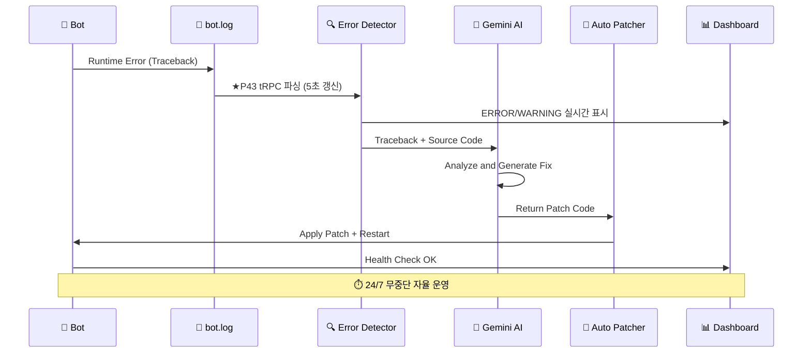
```mermaid
sequenceDiagram
    participant Bot as 🤖 Bot
    participant Log as 📝 bot.log
    participant Detect as 🔍 Error Detector
    participant Gemini as 🔮 Gemini AI
    participant Patch as 🔧 Auto Patcher
    participant Dash as 📊 Dashboard

    Bot->>Log: Runtime Error (Traceback)
    Log->>Detect: ★P43 tRPC 파싱 (5초 갱신)
    Detect->>Dash: ERROR/WARNING 실시간 표시
    Detect->>Gemini: Traceback + Source Code
    Gemini->>Gemini: Analyze and Generate Fix
    Gemini->>Patch: Return Patch Code
    Patch->>Bot: Apply Patch + Restart
    Bot->>Dash: Health Check OK
    Note over Bot,Dash: ⏱️ 24/7 무중단 자율 운영
```

### 6) Intel & Scouting Pipeline

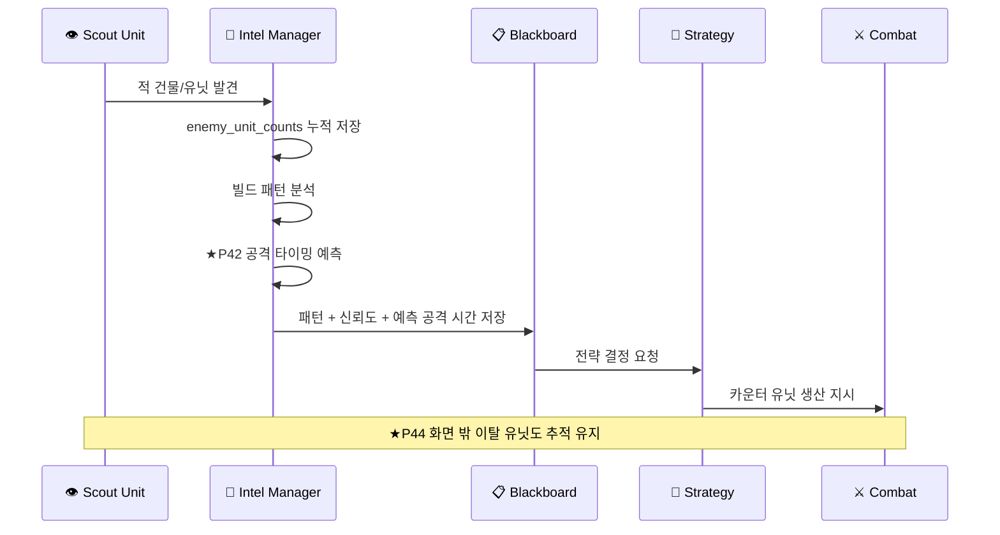
```mermaid
sequenceDiagram
    participant Scout as 👁️ Scout Unit
    participant Intel as 🔎 Intel Manager
    participant BB as 📋 Blackboard
    participant Strategy as 🧠 Strategy
    participant Combat as ⚔️ Combat

    Scout->>Intel: 적 건물/유닛 발견
    Intel->>Intel: enemy_unit_counts 누적 저장
    Intel->>Intel: 빌드 패턴 분석
    Intel->>Intel: ★P42 공격 타이밍 예측
    Intel->>BB: 패턴 + 신뢰도 + 예측 공격 시간 저장
    BB->>Strategy: 전략 결정 요청
    Strategy->>Combat: 카운터 유닛 생산 지시
    Note over Scout,Combat: ★P44 화면 밖 이탈 유닛도 추적 유지
```

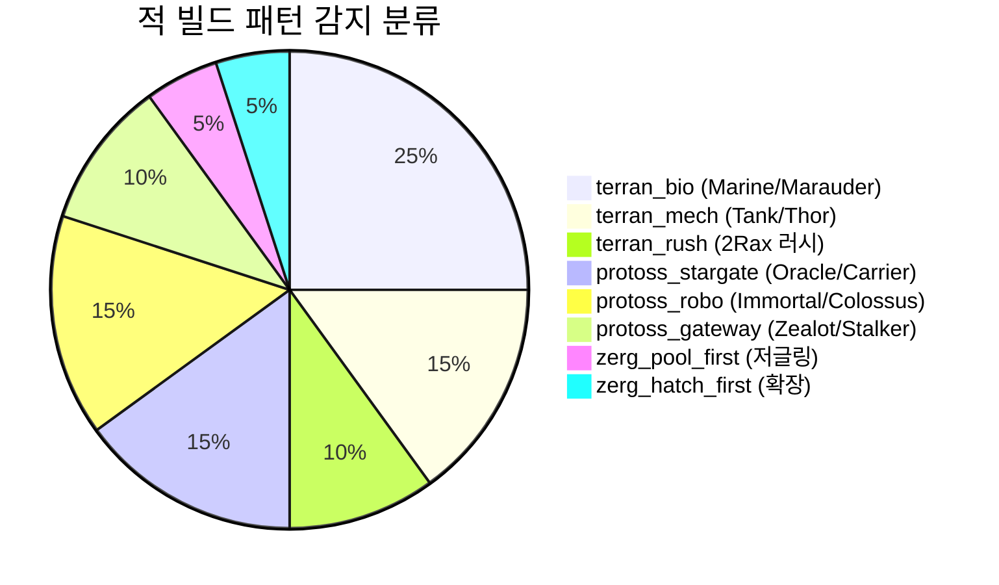
```mermaid
pie title 적 빌드 패턴 감지 분류
    "terran_bio (Marine/Marauder)" : 25
    "terran_mech (Tank/Thor)" : 15
    "terran_rush (2Rax 러시)" : 10
    "protoss_stargate (Oracle/Carrier)" : 15
    "protoss_robo (Immortal/Colossus)" : 15
    "protoss_gateway (Zealot/Stalker)" : 10
    "zerg_pool_first (저글링)" : 5
    "zerg_hatch_first (확장)" : 5
```

---

## 🟢 크립 시스템 (Phase 45 최적화)

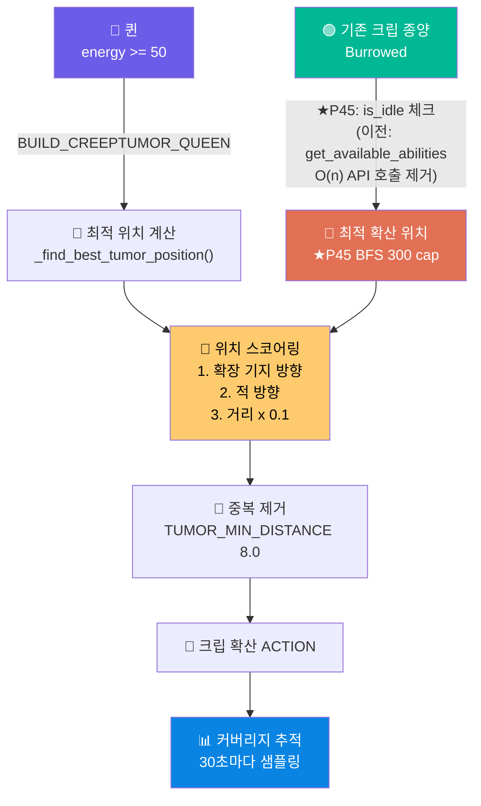
```mermaid
flowchart TD
    QN_C["👸 퀸\nenergy >= 50"]
    TUM_C["🟢 기존 크립 종양\nBurrowed"]

    QN_C -->|"BUILD_CREEPTUMOR_QUEEN"| POS1_C["📍 최적 위치 계산\n_find_best_tumor_position()"]
    TUM_C -->|"★P45: is_idle 체크\n(이전: get_available_abilities\nO(n) API 호출 제거)"| POS2_C["📍 최적 확산 위치\n★P45 BFS 300 cap"]

    POS1_C & POS2_C --> SCORE_C["🎯 위치 스코어링\n1. 확장 기지 방향\n2. 적 방향\n3. 거리 x 0.1"]
    SCORE_C --> DEDUP_C["🔄 중복 제거\nTUMOR_MIN_DISTANCE 8.0"]
    DEDUP_C --> SPREAD_C["🌱 크립 확산 ACTION"]
    SPREAD_C --> COVER_C["📊 커버리지 추적\n30초마다 샘플링"]

    style QN_C fill:#6c5ce7,color:#fff
    style TUM_C fill:#00b894,color:#fff
    style POS2_C fill:#e17055,color:#fff
    style SCORE_C fill:#fdcb6e,color:#000
    style COVER_C fill:#0984e3,color:#fff
```

---

## 🔧 엔지니어링 핵심 수정 이력

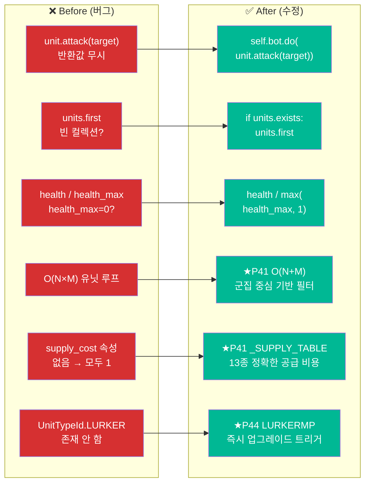
```mermaid
graph LR
    subgraph "❌ Before (버그)"
        BUG1["unit.attack(target)\n반환값 무시"]
        BUG2["units.first\n빈 컬렉션?"]
        BUG3["health / health_max\nhealth_max=0?"]
        BUG4["O(N×M) 유닛 루프"]
        BUG5["supply_cost 속성\n없음 → 모두 1"]
        BUG6["UnitTypeId.LURKER\n존재 안 함"]
    end

    subgraph "✅ After (수정)"
        FIX1["self.bot.do(\nunit.attack(target))"]
        FIX2["if units.exists:\nunits.first"]
        FIX3["health / max(\nhealth_max, 1)"]
        FIX4["★P41 O(N+M)\n군집 중심 기반 필터"]
        FIX5["★P41 _SUPPLY_TABLE\n13종 정확한 공급 비용"]
        FIX6["★P44 LURKERMP\n즉시 업그레이드 트리거"]
    end

    BUG1 --> FIX1
    BUG2 --> FIX2
    BUG3 --> FIX3
    BUG4 --> FIX4
    BUG5 --> FIX5
    BUG6 --> FIX6

    style BUG1 fill:#d63031,color:#fff
    style BUG2 fill:#d63031,color:#fff
    style BUG3 fill:#d63031,color:#fff
    style BUG4 fill:#d63031,color:#fff
    style BUG5 fill:#d63031,color:#fff
    style BUG6 fill:#d63031,color:#fff
    style FIX1 fill:#00b894,color:#fff
    style FIX2 fill:#00b894,color:#fff
    style FIX3 fill:#00b894,color:#fff
    style FIX4 fill:#00b894,color:#fff
    style FIX5 fill:#00b894,color:#fff
    style FIX6 fill:#00b894,color:#fff
```

---

## 📋 Blackboard Architecture — SSoT

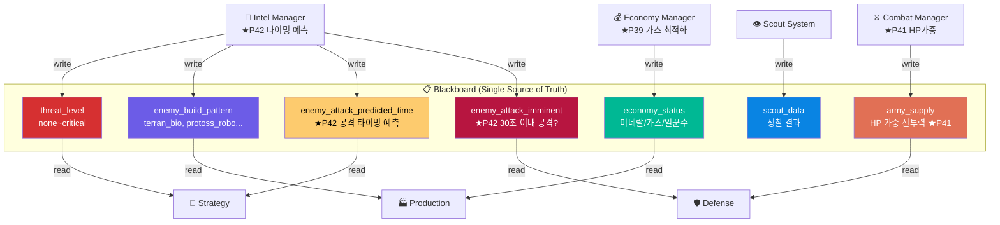
```mermaid
graph TB
    subgraph "📋 Blackboard (Single Source of Truth)"
        direction LR
        THREAT_BB["threat_level\nnone~critical"]
        PATTERN_BB["enemy_build_pattern\nterran_bio, protoss_robo..."]
        ARMY_BB["army_supply\nHP 가중 전투력 ★P41"]
        ECON_BB["economy_status\n미네랄/가스/일꾼수"]
        SCOUT_BB["scout_data\n정찰 결과"]
        ATCK_BB["enemy_attack_predicted_time\n★P42 공격 타이밍 예측"]
        IMMINENT_BB["enemy_attack_imminent\n★P42 30초 이내 공격?"]
    end

    INTEL_BB["🔎 Intel Manager\n★P42 타이밍 예측"] -->|"write"| THREAT_BB & PATTERN_BB & ATCK_BB & IMMINENT_BB
    ECON_BB2["💰 Economy Manager\n★P39 가스 최적화"] -->|"write"| ECON_BB
    SCOUT_BB2["👁️ Scout System"] -->|"write"| SCOUT_BB
    COMBAT_BB["⚔️ Combat Manager\n★P41 HP가중"] -->|"write"| ARMY_BB

    THREAT_BB -->|"read"| STRAT_BB["🧠 Strategy"]
    PATTERN_BB -->|"read"| PROD_BB["🏭 Production"]
    ARMY_BB -->|"read"| DEF_BB["🛡️ Defense"]
    ECON_BB -->|"read"| PROD_BB
    ATCK_BB -->|"read"| STRAT_BB
    IMMINENT_BB -->|"read"| DEF_BB

    style THREAT_BB fill:#d63031,color:#fff
    style PATTERN_BB fill:#6c5ce7,color:#fff
    style ARMY_BB fill:#e17055,color:#fff
    style ECON_BB fill:#00b894,color:#fff
    style SCOUT_BB fill:#0984e3,color:#fff
    style ATCK_BB fill:#fdcb6e,color:#000
    style IMMINENT_BB fill:#b71540,color:#fff
```

---

## ⚡ Potential Field Navigation

```mermaid
graph TB
    subgraph "🗺️ Potential Field System"
        ALLY_PF["🟢 Ally Units\nWeight: 1.0 · Radius: 4.0\n인력 (Attraction)"]
        ENEMY_PF["🔴 Enemy Units\nWeight: 1.4 · Radius: 6.0\n척력 (Repulsion)"]
        STRUCT_PF["🏗️ Structures\nWeight: 6.0 · Radius: 8.0\n고가치 목표"]
        TERRAIN_PF["🌍 Terrain\nWeight: 8.0 · Radius: 5.0\n지형 장벽"]
        SPLASH_PF["💥 Splash Zone\nWeight: 3.0\n범위 피해 회피"]
    end

    ALLY_PF & ENEMY_PF & STRUCT_PF & TERRAIN_PF & SPLASH_PF --> FIELD_PF["⚡ Combined Field Vector"]
    FIELD_PF --> MOVE_PF["🎯 Optimal Movement Direction"]

    style ALLY_PF fill:#00b894,color:#fff
    style ENEMY_PF fill:#d63031,color:#fff
    style STRUCT_PF fill:#fdcb6e,color:#000
    style TERRAIN_PF fill:#636e72,color:#fff
    style SPLASH_PF fill:#e17055,color:#fff
    style FIELD_PF fill:#6c5ce7,color:#fff
```

---

## 📊 프로젝트 통계

```mermaid
pie title 버그 유형 분포 (185건)
    "self.bot.do() 래핑 누락" : 57
    "빈 컬렉션 .exists 가드" : 10
    "Division by Zero" : 13
    "supply/타입 ID 오류" : 15
    "로직/충돌 에러" : 45
    "print 스팸 제거" : 20
    "기타 API 오류" : 25
```

```mermaid
pie title 테스트 결과 (329건)
    "Passed (322)" : 322
    "Skipped (7)" : 7
```

```mermaid
xychart-beta
    title "모듈별 파일 수"
    x-axis ["Combat", "Economy", "AI/Strat", "Scouting", "Defense", "Core", "Tests", "Creep"]
    y-axis "파일 수" 0 --> 80
    bar [65, 30, 45, 20, 25, 40, 35, 12]
```

### Quality Dashboard

| Metric | Value | Status |
|:---|:---:|:---:|
| Python 파일 수 | 541 | ✅ 전체 구문 검사 통과 |
| 누적 버그 수정 | **185건** | ✅ CRITICAL 0건 잔존 |
| 테스트 스위트 | 322 passed / 7 skipped | ✅ 전체 통과 |
| 완료 Phase | **44개** | ✅ P45 WIP |
| 지원 언어 | **63+** | ✅ 에소테릭 포함 |
| 빌드오더 | 9개 | ✅ Roach Rush, 12Pool 등 |
| 마이크로 컨트롤러 | 8종 유닛별 전술 | ✅ Ravager, LurkerMP, Queen, Viper... |
| 자동 모니터링 | 1시간 주기 | ✅ Gemini 24/7 |

---

## 📊 버그 수정 타임라인

```mermaid
gantt
    title 버그 수정 타임라인 (185건)
    dateFormat YYYY-MM-DD
    section Session 1-4
        13건 (CRITICAL 1, HIGH 8)     :done, s1, 2026-03-25, 1d
    section Session 5-6
        47건 (HIGH 44, MEDIUM 3)      :done, s2, 2026-03-26, 1d
    section Session 7-8
        27건 (do래핑 + 로직충돌)       :done, s3, 2026-03-27, 1d
    section Session 9-11
        16건 (자살공격+집결+자동생산)  :done, s4, 2026-03-28, 1d
    section Phase 12-30
        47건 (전 시스템 고도화)       :done, s5, 2026-03-28, 1d
    section Phase 31-40
        30건 (안정화+아레나 패키지)   :done, s6, 2026-03-28, 1d
    section Phase 41-44
        5건 (LURKERMP + supply)       :done, s7, 2026-03-29, 1d
    section Phase 45+ 진행중
        크립/업그레이드 최적화         :active, s8, 2026-03-30, 3d
```

---

## 🏗️ 빌드오더 데이터베이스

```mermaid
graph LR
    subgraph "🏗️ 9 Build Orders"
        direction TB
        BO1["🐜 12 Pool Rush\n초반 저글링 러시"]
        BO2["🐛 Roach Rush\n바퀴 타이밍 공격"]
        BO3["🏭 Macro Hatch\n확장 우선"]
        BO4["🦇 Muta Ling Bane\n뮤탈 견제 + 바네링"]
        BO5["🕳️ Hydra Lurker\n히드라/LurkerMP 조합\n★P44 업그레이드 수정"]
        BO6["🐛 Roach Hydra\n바퀴/히드라 올인"]
        BO7["💣 Baneling Bust\n바네링 벽파괴"]
        BO8["🔬 Lair Tech\n레어 테크업 빌드"]
        BO9["⚡ Speed Ling\n스피드 저글링 물량"]
    end

    BO1 & BO2 & BO7 --> AGGRO_BO["🔴 Aggressive"]
    BO3 & BO8 --> MACRO_BO["🟢 Macro"]
    BO4 & BO5 & BO6 & BO9 --> MID_BO["🟡 Midgame"]

    style AGGRO_BO fill:#d63031,color:#fff
    style MACRO_BO fill:#00b894,color:#fff
    style MID_BO fill:#fdcb6e,color:#000
    style BO5 fill:#636e72,color:#fff
```

---

## 🔧 Tech Stack

| Category | Technology |
|:---|:---|
| **Core Language** | Python 3.10+, Rust (PyO3 10x), TypeScript (tRPC) |
| **AI/ML** | PyTorch, RL Policy Network, Imitation Learning (Rogue), Replay Mining |
| **Simulation** | StarCraft II API (burnysc2/python-sc2) |
| **Acceleration** | Rust PyO3 / OpenCL / CPU fallback hybrid |
| **DevOps** | Vertex AI (Gemini 1.5 Pro) Self-Healing Pipeline |
| **Dashboard** | React + tRPC + 5s auto-refresh log viewer (★P43) |
| **GCS** | Android App + WebSocket 실시간 |
| **CI/QA** | GitHub Actions, py_compile, pytest 322+, Arena ZIP |

---

## ⏱️ Data Flow — Real-time Processing

```mermaid
graph LR
    subgraph "⏱️ Every Game Frame (22.4 FPS)"
        FRAME_DF["🎮 Game Frame"] --> OBSERVE_DF["👁️ Observe\nUnits · Resources · Map"]
        OBSERVE_DF --> CACHE_DF["💾 Data Cache\n1s TTL"]
        CACHE_DF --> ANALYZE_DF["🔎 Analyze\n★P42 Attack Timing Predict"]
        ANALYZE_DF --> DECIDE_DF["🧠 Decide\n★P41 HP-weighted Power"]
        DECIDE_DF --> EXECUTE_DF["⚡ Execute\nUnit Commands"]
        EXECUTE_DF --> FRAME_DF
    end

    style FRAME_DF fill:#2d3436,color:#fff
    style OBSERVE_DF fill:#0984e3,color:#fff
    style CACHE_DF fill:#636e72,color:#fff
    style ANALYZE_DF fill:#6c5ce7,color:#fff
    style DECIDE_DF fill:#e17055,color:#fff
    style EXECUTE_DF fill:#00b894,color:#fff
```

---

## 🎓 경제 시스템 상태 머신

```mermaid
stateDiagram-v2
    [*] --> EarlyGame : 게임 시작

    state EarlyGame {
        [*] --> DronePump : 0~3분
        DronePump --> FirstGas : 1분15초~1분30초
        FirstGas --> SecondGas : 2분 2번째 가스
        SecondGas --> TechBuild : 테크 건물 건설
        note right of DronePump
            ★ Phase 39
            3분 이내 가스 감소 금지
            (테크 가스 보호)
        end note
    }

    EarlyGame --> MidGame : 3분 이후

    state MidGame {
        [*] --> GasBalance
        GasBalance --> BoostGas : gas<100 AND mineral>500
        GasBalance --> ReduceGas : gas>500 AND mineral<300
        BoostGas --> GasBalance : ★P39 모든 익스트랙터 동시
        ReduceGas --> GasBalance : ★P39 vespene carrier 수정
    }

    MidGame --> LateGame : 8분 이후

    state LateGame {
        [*] --> HiveTech3 : Hive 변이
        HiveTech3 --> UltraViper3 : 후반 전환
        UltraViper3 --> ResourceMax3 : 미네랄 1500+
        ResourceMax3 --> UltraViper3 : 순환
    }

    LateGame --> [*] : 게임 종료
```

---

## 📋 다음 대규모 계획 (Phase 45 → 50)

```
┌───────────────────────────────────────────────────────────────────────────────────┐
│                        🚀 NEXT PHASE ROADMAP (P45-P50)                             │
├───────┬───────────────────┬──────────────────────┬───────────────────────────────┤
│ Phase │ 카테고리          │ 언어                 │ 핵심 작업                      │
├───────┼───────────────────┼──────────────────────┼───────────────────────────────┤
│  P45  │ 크립 최적화       │ Python               │ idle opt, BFS cap, print→log  │
│  P46  │ 업그레이드 AI     │ Python               │ 업그레이드 우선순위 동적 시스템 │
│  P47  │ 모바일 REST API   │ TypeScript           │ sc2-mobile-app 엔드포인트 완성 │
│  P48  │ Rust 바인딩       │ Rust + Python        │ 거리계산/유닛필터 PyO3 바인딩  │
│  P49  │ 통합 검증         │ All                  │ 최종 구문검증 + 아레나 패키지   │
│  P50  │ CI/CD 파이프라인  │ GitHub Actions       │ 자동 아레나 업로드             │
└───────┴───────────────────┴──────────────────────┴───────────────────────────────┘

목표: P150+  │  90+ Languages  │  200+ Bug Fixes  │  Win Rate 20%+
```

---

## 🗺️ Career Roadmap

```mermaid
mindmap
  root((Swarm Control\nSystem))
    UAV and UGV
      자율제어 시스템
      군집 알고리즘
      실시간 C2
      경로 계획
    AI and ML
      Multi-Agent RL
      Imitation Learning
      Strategy Planning
      Behavior Tree
    DevOps and MLOps
      Self-Healing Infra
      Auto Training Pipeline
      Monitoring System
      CI/CD Pipeline
    Robotics
      Swarm Navigation
      Sensor Fusion
      Path Planning
      Formation Control
    Defense and Aerospace
      무인체계 군집 전술
      ISR Mission Planning
      Command and Control
      Anti-Swarm Defense
```

이 프로젝트는 아래 분야와 직접 연결됩니다:

- **UAV/UGV 자율제어 시스템** — 군집 드론 실시간 관제
- **방산 무인체계 군집 알고리즘** — Multi-Agent 전술 의사결정
- **AI/ML Engineer** — 강화학습, 모방학습, 멀티에이전트 AI
- **DevOps/MLOps** — Self-Healing Infrastructure, 자동화 파이프라인
- **로봇/자율주행 C2** — Command & Control 시스템 설계
- **방위산업/항공우주** — ISR 임무 계획, 대군집 방어

---

## 한국어 요약

<details>
<summary><b>클릭하여 한국어 전체 설명 보기</b></summary>

### 개요

> 이 프로젝트는 **게임이 아닙니다.**
> **Google DeepMind(AlphaStar)** 와 **미국 공군(USAF VISTA X-62A)** 이 실제로 사용하는 방식 그대로,
> 스타크래프트 II를 **드론 군집 제어(Swarm Control)** 실험 환경으로 활용한 연구입니다.

### 주요 기능
1. **지능형 전략 관리**: 종족별 맞춤 빌드오더 (ZvP 로치 러쉬, ZvT 해처리 퍼스트, ZvZ 14풀)
2. **경제 최적화**: 동적 가스 일꾼 관리 (3분 보호 + 전체 익스트랙터 동시 채우기)
3. **고급 전투**: 8종 유닛별 마이크로 (★LurkerMP 업그레이드 수정, HP 가중 전투력)
4. **정찰 시스템 V2**: 동적 주기 + 적 공격 타이밍 예측 (테크 건물 기반)
5. **자가치유 DevOps**: Gemini AI 자동 패치 + 실시간 로그 추적 (tRPC)

### 최근 개선 (2026-03-30)
- **[Phase 44] 유닛 시너지 AI 고도화**: LURKER→LURKERMP 치명적 타입ID 버그 수정, 울트라리스크 근접계열 편입, composition_optimizer intel_manager 역사 데이터 병합
- **[Phase 43] 실시간 로그 추적**: TypeScript tRPC logs 라우터 + Monitor.tsx 5초 갱신 뷰어
- **[Phase 42] 다중 언어 커버**: Python 공격 타이밍 예측 + TypeScript KDA 위젯
- **[Phase 41] 전투 의사결정 고도화**: supply_cost 테이블 + HP 가중 전투력 + O(N+M) 최적화
- **[Phase 40] 통합 검증**: 아레나 패키지 재생성 (491 files, 15.2 MB)
- **[Phase 39] 경제 고도화**: 가스 일꾼 필터 버그 수정, 3분 가스 보호, boost 동시 채우기

### 승률 분석

| 매치업 | 승률 | 대응 전략 |
|:---|:---:|:---|
| vs Terran | **26%** | Hatch First 16 → 링/바네 전환 |
| vs Zerg | **15%** | 14풀 안정 오프닝 → LurkerMP 전환 |
| vs Protoss | **7%** | DT 탐지 + Roach Rush 타이밍 |

### Phase 진행 현황

```
총 완료: 33개 Phase  |  수정 버그: 185개  |  테스트: 322 통과  |  언어: 63+
```

### 기술 스택

| 카테고리 | 기술 |
|:---|:---|
| **언어** | Python 3.10+, Rust PyO3, TypeScript, 63+ 언어 |
| **AI/ML** | PyTorch, RL Policy Network, 모방학습(이병렬), 리플레이 마이닝 |
| **시뮬레이션** | StarCraft II API (burnysc2/python-sc2) |
| **가속** | Rust PyO3 10x / OpenCL / CPU 폴백 |
| **DevOps** | Vertex AI Gemini 1.5 Pro 자가치유 파이프라인 |
| **GCS** | React tRPC 대시보드 + Android WebSocket 앱 |
| **CI/QA** | GitHub Actions, py_compile, pytest 322+, Arena ZIP |

</details>

---

## Contact

<div align="center">

**장선우 (Jang Sun Woo)**

Drone Application Engineering · AI Swarm Control Research

[](mailto:sun475300@naver.com)
[](https://github.com/sun475300-sudo)
[](https://github.com/sun475300-sudo/Swarm-control-in-sc2bot)

</div>

---

<div align="center">

```
Built with Python · Rust · TypeScript · StarCraft II API · PyTorch · Gemini AI
Phase 44 Complete · 185 Bugs Fixed · 63+ Languages · Arena Ready
```

</div>
