# SC2 Zerg Commander Bot - Architecture Visualization

## 1. System Overview

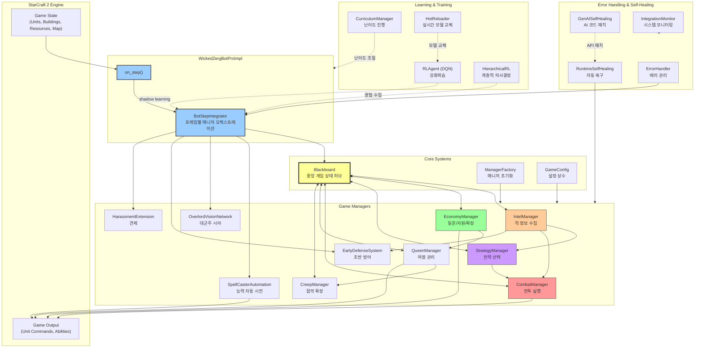

---

## 2. Game Loop Sequence (on_step)

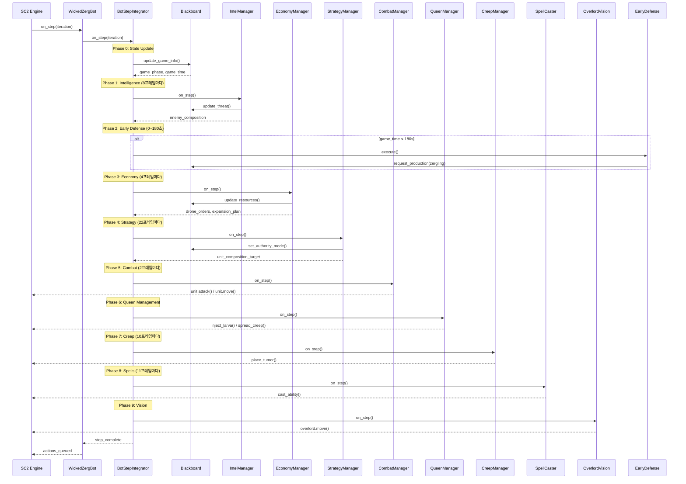

---

## 3. Blackboard Data Flow (Central State Hub)

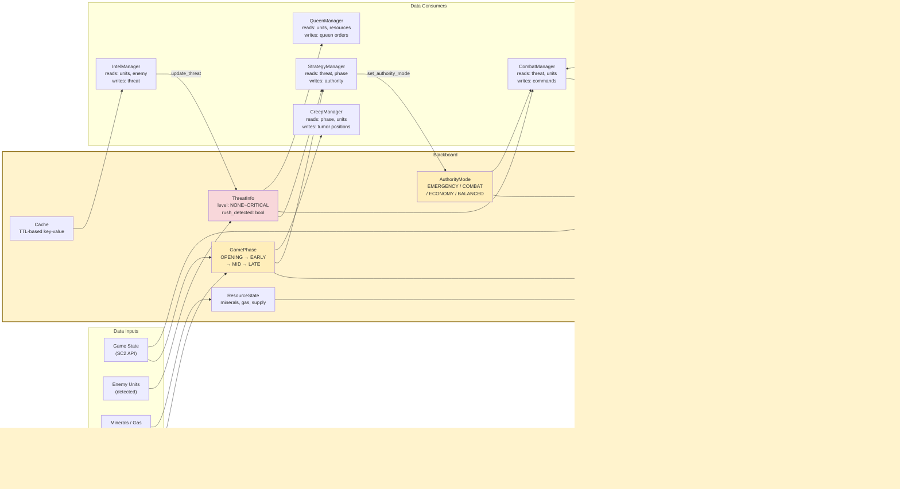

---

## 4. Authority Mode & Decision Flow

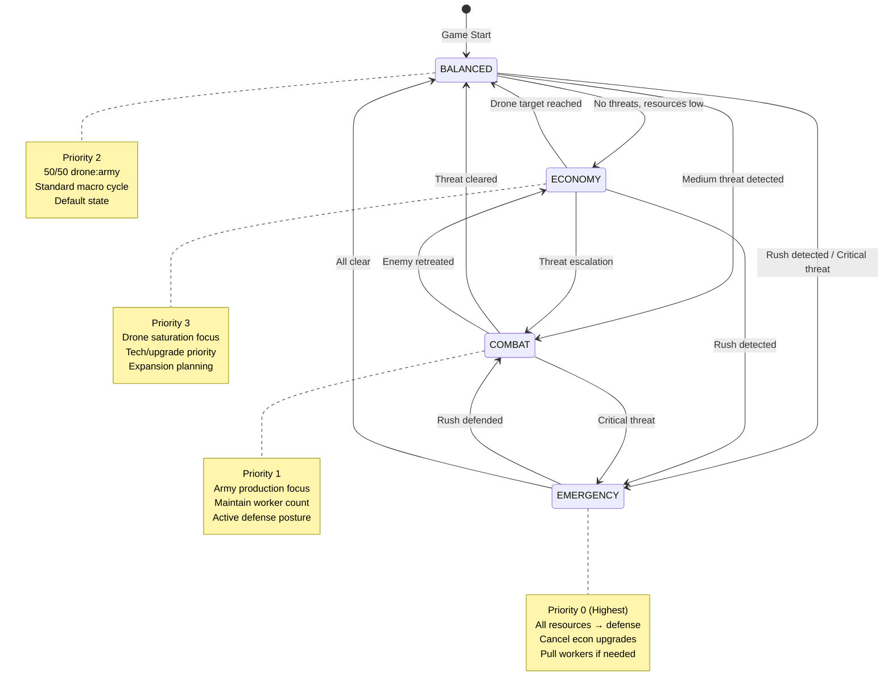

---

## 5. Combat System Architecture

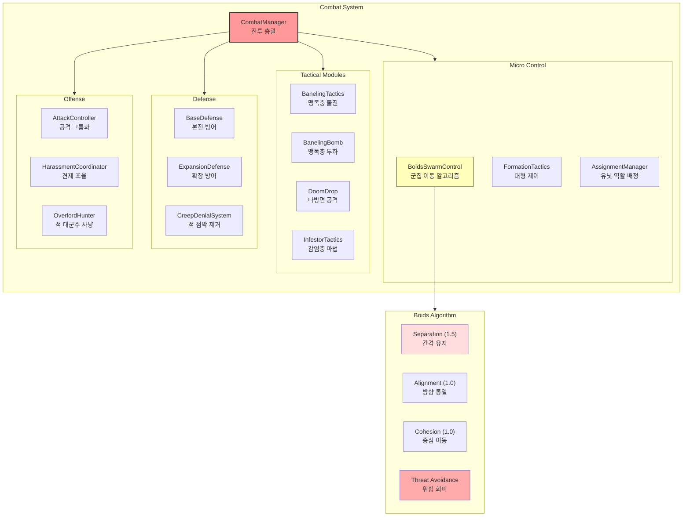

---

## 6. Learning & Training Pipeline

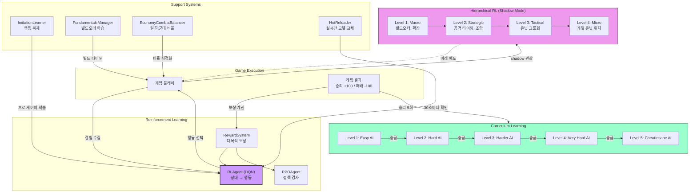

---

## 7. Strategy Decision Tree

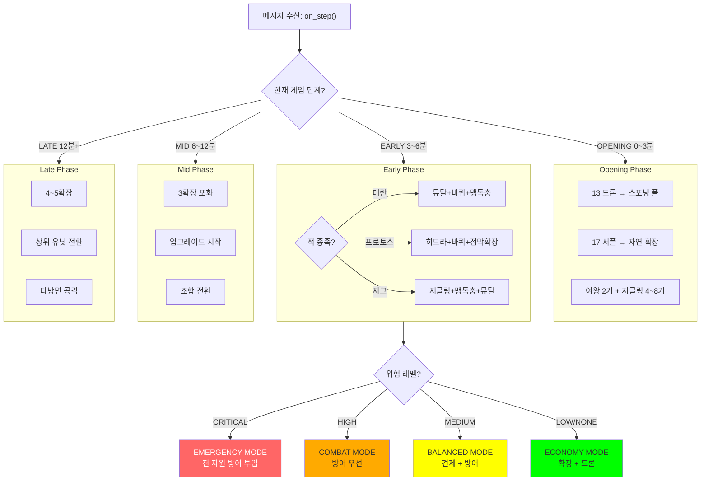

---

## 8. Error Handling & Self-Healing Flow

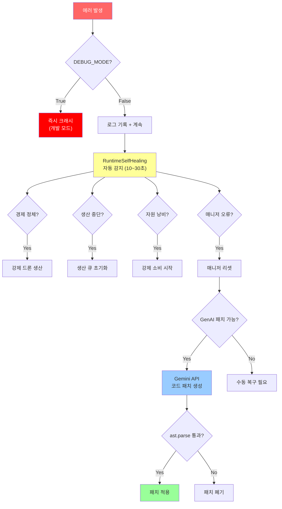

---

## 9. File Structure & Module Map

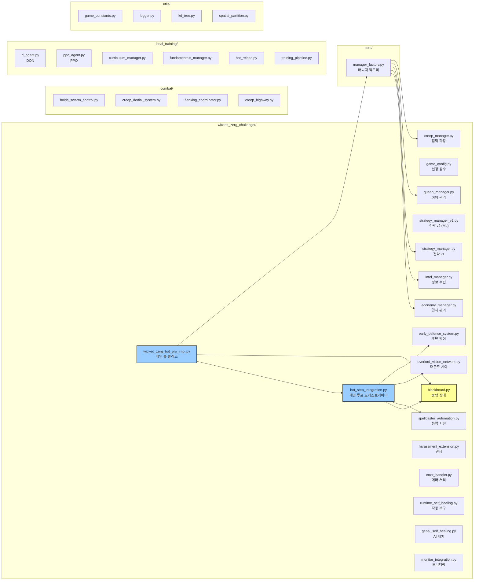

---

## 10. Game Phase Timeline

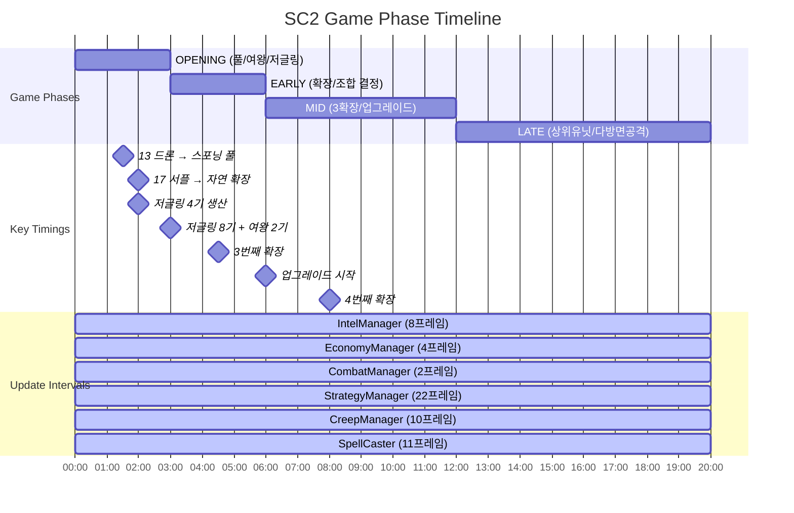

---

## 11. Unit Production Priority (Authority-Based)

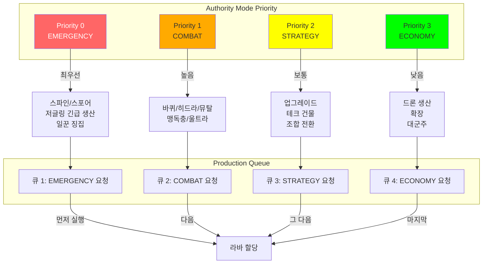

---

## Component Summary Table

| Component | File | Role | Update Interval |
|-----------|------|------|-----------------|
| **Blackboard** | `blackboard.py` | Central state hub | Every frame |
| **BotStepIntegrator** | `bot_step_integration.py` | Frame orchestrator | Every frame |
| **ManagerFactory** | `core/manager_factory.py` | Manager initialization | Game start |
| **IntelManager** | `intel_manager.py` | Enemy tracking | 8 frames |
| **EconomyManager** | `economy_manager.py` | Workers/supply/expansion | 4 frames |
| **StrategyManager** | `strategy_manager.py` | Strategy selection | 22 frames |
| **CombatManager** | Combat modules | Battle execution | 2 frames |
| **QueenManager** | `queen_manager.py` | Queen production/inject | Every frame |
| **CreepManager** | `creep_manager.py` | Creep spread | 10 frames |
| **SpellCaster** | `spellcaster_automation.py` | Auto-abilities | 11 frames |
| **EarlyDefense** | `early_defense_system.py` | Rush defense | Every frame (0~180s) |
| **OverlordVision** | `overlord_vision_network.py` | Map vision | Periodic |
| **RLAgent** | `local_training/rl_agent.py` | Decision ML | Per episode |
| **CurriculumManager** | `local_training/curriculum_manager.py` | Difficulty progression | Per game |
| **RuntimeSelfHealing** | `runtime_self_healing.py` | Auto-recovery | 10~30s |

---

> This document uses Mermaid diagrams for visualization.
> Render in any Mermaid-compatible viewer (GitHub, VSCode Mermaid plugin, mermaid.live).
