# SC2 Swarm Control → Drone ATC System
## Presentation Visual Diagrams

---

# Part 1: SC2 Bot Architecture (FSM + RL Hybrid)

---

## 1-1. Finite State Machine (FSM) — Game Phase Control

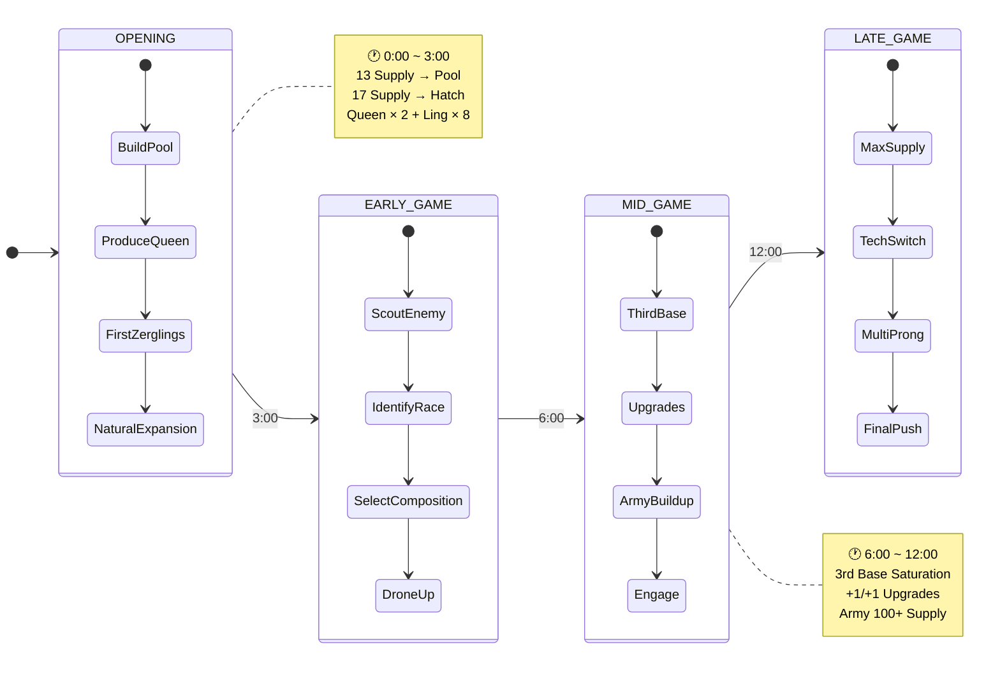

---

## 1-2. Authority Mode FSM (Dynamic Priority Switching)

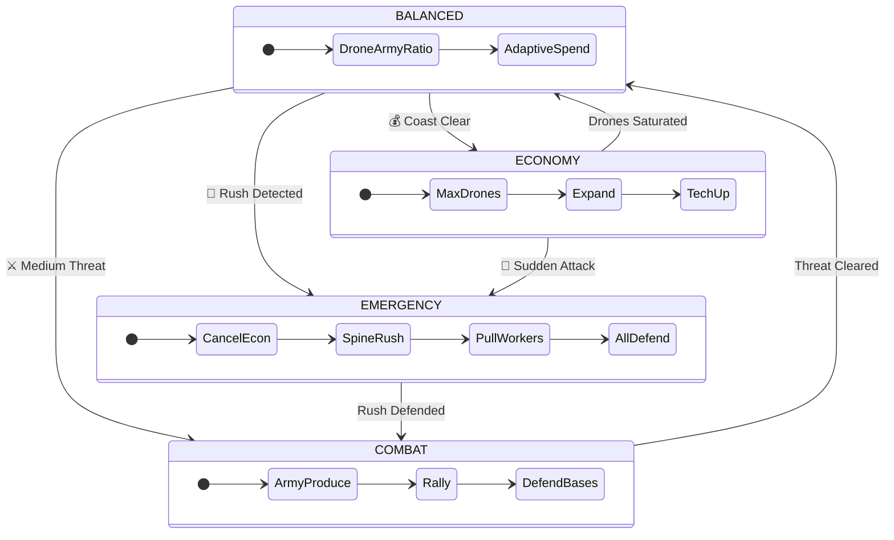

---

## 1-3. Rule-Based + RL Hybrid Architecture

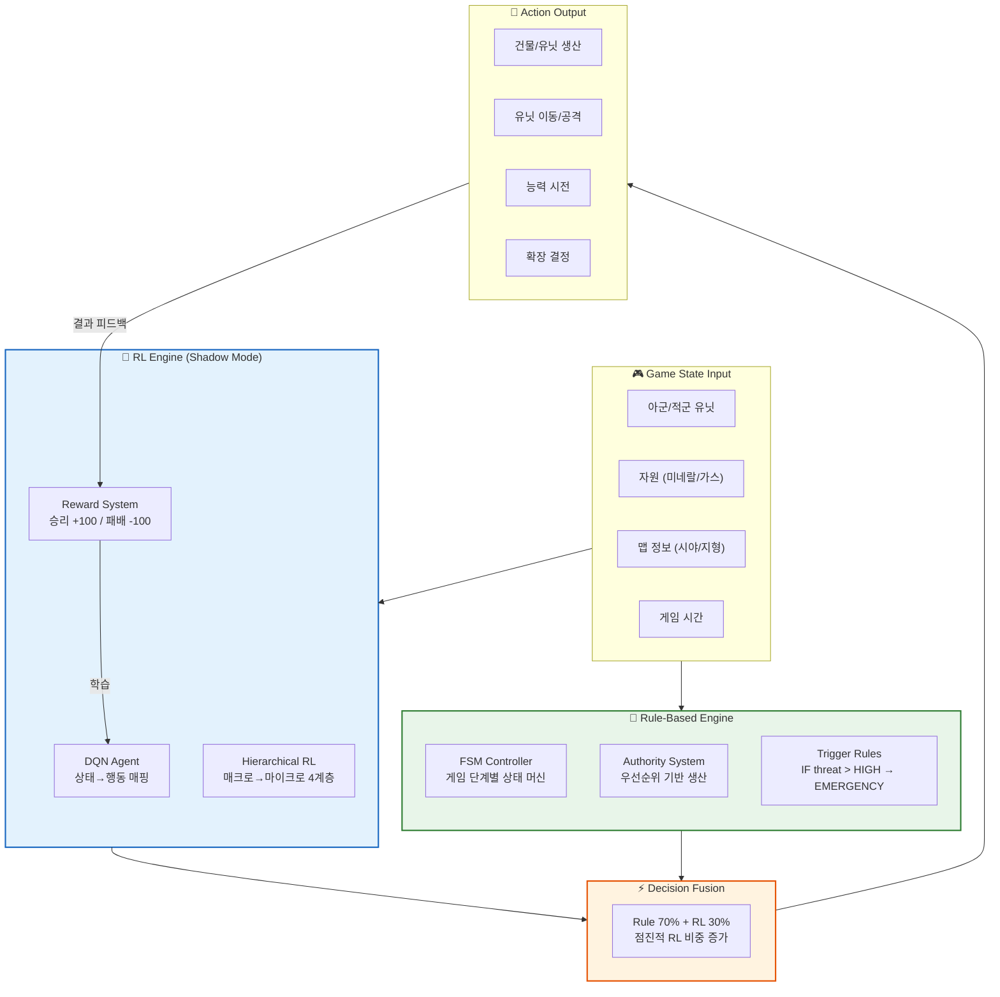

---

# Part 2: Operation Flow (Tactical Decision Process)

---

## 2-1. Tactical Decision Chain

```mermaid
graph LR
    subgraph Phase1["Phase 1: 정찰"]
        Scout["대군주 정찰<br/>적 본진 확인"]
        Analyze["적 빌드 분석<br/>테크/유닛 구성"]
        Threat["위협 평가<br/>NONE → CRITICAL"]
    end

    subgraph Phase2["Phase 2: 판단"]
        Strategy["전략 선택<br/>공격/방어/확장"]
        Comp["조합 결정<br/>바퀴/히드라/뮤탈"]
        Timing["타이밍 결정<br/>즉시/대기/올인"]
    end

    subgraph Phase3["Phase 3: 집결"]
        Rally["랠리 포인트<br/>자연 앞 집결"]
        Group["그룹 편성<br/>메인/서브/견제"]
        Formation["대형 구성<br/>전위/후위 배치"]
    end

    subgraph Phase4["Phase 4: 교전"]
        Engage["교전 개시<br/>engage_ratio > 0.7"]
        Micro["마이크로 제어<br/>Boids 알고리즘"]
        Spell["능력 시전<br/>자동 판단"]
        Retreat["후퇴 판단<br/>retreat_ratio < 0.4"]
    end

    subgraph Phase5["Phase 5: 평가"]
        Result["교전 결과"]
        Learn["RL 학습<br/>보상 계산"]
        Adapt["전략 수정"]
    end

    Phase1 --> Phase2 --> Phase3 --> Phase4 --> Phase5
    Phase5 -->|다음 교전| Phase1

    style Phase1 fill:#e3f2fd
    style Phase2 fill:#f3e5f5
    style Phase3 fill:#fff3e0
    style Phase4 fill:#ffebee
    style Phase5 fill:#e8f5e9
```

---

## 2-2. Engagement Decision Flowchart

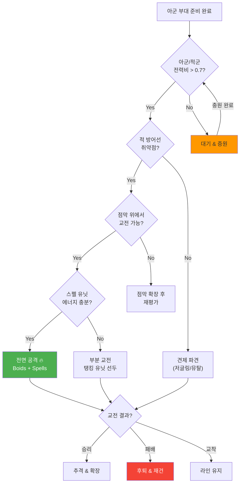

---

# Part 3: Unit Control Visualization (Swarm Simulation)

---

## 3-1. Boids Swarm Algorithm

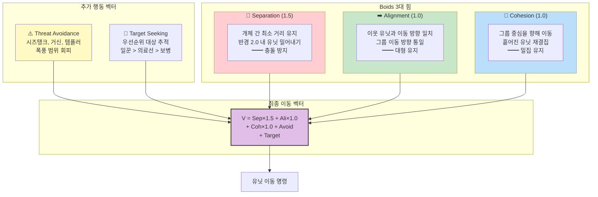

---

## 3-2. Swarm Movement Simulation (Top-Down View)

```
    ┌─────────────────────────────────────────────────────────────┐
    │                    BATTLEFIELD MAP                          │
    │                                                             │
    │   🔴🔴🔴  ← Enemy Base                                     │
    │   🔴🔴                                                      │
    │                                                             │
    │          💥 Engagement Zone                                  │
    │        ╱─────────────╲                                      │
    │       ╱   🟡  🟡  🟡  ╲   ← Banelings (Flanking)          │
    │      ╱                  ╲                                   │
    │                                                             │
    │          🟢🟢🟢🟢        ← Roaches (Front Line)            │
    │          🟢🟢🟢🟢                                           │
    │                                                             │
    │       🔵🔵🔵              ← Hydras (Rear Support)          │
    │       🔵🔵🔵                                                │
    │                                                             │
    │    🟣  🟣                  ← Mutalisk (Flanking)            │
    │      🟣  🟣                                                 │
    │                                                             │
    │   ← Creep Highway ████████████████████████                  │
    │                                                             │
    │                    🟤🟤🟤  ← Rally Point                    │
    │                                                             │
    │   🟢🟢  ← Our Base                                          │
    └─────────────────────────────────────────────────────────────┘

    Movement Vectors:
    ──→  Main attack direction
    ╲  ╱  Flanking pincer
    ····>  Retreat path
```

---

## 3-3. Multi-Prong Attack Pattern (Doom Drop)

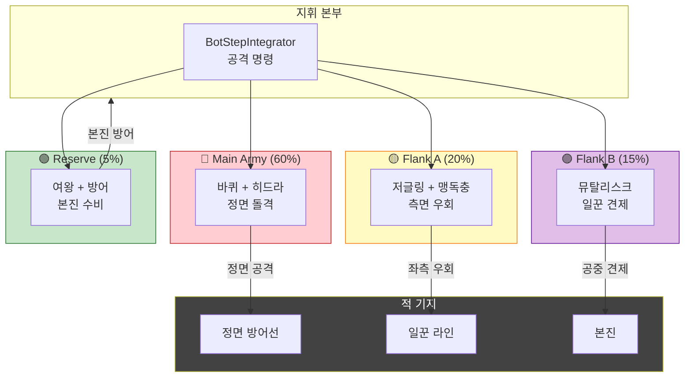

---

# Part 4: SC2 Bot → Drone ATC System (Vision Bridge)

---

## 4-1. Concept Mapping: SC2 → Drone Swarm ATC

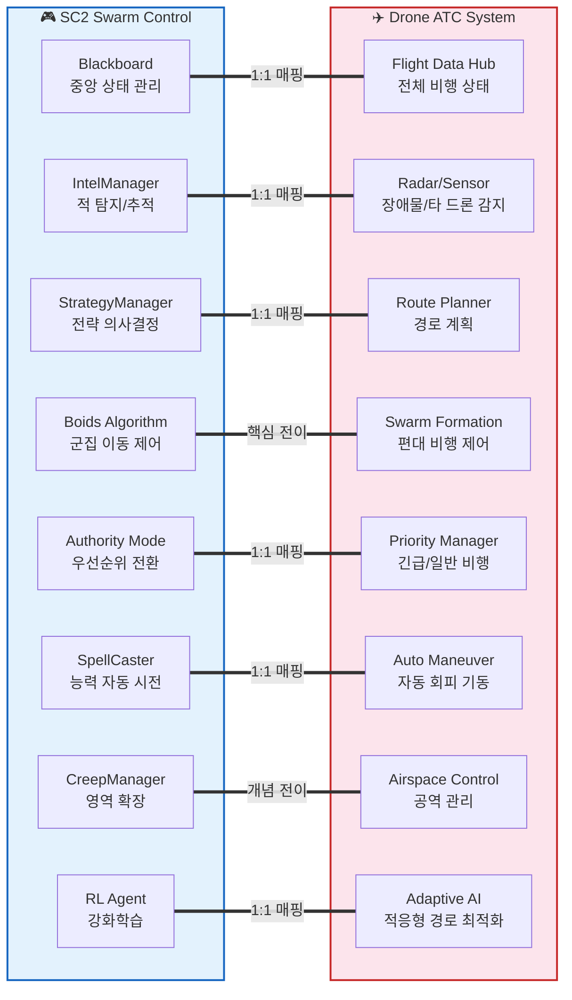

---

## 4-2. Drone ATC System Architecture

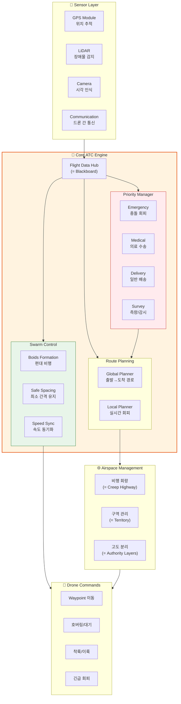

---

## 4-3. Boids in Drone Formation Flight

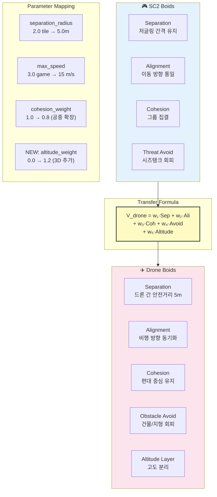

---

## 4-4. ATC Priority System (= Authority Mode)

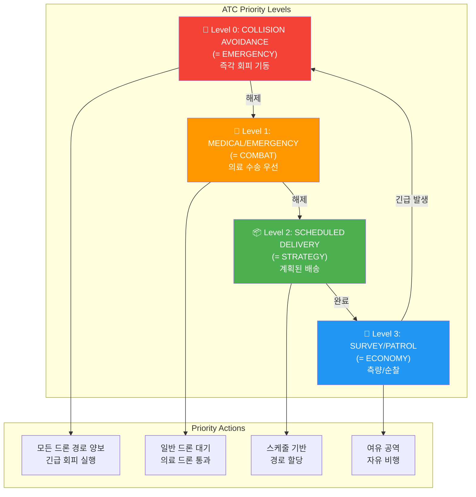

---

## 4-5. End-to-End Vision: Game → Reality

```mermaid
graph LR
    subgraph Stage1["Stage 1: SC2 Simulation"]
        Game["SC2 게임 환경<br/>저그 유닛 군집 제어"]
        Algo["알고리즘 검증<br/>Boids + FSM + RL"]
        Data["학습 데이터 축적<br/>10,000+ 게임"]
    end

    subgraph Stage2["Stage 2: Sim Transfer"]
        Sim["3D 시뮬레이터<br/>(Gazebo/AirSim)"]
        Adapt["파라미터 적응<br/>2D→3D, 타일→미터"]
        Test["시뮬레이션 테스트<br/>충돌률 < 0.01%"]
    end

    subgraph Stage3["Stage 3: Real Drone"]
        HW["드론 하드웨어<br/>ROS2 + PX4"]
        Edge["Edge Computing<br/>실시간 연산"]
        Fly["실제 비행 테스트<br/>5대 편대 비행"]
    end

    subgraph Stage4["Stage 4: ATC Scale"]
        ATC["ATC 시스템<br/>100+ 드론 관제"]
        City["도시 공역 관리<br/>자율 비행 통합"]
        AI["AI 최적화<br/>실시간 경로 조정"]
    end

    Stage1 -->|알고리즘 이전| Stage2
    Stage2 -->|시뮬 검증| Stage3
    Stage3 -->|스케일업| Stage4

    style Stage1 fill:#e3f2fd,stroke:#1565c0
    style Stage2 fill:#f3e5f5,stroke:#6a1b9a
    style Stage3 fill:#e8f5e9,stroke:#2e7d32
    style Stage4 fill:#fff3e0,stroke:#e65100
```

---

## 4-6. Technology Transfer Matrix

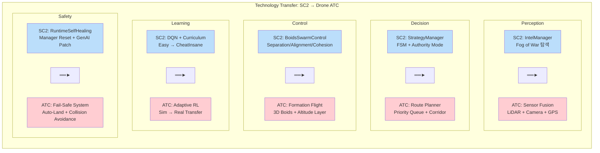

---

## 4-7. Swarm-Net Airspace Control Algorithm (4-Phase Sequence)

```mermaid
sequenceDiagram
    autonumber
    participant CS as 🖥️ 관제 서버<br/>(ATC Server)
    participant SW as 📡 군집 드론<br/>(Swarm Fleet)
    participant RN as 🔷 레이더망<br/>(Mesh Radar)
    participant UD as 🚁 사용자 드론<br/>(User Drone)
    participant APP as 📱 사용자 앱<br/>(Controller)

    rect rgb(20, 40, 80)
    Note over CS,SW: 【1단계】 통제 구역 설정 & 레이더망 형성
    CS->>SW: 공역 좌표 할당 (GPS Waypoints)
    SW->>SW: 다각형 대형(Polygon Formation) 전개
    SW->>RN: Mesh Network 전개 (LiDAR + RF)
    RN-->>CS: 레이더 돔(Dome) 활성화 확인
    Note right of RN: 가상 돔 형성 완료<br/>통제 공역 ACTIVE
    end

    rect rgb(20, 60, 40)
    Note over RN,UD: 【2단계】 사용자 드론 탐지 & 식별
    UD->>RN: 공역 진입 (경계선 통과)
    RN->>RN: RF 신호 스캔 + MAC 주소 추출
    RN->>CS: 탐지 데이터 전송 (ID, 위치, 속도)
    CS->>CS: DB 등록 + 비행 허가 검증
    CS-->>UD: 인증 ACK (허가/거부)
    Note right of CS: 객체 등록 완료<br/>식별자: UD-1001
    end

    rect rgb(60, 50, 20)
    Note over CS,APP: 【3단계】 체공 시간 할당 & 실시간 추적
    CS->>CS: 타이머 시작 (예: 15:00)
    loop 매 1초마다
        SW->>RN: 삼각측량 (X, Y, Z 좌표)
        RN->>CS: 실시간 위치 동기화
        CS->>APP: 위치 + 잔여 시간 Push
    end
    Note right of APP: 대시보드 실시간 표시<br/>🟢 정상 비행 중
    end

    rect rgb(80, 20, 20)
    Note over CS,APP: 【4단계】 경고 알림 & 퇴각 통제
    CS->>APP: ⚠️ 1차 경고 (잔여 2분)
    APP-->>UD: 비행 시간 임박 알림 표시
    Note right of APP: 🟡 WARNING<br/>"2분 남았습니다"

    CS->>APP: 🔴 최종 경고 (시간 초과!)
    CS->>UD: 강제 복귀 명령 전송
    APP-->>UD: 즉시 착륙/복귀 명령
    Note right of UD: 🔴 UNAUTHORIZED<br/>"즉시 복귀하세요"

    alt 유저 드론 응답 (30초 이내)
        UD-->>CS: 복귀 ACK + 이탈 진행
        CS->>RN: 레이더망 추적 해제
    else 미응답 (30초 초과)
        CS->>SW: 긴급 프로토콜 발동
        SW->>UD: 물리적 차단/에스코트
        Note right of SW: 🚨 EMERGENCY<br/>관제 강제 개입
    end
    end
```

---

## 4-8. Communication Flow: Swarm → Server → User Drone

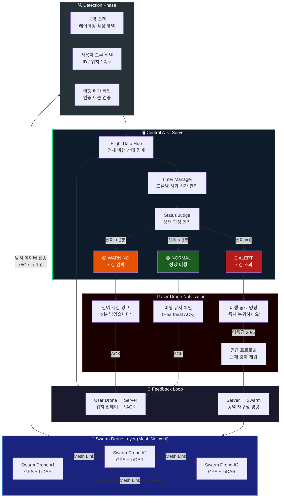

---

# Summary Slide

## SC2 Swarm Control → Drone ATC: Key Takeaways

| SC2 Component | Drone ATC Equivalent | Transfer Confidence |
|---------------|---------------------|-------------------|
| Blackboard (Central State) | Flight Data Hub | ★★★★★ Direct |
| Boids Algorithm | Formation Flight Control | ★★★★★ Direct |
| Authority Mode (Priority) | ATC Priority Levels | ★★★★★ Direct |
| IntelManager (Scouting) | Sensor Fusion | ★★★★☆ Adapt |
| StrategyManager (FSM) | Route Planning | ★★★★☆ Adapt |
| CreepManager (Territory) | Airspace Corridor | ★★★☆☆ Concept |
| RL Agent (Learning) | Adaptive AI | ★★★★☆ Adapt |
| RuntimeSelfHealing | Fail-Safe System | ★★★★★ Direct |

### Core Insight
> **SC2의 2D 군집 제어 알고리즘은 고도(altitude) 차원만 추가하면**
> **드론 편대 비행의 핵심 제어 로직으로 직접 전이 가능하다.**
>
> 10,000+ 게임의 시뮬레이션 데이터가 실제 드론 ATC의
> 안전성 검증 기반이 된다.

---

> **Rendering**: Use [mermaid.live](https://mermaid.live), GitHub, or VSCode Mermaid plugin.
> **Presentation**: Export diagrams as SVG/PNG for PowerPoint/Keynote slides.
