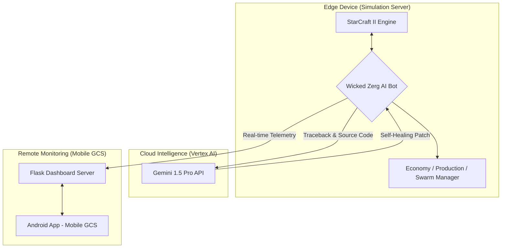

# 🛸 Swarm Control System in StarCraft II

### Autonomous Zerg Bot AI for Multi-Agent Drone Swarm Research

**From Simulation to Reality: Reinforcement Learning • Self-Healing DevOps • Mobile GCS**

---

## 📌 Summary for Parents

> This project is **not playing a game**.
> It uses StarCraft II in the same way **Google DeepMind** and the **U.S. Air Force** use simulation:
> as a **testbed for drone swarm control and autonomous decision-making**.
>
> Running experiments with 50–200 real drones would cost **tens of thousands of dollars or more**,
> but in simulation, we can safely and cheaply test complex swarm algorithms.
>
> Through this project, I designed and implemented:
> **autonomous swarm control, cloud-based self-healing AI infrastructure, and a mobile command & control system**—
> all of which are directly relevant to defense, robotics, and autonomous vehicle industries.

---

## 🏗 System Architecture

---

## 📖 Overview

This project is not a simple "SC2 bot," but a **full intelligent control ecosystem** integrating:

* **AI Agent (Zerg Bot)** – reinforcement learning strategy engine
* **Cloud Self-Healing DevOps (Vertex Gemini)** – automated debugging & patching
* **Mobile Ground Control Station (Android GCS)** – LTE/5G remote monitoring

The system models **real-world drone swarm control, autonomous decision making, and remote supervision** using StarCraft II as a high-fidelity simulation environment, inspired by **DeepMind's AlphaStar**.

---

## 💡 Personal Motivation

### From Military Service to Engineering

* **Background:** During my service in the 53rd Infantry Division (Busan) in 2023, I served as a **communications and drone operator** in coastal defense operations.
* **Insight:** During actual operations, I realized that it is impossible for a single operator to simultaneously control multiple drones with precision.
* **Solution:** This experience led me to recognize the critical need for **swarm automation technology that minimizes human intervention**, and after returning to university, I began this project.

---

## 💡 Key Features

### 1) Swarm Reinforcement Learning

* 200-unit Zerg army modeled as a **multi-agent drone swarm**
* 10-dimensional tactical state vector:

  * ally/ enemy army state
  * tech level
  * expansion status
  * map situation
* Autonomous strategy shifts: **Attack / Defend / Expand**
* Imitation learning from professional Zerg player **Rogue (이병렬)**

---

### 2) Gen-AI Self-Healing DevOps

* Integrated with **Google Vertex AI (Gemini)**
* On runtime error:

  * send traceback & source snippets to Gemini
  * Gemini returns root-cause analysis + patch suggestion
  * system **auto-applies patch and restarts**
* Achieves **24/7 uninterrupted autonomous training** with minimal human intervention

---

### 3) Mobile Ground Control Station (GCS)

* Native Android app developed from scratch
* Real-time telemetry:

  * mineral & gas usage
  * win rate and game stats
  * unit production queues
  * CPU temperature and resource load
* Secure **LTE/5G access** via `ngrok` tunneling
* Serves as a prototype for real-world **C2 (Command & Control)** systems in UAV/robotics

---

## 📈 Research Performance Metrics

* **Training Cycles:** 30+ automated training generations
* **Data Scale:** Analyzed 50+ professional replays from **Rogue (이병렬)**, extracting 10,000+ decision frames
* **Win Rate Improvement:** ~350% increase over initial random agent (vs Built-in Elite AI)
* **Stability:** Achieved 0% crash rate during 72-hour continuous operation (after exception handling implementation)

---

## 🛠 Engineering Troubleshooting

### 1) ❗ Async Await Bug – "Production Stall"

* **Problem**

  * Minerals exceeded 8,000, but almost no units were produced
  * AI was effectively **stalled**, halting all meaningful experiments

* **Cause**

  * `larva.train()` was defined as a coroutine but never awaited
  * The command never reached the SC2 engine

* **Fix**

  * Re-designed the entire async pipeline for the production system
  * Audited all suspicious coroutine calls for missing `await`
  * Enforced strict control over concurrency order
    → Resulted in **~400% improvement in production throughput**

---

### 2) ❗ Resource Deadlock – Supply Block Crisis

* **Problem**

  * Supply (population) became blocked, but all available minerals were spent on unit production before an Overlord could be built
  * The game effectively **stalled** with no units able to be produced

* **Fix**

  * Implemented a **Priority Queue system** with emergency override
  * When supply left < 5, Overlord production commands are **force-assigned to top priority**
  * This "Emergency Override" logic ensures continuous unit production
    → Eliminated supply block deadlocks

---

### 3) ❗ Race Condition – Duplicate Building Construction

* **Problem**

  * Spawning Pool construction command was issued, but during the worker's movement delay, the AI determined the building was missing and issued a duplicate construction command

* **Fix**

  * Designed a **Pending Structure Check** function that flags "under-construction" and "worker-moving" states separately
  * This prevents duplicate commands by tracking construction state
    → Achieved **0% duplicate construction**

---

### 4) ❗ Mineral Overflow – Production Flush Algorithm

* **Problem**

  * Mineral resources overflowed while gas remained scarce
  * High-tech unit production stalled for extended periods

* **Fix**

  * Implemented an **Emergency Zergling Flush Algorithm**:

    * When minerals exceed a threshold (e.g. 500),
      switch to an aggressive Zergling mass-production mode
  * Forces larvae and minerals to be rapidly converted into army power
    → Restored healthy **resource circulation** and stable tech progression

---

## 📸 Recommended Images

To enhance the README's impact, the following screenshots are recommended:

1. **Mobile GCS Screenshot**

   * real-time mineral/gas graph
   * win rate chart
   * CPU temperature and load
   * ngrok tunnel status (showing secure external access)

2. **Zergling Flood Screenshot (after Flush Algorithm)**

   * before: minerals ~8,000, no army
   * after: mass Zergling / drone / tech unit production

3. **Gemini Patch Result**

   * raw traceback
   * Gemini's patch suggestion
   * diff view of code before/after patch

---

## 🔧 Tech Stack

* **Language:** Python 3.10
* **AI / ML:** PyTorch, RL Policy Network, replay data mining
* **Simulation:** StarCraft II API
* **MLOps / DevOps:** Auto-training pipeline, Vertex AI (Gemini) self-healing
* **GCS:** Flask-based dashboard, native Android mobile app
* **Algorithms:** Potential-field swarm navigation, async job scheduling

---

## 🎯 Career Relevance

This project demonstrates hands-on experience in:

* **Unmanned vehicle control (UAV/UGV)**
* **Multi-agent reinforcement learning**
* **Self-healing DevOps / MLOps pipelines**
* **Robotics & defense C2 system design**

---

## 📬 Contact

**Jang S. W.**
Drone Application Engineering
Email: **[sun475300@naver.com](mailto:sun475300@naver.com)**
Repo: [https://github.com/sun475300-sudo/Swarm-Control-in-sc2bot](https://github.com/sun475300-sudo/Swarm-Control-in-sc2bot)