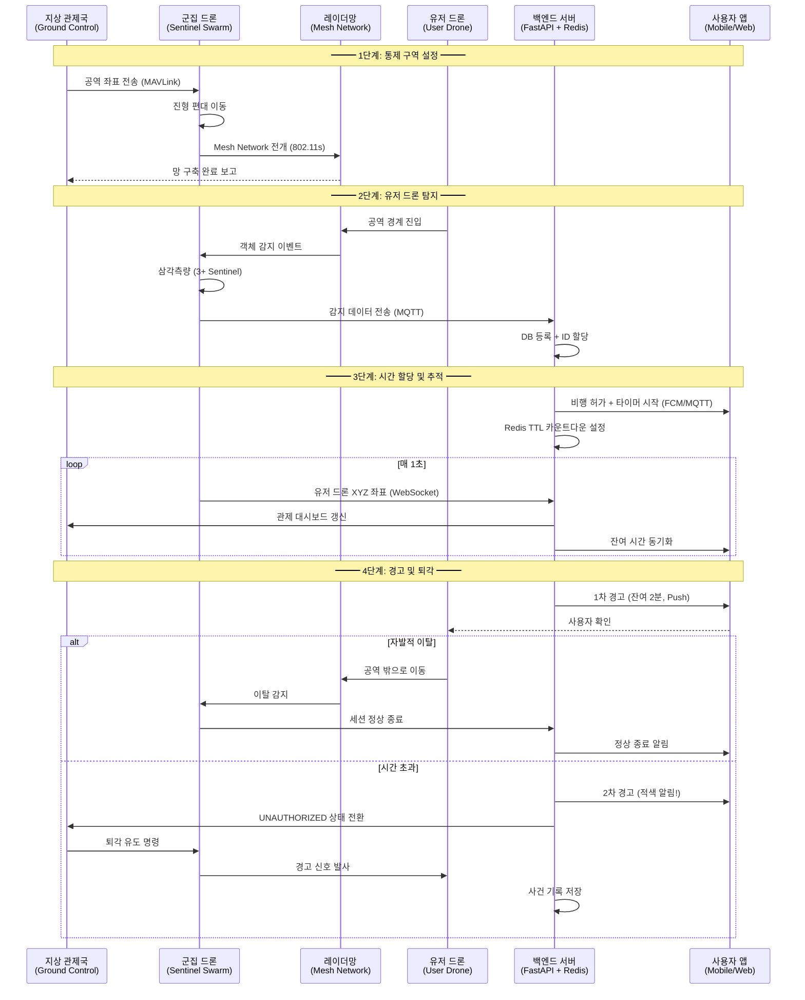
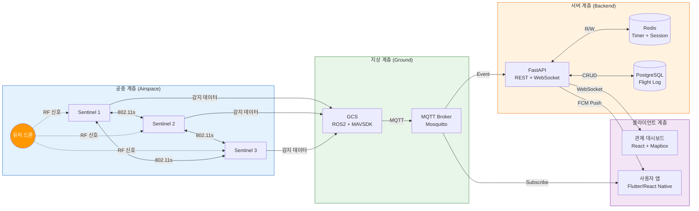
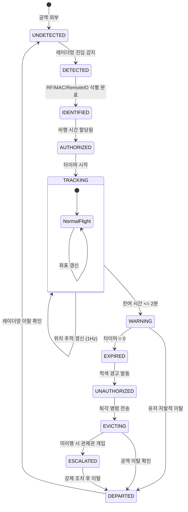

# Swarm-Net Airspace Manager: Algorithm Structure

## 1. System Flowchart (전체 시스템 플로우차트)

```mermaid
flowchart TD
    subgraph PHASE1["1단계: 통제 구역 설정"]
        A1[관제 서버: 공역 좌표 지정] --> A2[군집 드론 N대 이륙]
        A2 --> A3[드론 간 위치 동기화]
        A3 --> A4{다각형 진형 완성?}
        A4 -- No --> A3
        A4 -- Yes --> A5["레이더 Mesh Network 전개\n(802.11s + LoRa Backup)"]
        A5 --> A6["가상 돔(Dome) 형성 완료"]
    end

    subgraph PHASE2["2단계: 유저 드론 탐지 및 식별"]
        B1["레이더망 경계 감시\n(RF/Vision/RemoteID)"] --> B2{객체 진입 감지?}
        B2 -- No --> B1
        B2 -- Yes --> B3[센서 데이터 수집]
        B3 --> B4[삼각측량 위치 특정]
        B4 --> B5[RF 신호/MAC/RemoteID\n고유 식별자 추출]
        B5 --> B6{기존 등록 드론?}
        B6 -- Yes --> B7[DB 기록 업데이트]
        B6 -- No --> B8[신규 객체 등록]
        B7 --> B9[유저 드론 추적 시작]
        B8 --> B9
    end

    subgraph PHASE3["3단계: 체공 시간 할당 및 추적"]
        C1["비행 허가 시간 할당\n(예: 15분 / 30분)"] --> C2[카운트다운 타이머 시작]
        C2 --> C3["실시간 XYZ 좌표 추적\n(삼각측량 + Kalman Filter)"]
        C3 --> C4[관제 대시보드 표시]
        C4 --> C5{잔여 시간 체크}
        C5 -- "잔여 > 2분" --> C3
        C5 -- "잔여 <= 2분" --> D1
    end

    subgraph PHASE4["4단계: 경고 및 퇴각 통제"]
        D1["1차 경고: 비행 시간 임박\n(Push 알림 전송)"]
        D1 --> D2{유저 자발적 이탈?}
        D2 -- Yes --> D3["정상 종료\n(Green Status)"]
        D2 -- No --> D4{타이머 = 0?}
        D4 -- No --> D2
        D4 -- Yes --> D5["2차 경고: 시간 초과!\n(적색 알림 + 경고음)"]
        D5 --> D6["상태 변경: UNAUTHORIZED\n(적색 표시)"]
        D6 --> D7["강제 착륙/퇴각 명령\n전송"]
        D7 --> D8{드론 퇴각 완료?}
        D8 -- Yes --> D9["사건 기록 저장\n(PostgreSQL)"]
        D8 -- No --> D10["관제관 수동 개입\n또는 인터셉트"]
    end

    A6 --> B1
    B9 --> C1
    D3 --> B1
    D9 --> B1

    style PHASE1 fill:#E3F2FD,stroke:#1565C0,stroke-width:2px
    style PHASE2 fill:#E8F5E9,stroke:#2E7D32,stroke-width:2px
    style PHASE3 fill:#FFF3E0,stroke:#EF6C00,stroke-width:2px
    style PHASE4 fill:#FFEBEE,stroke:#C62828,stroke-width:2px
    style A6 fill:#1565C0,color:#fff
    style B9 fill:#2E7D32,color:#fff
    style D5 fill:#C62828,color:#fff
    style D3 fill:#4CAF50,color:#fff
```

## 2. Sequence Diagram (통신 흐름 시퀀스 다이어그램)

## 3. Communication Data Flow (통신 데이터 흐름도)

## 4. State Machine (유저 드론 상태 전이도)

